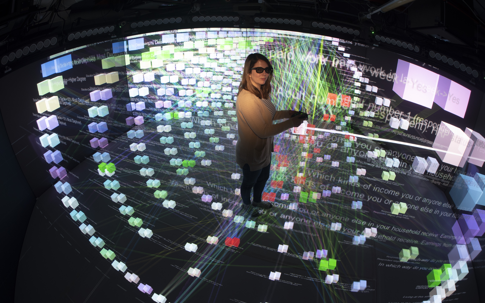
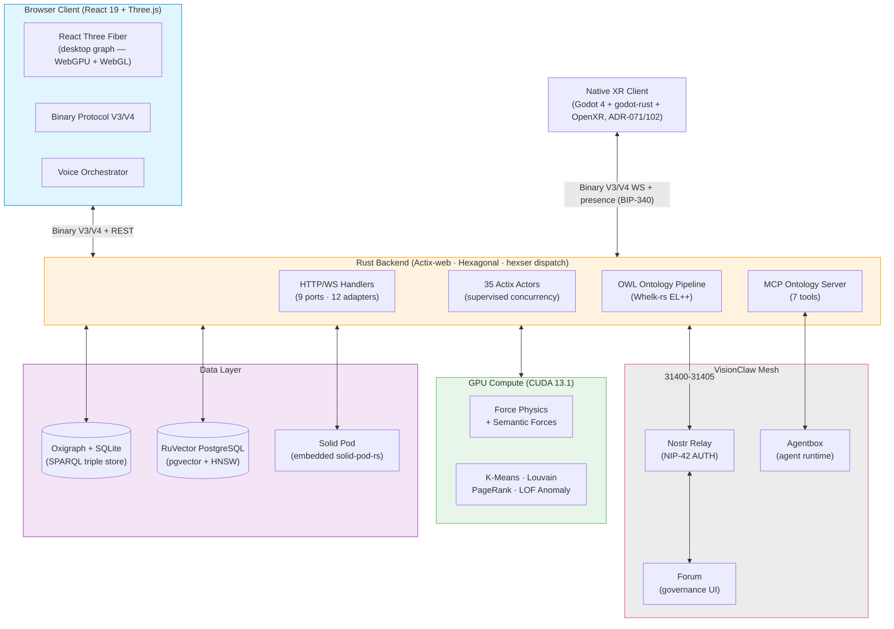

<div align="center">

# VisionClaw

### GPU-accelerated knowledge engineering with OWL 2 reasoning and immersive XR

[](https://github.com/DreamLab-AI/VisionClaw/actions)
[](https://github.com/DreamLab-AI/VisionClaw/releases)
[](LICENSE)
[](https://www.rust-lang.org/)
[](https://developer.nvidia.com/cuda-toolkit)
[](docs/README.md)

**Maintainer**: [John O'Hare](https://github.com/jjohare) · **Upstream IP**: [Melvin Carvalho](https://github.com/melvincarvalho) ([JSS](https://github.com/JavaScriptSolidServer/JavaScriptSolidServer), [DID:Nostr](https://github.com/nicholasgasior/did-nostr)) · [MAINTAINERS.md](MAINTAINERS.md)

<br/>

https://github.com/user-attachments/assets/f45c92dc-4800-4b57-a6e2-178da6bb0a38

<br/>

[Why VisionClaw?](#why-visionclaw) · [Quick Start](#quick-start) · [Capabilities](#capabilities) · [Architecture](#architecture) · [Performance](#performance) · [Documentation](#documentation)

</div>

---

**82 CUDA kernels · GPU clustering, anomaly detection and PageRank · Multi-user immersive XR · 88 agent skills · OWL 2 + SHACL ontology governance · W3C PROV-O provenance · Nostr DID identity · Solid Pod sovereignty**

---

## What Is VisionClaw?

VisionClaw is an open-source knowledge engineering platform that transforms organisations into governed agentic meshes. It ingests knowledge from Logseq notebooks via GitHub, reasons over it with an OWL 2 EL inference engine (Whelk-rs), renders the result as an interactive 3D graph where nodes attract or repel based on semantic relationships, and exposes everything to AI agents through 7 Model Context Protocol tools. Users collaborate in the same space through multi-user XR presence, spatial voice, and immersive graph exploration.

Every agent decision is semantically grounded, every mutation passes consistency checking, and every reasoning chain is auditable from edge case back to first principles. **Governance isn't an inhibitor, it's an accelerant.**


### Why VisionClaw?

73% of frontline AI adoption happens without management sign-off. Your workforce is already building shadow workflows, stitching together AI agents, automating procurement shortcuts, inventing cross-functional pipelines that don't appear on any org chart. The question isn't whether your organisation is becoming an agentic mesh. It's whether you'll shape how it forms.

**The personal agent revolution has a governance problem.** Autonomous AI agents are powerful, popular, and ready to act. They've also shown what happens without shared semantics, formal reasoning, or organisational guardrails: unauthorised actions, prompt injection attacks, and enterprises deploying security scanners just to detect rogue agent instances on their own networks.

When agents know their authority boundary and surface exceptions cleanly, the 90% of decisions that don't need human judgment flow without friction. The 10% that do get clean, contextualised escalation with full provenance.

VisionClaw is the knowledge engineering substrate of the **[VisionFlow](https://github.com/DreamLab-AI/VisionFlow)** coordination platform — the federated mesh where autonomous agents, human judgment, and institutional knowledge collaborate through shared protocols and self-sovereign data.


*Live dual-graph: a dense knowledge-graph nucleus (red) wrapped in an ontology shell (blue), 21,038 nodes and 94,702 edges settling under GPU spring, repulsion, and ontology-driven semantic forces in real time. Degree-1 dangling wikilink stubs are pruned at ingest, so the surfaced graph is navigable structure rather than citation noise.*

https://github.com/user-attachments/assets/0a4a84e5-b86f-4458-bba5-31b0565882a6

*The same dual-graph in motion — GPU physics settling a complex knowledge graph in real time.*


*The Control Center: live WS / MCP / sync status, per-type node toggles (knowledge, ontology, agent), and force parameters — driving the same scene the backend streams over the binary WebSocket protocol.*



*Chloe Nevitt interacting with Prof Rob Aspin's precursor to VisionClaw in the*
[Octave Multimodal Lab  University of Salford 2017](https://narrativegoldmine.com/notes/#/page/octave%20multi%20model%20laboratory)

---

## Quick Start

```bash
git clone https://github.com/DreamLab-AI/VisionClaw.git
cd VisionClaw && cp .env.example .env
./scripts/launch.sh up dev
```

`./scripts/launch.sh up dev` is the canonical launcher. The explicit fallback is `docker compose -f docker-compose.unified.yml --profile dev up -d` (`docker-compose.unified.yml` is the only compose file shipped).

| Service | URL | Description |
|:--------|:----|:------------|
| Frontend | http://localhost:3001 | 3D knowledge graph interface (via Nginx) |
| API | http://localhost:4000/api | REST + WebSocket endpoints (Rust/Actix-web) |
| Solid Pod | http://localhost:8484 | Embedded Solid pod server (solid-pod-rs) |

<details>
<summary><strong>Voice routing and multi-user XR overlays</strong></summary>

The voice (LiveKit + whisper + TTS) and multi-user XR presence services are not shipped as separate compose files. `docker-compose.unified.yml` is the only compose file in the repository; there are no `docker-compose.voice.yml` or `docker-compose.xr.yml` overlays to stack on top of it. Any voice and presence services are configured within the unified compose definition or via the host launcher, not by overlaying additional compose files. The native XR client (`xr-client/`) builds as a separate Quest 3 APK, not a compose service.

</details>

<details>
<summary><strong>Native Rust + CUDA build</strong></summary>

```bash
curl --proto '=https' --tlsv1.2 -sSf https://sh.rustup.rs | sh
git clone https://github.com/DreamLab-AI/VisionClaw.git
cd VisionClaw && cp .env.example .env
cargo build --release --features gpu
cd client && npm install && npm run build && cd ..
./target/release/visionclaw-server
```

Requires CUDA 13.1 toolkit. See [Deployment Guide](docs/how-to/deployment.md) for full GPU setup.

</details>

---

## Capabilities

### Three Layers of the Dynamic Mesh

```mermaid
flowchart TB
    subgraph Layer3["LAYER 3 — DECLARATIVE GOVERNANCE"]
        JB["Judgment Broker\n(Human-in-the-Loop)"]
        Policy["AI-Enforced Policies\nBias · Security · Alignment"]
        Trust["Cascading Trust\nNostr DID Identity"]
    end

    subgraph Layer2["LAYER 2 — ORCHESTRATION"]
        Skills["88 Agent Skills\nClaude-Flow DAG Pipelines"]
        Ontology["OWL 2 EL + SHACL\nWhelk-rs + PROV-O"]
        MCP["7 Ontology MCP Tools\nKnowledge Graph Read/Write"]
        GPU["GPU Compute\n82 CUDA Kernels"]
    end

    subgraph Layer1["LAYER 1 — DISCOVERY ENGINE"]
        Ingest["Knowledge Ingestion\nLogseq · GitHub · RSS"]
        Graph["Oxigraph + SQLite\n+ RuVector pgvector Memory"]
        Viz["3D Visualisation\nR3F · native Godot XR"]
        Voice["Voice Routing\n4-Plane Architecture"]
    end

    Layer1 -->|"Insights bubble up"| Layer2
    Layer2 -->|"Exceptions surface"| Layer3
    Layer3 -->|"Governance flows down"| Layer2
    Layer2 -->|"Validated workflows deploy"| Layer1

    style Layer3 fill:#1A0A2A,stroke:#8B5CF6
    style Layer2 fill:#0A1A2A,stroke:#00D4FF
    style Layer1 fill:#0A2A1A,stroke:#10B981
```




<table>
<tr>
<td width="50%">

**Semantic Governance**
- OWL 2 EL reasoning via Whelk-rs (EL++ inference)
- W3C SHACL shape validation — dual-mode gate (enforcing on writes, advisory on reads)
- W3C PROV-O provenance reified as queryable RDF in an append-only named graph
- `subClassOf` → attraction, `disjointWith` → repulsion in GPU physics
- Every ontology mutation creates a GitHub PR — human veto before commit
- Content-addressed immutable provenance beads (Nostr)
- DDD bounded contexts with direct hexser dispatch — 44 `DirectiveHandler`/`QueryHandler` implementations across 5 application contexts (no CQRS bus; see ADR-089)

</td>
<td width="50%">

**GPU-Accelerated Physics**
- 82 CUDA kernel functions across 9 files (5,854 LOC)
- 55× speedup vs single-threaded CPU physics
- Force-directed layout + semantic forces + stress majorisation
- On-demand: K-Means clustering, Louvain communities, LOF anomaly, PageRank
- Periodic full broadcast every 300 iterations — no stale-position bugs

</td>
</tr>
<tr>
<td width="50%">

**Agent Skills + MCP**
- Claude-Flow DAG orchestration with RAFT consensus hive-mind
- 7 MCP Ontology Tools (discover, read, query, traverse, propose, validate, status)
- Nostr DID agent identities with W3C-compliant key rotation
- Cascading trust revocation — revoke one agent, cascade to all dependents
- RuVector PostgreSQL memory (pgvector + HNSW, 384-dim MiniLM-L6-v2)

</td>
<td width="50%">

**Multi-User Immersive XR**
- Native Godot 4 + godot-rust + OpenXR Quest 3 client (`xr-client/`, ADR-071/102)
  — live V3 graph wire, analytics-driven rendering (community colours,
  centrality sizing, anomaly tint), instanced edges, importance-capped LOD
- Multi-avatar presence over BIP-340-authenticated `/ws/presence` with
  `local_id`-attributed poses; server-authoritative node drag shared
  across every connected client (NIP-98-authenticated)
- Voice-guided knowledge elevation inside the session (local Whisper/Kokoro)
- React Three Fiber desktop graph (dual-renderer architecture);
  WebGPU + WebGL fallback in the browser path

</td>
</tr>
<tr>
<td width="50%">

**Self-Sovereign Identity**
- Nostr NIP-98 HTTP auth — signed cryptographic events, no passwords
- NIP-07 browser extension signing (Alby, nos2x)
- Embedded Solid Pod (solid-pod-rs) — each user owns their data
- WAC access control evaluated against `did:nostr` identities
- Per-user agent memory namespace via NIP-26 delegation

</td>
<td width="50%">

**Voice Routing (4-Plane Architecture)**
- LiveKit SFU + turbo-whisper STT (CUDA) + Kokoro TTS
- Plane 1: User mic → whisper → private agent channel
- Plane 2: Agent TTS → user ear (private)
- Planes 3–4: Public spatial audio via LiveKit SFU, HRTF from live presence positions
- Opus 48kHz mono end-to-end

</td>
</tr>
</table>

### The Insight Ingestion Loop

How shadow workflows become sanctioned organisational intelligence:

```mermaid
flowchart LR
    D["DISCOVERY\nPassive agent monitoring\ndetects the pattern"]
    C["CODIFICATION\nMaps the new path\nas a proposed DAG —\nOWL 2 formalised\nwith provenance"]
    V["VALIDATION\nThe Judgment Broker\nreviews for strategic\nfit & bias"]
    I["INTEGRATION\nPromoted to live mesh\nwith SLAs, ownership,\nquality"]
    A["AMPLIFICATION\nMesh propagates\npattern to other\nteams where it applies"]

    D --> C --> V --> I --> A

    style D fill:#0A2A1A,stroke:#10B981
    style C fill:#0A1A2A,stroke:#00D4FF
    style V fill:#1A0A2A,stroke:#8B5CF6
    style I fill:#0A1A2A,stroke:#00D4FF
    style A fill:#0A2A1A,stroke:#10B981
```



This loop runs live for knowledge: the elevation actor *discovers* frontier
concepts (graph analytics + conversation), *codifies* them as draft OWL Class
pages, the broker *validates* them on the governance page, and an approval
*integrates* them into the corpus as a PR — see Knowledge Elevation below.

### Agent Control Surface Protocol — shipped producer (ADR-110)

VisionClaw **is** an ACSP producer: agentic actors publish structured panel
events that the forum relay routes, the governance page renders as decision
surfaces, and humans answer with cryptographically signed responses
(`src/services/acsp/` — serde-exact wire types locked to the consumer
contract by round-trip tests, `nostr_sdk` relay pool, kind-31403 decision
return path routed per actor). The bead-provenance bridge
(`src/services/nostr_bridge.rs`, kind 30001 → kind 9) remains the separate
audit trail. Contract details: [docs/explanation/agent-control-surface.md](docs/explanation/agent-control-surface.md);
decision record: [ADR-110](docs/adr/ADR-110-agentic-actors-acsp-control-surfaces.md).

| Kind | Name | Flow |
|---|---|---|
| 31400 | PanelDefinition | Agent → declares a control panel |
| 31401 | PanelState | Agent → current data snapshot |
| 31402 | ActionRequest | Agent → requests a human decision (broker case) |
| 31403 | ActionResponse | Human → approve/reject (admin-only, signed) |
| 31404 | PanelUpdate | Agent → incremental state diff |
| 31405 | PanelRetired | Agent → retires a control panel |

### Knowledge Elevation — voice-guided, human-governed

The flagship ACSP actor (`src/actors/elevation_actor.rs`) closes the
informal→formal knowledge loop. The ontology's *frontier* — classes
referenced by axioms but never authored — is a ranked work queue; the actor
drafts canonical Class pages and opens `knowledge_enrichment` broker cases
on the governance page. An **approve** commits the draft to the corpus repo
as a PR; the next sync ingests it.

**Conversation is the primary signal** (ADR-110 D3b, fully local: Whisper
STT in, Kokoro TTS out). Transcripts inside the immersive session are
matched against the graph's elevatable vocabulary; a decaying demand ledger
(30-minute half-life) outranks raw graph degree, and cases carry
conversational provenance — mention counts, utterance excerpts, speakers.
Explicit commands ("elevate finality mechanism", "formalise X") open a
high-priority case immediately and are confirmed aloud. Spoken interface
requests ("hide the ontology nodes", "increase spring strength") route to
the same settings assistant the Control Center command box drives
(`src/actors/voice_interface_actor.rs`).

### Embodied Agent Loop

Agent actions are not just audited — they are **visibly embodied** in the GPU/XR graph. When an agent acts (on a Solid pod, the knowledge graph, or the ontology), the action crosses the federation boundary and renders as a living event on the agent's actor node:

- **Beam** — a transient coloured cylinder `agent → target` (`TransientBeamsLayer`). Both its colour **and** its shape encode the action type: query=blue probe, update=yellow, create=green widening into the node, delete=red narrowing into it, link=purple tie, transform=cyan rounder beam. Opacity animates fade-in → hold → fade-out over the action's `durationMs`. The colour palette is the source of truth on the agentbox side (`agent-event-publisher.js`); VisionClaw re-uses it and never invents its own.
- **Gluon** — the same transient edge exerts the spring kernel's attractive force, so the agent capsule is drawn toward its target for the action's lifetime, then released when the edge despawns. The gluon needs **no new CUDA and no new GPU buffer** — it is the force the transient edge already produces. (An earlier design modulated a per-node `class_charge`; that is retracted — `class_charge` is bulk ontology-clustering metadata loaded at construction, not a transient per-agent handle. See ADR-059 §4.)
- **Memory-flash bursts** — RuVector access events render as concentric burst rings on the embedding cloud (`EmbeddingCloudLayer`). The memory action verb maps to burst colour, motion, scale, and ring count: store=electric-green expand, retrieve=blue, search=wide cyan with 3 rings, list=amber, delete=red implode, access=neutral default. The namespace applies a deterministic hue jitter so each namespace carries a stable sub-identity tint.

Both render layers draw their colour, shape, motion, and scale from a single module, `client/src/features/visualisation/semanticEncoding.ts` — the source of truth that keeps the beam and burst encodings from drifting apart (covered by `__tests__/semanticEncoding.test.ts`).

The transport is one authenticated WebSocket, `/wss/agent-events` (subprotocol `vc-agent-events.v1`), carrying the canonical `notifications/agent_action` envelope with `source_urn`/`target_urn`/`pubkey` identity intact (agentbox ADR-013). As of 2026-05-29 the ingest seam is wired and verified (Phase 2a): VisionClaw authenticates the upgrade, validates the envelope, and publishes it to a process-global broadcast hub; the beam + gluon render actor subscribes to that hub (Phase 2b). The identity-blind `0x23 AGENT_ACTION` binary frame remains a downstream server→browser projection — identity rides the JSON ingest envelope and is resolved to numeric IDs before the GPU frame. The legacy MCP-TCP `:9500` path carries agent **state** snapshots (a different payload) and is retired in favour of this one socket.

Contract: **VisionClaw [ADR-059](docs/adr/ADR-059-bidirectional-agent-channel-server.md)** (server) paired with **agentbox ADR-014** (ingress), with cross-substrate seams in **agentbox ADR-026** and the driving spec **agentbox PRD-014**.

The agentbox consumer economy pipeline (PRD-015 Phase 1, 2026-06-12) adds a governed buy-side: agents can pay 402-gated resources from peer nodes via `payFetch()`, with fail-closed policy gates, receipt URNs on every attempt, and a `/.well-known/x402.json` discovery manifest — all Lightning-first (no EVM rail).

### Provenance & traceability

The elevation/governance loop above produces an authoritative record — a frontier
concept the agent proposed, the signed Nostr broker case a human approved, the draft
that became a corpus PR. Today that record is the content-addressed bead audit trail
(`src/services/nostr_bridge.rs`). The ecosystem's sovereign data substrate
(**solid-pod-rs 0.5.0-alpha.0**, ecosystem ADR-059) now ships the next layer beneath
it: a hash-chained **provenance trail** that makes a decision tamper-evident and
externally verifiable. Every decision earns a git-commit **mark** in its
git-versioned pod (the same smart-HTTP pod history VisionClaw already clones);
high-value or disputed decisions can additionally be anchored as a Bitcoin taproot
**block-trail**, settling traceability on a global, sovereign trust ledger — sats and
Lightning, no EVM. This is the provenance substrate the elevation/governance loop
*will anchor into*: the primitives now exist in solid-pod-rs; carrying a decision's
provenance from the bead/receipt path into a trail (mark always, block-trail on
escalation) is the next increment, not yet wired into VisionClaw. Traceability is the
value — verifiable provenance for human-governed knowledge, not a crypto project.

<details>
<summary><strong>7 MCP Ontology Tools (native)</strong></summary>


| Tool | Purpose |
|:-----|:--------|
| `ontology_discover` | Semantic keyword search with Whelk inference expansion |
| `ontology_read` | Enriched note with axioms, relationships, schema context |
| `ontology_query` | Validated graph query against the embedded Oxigraph store with schema-aware label checking (accepts a Cypher-style `cypher` field for backwards compatibility, ADR-11) |
| `ontology_traverse` | BFS graph traversal from starting IRI |
| `ontology_propose` | Create/amend notes → consistency check → GitHub PR |
| `ontology_validate` | Axiom consistency check against Whelk reasoner |
| `ontology_status` | Service health and statistics |

</details>

<details>
<summary><strong>10 MCP Ontology Bridge Tools (agentbox → VisionClaw)</strong></summary>

The agentbox ontology bridge (`mcp/servers/ontology-bridge.js`) proxies agents running inside agentbox to VisionClaw's Oxigraph SPARQL store and REST API over the shared `visionclaw_network`. Gated by `[skills.ontology]` in `agentbox.toml`. Fail-open when VisionClaw is unreachable.

| Tool | Purpose |
|:-----|:--------|
| `ontology_health` | Bridge and backend health check |
| `ontology_search` | Full-text search across ontology concepts |
| `ontology_class_get` | Retrieve a single class with axioms and relationships |
| `ontology_class_list` | List classes with optional prefix filter |
| `ontology_axiom_add` | Add axioms (SPARQL UPDATE, gated) |
| `ontology_validate` | Consistency check via Whelk reasoner |
| `ontology_graph_query` | Raw SPARQL SELECT with `vc:` prefix auto-injection |
| `kg_node_search` | Search knowledge graph nodes by label or property |
| `kg_neighbors` | Get immediate neighbors of a node (1-hop) |
| `kg_pathfind` | Shortest path between two nodes |

</details>

<details>
<summary><strong>Binary WebSocket Protocol (V3 full / V4 delta)</strong></summary>

High-frequency position updates use a compact binary protocol instead of JSON, achieving 80% bandwidth reduction. V3 (52 bytes/node) is the full-snapshot baseline; **V4 delta — which transmits only changed nodes against the last V3 frame — is the current production default**. The wire format is specified in [docs/reference/binary-protocol.md](docs/reference/binary-protocol.md) (ADR-061).

Each binary frame carries a one-byte `MessageType` header (`client/src/services/binaryProtocol/frameTypes.ts`). Position streaming is the hot path; the other frame types carry agent state, control, voice, and multi-user sync:

| Code | Frame | Direction |
|:-----|:------|:----------|
| 0x01 | GRAPH_UPDATE | server → client |
| 0x10–0x12 | POSITION / AGENT_POSITIONS / VELOCITY | server → client |
| 0x20–0x22 | AGENT_STATE_FULL / DELTA / HEALTH | server → client |
| **0x23** | **AGENT_ACTION** — transient agent→data action beam (see Embodied Agent Loop) | server → client |
| 0x30–0x34 | CONTROL_BITS / SSSP_DATA / HANDSHAKE / HEARTBEAT / BROADCAST_ACK | both |
| 0x40–0x42 | VOICE_CHUNK / VOICE_START / VOICE_END | both |
| 0x50–0x54 | multi-user SYNC / ANNOTATION / SELECTION / USER_POSITION / VR_PRESENCE | both |

The `0x23 AGENT_ACTION` frame is a 15-byte identity-blind header (`sourceAgentId`, `targetNodeId`, `actionType` 0–5, `timestamp`, `durationMs`) plus optional payload. The six `AgentActionType` values (Query/Update/Create/Delete/Link/Transform) carry the `AGENT_ACTION_COLORS` palette consumed by the beam render layer. Identity (`source_urn`/`target_urn`/`pubkey`) rides the JSON `/wss/agent-events` ingest envelope and is resolved to numeric IDs server-side before the binary frame is emitted (ADR-059 Finding 2).

**V3 (52 bytes/node)** — full-snapshot record, includes GPU analytics (ADR-031); V4 deltas encode against it:

| Bytes | Field | Type | Description |
|:------|:------|:-----|:------------|
| 0–3 | Node ID | u32 | Flag bits 26-31 encode node type |
| 4–15 | Position (X/Y/Z) | f32×3 | World-space position |
| 16–27 | Velocity (X/Y/Z) | f32×3 | Physics velocity |
| 28–31 | SSSP distance | f32 | Shortest-path from source |
| 32–35 | SSSP parent | i32 | Predecessor node ID (−1 = none) |
| 36–39 | Cluster ID | u32 | K-means/DBSCAN cluster (1-based, 0 = unclustered) |
| 40–43 | Anomaly score | f32 | LOF local-outlier ratio |
| 44–47 | Community ID | u32 | Louvain community assignment |
| 48–51 | Centrality | f32 | PageRank centrality score |

Each analytics field has a single writer (ADR-031 D3): ClusteringActor owns `cluster_id`/`community_id`, AnomalyDetectionActor owns `anomaly_score`. The 36-byte V2 record (no analytics tail) is retired; the server emits V3 full snapshots and V4 deltas (the default), and decodes both.

</details>

<details>
<summary><strong>Agent skill domains (88 skills)</strong></summary>

**Creative Production** — Script, storyboard, shot-list, grade & publish workflows. ComfyUI orchestration for image, video, and 3D asset generation.

**Research & Synthesis** — Multi-source ingestion, GraphRAG, semantic clustering, Perplexity integration.

**Knowledge Codification** — Tacit-to-explicit extraction; OWL concept mapping; Logseq-formatted output.

**Governance & Audit** — Bias detection, provenance chains (content-addressed beads), declarative policy enforcement.

**Workflow Discovery** — Shadow workflow detection; DAG proposal & validation against ontology.

**Spatial & Immersive** — XR scene graph, light field, WebXR rendering agent, Blender MCP, ComfyUI SAM3D.

**Identity & Trust** — DID management, key rotation, Nostr agent communications, NIP-26 delegation.

**Development & Quality** — Rust development, pair programming, agentic QE fleet (111+ sub-agents), GitHub code review.

**Infrastructure & DevOps** — Docker management, Kubernetes ops, Linux admin, network analysis, monitoring.

</details>

<details>
<summary><strong>Node geometry and material system</strong></summary>

| Node Type | Geometry | Material | ID Encoding |
|:---------|:---------|:---------|:------------|
| Knowledge (public pages) | Icosahedron r=0.5 | `GemNodeMaterial` — analytics-driven colour | Bit 30 set (`0x40000000`) |
| Ontology | Sphere r=0.5 | `CrystalOrbMaterial` — depth-pulsing cosmic spectrum | Bits 26-28 set (`0x1C000000`) |
| Agent | Capsule r=0.3 h=0.6 | `AgentCapsuleMaterial` — bioluminescent heartbeat | Bit 31 set (`0x80000000`) |
| Linked pages | Icosahedron r=0.35 | `GemNodeMaterial` | No flag bits |

Agent visual states: `#10b981` (idle) · `#fbbf24` (spawning/active) · `#ef4444` (error) · `#f97316` (busy).

</details>

<details>
<summary><strong>Voice routing (4-plane architecture)</strong></summary>

| Plane | Direction | Scope | Trigger |
|:------|:----------|:------|:--------|
| 1 | User mic → turbo-whisper STT → Agent | Private | PTT held |
| 2 | Agent → Kokoro TTS → User ear | Private | Agent responds |
| 3 | User mic → LiveKit SFU → All users | Public (spatial) | PTT released |
| 4 | Agent TTS → LiveKit → All users | Public (spatial) | Agent configured public |

Opus 48kHz mono end-to-end. HRTF spatial panning from live `/ws/presence` avatar positions.

</details>

<details>
<summary><strong>Logseq ontology input (source data)</strong></summary>

<br/>

| Ontology metadata | Graph structure |
|:-:|:-:|
|  |  |
| OWL entity page with category, hierarchy, and source metadata | Graph view showing semantic clusters |


*Dense knowledge graph in Logseq — the raw ontology VisionClaw ingests, reasons over, and renders in 3D*

</details>

<details>
<summary><strong>Mesh KPIs — measuring what matters</strong></summary>

| KPI | Formula | Target | What It Measures |
|:----|:--------|:-------|:-----------------|
| **Mesh Velocity** | Δt(insight → codified workflow) | < 48h | How fast a discovered shortcut becomes a sanctioned, reusable DAG |
| **Augmentation Ratio** | Cognitive load offloaded ÷ Total cognitive load | > 65% | Percentage of decision-making handled by agents without human escalation |
| **Trust Variance** | σ(Agent Decision Quality) over 30-day window | < 0.12σ | Drift or bias monitoring in the automated task layer |
| **HITL Precision** | Correct escalations ÷ Total escalations | > 90% | Are the edge cases the mesh flags actually requiring human intervention? |

</details>

---

## Architecture


### Workspace crates (ADR-090)

The Rust backend is a Cargo workspace. The `visionclaw-server` binary depends on eight extracted crates arranged as an acyclic DAG:

| Crate | Responsibility |
|:------|:---------------|
| `visionclaw-contracts` | Shared contract types and bindings; leaf crate with no framework deps |
| `visionclaw-domain` | Domain model, port traits, no framework dependencies |
| `visionclaw-protocol` | Binary V2/V3/V4 wire protocol encode/decode |
| `visionclaw-gpu` | CUDA kernels, force-directed physics, build.rs PTX compilation |
| `visionclaw-ontology` | OWL 2 types, horned-owl pipeline, ontology services |
| `visionclaw-adapters` | Oxigraph ontology store, Whelk inference engine |
| `visionclaw-actors` | Actor message types; actor implementations remain in `visionclaw-server` |
| `visionclaw-xr-presence` | Multi-user XR presence session ports and types |

Dependency order (inner → outer): `contracts → domain → {gpu, ontology, protocol} → adapters → actors → xr-presence → visionclaw-server`



<details>
<summary><strong>Hexagonal architecture (9 ports · 12 adapters · 44 direct hexser DirectiveHandler/QueryHandler impls — no CQRS bus, see ADR-089)</strong></summary>

VisionClaw follows strict hexagonal architecture. Business logic in `src/services/` depends only on port traits in `src/ports/`. Concrete implementations live in `src/adapters/`, swapped at startup via dependency injection.

```mermaid
flowchart LR
    subgraph Ports["src/ports/ + crates/visionclaw-domain/src/ports/ (Traits)"]
        GP[GraphRepository]
        KGR[KnowledgeGraphRepository]
        PS[PhysicsSimulator]
        SA[SemanticAnalyzer]
        SR[SettingsRepository]
        OR[OntologyRepository]
        IE[InferenceEngine]
        GPA[GpuPhysicsAdapter]
        GSA[GpuSemanticAnalyzer]
    end

    subgraph Adapters["src/adapters/ + crates/visionclaw-adapters/ (Implementations)"]
        OxiGraph[OxigraphGraphRepository]
        OxiOntology[OxigraphOntologyRepository]
        Whelk[WhelkInferenceEngine]
        CudaPhysics[PhysicsOrchestratorAdapter]
        AGR[ActorGraphRepository]
        SqliteSettings[SqliteSettingsRepository]
    end

    subgraph Services["src/services/ (Business Logic)"]
        OQS[OntologyQueryService]
        OMS[OntologyMutationService]
        GPS[GitHubPRService]
        OPS[OntologyPipelineService]
    end

    Services --> Ports
    Adapters -.->|implements| Ports

    style Ports fill:#e8f5e9,stroke:#4caf50
    style Adapters fill:#fff3e0,stroke:#ff9800
    style Services fill:#e1f5ff,stroke:#0288d1
```



</details>

<details>
<summary><strong>Actor supervision tree (35 actors)</strong></summary>

The backend uses Actix actors for supervised concurrency. GPU actors form a hierarchy: `GraphServiceSupervisor` → `PhysicsOrchestratorActor` → `ForceComputeActor`. All actors restart automatically on failure.

**GPU Physics Actors:**

| Actor | Purpose |
|:------|:--------|
| `ForceComputeActor` | Core force-directed layout (CUDA) — 60Hz |
| `StressMajorizationActor` | Stress majorisation algorithm |
| `ClusteringActor` | K-Means + Louvain community detection (GPU) |
| `PageRankActor` | GPU PageRank centrality computation |
| `ShortestPathActor` | Delta-stepping SSSP (GPU) |
| `ConnectedComponentsActor` | Label propagation component detection (GPU) |
| `AnomalyDetectionActor` | LOF / Z-score anomaly detection (GPU) |
| `SemanticForcesActor` | OWL-driven attraction/repulsion constraints |
| `ConstraintActor` | Layout constraint solving |
| `AnalyticsSupervisor` | GPU analytics orchestration |
| `BroadcastOptimizerActor` | Delta-filter + periodic full-broadcast (300 iters) |

**Service Actors:**

| Actor | Purpose |
|:------|:--------|
| `GraphStateActor` | Canonical graph state — single source of truth |
| `OntologyActor` | OWL class management and Whelk bridge |
| `ClientCoordinatorActor` | Per-client session management + WebSocket |
| `PhysicsOrchestratorActor` | Delegates to GPU actors, manages convergence |
| `SemanticProcessorActor` | NLP query processing |
| `VoiceCommandsActor` | Voice-to-action routing |
| `TaskOrchestratorActor` | Background task scheduling |
| `GitHubSyncActor` | Incremental GitHub sync (SHA1 delta) |
| `OntologyPipelineActor` | Assembler → converter → Whelk pipeline |
| `GraphServiceSupervisor` | Top-level GPU supervision and restart |
| `AgentMonitorActor` | Agent lifecycle monitoring |

</details>

<details>
<summary><strong>DDD bounded contexts (10 contexts)</strong></summary>

**Core Domain:** Knowledge Graph · Ontology Governance · Physics Simulation

**Supporting Domain:** Authentication (Nostr NIP-98) · Identity (DID/Solid) · Agent Orchestration · Semantic Analysis

**Generic Domain:** User Management · Audit/Provenance · Configuration

Each context has its own aggregate roots, domain events, and anti-corruption layers. Cross-context communication uses domain events, never direct model sharing. See [DDD Bounded Contexts](docs/explanation/bounded-contexts.md).

</details>

---

## Real-World Validation

| Deployment | Context | Scale |
|:-----------|:--------|:------|
| **DreamLab Creative Hub** | 50-person creative technology team — live production | ~998 knowledge graph nodes, daily ontology mutations |
| **University of Salford** | Research partnership validating semantic force-directed layout | Multi-institution ontology |
| **THG World Record** | Large-scale multi-user immersive data visualisation | 250+ concurrent XR users |

---

## Performance

| Metric | Result | Conditions |
|:-------|-------:|:-----------|
| GPU physics speedup | 55× | 246ms → 4.5ms @ 100K nodes, vs single-threaded CPU |
| HNSW semantic search | 61µs p50 | RuVector pgvector, 1.17M entries |
| WebSocket latency | 10ms | Local network, binary frame |
| Bandwidth reduction | 80% | Binary V4 delta vs JSON |
| Concurrent XR users | 250+ | Native `/ws/presence` (THG world record) |
| CUDA kernels | 82 | 5,854 LOC across 9 files |

---

## Technology Stack

<details>
<summary><strong>Full technology breakdown</strong></summary>

| Layer | Technology | Detail |
|:------|:-----------|:-------|
| **Backend** | Rust 2021 · Actix-web | 428 files, 178K LOC · hexagonal · direct hexser dispatch (no CQRS bus, ADR-089) · 9 ports · 12 adapters · 44 DirectiveHandler/QueryHandler impls · 8 workspace crates (ADR-090) |
| **Frontend (desktop)** | React 19 · Three.js 0.182 · R3F | 465 files, 103K LOC · 16 feature modules · TypeScript 5.9 · dual renderer (WebGPU preferred, WebGL fallback) · InstancedMesh · SAB zero-copy |
| **Frontend (XR)** | Godot 4 · godot-rust (gdext) · OpenXR | Native Quest 3 client (`xr-client/`, ADR-071/102) — V3 graph wire, analytics-driven rendering, instanced edges, importance-capped LOD. **Supersedes the retired Babylon.js path.** |
| **WASM** | Rust → wasm-pack | `scene-effects` crate: zero-copy `Float32Array` view over `WebAssembly.Memory` |
| **Graph Store** | Oxigraph + SQLite | ADR-11 canonical persistence (SPARQL triple store) · Neo4j fully removed |
| **Vector Memory** | RuVector PostgreSQL · pgvector | 1.17M+ entries · HNSW 384-dim · MiniLM-L6-v2 · 61µs search |
| **GPU** | CUDA 13.1 · cudarc | 82 kernel functions · 5,854 LOC · 9 `.cu` files in `crates/visionclaw-gpu/src/cuda_sources/` · PTX ISA auto-downgrade |
| **Ontology** | OWL 2 EL · Whelk-rs · SHACL | EL++ subsumption · consistency checking · W3C shape validation · PROV-O provenance |
| **Multi-User** | BIP-340 `/ws/presence` · server-authoritative drag | Multi-avatar presence with `local_id`-attributed poses · shared node drag (NIP-98 auth). **Supersedes the retired Vircadia World Server.** |
| **Voice** | LiveKit SFU · turbo-whisper · Kokoro | CUDA STT · TTS · Opus 48kHz · 4-plane routing |
| **Identity** | Nostr NIP-07/NIP-98 · DID:Nostr | Browser extension signing · NIP-26 delegation · W3C key rotation |
| **User Data** | Solid Pods · solid-pod-rs (embedded) | Per-user data sovereignty · WAC access control · JSON-LD |
| **Agents** | Claude-Flow · MCP · RAFT | 88 skills · 7 ontology tools · hive-mind consensus |
| **Build** | Vite 6 · Vitest · Playwright | Frontend build · unit tests · E2E tests |
| **Infra** | Docker Compose | 15+ services · multi-profile (dev/prod) |

</details>

---

## Documentation

VisionClaw's documentation follows the [Diátaxis](https://diataxis.fr/) framework — tutorials, how-to guides, explanation, and reference — backed by the formal decision record (98 ADRs plus the PRD and DDD archives). Start at the [Documentation Hub](docs/README.md).

| Category | Entry point | Key pages |
|:---------|:------------|:----------|
| **Tutorials** | [docs/tutorials/](docs/tutorials/README.md) | [First graph](docs/tutorials/first-graph.md) · [Installation](docs/tutorials/installation.md) · [What is VisionClaw?](docs/tutorials/what-is-visionclaw.md) |
| **How-To Guides** | [docs/how-to/](docs/how-to/README.md) | [Deployment](docs/how-to/deployment.md) · [Agent orchestration](docs/how-to/agent-orchestration.md) · [Quest 3 XR setup](docs/how-to/xr-quest3-setup.md) · [Performance profiling](docs/how-to/performance-profiling.md) |
| **Explanation** | [docs/explanation/](docs/explanation/README.md) | [System overview](docs/explanation/system-overview.md) · [Backend architecture](docs/explanation/backend-architecture.md) · [GPU physics engine](docs/explanation/physics-gpu-engine.md) · [XR architecture](docs/explanation/xr-architecture.md) · [Security model](docs/explanation/security-model.md) · [Subsystems](docs/explanation/subsystems.md) · [Ontology pipeline](docs/explanation/ontology-pipeline.md) · [Bounded contexts](docs/explanation/bounded-contexts.md) |
| **Reference** | [docs/reference/](docs/reference/README.md) | [REST API](docs/reference/rest-api.md) · [WebSocket protocol](docs/reference/websocket-protocol.md) · [Binary protocol](docs/reference/binary-protocol.md) · [MCP tools](docs/reference/mcp-tools.md) · [Configuration](docs/reference/configuration.md) · [Graph schema](docs/reference/graph-schema.md) · [CLI](docs/reference/cli.md) · [Physics parameters](docs/reference/physics-parameters.md) |
| **Decisions & domain** | [docs/adr/](docs/adr/README.md) · [docs/prd/](docs/prd/README.md) · [docs/ddd/](docs/ddd/README.md) | 98 Architecture Decision Records, product requirements, and domain-driven design records |

Conceptual deep-dives: [VisionFlow platform](docs/explanation/visionflow-coordination-platform.md) · [Wardley map](docs/explanation/visionflow-wardley-map.md) · [Deployment topology](docs/explanation/deployment-topology.md). The agent runtime has its own subsystem hub at [agentbox/docs/](agentbox/docs/README.md). Active bugs live in [Known Issues](docs/KNOWN_ISSUES.md).

---

## Development

<details>
<summary><strong>Prerequisites, build commands, system requirements</strong></summary>

### Prerequisites

| Tool | Version | Purpose |
|:-----|:--------|:--------|
| Rust | 2021 edition | Backend |
| Node.js | 20+ | Frontend |
| Docker + Docker Compose | — | Services |
| CUDA Toolkit | 13.1 | GPU acceleration (optional) |

### Build and Test

```bash
cargo build --release && cargo test
cd client && npm install && npm run build && npm test
```

### System Requirements

| Tier | CPU | RAM | GPU | Use Case |
|:-----|:----|:----|:----|:---------|
| **Minimum** | 4-core 2.5GHz | 8 GB | Integrated | Development · < 10K nodes |
| **Recommended** | 8-core 3.0GHz | 16 GB | GTX 1060 / RX 580 | Production · < 50K nodes |
| **Enterprise** | 16+ cores | 32 GB+ | RTX 4080+ (16GB VRAM) | Large graphs · multi-user XR |

**Platform support:** Linux (full GPU) · macOS (CPU-only) · Windows (WSL2) · Meta Quest 3 (Beta)

</details>

<details>
<summary><strong>Project structure</strong></summary>

```
VisionClaw/
├── src/                          # visionclaw-server binary (428 .rs files, ~178K LOC)
│   ├── actors/                   #   35 Actix actors (19 service + 16 GPU)
│   ├── adapters/                 #   Oxigraph, Whelk, Solid, RuVector adapters
│   ├── handlers/                 #   HTTP/WebSocket request handlers
│   ├── services/                 #   Business logic (ontology, voice, agents, ACSP)
│   ├── ports/                    #   Trait definitions (9 hexagonal boundaries)
│   └── gpu/                      #   CUDA kernel bridge, memory, streaming
├── crates/                       # 8 workspace crates (ADR-090)
│   ├── visionclaw-contracts/     #   Shared contract types (leaf crate)
│   ├── visionclaw-domain/        #   Domain model + port traits
│   ├── visionclaw-protocol/      #   Binary V2/V3/V4 wire codec
│   ├── visionclaw-gpu/           #   GPU physics + analytics
│   │   └── src/cuda_sources/     #     82 CUDA kernels (9 .cu files, 5,854 LOC)
│   ├── visionclaw-ontology/      #   OWL 2 types, horned-owl pipeline
│   ├── visionclaw-adapters/      #   Oxigraph store, Whelk inference engine
│   ├── visionclaw-actors/        #   Actor message types
│   └── visionclaw-xr-presence/   #   Multi-user XR presence ports
├── client/                       # React 19 frontend (465 .ts/.tsx, ~103K LOC)
│   ├── src/features/             #   16 feature modules (graph, settings, ontology, …)
│   ├── src/services/             #   Voice, WebSocket, Nostr auth, Solid
│   └── crates/scene-effects/     #   Rust WASM crate — zero-copy scene FX
├── xr-client/                    # Native Godot 4 + godot-rust Quest 3 client (ADR-071/102)
├── agentbox/                     # Submodule: agent runtime (88 skills, ontology bridge, x402 payment consumer PRD-015)
├── docs/                         # Diátaxis tree + 98 ADRs + PRD/DDD records
│   ├── tutorials/  how-to/       #   four Diátaxis categories
│   ├── explanation/  reference/  #
│   ├── adr/  prd/  ddd/          #   decision, product, and domain records
│   └── KNOWN_ISSUES.md           #   Active P1/P2 bugs
├── tests/                        # Integration tests
└── scripts/                      # launch.sh, build, migration, embedding ingestion
```

</details>

---

## Contributing

See the [Contributing Guide](docs/CONTRIBUTING.md). Check [Known Issues](docs/KNOWN_ISSUES.md) before starting — the Ontology Edge Gap (ONT-001) and V4 delta instability (WS-001) are active P1/P2 bugs.

---

## License

[GNU Affero General Public License v3.0-only](LICENSE) — see [LICENSE](LICENSE) for the full text. Network use is distribution: if you run a modified version as a network service, you must offer its complete source to its users.

---

<div align="center">

**VisionClaw is the knowledge engineering substrate of [VisionFlow](https://github.com/DreamLab-AI/VisionFlow), built by [DreamLab AI](https://www.dreamlab-ai.com).**

[VisionClaw Platform](https://github.com/DreamLab-AI/VisionClaw) · [Documentation](docs/README.md) · [Known Issues](docs/KNOWN_ISSUES.md) · [Discussions](https://github.com/DreamLab-AI/VisionClaw/discussions)

</div>
