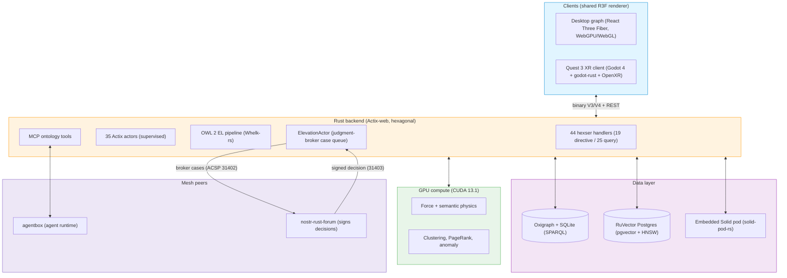

<div align="center">

# VisionClaw

### Watch here, judge there — the flagship engine of the Dynamic Agentic Mesh

[](LICENSE)
[](https://www.rust-lang.org/)
[](https://developer.nvidia.com/cuda-toolkit)
[](docs/README.md)

**Maintainer**: [John O'Hare](https://github.com/jjohare) · **Upstream IP**: [Melvin Carvalho](https://github.com/melvincarvalho) · [MAINTAINERS.md](MAINTAINERS.md)

<br/>

*A live agent swarm embodied in the knowledge graph — status-driven capsules, per-swarm tinting, and real-time action beams from agents to the concepts they touch.*

https://github.com/user-attachments/assets/f45c92dc-4800-4b57-a6e2-178da6bb0a38

</div>

---

## What it is, and why it exists

Hierarchy was an information-routing protocol bounded by human bandwidth. As AI collapses the cost of that routing toward zero, the human role is not deleted — it is promoted from **router** to **judgment broker**: the person who decides at the intersections the machines cannot own.

VisionClaw is the flagship engine that makes that promotion legible. It ingests a Logseq knowledge corpus from GitHub, reasons over it with an OWL 2 EL inference engine (Whelk-rs, 5,975 classes), settles the result as a 3D graph under GPU physics where semantic relationships become attraction and repulsion, and renders it verbatim on the desktop and inside a Quest 3 headset. Agents act **inside** that graph, and every action they take is drawn as a beam from the agent to the concept it touched.

That is the whole design in one line: **VisionClaw observes, it never signs a decision.** It shows an agent working; the [forum](https://github.com/DreamLab-AI/nostr-rust-forum) is where a human answers with a cryptographic signature. Observation and authority are kept apart on purpose — the engine you can watch is not the surface that can commit. Where that separation is only partly wired, the [Status](#status--remaining-work) section says so, dated and pinned to [`docs/TODO-unified.md`](docs/TODO-unified.md).


---

## Where it sits in the ecosystem

VisionClaw is one of seven repositories in the **Dynamic Agentic Mesh** — the coordination substrate DreamLab AI has built on Nostr events since 2022. VisionClaw is the embodiment-and-observation layer. It does not own identity, data sovereignty, or the signing surface; those are separate repos, each graded honestly against its own code.

| Repo | Role in the mesh |
|---|---|
| **VisionClaw** *(this repo)* | Flagship engine — ontology-grounded immersive 3D knowledge graph, GPU physics, agent embodiment |
| [VisionFlow](https://github.com/DreamLab-AI/VisionFlow) | Ecosystem canon — ADRs, PRDs, compatibility matrix, vision report, marketing site |
| [agentbox](https://github.com/DreamLab-AI/agentbox) | Sovereign agent runtime — Nix-built container, `did:nostr` identities, 116 skills, RuVector memory *(git submodule of this repo)* |
| [nostr-rust-forum](https://github.com/DreamLab-AI/nostr-rust-forum) | The one place a human decision gets signed — governance surface, ACSP relay |
| [solid-pod-rs](https://github.com/DreamLab-AI/solid-pod-rs) | Personal-data-sovereignty layer — Rust Solid pod server |
| [narrativegoldmine](https://github.com/DreamLab-AI/knowledgeGraph) | The readable front door — published static render of the corpus VisionClaw shows in 3D |
| [dreamlab-ai-website](https://github.com/DreamLab-AI/dreamlab-ai-website) | The commercial face — thin consumer of the forum kit |

**Industry convergence.** In July 2026 Block (Jack Dorsey) launched [Buzz](https://github.com/block/buzz), a self-hosted, Nostr-native team-chat + AI-agent + git platform in Rust. It independently arrives at the same substrate this ecosystem has been building since 2022: Nostr events as source of truth, agents as first-class signed participants, kind-based extensibility. That convergence validates the direction. What VisionClaw adds on top, and Buzz does not have, is exactly this repo's remit: OWL 2 EL / KG ontology grounding, immersive 3D embodiment of agent action, and the closed memory/learning loops feeding [RuVector](#status--remaining-work).

---

## Architecture



The backend is a Cargo workspace: eight extracted crates (`contracts → domain → {gpu, ontology, protocol} → adapters → actors → xr-presence → visionclaw-server`), 428 Rust files, hexagonal boundaries (9 ports / 12 adapters), direct hexser dispatch — no CQRS bus (ADR-089). Neo4j is fully removed; Oxigraph + SQLite is the single canonical store ([ADR-132](docs/adr/ADR-132-neo4j-removal-oxigraph-adoption.md)). Full detail: [System overview](docs/explanation/system-overview.md) · [Bounded contexts](docs/explanation/bounded-contexts.md).

---

## Quick start

```bash
git clone https://github.com/DreamLab-AI/VisionClaw.git
cd VisionClaw && cp .env.example .env
./scripts/launch.sh up dev
```

`./scripts/launch.sh up dev` is the canonical launcher. The explicit fallback is `docker compose -f docker-compose.unified.yml --profile dev up -d` — `docker-compose.unified.yml` is the only compose file shipped.

| Service | URL | Description |
|:--------|:----|:------------|
| Frontend | http://localhost:3001 | 3D knowledge-graph interface (via nginx) |
| API | http://localhost:4000/api | REST + WebSocket (Rust / Actix-web) |
| Solid pod | http://localhost:8484 | Embedded Solid pod server (solid-pod-rs) |

<details>
<summary><strong>Native Rust + CUDA build (optional GPU)</strong></summary>

```bash
curl --proto '=https' --tlsv1.2 -sSf https://sh.rustup.rs | sh
git clone https://github.com/DreamLab-AI/VisionClaw.git
cd VisionClaw && cp .env.example .env
cargo build --release --features gpu
cd client && npm install && npm run build && cd ..
./target/release/visionclaw-server
```

Requires the CUDA 13.1 toolkit. See the [Deployment guide](docs/how-to/deployment.md) for full GPU setup. The native XR client (`xr-client/`) builds separately as a Quest 3 APK, not a compose service — see [Quest 3 setup](docs/how-to/xr-quest3-setup.md).

</details>

---

## How it works

**Agent embodiment.** When an agent acts on the graph, ontology, or a Solid pod, the action renders as a transient coloured beam `agent → target` in the GPU/XR scene. Beam colour and shape encode the verb (query, update, create, delete, link, transform); RuVector memory access renders as burst rings on the embedding cloud. Both render layers draw from one source-of-truth module (`client/src/features/visualisation/semanticEncoding.ts`) so the encodings cannot drift apart. Transport is one authenticated socket, `/wss/agent-events`, with identity resolved server-side before the identity-blind `0x23` binary frame reaches the browser.

**The insight loop, running for knowledge.** The ontology's *frontier* — classes referenced by axioms but never authored — is a ranked work queue. The `ElevationActor` drafts canonical Class pages, opens a broker case, and waits. A human answers on the forum's governance page with a signed decision; an approval commits the draft to the corpus as a PR, and the next sync ingests it. See [insight-migration loop](docs/explanation/insight-migration-loop.md).

**The judgment broker.** This is where the espoused design and the shipped code diverge, and the honesty rule applies: the broker runs today as the `ElevationActor` case queue on `main`, serving one use case (ontology concept elevation, capped at five concurrent cases) — **not** the distributed `BrokerActor` of the original design, and narrower than a universal human-in-the-loop surface. That gap is tracked, not hidden.

<details>
<summary><strong>Agent Control Surface Protocol (ACSP) — Nostr kinds 31400–31405</strong></summary>

VisionClaw is an ACSP *producer*: agentic actors publish panel events that the forum relay routes and renders as decision surfaces, and only an admin key can publish a signed Decision (31403).

| Kind | Name | Flow |
|---|---|---|
| 31400 | PanelDefinition | Agent declares a control panel |
| 31401 | PanelState | Agent snapshot |
| 31402 | ActionRequest | Agent requests a human decision (broker case) |
| 31403 | ActionResponse | Human approve/reject — admin-only, signed |
| 31404 | PanelUpdate | Agent incremental diff |
| 31405 | PanelRetired | Agent retires a panel |

Contract: [agent-control-surface.md](docs/explanation/agent-control-surface.md) · [ADR-110](docs/adr/ADR-110-agentic-actors-acsp-control-surfaces.md). The agent channel is specified in [ADR-059](docs/adr/ADR-059-bidirectional-agent-channel-server.md).

</details>

<details>
<summary><strong>Binary WebSocket protocol (V3 full / V4 delta)</strong></summary>

High-frequency position updates use a compact binary protocol; V3 is the 52-byte full-snapshot record (with GPU analytics tail), V4 delta — only changed nodes against the last V3 frame — is the production default. Full wire format: [binary-protocol.md](docs/reference/binary-protocol.md). The `0x23 AGENT_ACTION` frame carries the transient agent→data beam.

</details>

---

## Documentation

VisionClaw's docs follow the [Diátaxis](https://diataxis.fr/) framework, backed by the formal decision record (ADRs, PRDs, DDD context maps). Start at the [Documentation Hub](docs/README.md).

| Category | Entry points |
|:---------|:-------------|
| **Explanation** | [System overview](docs/explanation/system-overview.md) · [Ontology pipeline](docs/explanation/ontology-pipeline.md) · [XR architecture](docs/explanation/xr-architecture.md) · [Security model](docs/explanation/security-model.md) · [Bounded contexts](docs/explanation/bounded-contexts.md) · [Insight-migration loop](docs/explanation/insight-migration-loop.md) |
| **Reference** | [REST API](docs/reference/rest-api.md) · [WebSocket protocol](docs/reference/websocket-protocol.md) · [Binary protocol](docs/reference/binary-protocol.md) · [MCP tools](docs/reference/mcp-tools.md) · [Graph schema](docs/reference/graph-schema.md) · [Physics parameters](docs/reference/physics-parameters.md) · [Configuration](docs/reference/configuration.md) |
| **How-to** | [Deployment](docs/how-to/deployment.md) · [Quest 3 XR setup](docs/how-to/xr-quest3-setup.md) |
| **Decisions & work register** | [ADR index](docs/adr/README.md) · [TODO-unified](docs/TODO-unified.md) *(canonical six-state work register)* · [Known issues](docs/KNOWN_ISSUES.md) |

---

## Status & remaining work

*Dated 2026-07-22. Maturity words pinned to the ADR-002 ladder; the canonical register is [`docs/TODO-unified.md`](docs/TODO-unified.md).*

| Capability | Maturity | Honest boundary |
|---|---|---|
| OWL 2 EL + Whelk reasoning | integrated | Real and running — 5,975 classes. |
| W3C SPARQL query | integrated | Real (Oxigraph). No Neo4j anywhere — retired ([ADR-132](docs/adr/ADR-132-neo4j-removal-oxigraph-adoption.md)). |
| GPU graph physics | released | 82 CUDA kernels across 9 `.cu` files (5,854 LOC). ~17k nodes live (17,147 captured); higher figures are benchmarked capacity, not live count. |
| Hexser handlers / Actix actors | released | 44 handlers (19 directive + 25 query); 35 actors; 9 ports / 12 adapters. |
| `did:nostr` identity spine | integrated | One keypair = login + WAC principal + provenance author + DID subject + payment account. |
| ACSP signed governance | integrated | Six-kind protocol live; only the admin key publishes a Decision (31403). One use case today (ontology elevation, ≤5 concurrent) — narrower than universal HITL. |
| RuVector semantic memory | released | 1.17M+ embeddings, bge-small-en-v1.5 via Xinference, 384-dim, HNSW. |
| Judgment broker | integrated | Runs as `ElevationActor` / case queue on `main` — **not** the designed distributed `BrokerActor`. |
| SHACL shape validation | scaffolded | "Lite" — an inline Rust matcher, advisory-only. The 5 `.shacl.ttl` NodeShapes are authored but **not** loaded into Oxigraph. It is not a dual-mode gate. |
| PROV-O provenance | scaffolded | URN-based today; **not** yet reified as queryable RDF triples. Do not assume "every decision traceable via SPARQL". |
| Gluon attractive force | planned | The beam is shipped; the intended agent→target attractive edge is deferred pending a transient-edge GPU buffer (ADR-059 addendum). |

**Live-session pending** (code + tests proven; awaiting observation on real traffic — [TODO-unified §3](docs/TODO-unified.md)): envelope canary fire (L-1), ADR-117 query clamp fire (L-3), ADR-119 telemetry fire (L-4), Quest 3 physical on-device validation (L-5). Keystones K-1/K-2 (server up, canary sweep) landed 2026-07-22.

**Posture held** (decisions, not gaps): XR residue keep-or-delete (T-2), four-tier RBAC merge-or-stay-coarse (T-3).

---

## Contributing & licence

See the [Contributing guide](docs/CONTRIBUTING.md); read [Known issues](docs/KNOWN_ISSUES.md) before starting. Licensed under the [GNU AGPL v3.0-only](LICENSE) — network use is distribution: run a modified version as a network service and you must offer its complete source to its users. Maintainers and upstream IP attribution: [MAINTAINERS.md](MAINTAINERS.md).

<div align="center">

**VisionClaw is the flagship engine of the [VisionFlow](https://github.com/DreamLab-AI/VisionFlow) Dynamic Agentic Mesh, built by [DreamLab AI](https://www.dreamlab-ai.com).**

[Platform](https://github.com/DreamLab-AI/VisionClaw) · [Documentation](docs/README.md) · [Work register](docs/TODO-unified.md) · [Known issues](docs/KNOWN_ISSUES.md)

</div>
