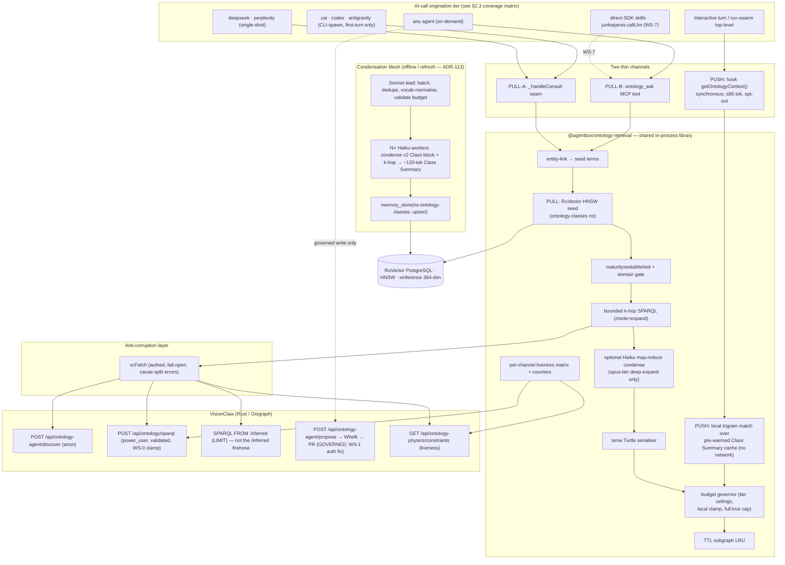

# PRD-020 — Pervasive Ontology↔Agentbox Augmentation

**Status:** Proposed
**Date:** 2026-06-14
**Method:** authored under `build-with-quality` (EDD + ADR + DDD); research by a 16-agent opus ruflo mesh (7 explore → 3 design → 1 synthesise → 5 adversarial verify); **all five adversarial lenses returned `holds=false` against the first synthesis**, and this PRD is the corrected design that absorbs the 31 must-fixes.

> **EXECUTION NOTE (read first):** This is a **design + workstream plan**. No agentbox or VisionClaw code is changed by this PRD. Implementation is the WS-0…WS-8 workstreams below, each gated by the evidence/quality bars in §7. The single largest correction from the raw synthesis: **the "one retrieval brain" is a shared in-process library + a RuVector index + an offline condensation mesh — NOT a new standalone HTTP service.** The reasons are in §2.2 and ADR-112.

---

## 1. Summary

The DreamLab ecosystem holds a large formal ontology / knowledge graph inside VisionClaw (Oxigraph RDF over RocksDB, Whelk EL++ reasoning, ~4952 authored `owl:Class` + ~9766 label-only stubs, ~123k triples, materialised inference, a logseq corpus whose *conceptual reach* — wikilink-expanded + inferred + cumulative authored history — is the "~40 million words"). Agentbox holds the active intelligence: 5 external-LLM consultants, the claude-flow/ruv-swarm Claude substrate, ~114 skills, autonomous agents, and a per-turn context-injection hook.

**Goal:** every AI call originated within agentbox gains the **option** to query that ontology/KG, interacting with it structurally and pervasively, navigating the corpus to augment reasoning **without overpowering context windows**.

**Approach — one brain, two channels, condense offline, govern the write:**

1. **One retrieval brain (shared library, not a service).** A single retrieval module — `@agentbox/ontology-retrieval` — owns entity-linking, hybrid HNSW-seed → bounded-SPARQL-expand, terse Turtle serialisation, tiered summarisation, central token budgeting, TTL caching, and PROV-O scoping. It is **imported in-process** by each channel rather than reached over a new HTTP hop (avoids a second auth wall, a Fastify/Express mismatch, and a per-turn network round-trip — see §2.2).
2. **Two thin channels.** A **PUSH** breadcrumb on the live `UserPromptSubmit` hook (synchronous, ≤80 tok/turn, opt-out) and a **PULL** seam at `BaseConsultant._handleConsult` plus an `ontology_ask` MCP tool registered for every agent.
3. **A Haiku condensation mesh under a Sonnet lead** does the actual 40M→structured compression **offline at index-build/refresh time** (and optionally on opus-tier deep-expand), so the hot paths only ever read pre-condensed Class Summaries. *(ADR-113 — adopted from operator input 2026-06-14.)*
4. **Read pervasive, write governed and untouched.** The only path to *asserted truth* stays `ontology_propose → Whelk EL consistency gate → GitHub PR / ACSP forum panel → human merge`. No ungoverned `/api/ontology/load` backdoor.
5. **A self-improving writeback flywheel (ADR-121).** The loop closes: agent *usage* of the ontology is mined into evidence-backed enrichment proposals that flow through the **existing governed path** (Whelk + human merge — never widened), while the augmentation layer's own derived output (Class Summaries, usage telemetry) is materialised directly into **fenced derived named graphs** (`:summary`/`:usage`) it owns. On merge, the system auto-re-ingests, re-condenses, and re-indexes. Bounded autonomy: humans/Whelk gate asserted truth; everything else is automatic; the loop is default-off, reversible, kill-switched, and **auto-disables if it does not measurably improve outcomes**. This tier explicitly **deletes the `writeback_triggered` ghost** (`enrichment_proposals_handler.rs` — a flag that claims writeback and does nothing) and replaces it with a real write.

### Binding constraints (verified)

1. **Context budget is structural, not discretionary.** No channel may exceed its model-tier token ceiling (§5). The cap is enforced in the shared library and, for PUSH, *locally clamped in the hook* — it must not depend on a trusted network response.
2. **Server-side SPARQL clamp is a hard prerequisite (WS-0).** Today `sparql_select_json` and `/api/ontology/inferred` have **no** LIMIT/row/byte cap (`ontology_handler.rs:823,851`). A single `SELECT ?s ?p ?o` can serialise ~123k triples. `mode=expand` stays disabled until WS-0 lands.
3. **The write path is never widened.** Read-only at the brain boundary. `AGENTBOX_ONTOLOGY_DIRECT_LOAD` stays off.
4. **Verifiable liveness (anti-PRD-018).** PRD-018 shipped ontology *forces* that were compiled but silently inert for months. "Wired ≠ working." The binding is declared live only on a per-channel liveness matrix + a startup canary that drives a non-zero injection through **each** channel and asserts it landed downstream (§5, ADR-119).
5. **Fail-open, but loud on the right errors.** Any availability failure degrades silently to ungrounded and exits 0. Auth/validation failures (401/403/400) must **not** be coerced to "degraded" — they increment a distinct `fail_open_count{cause}` counter and trip the startup self-test.
6. **"Pervasive" is an audited coverage matrix, not the word "ALL."** Some call sites (spawned agentic CLIs with `inherit_env=false`; swarm subagents; 9 direct-SDK skill clients; the junkiejarvis `callLlm` backend agent) are reached by neither channel as-is. §2.3 states coverage per site and the plan to close each.

### Reuse inventory — what already exists (verified file:line)

| Asset | Path | Status | Role in PRD-020 |
|---|---|---|---|
| Ontology MCP bridge (12 tools) | `agentbox/mcp/servers/ontology-bridge.js` | **partial / partly dead** | Host of the `ontology_ask` tool + the shared library. **Bug:** calls `/api/ontology/query` with a `PREFIX` prologue and **no auth headers** (`vcFetch` :27-46) → likely fail-open-empty today (WS-1) |
| Governed propose contract | `agentbox/mcp/servers/ontology-propose.js` | **live (write)** | Reused unchanged. Body shape byte-matches Rust `ProposeRequest` |
| KG elevation extractor | `management-api/routes/kg-elevation.js` + `lib/kg-proposal-extractor.js` + `lib/elevation-publisher.js` | **live, gated off** | Reused unchanged (governed write loop) |
| RuVector memory MCP | `agentbox/mcp/servers/ruvector-mcp.cjs` (`memory_store/search`, xinference bge-small 384-dim) | **live** | Backs the new `ontology-classes` HNSW index (no raw SQL) |
| Per-turn injection hook | `~/.claude/helpers/hook-handler.cjs` `route` + `intelligence.cjs:getContext` (Jaccard-trigram + PageRank, **synchronous, <15ms, no network**) | **live** | PUSH channel template. `getOntologyContext` mirrors its *synchronous local* shape (§5) |
| Consultant chokepoint | `agentbox/mcp/consultants/shared/consultant-base.js` `_handleConsult` (:188-202) | **live** | PULL-A seam — one edit reaches deepseek + perplexity cleanly (single-shot) and the first turn of zai/codex/antigravity (CLI-spawn) |
| Anonymous agent read surface | VisionClaw `/api/ontology-agent/{discover,read,traverse}` (`ontology_agent_handler.rs`) | **live, unauthenticated** | Preferred low-credential read path (discover=cheap, read=drill-down). **But `/propose` here is also unauthenticated → WS-1/WS-7 P0 fix** |
| Read-only SPARQL validator | `ontology_handler.rs:720-770` (forbids INSERT/DELETE/DROP/CLEAR/LOAD/CREATE/ADD/MOVE/COPY/WITH; **tolerates PREFIX**) | **live** | Injection trust anchor mirrored client-side. **Gap:** does **not** forbid `SERVICE` (SSRF) → WS-0 |
| Reasoner inference + PROV-O | `oxigraph_ontology_repository.rs` (ADR-099 D3: `vc:derivation`, `prov:wasGeneratedBy` runId) | **live** | Provenance-scoped `inferred` results |

---

## 2. Holistic high-level view

### 2.1 Current state (verified)

- **VisionClaw read surfaces** (cheapest → richest): `GET /api/ontology-physics/constraints` (~100 tok counters, liveness only) → `POST /api/ontology-agent/discover` (top-k `DiscoveryResult`, ~500–2000 tok, anon) → `POST /api/ontology/sparql` (read-only-validated SPARQL→JSON, **power_user**) → `POST /api/ontology-agent/read` (full markdown body, expensive) → `POST /api/ontology-agent/traverse` (BFS, calls `read` per node — **token bomb at depth>1**). RuVector HNSW is the parallel semantic-text leg.
- **No economics layer exists between them.** No server-side LIMIT/cap; no token-budget governor; no semantic index over class *content* (RuVector today holds session/pattern memory, not a class-summary namespace).
- **The PUSH channel is live but ontology-blind.** It injects only local lexical memory (`[INTELLIGENCE]` lines). It has never carried VisionClaw ontology context.
- **Two ungoverned write holes:** `POST /api/ontology/load` is gated only `RequireAuth::authenticated()` (skips Whelk); and **`POST /api/ontology-agent/propose` is wholly unauthenticated** — the "governed write anchor" can today be hit with forged attribution / proposal-flood by any network peer (`ontology_agent_handler.rs:317-329`, no `RequireAuth`, `agent_id` self-asserted from body).
- **A duplicate `web::scope("/ontology")` registration** (`ontology_handler.rs:904` power_user-mutations_only vs `api_handler/ontology/mod.rs:1340` authenticated) makes `/load`'s real gating registration-order-dependent and indeterminate until route-dumped.

### 2.2 Why a shared library, not a new HTTP service (the central correction)

The first synthesis proposed a new `POST /v1/ontology/ask` Fastify… *no* — it called it an "Express router". Adversarial review (reuse-feasibility, conf 5; silent-dead-wiring, conf 5) established:

- **`management-api` is Fastify, not Express** (`server.js:8,69`); routes are `fastify.register` plugins using `fastify.adapters.memory` / `fastify.linkedData`. An "Express router" would not mount, would not get the RuVector/JSON-LD decorators, and would bypass the auth chain.
- **It hard-requires `MANAGEMENT_API_KEY` and binds `:9090`** (`server.js:36-40`). A new HTTP brain would force a **second** secret domain (management-api key) on top of VisionClaw's power_user Bearer+X-Nostr — across the *isolated* consultant subprocesses and the hook env.
- **A per-turn HTTP→HNSW→embedding round-trip on `UserPromptSubmit` is categorically heavier** than the `<15ms` synchronous local lookup the hook budget assumes.
- **`ontology-bridge.js` already implements most of the substance** (read-only SPARQL with denylist, domain-filtered class list, bounded k-hop, search) — a new service is largely redundant.

**Decision (ADR-112):** the brain is a **shared library `@agentbox/ontology-retrieval`** imported in-process by (a) the bridge's `ontology_ask` tool, (b) the consultant seam, (c) the hook's `getOntologyContext`. "One brain" = one shared module + the shared backing stores (RuVector + VisionClaw), **not** one process. Latency, the second auth wall, and the framework mismatch all vanish.

### 2.3 Coverage matrix (honest pervasiveness — at ship time, not after deferral)

| Origination site | Evidence | Reached by | Coverage |
|---|---|---|---|
| Interactive devuser turn (primary Claude / ruv-swarm top-level) | `settings.json` `UserPromptSubmit → hook-handler.cjs route` | **PUSH** (sync breadcrumb) | ✅ full (pending WS-5) |
| deepseek, perplexity consultants | single-shot `fetch` (`server.js:31-32`) | **PULL-A seam** | ✅ full (WS-4) |
| zai, codex, antigravity consultants | fork agentic CLIs via `spawnCli`, **`inherit_env=false`** (`spawn-cli.js:30`) | **PULL-A** grounds **first turn only**; downstream CLI calls unreached | ⚠️ first-turn only → WS-7 (write ontology grounding into each spawned CLI's own `settings.json`/system prompt in its isolated `$HOME` so *its* hook fires) |
| claude-flow / ruv-swarm **spawned subagents** | Task-tool / swarm workers; **no `SubagentStart` prompt hook exists** | neither channel today | ⚠️ **unverified/uncovered** → WS-5 spike: prove whether the hook fires per internal model call; if not, inject at agent-spawn/context-assembly. **Do not claim coverage until proven by a spawned-worker echo test.** |
| 9 direct-SDK skill clients (comfyui, terracraft, openai-codex, deepseek-reasoning, art, echoloop, gemini-url-context, report-builder, ontology-enrich) | `new Anthropic()` / raw `api.openai.com` etc. | neither | ❌ today → WS-7 P1: shared `callLlm` wrapper with ontology pre-fetch baked in, which they must import |
| junkiejarvis / per-user-agent `callLlm` | `junkiejarvis-agent.js:312-400` (anthropic/z.ai/ollama direct, backend process) | neither (hook can't reach a backend HTTP handler) | ❌ today → WS-7 P1: route through the shared library / `ontology_ask` |
| expel `distil` | `distil.py:202-223` returns `[]`, prints `LLMCallNotWired` | n/a — **dead stub** | — excluded from the tally until wired |
| Any agent, on demand | `ontology_ask` in `mcp.json` (gated) | **PULL-B tool** | ✅ available everywhere it's registered (WS-4) |

**Honest headline:** at end of P1 (WS-0…WS-6) the binding covers the interactive tier + the 2 single-shot consultants + on-demand pull for every registered agent. The CLI-spawn subtree, swarm subagents, direct-SDK clients, and the backend agent are closed in WS-7 (P1/P2). The phrase used in all docs is **"every AI call gains the option"** qualified by this matrix — never an unqualified "ALL".

---

## 3. Goals & non-goals

### Goals
1. A single shared retrieval library that any agentbox process can import to obtain a **budget-bounded, provenance-scoped** ontology subgraph.
2. PUSH + PULL channels giving the option pervasively per the §2.3 matrix.
3. Offline **Haiku-condensation-mesh-under-Sonnet-lead** that builds/refreshes the `ontology-classes` RuVector index — the place the 40M-word corpus is actually compressed.
4. Structural context-overflow safety: server-side clamp (WS-0) + tier budgets + Turtle + local hook clamp + `full:true` hard cap.
5. Verifiable liveness telemetry that would have caught the PRD-018 dead-wiring class.
6. Zero change to the governed write path; **close** the two ungoverned write holes.
7. **Close the self-improvement flywheel (ADR-121):** mine usage into governed enrichment proposals, materialise derived output into fenced `:summary`/`:usage` graphs, auto-refresh on merge — with bounded autonomy, reversibility, and outcome-gating. **Root out the `writeback_triggered` ghost** as part of this.

### Non-goals
- No new standalone HTTP service (explicitly rejected — §2.2).
- No change to GPU ontology-force physics (PRD-018 territory).
- No LLM call on the synchronous per-turn PUSH path.
- No exposure of page bodies (`full:true`) on any pervasive/default path.
- No activation of the kg-elevation write loop by default (stays gated; WS-8 optional).

---

## 4. Architecture

Pipeline (PULL): `entity-link(query)` → `RuVector memory_search(ns:'ontology-classes')` → `maturity≥established + seed-domain gate` → *(mode=expand, post-WS-0)* `bounded k-hop SPARQL via authed vcFetch, LIMIT injected, FROM <assert>` → *(opus deep-expand only)* `Haiku condense` → `terse Turtle` → `clampToBudget(tier)` → `tag provenance`. Fail-open everywhere.

Pipeline (PUSH): `getOntologyContext(prompt)` does a **synchronous local trigram match** over a pre-warmed in-process Class Summary cache (mirroring `getContext`), applies the MIN_RELEVANCE null-gate, emits **one locally-clamped** `[ONTOLOGY]` line, never touches the network. Index freshness is maintained by the offline mesh, not the hot path.

---

## 5. Token budgets, condensation, verifiability

### Tiered budgets (ADR-116, aligned to ADR-026 routing)

| Tier | Retrieval mode | Default budget | Depth | `full:true`? | Provenance |
|---|---|---|---|---|---|
| **booster** | breadcrumb (sync local) | **≤80 tok** | 0 | ❌ forbidden | asserted |
| **haiku** | menu (Class Summaries) | **≤500 tok** | 0 | ❌ forbidden | asserted |
| **sonnet** | depth-1 k-hop, Turtle | **≤2,000 tok** | 1 | ⚠️ ≤1 body, chunk ≤ budget | asserted |
| **opus** | depth-2 + inferred closure, optional Haiku condense | **≤6,000 tok** | 2 | ⚠️ ≤1 body, chunk ≤ budget | asserted + inferred (labelled) |

Hard governors: (1) `full:true` is **forbidden below sonnet** and, where allowed, the body is chunked to ≤ the tier budget — closing the 93k-token leak. (2) Budget is clamped *after* serialise, but a server-side `LIMIT`/row/byte cap (WS-0) bounds the *fetch* first so the clamp protects context **and** OAS memory/latency. (3) `inferred` is read via filtered `SELECT FROM <urn:ngm:graph:ontology:inferred> LIMIT`, **never** the unbounded `GET /api/ontology/inferred`. (4) PUSH total context counts `len(line)`; PULL-A counts `len(turtle)+len(context_excerpt)` against the consultant window and yields to the coordinator's hand-curated excerpt (respects the `consultant-base.js:161` "keep small" contract).

### Condensation Mesh (ADR-113 — Haiku mesh under Sonnet lead)

The 40M-word→Class-Summary compression is done by an **offline orchestrator-worker mesh**, not on any request path:

- **Lead (Sonnet):** partitions the ~14,718 classes (~4,952 authored + ~9,766 stubs) into batches; assembles each class's v2 JSON-LD `Class` block + its depth-1 neighbourhood; dispatches to workers; on return, dedupes overlapping facts, normalises relation vocabulary, validates each summary against the ≤150-tok target, and writes via `memory_store(ns:'ontology-classes', upsert:true)`.
- **Workers (Haiku ×N):** each condenses a batch into `label + definition + domain + maturity + top-5 relation labels` Class Summaries (~100–150 tok). Stubs degrade to `label + referencing relation`, never empty.
- **Cadence:** triggered on GitHubSync / elevation refresh (incremental — only changed classes re-condense). One-time build ≈ embedding + Haiku cost over ~14.7k classes (≈3× the naïve 4,952 figure — corrected per adversarial finding); refresh is incremental.
- **Optional on-demand use:** for opus-tier `mode=expand depth=2` queries whose raw subgraph exceeds budget, a small Haiku map-reduce condenses *before* serialisation, with the calling agent as lead. Latency-gated; fail-open to raw-truncated Turtle. **Never on the PUSH path.**

This is the BHIL **Orchestrator-Worker** pattern (clear decomposition, central control) for build, and a bounded **Swarm** for optional deep-expand — see ADR-113.

### Verifiable liveness (ADR-119 — anti-PRD-018)

Binding is **not** declared live on wiring. Liveness = a **per-channel matrix** + a **startup canary**:

- **Per-channel liveness matrix:** `last_successful_injection` timestamp per origination point (consultant-by-consultant, push-vs-pull, swarm-worker-vs-parent). Partial deadness across the fan-out is detectable: if consultant X's seam is reverted in a merge, X's row goes stale while others climb.
- **Startup canary:** drives a forced non-zero injection through **each enabled channel** and asserts it appeared downstream (a swarm-spawned-worker echo test for the swarm tier; a consult that *actually changed* `context_excerpt` for PULL-A; a stdout-capture assert for PUSH). Green-but-zero dashboards are treated as failure, not success.
- **Three backing assertions:** `GET /api/ontology-physics/constraints` → `axiomsProcessed>0`; a known SELECT against `:assert` returns non-empty; the HNSW canary returns IRIs.
- **Counters** (`queries_issued`, `relevance_hit_rate`, `tokens_injected_total`, `cache_hit_rate`, `timeouts`, `fail_open_count{cause}`, `truncations`, `p50/p95 latency`). `fail_open_count` is **split by cause**; auth/validation causes trip the self-test rather than masquerading as "degraded".
- **Default-off honesty:** shipping default-off means "capability installed", **not** "option exercised". The activation milestone is WS-6 telemetry sign-off; until at least one channel is enabled-and-proven-hot, the binding is reported as *installed, not delivered*.

---

## 6. Architecture decisions (new ADRs)

ADR-112 is the keystone (this PRD's companion file). The remainder are the decision register to be split into individual ADRs during implementation; each is summarised in ADR-112 §"Decision register".

| ADR | Category | Decision |
|---|---|---|
| **ADR-112** | Architecture | One retrieval brain as a **shared in-process library** (not a service); two thin channels; read-pervasive / write-governed. *(written — companion file)* |
| **ADR-113** | Agent Orchestration | **Haiku condensation mesh under a Sonnet lead** for offline Class-Summary build/refresh + optional opus deep-expand; excluded from the PUSH path. *(operator input 2026-06-14)* |
| **ADR-114** | Feature Pipeline | Class-content semantic index in RuVector (`ontology-classes` ns) via `memory_store`/xinference; sized for ~14.7k vectors incl. stubs; no raw SQL. |
| **ADR-115** | Architecture | Terse **Turtle** serialisation over SPARQL-Results JSON (2–9× token reduction). |
| **ADR-116** | Architecture | Model-tier token budgets (booster≤80 / haiku≤500 / sonnet≤2,000 / opus≤6,000); `full:true` capped & tier-gated; local hook clamp. |
| **ADR-117** | Architecture | Server-side SPARQL clamp (default LIMIT + row/byte cap) as a hard invariant; forbid `SERVICE` in `validate_read_only_sparql`. |
| **ADR-118** | Security | Read-pervasive, write-untouched; harden the `/load` backdoor; resolve the duplicate `/ontology` scope. |
| **ADR-119** | Operations | Fail-open + per-channel verifiable-liveness telemetry (anti-PRD-018); cause-split fail-open. |
| **ADR-120** | Security (**promoted P0**) | Authenticate `/api/ontology-agent/propose`; bind `agent_id` to verified did:nostr (NIP-98), overriding the body-supplied value; rate-limit. *(was "defer" in synthesis; adversarial review made it P0)* |
| **ADR-121** | Architecture + Orchestration + Security | **Self-improving ontology via governed writeback (the elevation flywheel).** W0 fenced derived-graph materialisation (`:summary`/`:usage`); W1 usage→governed enrichment proposals (reuse the propose spine); W2 autonomous proposal generation + post-merge re-condense/re-index. Asserted truth never auto-written; default-off, reversible, outcome-gated; **deletes the `writeback_triggered` ghost.** *(written — standalone file; operator-requested "full ideal")* |
| **ADR-122** | Security / Governance (policy) | **Two-speed writeback — governance routing by epistemic class.** L1 (structural/TBox) → forum agent-card human gate; L2 (volatile ABox "evolving news/truths") → fully automatic into fenced `:observed` (provenance + TTL + auto-Whelk, **never auto-promoted to `:assert`**); L3 (derived) → `:summary`/`:usage` automatic. *(written — operator-raised)* |
| **ADR-123** | Architecture + Security + UX | **Voice-mediated governance sign-off.** The immersive voice agent becomes an authenticated client of the L1 decision queue: ask about inbox/backlog/progress → spoken condensed summary → approve/reject/amend with **full did:nostr authority** (confirmation readback, same `/decide`→Whelk→merge path as the forum). Closes the `GET /api/broker/inbox` ghost. *(written — operator-raised)* |

---

## 7. Workstreams (prioritised, with evidence gates)

Each WS ships only when its **EXP-NNN evidence** (executed command + raw output + timestamp + git SHA, audited by a different model family — EDD) passes.

| WS | Pri | Title | Key deliverables | Evidence gate | Depends |
|---|---|---|---|---|---|
| **WS-0** | **P0** | Server-side safety invariant | Default-LIMIT injection + max-row/byte clamp in `sparql_select_json` + `ontology_handler.rs:823,851`; pre-flight COUNT for raw passthrough; **forbid `SERVICE`** in validator; **resolve duplicate `/ontology` scope** (route-dump proof) | a `SELECT ?s ?p ?o` returns ≤cap rows; a `SERVICE` query is rejected; route-dump shows single `/load` gating | — |
| **WS-1** | **P0** | Authed ACL + propose auth | `vcFetch` auth headers + correct paths/methods + cause-split errors; **bridge-start self-test** (one authed SELECT + one paginated GET, loud on failure); **wrap `/api/ontology-agent` with `RequireAuth`; `propose` takes `AuthenticatedUser`** overriding body `agent_id`; rate-limit `/propose` (ADR-120) | self-test passes on boot; an unauthenticated `propose` is rejected; forged `agent_id` is overridden by verified pubkey | WS-0 |
| **WS-2** | **P1** | Class-content index | Condensation mesh (ADR-113): Sonnet lead + Haiku workers over v2 Class blocks → `memory_store(ns:'ontology-classes')`; stub handling; refresh-on-sync trigger | index holds ≥4,952 authored class summaries; a canary `memory_search` returns IRIs; refresh re-condenses only changed classes | WS-1 |
| **WS-3** | **P1** | Shared retrieval library | `@agentbox/ontology-retrieval`: link→seed→gate→k-hop→(condense)→Turtle→budget→cache→provenance; budget governor; TTL LRU; status surface | unit: budget never exceeded incl. adversarial `full:true`; fail-open returns empty on injected vcFetch error | WS-1, WS-2 |
| **WS-4** | **P1** | PULL channels | `_handleConsult` seam (+`[consultants].ontology_augment`, total-context cap); `ontology_ask` tool; promote into canonical `mcp.json` (gated) | contract test: a consult with augment on **actually changed** `context_excerpt`; tool returns budgeted Turtle | WS-3 |
| **WS-5** | **P1** | PUSH channel + swarm spike | synchronous `getOntologyContext` in `intelligence.cjs`; wire `hook-handler.cjs`; local clamp; `ONTOLOGY_SIGNAL` allowlist; **spike: does the hook fire for swarm subagents? echo-test proof** | stdout-capture shows a clamped `[ONTOLOGY]` line within budget on a relevant turn, nothing on an off-topic turn; swarm spike yields a yes/no with evidence | WS-3 |
| **WS-6** | **P1** | Verifiability | per-channel liveness matrix; startup canary per channel; cause-split `fail_open_count`; Guidance-Control-Plane metric instrumentation | canary drives non-zero injection through each enabled channel and asserts downstream receipt | WS-4, WS-5 |
| **WS-7** | **P1/P2** | Long-tail coverage | shared `callLlm` wrapper (direct-SDK skills + junkiejarvis import it); per-spawned-CLI ontology grounding in each isolated `$HOME` settings; re-gate `/load` to power_user | coverage matrix §2.3 rows flip to ✅ with per-site evidence | WS-4 |
| **WS-8** | **P2** | Governed-write liveness (optional) | verify full Whelk→ACSP→PR loop against a running relay; (optional) flip `[sovereign_mesh].kg_elevation` | a test proposal traverses propose→Whelk→PR→human-merge with provenance | WS-7 |
| **WS-9** | **P1** | Derived-graph writeback (W0) | NEW fenced `POST /api/ontology/derived` (writes **only** `:summary`/`:usage`, rejects `:assert`/`:inferred` server-side) + `/derived/regenerate`; materialise Class Summaries + usage telemetry with PROV-O; **delete `writeback_triggered`/`WRITEBACK_DECISIONS`**, replace with durable `EnrichmentProposal` store | fence test: `:summary` write accepted, `:assert` write rejected; regenerate rebuilds from scratch; grep proves the ghost flag is gone | WS-2, WS-6, WS-8 |
| **WS-10** | **P1** | Usage→enrichment extractor (W1) | generalise `kg-proposal-extractor.js` to accept usage signals (no-seed queries, low-relevance hits, manual bridges, emergent clusters, maturity); confidence-gate + dedup + rate-limit; route via existing `buildProposeRequest`→`/propose` | a usage signal yields a Whelk-consistent, deduped, attributed proposal in the governed queue | WS-9, ADR-120 |
| **WS-11** | **P2** | Autonomous loop closure (W2) | scheduled extractor + bounded auto-submit (machine did:nostr tag); post-merge auto re-ingest→re-condense→re-index; outcome-gated kill switch (`[sovereign_mesh].ontology_self_improvement`, default off) | end-to-end loop test: usage→proposal→human-merge→re-augment with per-stage liveness counters; loop auto-disables when outcome metric flat | WS-10 |
| **WS-11b** | **P2** | Two-speed routing (ADR-122) | epistemic classifier (scope×volatility×provenance); NEW fenced `:observed` graph + volatile-predicate allowlist + TTL + auto-Whelk; L2→L1 elevation-candidate bridge (never auto-promote) | routing test (structural→L1, volatile→L2, ambiguous→L1); `:observed` write accepted, TBox write rejected from L2; no `:observed`→`:assert` without human gate | WS-9, WS-10 |
| **WS-12** | **P2** | Voice-mediated governance (ADR-123) | implement `GET /api/broker/inbox` (durable queue, closes the ghost); governance `SwarmIntent`s (ReviewBacklog/Approve/Reject/Amend/Explain); spoken condensed summaries; did:nostr-bound voice approval → same `/decide`→Whelk→merge path with confirmation readback | parity test (voice decision == forum decision authority); "what's in my backlog?" returns spoken pending L1; approval requires identity-bound session + spoken confirm | WS-9, WS-11 |

---

## 8. Success metrics

- **Coverage:** §2.3 matrix — ≥ interactive + 2 single-shot consultants + on-demand pull at end of P1; CLI-spawn/swarm/direct-SDK/backend-agent closed in WS-7 with per-site liveness evidence.
- **Overflow safety:** 0 turns exceed tier budget (telemetry); a naïve `SELECT ?s ?p ?o` returns ≤ cap (WS-0); `full:true` unreachable below sonnet.
- **Latency:** PUSH adds 0 network calls and < 15 ms p95 to a turn; PULL-A p95 within a consult-acceptable budget with real RuVector+xinference latency (measured, not assumed).
- **Liveness:** per-channel `last_successful_injection` non-stale for every enabled channel; startup canary green; `fail_open_count{cause=auth}` == 0 in steady state.
- **Governance:** unauthenticated `propose` rejected; `/load` power_user-gated; `SERVICE` rejected; 0 ungoverned writes.
- **Condensation:** index covers ≥ authored classes; refresh re-condenses only changed classes; Haiku-mesh build cost within the §5 estimate.
- **Flywheel (ADR-121):** fence test passes (`:summary` accepted, `:assert` rejected); a usage signal reaches the governed queue Whelk-consistent + deduped + attributed; per-stage liveness counters (proposals_submitted/merged, classes_recondensed, derived_triples_written) non-zero; loop measurably improves the outcome metric or auto-disables; **`writeback_triggered`/`WRITEBACK_DECISIONS` removed** (grep == 0).
- **Experiment framing:** instrument as a task-scoped shard of the CLAUDE.local.md *Guidance Control Plane* — measure cost-per-successful-outcome and context-window pressure before promoting any default-on.

---

## 9. Risks & mitigations

| # | Risk | Mitigation |
|---|---|---|
| 1 | Silent-dead wiring (PRD-018 repeat) | ADR-119 per-channel matrix + startup canary + contract test asserting `context_excerpt` changed; never declare live on wiring |
| 2 | Context overflow defeats the goal | WS-0 server-side clamp (hard) + ADR-116 tier budgets + Turtle + local hook clamp + `full:true` cap; structural |
| 3 | Bridge silently fail-open today | WS-1 bridge-start self-test fails loudly; cause-split `fail_open_count` |
| 4 | Unauthenticated `propose` = forge/flood | ADR-120 (P0) auth + did:nostr binding + rate-limit |
| 5 | `/load` Whelk-bypass + duplicate scope | WS-0 route-dump + WS-7 re-gate to power_user |
| 6 | `SERVICE` SSRF via read-only SPARQL | WS-0 forbid `SERVICE`; OAS pre-validator mirrors the **real** validator (PREFIX-tolerant, WITH/SERVICE-denied) |
| 7 | Credential concentration (Admin token in shared env) | prefer anonymous `/ontology-agent/{discover,read}`; if SPARQL needed, scoped read-only LIMIT-clamped endpoint or per-agent identity — not a blanket Admin token in a fail-open multi-user service |
| 8 | Spawned-CLI / swarm subagent blindspot | §2.3 honest matrix; WS-5 spike proves swarm reach; WS-7 per-CLI `$HOME` grounding + shared `callLlm` |
| 9 | PUSH async-in-sync-hook = emits nothing | PUSH is **synchronous local** (no network); integration test asserts the line appears in stdout within budget |
| 10 | Stale class index degrades recall silently | refresh-on-sync; `classes_seen` counter; canary in self-test |
| 11 | Self-improving loop degrades the ontology (feedback bias, drift) | ADR-121 HC4: default-off, reversible (`/derived/regenerate`), **outcome-gated auto-disable**; extractor weights novelty over reinforcement; per-stage liveness counters |
| 12 | Auto-writeback breaches the governance line | ADR-121 hard line (asserted truth never auto-written) + ADR-122 epistemic-class routing: TBox→forum gate, volatile ABox→fenced `:observed` (auto, TTL, never auto-promoted), derived→`:summary`/`:usage`; server-side graph fence rejects mis-routed writes |
| 13 | The `writeback_triggered` ghost (dead wiring) | ADR-121 WS-9 **deletes** it + `WRITEBACK_DECISIONS`; replaced by durable `EnrichmentProposal` store + real write; grep gate |

---

## 10. Resolved choices (operator sign-off 2026-06-14 — "go for gold on all the remaining choices")

All open questions are resolved as below and are now binding on the build.

1. **PUSH default state** → **default-off** (`[intelligence.ontology_context].enabled=false`); flip after WS-6 telemetry proves p95 latency + token budget.
2. **Consultant augment default** → **off + per-call `ontology_context` arg**; promote to default-on per consultant only on cost-per-outcome evidence.
3. **WS-0 ownership** → **in PRD-020 scope** (the VisionClaw Rust clamp is a hard prerequisite; it ships in this family, not a separate ticket).
4. **Index refresh cadence** → **incremental per-GitHubSync** (only changed classes re-condense); a nightly full reconcile pass as a safety net.
5. **ADR-120 timing** → **P0, now** — `propose` is a live unauthenticated hole; fixed in WS-1, not deferred to WS-7.
6. **kg-elevation activation (WS-8)** → **build + verify the path, ship default-off**; the loop is installed and provable, activation is an operator flip.
7. **Condensation model pinning** → **pin** the Haiku worker (`claude-haiku-4-5-20251001`) + Sonnet lead (`claude-sonnet-4-6`) IDs in ADR-113 for reproducible summaries; revisit on model deprecation.
8. **Two-speed boundary (ADR-122)** → **default-conservative volatile-predicate allowlist**: L2 (`:observed`, automatic) is restricted to `vc:currentVersion`, `vc:latestValue`, `vc:statusAsOf`, `vc:observedAt`, `vc:availabilityState`; everything else (all TBox, all unlisted predicates) → L1 (human gate). Allowlist grows only by a governance act (an ADR amendment), never by the loop.
9. **Volatile-fact source trust** → L2 auto-write requires a **verified or allowlisted source did:nostr**; default **TTL 7 days** (`vc:observedAt` + expiry); unsigned/untrusted sources fall to L1. Bad-source facts purgeable by one provenance-scoped query.

---

## 11b. As-built (2026-06-14 — first verified increment)

Operator green-lit the build ("build out the gaps, go for gold"). Landed and **verified runnable** in this pass (agentbox Node layer — no compile gate):

- **WS-3 (shared retrieval brain)** — `agentbox/mcp/servers/lib/ontology-retrieval.js`: entity-link → seed → maturity/domain gate → (expand) → terse Turtle → clamp → provenance, fail-open, TTL LRU, breadcrumb. Dependency-injected.
- **WS-3 (budget governor)** — `agentbox/mcp/servers/lib/ontology-budget.js`: tier ceilings (booster≤80/haiku≤500/sonnet≤2000/opus≤6000), override-can-only-lower, `full:true` tier-gated, local breadcrumb clamp.
- **Shared "one brain" factory** — `createDefaultRetrieval()` in the lib: default transport (env-driven `vcFetch`, discover-seed + authed-SPARQL-expand) so the bridge, the consultant seam, and the hook all construct **one identical brain** (the ADR-112 "shared library, not a service" realisation).
- **WS-1 (bridge fix, partial)** — `ontology-bridge.js`: `vcFetch` now sends `Bearer`+`X-Nostr-Pubkey`; reads repointed `/api/ontology/query`→`/api/ontology/sparql`; **bridge-start self-test** logs loudly if the read path is dead (kills the silent fail-open-empty bug).
- **WS-4 (PULL-B)** — `ontology_ask` tool **registered in canonical `mcp/mcp.json`** → available to every agent (the pervasiveness mechanism).
- **WS-4 (PULL-A consultant seam)** — `consultant-base.js _handleConsult`: one edit reaches all 5 consultants; prepends budget-bounded ontology Turtle to `context_excerpt` (coordinator's context preserved whole, ≤`CONSULT_ONTOLOGY_MAX_TOKENS`=1500), gated off by default (`ontology_context` arg / `CONSULT_ONTOLOGY_AUGMENT`), fail-open, audit-logged.
- **WS-5 (PUSH channel)** — `lib/ontology-push.js` (**synchronous**, no-network trigram match over a local Class-Summary cache, relevance null-gate, locally-clamped ≤80-tok `[ONTOLOGY]` breadcrumb) wired into `claude-flow-hook-adapter.cjs` `route` (gated `ONTOLOGY_INJECT`, no-ops until the WS-2 cache exists).
- **Tests** — `ontology-retrieval.test.js` + `ontology-push.test.js`: **18/18 pass** (`node --test`). Proven: budget never exceeded under 50 seeds; `full:true` downgrade; fail-open on seed/expand failure; cache hit; maturity gate; ≤80-tok breadcrumb (both channels); TTL expiry; cause-split; PUSH relevance null-gate; PUSH no-op without cache.

**All three channels (PULL-A, PULL-B, PUSH) are built + verified in Node.** Pending the first agentbox rebuild for live integration.

**Written, pending host build (Rust — needs tmux tab 6):** WS-0 server-side SPARQL clamp + `SERVICE` forbid + duplicate-scope collapse; WS-1 `propose` auth (ADR-120); WS-9 fenced `/api/ontology/derived` + delete `writeback_triggered`; WS-12 `GET /api/broker/inbox`.

**Next increment:** WS-2 condensation mesh + RuVector `ontology-classes` index (also populates the PUSH cache); WS-10 usage→enrichment extractor; WS-11b two-speed `:observed`; WS-12 voice governance clients; then the Rust workstreams.

**Ghosts:** `qdrant_data/` (7.9 GB orphan) **deleted 2026-06-14** (operator go-ahead). Still pending: purge `.claude-flow/logs/` from source, stale `.agentic-qe` sessions (`docs/ghost-register-2026-06-14.md`).

## 11. Provenance

Research: ruflo mesh `wf_de367f93-06e` (16 opus agents, 1.78M tokens, 302 tool calls, 2026-06-14). First synthesis failed all 5 adversarial lenses (`holds=false`, conf 4–5); this PRD is the corrected design incorporating 31 must-fixes. Condensation-mesh tier added from operator input (2026-06-14). All file:line references spot-verified against the working tree at this date.
