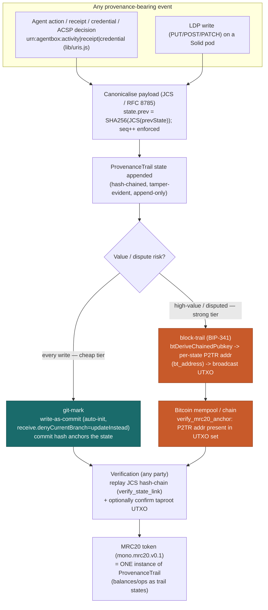
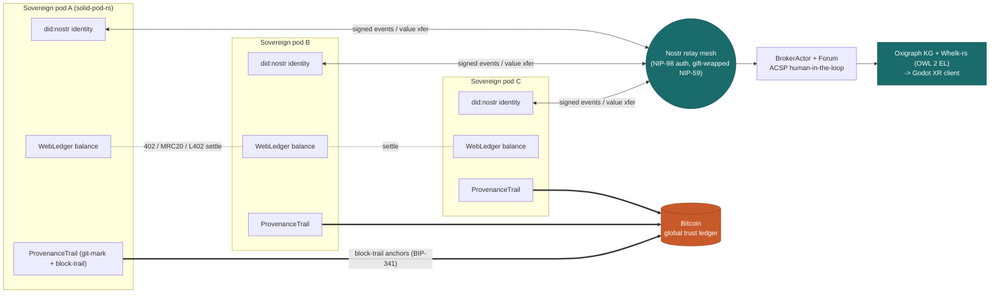
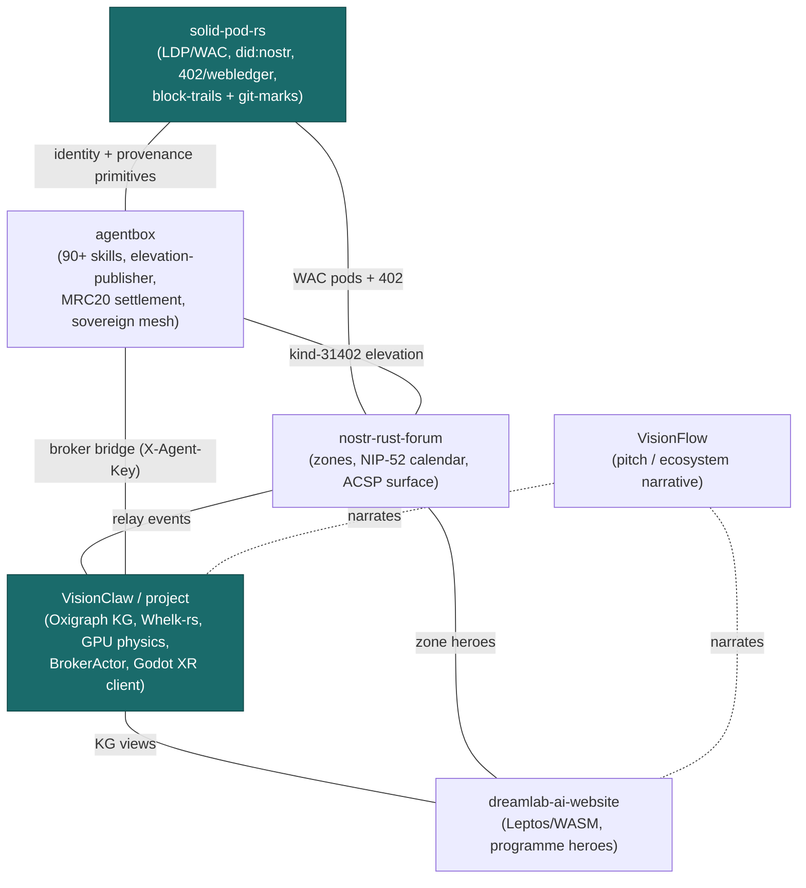

# ADR-111 — Ecosystem Infographic Modernisation: diagram-as-code + Nano Banana regeneration

**Status:** Proposed
**Date:** 2026-06-13
**Supersedes/relates:** ADR-110 (ACSP elevation control surfaces), ADR-032 (embed solid-pod-rs), agentbox ADR-032 (402 scheme grammar), agentbox PRD-015 (consumer broadcast economy), solid-pod-rs ADR-059 (provenance primitives: block-trails + git-marks)
**Scope:** Six repos — `project` (VisionClaw/VisionFlow), `agentbox`, `nostr-rust-forum`, `solid-pod-rs`, `dreamlab-ai-website`, and the VisionFlow ecosystem pitch/website asset tree.

> **EXECUTION NOTE (read first):** This ADR is an **audit + prompt-layout plan only**. No images are generated, edited, deleted, re-rendered, or committed as part of this ADR. Image generation/regeneration/removal is a **separate follow-up task** that the operator runs later (see §7). Everything below — verdicts, mermaid skeletons, Nano Banana prompts — is the specification that follow-up task will execute against.

---

## 1. Context

The DreamLab AI ecosystem has shipped a substantially new feature set through 2026, but a large share of its **infographics, hero art, and rendered architecture diagrams predate that stack**. The visual layer has drifted from ground truth. The features now central to the product — and therefore the things our images must depict — are:

- **Bitcoin-anchored provenance (block-trails).** A `ProvenanceTrail` primitive: JCS-canonicalised, hash-chained, tamper-evident append-only state log, with an **optional BIP-341 taproot anchor** (per-state P2TR address → mempool UTXO) for high-value/disputed records. The MRC20 token (profile `mono.mrc20.v0.1`) is now just **one instance** of this general trail. Code lives in `solid-pod-rs/crates/solid-pod-rs/src/mrc20.rs` (verify/derive side present: `bt_derive_chained_pubkey`, `bt_address`, `verify_mrc20_anchor`, feature `mrc20=k256`). Specified in solid-pod-rs **ADR-059**.
- **git-marks.** The cheap-tier provenance sibling: **write-as-commit** (git-commit-anchored, auto-init + `receive.denyCurrentBranch=updateInstead`). Every LDP write can leave a commit mark; every agent action/receipt/credential URN (`urn:agentbox:activity|receipt|credential`, minted via `lib/uris.js`) becomes a trail state — git-mark always, Bitcoin anchor optionally.
- **The 402 / webledger / MRC20 / AMM value-transfer substrate.** HTTP **402 Payment Required** with `PaymentCondition`, a multi-currency **WebLedger** keyed by `did:nostr`, MRC20 token rails, and an **AMM**. Framed ecosystem-wide as a **global trust ledger + value-transfer substrate** — not a "crypto feature." Specified in agentbox **ADR-032 (402 scheme grammar)** and **PRD-015 (consumer broadcast economy)**; settlement derives from the upgraded pod. (`solid-pod-rs/crates/solid-pod-rs/src/trading.rs` provides a **live** order book — `/pay/.offers|.sell|.swap` — and a constant-product **AMM** — `/pay/.pool` — both routed in solid-pod-rs ADR-059 Phase 0; the WebLedger is keyed by `did:nostr`. Nostr is the federation primitive. Value-transfer art should depict the **webledger + 402 spend-receipt** flow alongside the AMM / order-book rails.)
- **ACSP human-in-the-loop elevation.** Agentic Actors Control Surfaces Project: agents publish governed proposals as **signed Nostr kind-31402 ActionRequests** (control-surface kinds 31400–31405), routed Agent → Relay → BrokerActor → Forum → **Human approval** → write-back. Publisher: `agentbox/lib/elevation-publisher.js`. Specified in project **ADR-110** and the Judgment Broker (ADR-041).
- **Native Godot XR client** replacing Babylon.js / Vircadia.
- **Oxigraph** RDF knowledge graph replacing Neo4j; OWL 2 EL reasoning via **Whelk-rs**.
- **did:nostr identity** (secp256k1/Schnorr, passkey-derived, never stored) across all surfaces; NIP-98 the universal auth seam; NIP-59 gift-wrapped DMs.
- **Lightning / L402** micropayment rails alongside MRC20/webledger.
- **The agentic-mycelia narrative** — value, provenance, and trust transferred across a living **Nostr agentic mesh** (sovereign pods as nodes, did:nostr agents as hyphae, block-trails as the nutrient/signal flow). This is the connective story the marketing art must carry.

Per the **operator remove-legacy mandate**, stale images that depict retired tech (Babylon/Vircadia, Neo4j, Telegram/CTM, generic 2024 crypto/metaverse stock, pre-economy SOLID positioning) are **REPLACED-AND-DELETED**, not kept in parallel. We do not maintain two truths.

The good news from the six inventories: the **technical diagram corpus is largely current** (most VisionClaw `docs/diagrams/*`, the solid-pod-rs `.mmd` sources updated 2026-06-12, all forum diagrams already mermaid). The drift is concentrated in (a) **rendered PNG staleness** vs updated mermaid sources, (b) **marketing/hero art** built in May 2024 from generic stock, and (c) a few **retired-tech / duplicate** marketing assets. There are also **net-new gaps**: no diagram anywhere yet depicts block-trails/git-marks, the 402/webledger flow, or the agentic-mycelia mesh.

---

## 2. Decision

A three-track policy, applied per image by verdict:

1. **Technical diagrams → diagram-as-code (mermaid), version-controlled, drift-checkable.**
   Architecture, sequence, state, and flow diagrams become `.mmd`/fenced-mermaid sources committed next to the docs that embed them. Rendered PNGs (where needed for PDFs/LaTeX/README) are produced **from** those sources by a render step, never hand-authored. This makes every diagram greppable, diffable, and CI-checkable against code. Verdict tag: **REGEN-AS-MERMAID** (covers both "PNG superseded by mermaid" and "stale PNG, re-render from current `.mmd`").

2. **Marketing / feature / hero art → regenerated via the `/art` Nano Banana 2 skill.**
   Model `gemini-3.1-flash-image-preview` (Nano Banana 2; Pro `gemini-3-pro-image-preview` for the most complex hero composites). **House aesthetic (operator-specified, matches the art skill `aesthetic.md`):**
   - Backgrounds **light** — warm cream `#F7F4EA` or pure white `#FFFFFF`.
   - **Hand-drawn-sketch editorial** line work, charcoal `#2D2D2D`, rough/imperfect whiteboard feel; lines dominate 70–80% of the composition.
   - Two accents only: **deep teal `#1A6B6B`** (trust/expertise, ~10–15%) and **burnt orange `#C85A2A`** (warmth/action, ~5–10%).
   - **Strong text rendering** (Nano Banana 2 leads text-in-image); render the actual labels.
   - **4K** output (final), 512px preview first to iterate cheaply.
   - **No generic crypto/metaverse clichés.** Depict the *actual* tooling: sovereign pods, Bitcoin-anchored provenance trails, did:nostr agents, the Oxigraph-backed knowledge-graph XR client, value flowing across the Nostr agentic mesh.
   Verdict tag: **REGEN-AS-NANOBANANA**.

3. **Retired-tech / duplicate images → removed** after their replacement lands.
   Verdict tag: **REMOVE-STALE** (retired tech / pre-2026 marketing) or **REMOVE-DUPLICATE** (orphaned redundant asset). Deletion happens in the follow-up task, paired with the replacement so no doc ends up with a broken embed.

Verdicts not in the above three are bookkeeping: **KEEP** (current + accurate), **KEEP-ARCHIVAL/HIDDEN** (retain, not surfaced), **ASSESS** (needs a visual eyeball in the follow-up to decide Babylon-vs-Godot etc.).

---

## 3. Inventory & Verdicts

Counts are summarised where long-tailed. Paths are as reported by each repo's inventory pass (the `inv:visionflow` `/assets/**` and `/website/**` paths are relative to that pitch/asset tree; all others are absolute).

### 3.1 `project` — VisionClaw (`/home/devuser/workspace/project`)

| Image path | Depicts | Referenced in | Verdict | New-feature relevance |
|---|---|---|---|---|
| `docs/diagrams/01-three-layer-mesh.png` | Governance/orchestration/discovery mesh | README hero | KEEP | Already current (Whelk-rs, Oxigraph, Godot XR, Nostr DID) |
| `docs/diagrams/03-four-plane-voice.png` | Voice routing (STT/TTS/spatial planes) | README L1 | KEEP | Live voice stack |
| `docs/diagrams/04-mcp-tools-radial.png` | 7 ontology MCP tools around Whelk-rs | README MCP | KEEP | Current; references Oxigraph + Whelk |
| `docs/diagrams/05-architecture-hexagonal.png` | Hexagonal backend, ports/adapters, GPU | README arch | KEEP | Matches ADR-089 direct dispatch |
| `docs/diagrams/07-dual-tier-identity.png` | did:nostr + Solid Pod identity | README identity | KEEP | Current dual-tier identity |
| `docs/diagrams/02,06,08–20 + skills-ecosystem*` | Flywheel, migration, scoring, physics, DDD context/ACL/sequences, skill lifecycle, skills ecosystem | README/docs | KEEP (18 diagrams) | Current; org/skill/DDD models unchanged |
| `docs/diagrams/upgraded/01–11*.png` | Nano Banana Pro final upgrades | docs/presentation | KEEP (11) | Publication-quality finals |
| `docs/diagrams/rendered/01–11*.png` | Mermaid precursors of the above | — | **REMOVE-STALE** (11) | Intermediate renders superseded by `upgraded/` |
| `presentation/report/diagrams/01–10*.svg` | Org/mesh/KPI/adoption SVGs | pitch deck | KEEP (10) | Current; SVG already diagram-as-code-ish |
| `presentation/report/images/wardley-01/02/05*.png` | Wardley positioning maps | pitch | KEEP (3) | Reflect current stack |
| `graph-knowledge-nucleus.png`, `graph-dual-control-center.png` | Live dual-graph + control centre | README | KEEP | Live system screenshots |
| `logseq1–4.png` | Logseq ingestion source format | README | KEEP (4) | Source-data docs |
| `docs/screenshots/01–05*.png`, `screenshots/*` (8), `cleaned/frame_*` (16), `client/test-results/control-center.png` | UI/physics validation, anim frames | docs/tests | KEEP/KEEP-ARCHIVAL (~30) | Current UI / archival frames |
| `ChloeOctave.jpg` | Historical team photo (Salford 2017) | README | KEEP | Team-history value; clearly historical |
| `docs/visionclaw-poster.jpg`, `docs/diagrams/linkedInEcosystem.png`, `docs/explanation/visionflow-wardley-map.png` | Poster / ecosystem hero / Wardley | README/docs | KEEP | Current marketing |
| `agentbox/workspace/.codex/.tmp/plugins/**` (~390 svg/png/jpg) | Vendor SaaS logos (Slack/GitHub/Figma…) | — | KEEP-IGNORE (~390) | Out of scope; not our infographics |

**`project` summary:** ~38 in-scope diagrams; the only deletions are the **11 `docs/diagrams/rendered/*` precursors** (REMOVE-STALE, superseded by `upgraded/`). No retired-tech found in this repo's diagrams.

### 3.2 `agentbox` (`/home/devuser/workspace/project/agentbox`)

| Image path | Depicts | Referenced in | Verdict | New-feature relevance |
|---|---|---|---|---|
| `docs/agentbox.png` | Hero: 90+ skills, Solid pod, nostr-rs-relay, management-api, did:nostr, hardening | README L5 | KEEP | Accurate to 2026 sovereign stack |
| `docs/images/setup-wizard-overview.png` | Setup wizard SPA (live tool) | PRD-012 / quickstart / README | KEEP | Functional screenshot, current |
| `docs/agentbox_old.jpg` | "Sovereign Data Stack" pre-2026 marketing (SOLID/JPS/Verified Web, generic icons) | unused | **REMOVE-STALE** | No Bitcoin-anchored provenance, no Godot XR, no 402/Lightning, no Oxigraph; pre-economy positioning |
| `docs/images/setup-wizard-sections.png` | Duplicate of wizard-overview | unused | **REMOVE-DUPLICATE** | Asset debt |
| `docs/images/setup-dashboard.png` | Ops dashboard with **placeholder** service-card labels (GPT-Lite, Recromer…) | PRD-012 / quickstart | **REGEN-AS-NANOBANANA** | Relabel to real services: nostr-rs-relay, solid-pod-rs, management-api, memory store, Prometheus, pod health, 402/webledger status, LLM marketplace |

**`agentbox` summary:** 5 in-scope. KEEP 2, REGEN-AS-NANOBANANA 1, REMOVE-STALE 1, REMOVE-DUPLICATE 1.

### 3.3 `nostr-rust-forum` (`/home/devuser/workspace/nostr-rust-forum`)

| Image path | Depicts | Referenced in | Verdict | New-feature relevance |
|---|---|---|---|---|
| `docs/screenshots/forum-zones-friends-view.webp` | Config-driven zone tiles (public/friends/locked) | README | KEEP | Live June-2026 zone ACL |
| `docs/screenshots/forum-section-friends-chat.webp` | Cohort-gated NIP-42 chat, display-name resolution | README | KEEP | Live |
| `docs/screenshots/forum-events-freebusy-friends.webp` | Tiered NIP-52 calendar projection | README | KEEP | Live |
| 8 markdown files, 73+ mermaid blocks (`README`, `docs/architecture.md`, `docs/diagrams/*`) | Zone/calendar/auth/governance/relay flows | docs | KEEP (already diagram-as-code) | Reference shipping did:nostr, pod-worker 402/MRC20, block-trails governance, Oxigraph relay workers |
| External hero URLs (`/images/heroes/*-hero.webp`) | Zone banners | `ZONE_CONFIG` env | N/A in-repo | Hosted in `dreamlab-ai-website` (see §3.5) |

**`nostr-rust-forum` summary:** 3 screenshots KEEP; **0 to regen/remove** — all diagrams already mermaid and current. Exemplar repo for the diagram-as-code policy.

### 3.4 `solid-pod-rs` (`/home/devuser/workspace/solid-pod-rs`)

All 8 core diagrams live under `crates/solid-pod-rs/docs/diagrams/rendered/` with `.mmd` sources. **Sources updated 2026-06-12; PNG renders stale (2026-04-20, 53 days out of sync).** Semantic content current — re-render, do not redraw.

| Image path | Depicts | Verdict | New-feature relevance |
|---|---|---|---|
| `…/rendered/01-architecture-overview.png` | 3-layer crate arch, NIP-98 + OIDC gates, LDP/WAC/Notif/WebID, Fs/Memory/S3 storage | **REGEN-AS-MERMAID** (re-render) | Core; `.mmd` current |
| `…/rendered/02-request-lifecycle.png` | PUT: NIP-98 → WAC → storage, 401/403/5xx branches | REGEN-AS-MERMAID | Current |
| `…/rendered/03-wac-inheritance.png` | `.acl` walk-up precedence, `accessTo` vs `default` | REGEN-AS-MERMAID | Current |
| `…/rendered/04-ldp-containment.png` | BasicContainer, `ldp:contains`, server-managed triples | REGEN-AS-MERMAID | Current |
| `…/rendered/05-notifications-flow.png` | StorageEvent → broadcast → WS+webhook, backoff/circuit-breaker | REGEN-AS-MERMAID | Current |
| `…/rendered/06-oidc-dpop.png` | DCR, DPoP `cnf.jkt`, per-request proof, WebID | REGEN-AS-MERMAID | Current |
| `…/rendered/07-nip98-vs-oidc.png` | Dual-auth swim lanes to same AuthZ | REGEN-AS-MERMAID | Current |
| `…/rendered/08-storage-trait.png` | `trait Storage` class diagram (Fs/Memory; S3 flag, no impl) | REGEN-AS-MERMAID | Current |
| **GAP — 402/webledger/MRC20** | HTTP 402 `PaymentCondition`, WebLedger, spend-receipt | **NEW (mermaid)** | ADR-059 + agentbox ADR-032; documented in README, no diagram |
| **GAP — block-trails + git-marks** | `ProvenanceTrail` hash-chain + BIP-341 anchor; write-as-commit | **NEW (mermaid)** | ADR-059 core; under implementation |
| **GAP — did:nostr resolution** | Schnorr key → DID doc → WebID | **NEW (mermaid)** | Documented, no flow diagram |

**`solid-pod-rs` summary:** 8 KEEP-semantics → **REGEN-AS-MERMAID (re-render from current `.mmd`)**; **3 NEW** diagrams to author (§4.1–4.3). No retired tech.

### 3.5 `dreamlab-ai-website` (`/home/devuser/workspace/dreamlab-ai-website`)

94 images; ~30 in-scope. Forum/UI screenshots and venue/team/showcase photography are timeless → KEEP. The **10 programme hero images (May 2024 stock)** are the drift.

| Image path | Depicts (current vs needed) | Referenced in | Verdict | New-feature relevance |
|---|---|---|---|---|
| `public/images/heroes/ai-commander-week.webp` | Generic 2024 AI render → **ACSP control surface (kinds 31400–31405) + human approval panels** | og-meta, Programmes | **REGEN-AS-NANOBANANA** | ADR-110 governance loop |
| `public/images/heroes/visionflow-power-user.webp` | Generic network viz → **Oxigraph RDF KG + OWL 2 EL reasoning, XR client** | Programmes | **REGEN-AS-NANOBANANA** | Oxigraph replaces Neo4j |
| `public/images/heroes/decentralised-agents.webp` | Generic blockchain stock → **Lightning/L402 + did:nostr Schnorr + Nostr relay mesh + block-trails** | Programmes | **REGEN-AS-NANOBANANA** | Economy + provenance |
| `public/images/heroes/cyber-infrastructure.webp` | Generic cybersec → **Solid pod WAC ACL inheritance, Workers trust boundary, relay zone enforcement** | Programmes | **REGEN-AS-NANOBANANA** | WAC + zones |
| `public/images/heroes/xr-innovation-intensive.webp` | Generic XR stock → **Godot native XR client (NOT Babylon/Vircadia), KG-in-XR** | Programmes | **REGEN-AS-NANOBANANA** | Godot migration |
| `public/images/heroes/engineering-visualisation.webp` | Generic CFD → Gaussian splat from drone survey + Unreal pipeline | Programmes | REGEN-AS-NANOBANANA | Capture pipeline |
| `public/images/heroes/neural-content-creation.webp` | Generic NeRF → photogrammetry → Gaussian splat workflow | Programmes | REGEN-AS-NANOBANANA | Capture pipeline |
| `public/images/heroes/virtual-production-master.webp` | Generic VP → DreamLab LED volume / Unreal pixel-streaming | Programmes | REGEN-AS-NANOBANANA | Real facility |
| `public/images/heroes/corporate-immersive.webp` | Generic enterprise → optional: Solid pod + Nostr identity onboarding | Enterprise | REGEN-AS-NANOBANANA (optional) | Identity story |
| `public/images/heroes/creative-technology-fundamentals.webp` | Generic IDE → optional: AI-assisted dev workflow | og-meta/workshops | REGEN-AS-NANOBANANA (optional) | Low priority |
| `docs/images/screenshots/forum-*` (5), `heroes/{minimoonoir,dreamlab,family,business,digital-human-mocap,spatial-audio,lake-district-dawn}` | Live forum UI / generic-safe / venue | README/og | KEEP (~12) | Current or timeless |
| `public/images/{venue/* (8), team/* (45), showcase/0–9 (10), portfolio/*-thumb (8), partners/visioninglab-dark}` | Facility/team/portfolio/partner | site | KEEP (~72) | Timeless |

**`dreamlab-ai-website` summary:** ~28 KEEP, **~10 REGEN-AS-NANOBANANA** (8 high-priority programme heroes + 2 optional). No explicit retired-tech *files* to delete, but the regen targets must purge the *implied* legacy (Babylon/Vircadia/Neo4j/generic blockchain).

### 3.6 VisionFlow ecosystem pitch/asset tree (`inv:visionflow`, within `project`)

| Image path (repo-relative) | Depicts | Referenced in | Verdict | New-feature relevance |
|---|---|---|---|---|
| `/assets/generated/{evolution-line,five-substrates,identity-spine,judgment-broker,coordination-topology}.png` | Evolution, 5 substrates, did:nostr spine, broker sequence, deploy topology | README | KEEP (5) | Current; mermaid-rendered |
| `/assets/diagrams/{wardley-map,ecosystem-overview,agentbox-overview,solid-pod-rs-architecture}.png` | Strategy, federation, agentbox, solid stack (incl. 402/Bitcoin) | README/pitch | KEEP (4) | Current |
| `/assets/screenshots/{visionclaw-graph-live.png}`, `/website/static/img/{vc-graph-hero,vc-control-center}.png`, showcase `{visionclaw-graph-ui,studio,octave-lab,photogrammetry-env,nostr-forum,jss-architecture.svg}`, `visionflow-triptych.jpg`, `decentralised-agents.webp`, `dreamlab-hero.webp` | Live product / showcase / brand | README/site | KEEP (~16) | Current product shots |
| `/assets/diagrams/{dual-tier-identity,three-layer-mesh,visionclaw-architecture,insight-ingestion-cycle,mcp-tools-radial}.png` | Identity tiers, federation strata, VC internals, ingestion, MCP taxonomy | README tables / none | **REGEN-AS-MERMAID** (5) | Render from mermaid (DRY); MCP counts drift → prefer table/registry |
| `/assets/diagrams/{solid-request-lifecycle,nip98-vs-oidc}.png` | Solid request, auth comparison | none | REGEN-AS-MERMAID → consolidate into solid-pod-rs docs (2) | Dedupe with §3.4 |
| `/assets/heroes/visionflow-power-user.webp` | Generic feature hero → **provenance beads, governance panels, git-marks, Oxigraph** | unknown | **REGEN-AS-NANOBANANA** | New features |
| `/website/static/img/showcase/{cave-knowledge-graph,hand-interaction,telepresence}.webp`, `/assets/heroes/cyber-infrastructure.webp`, `/pitch/img/cyber-infrastructure.png` | Multi-user XR / interaction — **possibly Babylon/Vircadia era** | site/pitch | **REGEN-AS-NANOBANANA** *(pending visual ASSESS)* | Must be Godot; regen if legacy |
| `/assets/screenshots/octave-lab-2017.jpg`, `/website/static/img/vc-graph-product.png` | 9-yr-old lab / superseded product render | none | **REMOVE-STALE** (2) | Replace with current multi-user / `vc-graph-hero` |
| `/pitch/img/{agentbox-overview,ecosystem-overview,wardley-map,coordination-topology,identity-spine,judgment-broker}.png` | Identical MD5 duplicates of `/assets/**` | pitch LaTeX | **REMOVE-DUPLICATE** (6) | Keep canonical in `/assets/`; point LaTeX there |
| `/assets/screenshots/visionclaw-poster.jpg`, `/pitch/*.pdf`, `/pdf-reports/*` | Poster / pitch PDFs | pitch | **ASSESS-FRESHNESS** | Check PDF `CreationDate`; regen if pre-2026; verify symlink vs copy |

**VisionFlow summary:** ~25 KEEP, **7 REGEN-AS-MERMAID**, **5 REGEN-AS-NANOBANANA** (4 pending XR ASSESS), **2 REMOVE-STALE**, **6 REMOVE-DUPLICATE**, **3 ASSESS-FRESHNESS**. The README still names Babylon.js/Vircadia (line ~198) as XR tech and has **no Godot references** — flagged for the follow-up: either the Godot migration art is premature, or the README is itself stale. **Resolve text-vs-image truth before regenerating XR heroes.**

### 3.7 Ecosystem totals

| Verdict | Count (approx) |
|---|---|
| KEEP / KEEP-ARCHIVAL / KEEP-HIDDEN / KEEP-IGNORE | ~560 (incl. ~390 vendor icons + ~72 website photos) |
| REGEN-AS-MERMAID (re-render or supersede PNG) | **15** (8 solid-pod-rs + 7 VisionFlow) |
| NEW mermaid (gap-fill) | **3+** (402/webledger, block-trails+git-marks, did:nostr) + ecosystem-topology + agentic-mycelia (this ADR §4) |
| REGEN-AS-NANOBANANA | **~16** (10 website + 5 VisionFlow + 1 agentbox) |
| REMOVE-STALE | **14** (11 VC `rendered/` + agentbox_old + octave-lab-2017 + vc-graph-product) |
| REMOVE-DUPLICATE | **7** (6 pitch dupes + agentbox wizard-sections) |
| ASSESS (XR tech / PDF freshness) | **7+** |

---

## 4. Diagram-as-code skeletons

Concrete mermaid for the highest-value REGEN-AS-MERMAID and NEW items, depicting the **current** architecture with the new features. These are authored to be committed as `.mmd` sources (or fenced blocks) and rendered into the relevant `docs/diagrams/` trees.

### 4.1 Provenance tiers — git-mark (cheap) + block-trail (Bitcoin-anchored)

> Target: `solid-pod-rs/crates/solid-pod-rs/docs/diagrams/` new `09-provenance-tiers.mmd`; cross-link from agentbox provenance docs. Source of truth: ADR-059, `src/mrc20.rs`.



Drift-checks to assert in CI: `bt_derive_chained_pubkey`/`bt_address`/`verify_mrc20_anchor` exist in `src/mrc20.rs`; feature `mrc20` gates `k256`; `verify_state_link` enforces `prev == SHA256(JCS(prev))`.

### 4.2 402 / WebLedger / MRC20 / AMM value-transfer flow

> Target: `solid-pod-rs` new `10-webledger-402-flow.mmd` + mirror into VisionFlow `/assets` (replacing the static MCP/identity PNGs with a real economy diagram). Source of truth: agentbox ADR-032 (402 scheme grammar), PRD-015, `payments.rs`/webledger, the C4 402 spend-receipt.

```mermaid
sequenceDiagram
    autonumber
    participant C as Consumer agent (did:nostr)
    participant P as Solid pod / resource (402-gated)
    participant WL as WebLedger (multi-currency, keyed by did:nostr)
    participant LN as Lightning / L402
    participant MR as MRC20 rail (block-trail)
    participant PT as ProvenanceTrail (spend receipt)

    C->>P: GET /resource
    P-->>C: 402 Payment Required\nPaymentCondition { amount, currency, scheme }
    Note over C,P: scheme grammar per agentbox ADR-032\n(global trust ledger + value transfer)

    alt Lightning / L402
        C->>LN: pay invoice (sats)
        LN-->>C: preimage / L402 token
        C->>WL: present proof -> credit did:nostr balance
    else MRC20 webledger (Bitcoin-anchored)
        C->>MR: transfer (JCS state, seq++, prev-hash)
        MR->>MR: optional BIP-341 taproot anchor
        MR-->>WL: settled -> debit/credit balance
    end

    WL->>WL: check_replay / record_replay (no double-spend)
    WL->>PT: append spend receipt as trail state\n(urn:*:receipt, git-mark always)
    PT-->>WL: receipt hash (verifiable)

    C->>P: GET /resource  (Authorization: settled)
    P->>WL: verify balance / receipt
    WL-->>P: ok
    P-->>C: 200 + resource

    Note over WL: order book (/pay/.offers|.sell|.swap) + constant-product AMM\n(/pay/.pool) — trading.rs, routed in ADR-059 Phase 0; webledger keyed by did:nostr
```

### 4.3 ACSP elevation — human-in-the-loop loop

> Target: project new `docs/diagrams/21-acsp-elevation-loop.mmd`. Source of truth: ADR-110, ADR-041 (Judgment Broker), `agentbox/lib/elevation-publisher.js`, control-surface kinds 31400–31405.

```mermaid
sequenceDiagram
    autonumber
    participant AG as Agent (agentbox, did:nostr)
    participant EP as elevation-publisher.js
    participant RL as Nostr relay (nostr-rust-forum)
    participant BR as BrokerActor (VisionClaw)
    participant FM as Forum control surface
    participant HU as Human reviewer
    participant PT as ProvenanceTrail

    AG->>EP: governed proposal\n(urn:agentbox:thing:proposal-*)
    EP->>RL: publish kind-31402 ActionRequest\n(NIP-33 d-tag, signed, NIP-98)
    RL->>BR: deliver control-surface event (31400-31405)
    BR->>FM: render proposal in Judgment Broker workbench
    FM->>HU: present for approval (diff, rationale, blast radius)

    alt Human approves
        HU->>FM: approve
        FM->>BR: decision = approved
        BR->>PT: append decision (git-mark; anchor if high-value)
        BR-->>AG: write-back POST /api/enrichment-proposals/{id}/decide (200)
        AG->>AG: apply action (now provenance-stamped)
    else Human rejects / edits
        HU->>FM: reject or amend
        FM-->>BR: decision = rejected/amended
        BR-->>AG: no-apply / revised constraints
    end

    Note over EP,RL: publisher is inert no-op when standalone\n(closes elevation -> Nostr federation loop only when wired)
```

### 4.4 Agentic-mycelia value-transfer mesh (narrative topology)

> Target: project new `docs/diagrams/22-agentic-mycelia-mesh.mmd`; doubles as the structural reference for the §5.1 hero art. This is the connective story: sovereign pods = nodes, did:nostr agents = hyphae, block-trails = nutrient/signal flow.



### 4.5 Ecosystem topology (six-repo federation)

> Target: refresh `/assets/diagrams/ecosystem-overview` source + project `docs/ecosystem-map`. Reflects the six repos and the value/provenance/identity seams.



---

## 5. Nano Banana prompt layouts

Ready-to-run `/art` prompts (Nano Banana 2, `gemini-3.1-flash-image-preview`). Each is self-contained, in-house aesthetic, and faithful to the real tooling. **Render a 512px preview first, then 4K.** Each prompt explicitly forbids generic crypto/metaverse clichés and names the actual systems and the exact text to render.

**Shared style block (prepend to every prompt):**
> *Editorial hand-drawn-sketch infographic, light warm-cream `#F7F4EA` background, rough imperfect charcoal `#2D2D2D` whiteboard line work dominating the composition (~75%), exactly two accent colours — deep teal `#1A6B6B` for trust/expertise focal elements and burnt orange `#C85A2A` for action/value-flow accents. Clean, confident, legible hand-lettered labels. No photorealism, no neon, no glowing 3D blockchain cubes, no generic metaverse avatars, no stock "AI brain". 4K, 16:9.*

### 5.1 `decentralised-agents.webp` / `visionflow-power-user.webp` — the agentic-mycelia mesh (flagship hero)
> *Subject:* a living mycelial network drawn as sketch hyphae connecting three **sovereign pods** (small labelled house/vault glyphs: "Pod A / Pod B / Pod C"). Along the hyphae, small **did:nostr** key glyphs (sketched Schnorr/secp256k1 keys) travel between pods. A central hub node labelled **"Nostr relay mesh"** routes signed events. From each pod, a chain of beads (the **block-trail**) descends into a burnt-orange anchor labelled **"Bitcoin — global trust ledger (BIP-341)"**. Value tokens labelled **"402 / MRC20 / L402"** flow teal along the hyphae between pod ledgers. Top-right inset: a knowledge-graph node cloud feeding a small headset labelled **"Godot XR client / Oxigraph KG"**.
> *Composition:* left-to-right organic flow; mycelia as the dominant sketch motif; pods as anchored nodes.
> *Text to render:* "Sovereign pods · did:nostr agents · value across the Nostr mesh", "block-trail → Bitcoin anchor", "402 / MRC20 / L402", "Oxigraph KG · Godot XR".
> *Forbid:* coins, ledgers-as-blocks, glowing chains, hooded hackers.

### 5.2 `ai-commander-week.webp` — ACSP human-in-the-loop control surface
> *Subject:* a sketched **control-surface dashboard** (the Forum Judgment Broker workbench) with three stacked **proposal cards**, each showing a diff snippet, a rationale line, and an **Approve / Reject** pair. A human hand (sketch) hovers over the Approve button of the top card. Incoming from the left, an agent glyph emits an envelope labelled **"kind-31402 ActionRequest"** travelling over a relay line. On approval, a teal arrow writes back to the agent and drops a bead onto a **provenance trail** at the bottom.
> *Text to render:* "ACSP · agents propose, humans approve", "kind 31400–31405", "BrokerActor → Forum → you", "approved → provenance-stamped".
> *Forbid:* robot faces, command-centre war-room screens, generic "AI agent" mascots.

### 5.3 `visionflow-power-user.webp` (VisionFlow variant) — Oxigraph KG in the XR client
> *Subject:* a person at a sketched **Godot native XR client** manipulating a force-directed **knowledge graph** of labelled nodes/edges. Beside it, a panel labelled **"Oxigraph (RDF) + Whelk-rs (OWL 2 EL)"** shows a tiny inferred-edge being added. Floating provenance beads on selected nodes read **"git-mark"** and **"block-trail"**. A side governance panel mirrors §5.2 in miniature.
> *Text to render:* "Oxigraph RDF · OWL 2 EL reasoning", "Godot XR (not Babylon, not Vircadia)", "provenance: git-mark + block-trail".
> *Forbid:* Neo4j branding, generic blue network-graph stock, VR cliché tunnels.

### 5.4 `decentralised-agents.webp` (economy detail) — value transfer across the mesh
> *Subject:* a focused **402/webledger** flow as a sketch ledger strip: a consumer agent hits a pod, a **"402 Payment Required"** speech card appears, payment goes via two labelled rails — **"Lightning / L402"** and **"MRC20 (block-trail)"** — both crediting a central **"WebLedger (did:nostr keyed)"**, which emits a **spend-receipt bead** onto a provenance trail. A small note: **"order book + AMM over the did:nostr WebLedger"**.
> *Text to render:* "402 → pay → settle → receipt", "Lightning / L402 · MRC20", "WebLedger keyed by did:nostr", "every spend → provenance receipt".
> *Forbid:* candlestick charts, trading terminals, exchange UIs, coin logos.

### 5.5 `cyber-infrastructure.webp` — sovereign pod WAC + zone trust boundary
> *Subject:* a sketched **trust boundary** (dashed teal perimeter) around a **Solid pod** showing nested **WAC `.acl` inheritance** (folder tree with `accessTo` vs `default` annotations and a walk-up arrow to the nearest `.acl`). Outside the perimeter: a **Cloudflare Workers** edge band and a **Nostr relay** enforcing **four zones** (public/friends/family/business) with a NIP-98 gate stamp. did:nostr keys present credentials at the gate.
> *Text to render:* "WAC: nearest .acl wins (accessTo vs default)", "Workers trust boundary", "relay zones: public · friends · family · business", "NIP-98 gate".
> *Forbid:* padlock-on-shield cliché, binary-rain, firewall-brick-wall art.

### 5.6 `xr-innovation-intensive.webp` — Godot native XR, industrial training
> *Subject:* a learner in a sketched **mixed-reality** scene running an **industrial training scenario**, with a floating **knowledge-graph overlay** sourced from Oxigraph. Label the runtime explicitly **"Godot native XR client"** and add a struck-through ghost note **"~~Babylon.js / Vircadia~~"** to signal the migration. Devices noted: Apple Vision Pro + Meta Quest as small sketch glyphs.
> *Text to render:* "Godot native XR client", "industrial training · KG overlay", "Vision Pro · Quest".
> *Forbid:* generic VR-headset-in-the-dark stock, neon grid floors.
> *Note:* gate on the §3.6 README-vs-image truth check before running.

### 5.7 `agentbox/docs/images/setup-dashboard.png` — real-service ops dashboard
> *Subject:* a clean sketched **operations dashboard SPA** (matching `agentbox.png` visual language but in the house sketch aesthetic) with service cards bearing the **real** names and status pips: **nostr-rs-relay**, **solid-pod-rs (pod)**, **management-api**, **memory store (RuVector)**, **Prometheus / OTLP**, **402 / WebLedger**, **LLM marketplace**, **pod health**. Left sidebar nav, status indicators (teal = healthy, burnt-orange = attention).
> *Text to render:* exact service names above + "did:nostr · sovereign mesh".
> *Forbid:* placeholder names (GPT-Lite, Recromer, Promontory, Solernet…), generic SaaS dashboard chrome.

### 5.8 Showcase XR set (`cave-knowledge-graph`, `hand-interaction`, `telepresence`) — *conditional*
> Regenerate **only if** the §3.6 ASSESS confirms they depict Babylon/Vircadia. If so, reshoot as **Godot native** equivalents: multi-user knowledge-graph CAVE (sketch), hand-gesture KG manipulation, multi-user telepresence — each captioned **"Godot native XR · Oxigraph KG"**, same house aesthetic. *Forbid:* any Babylon/Vircadia UI chrome.

---

## 6. References

**Repos / asset roots**
- `project` (VisionClaw): `docs/adr/` (this ADR), `docs/diagrams/`, `docs/diagrams/{rendered,upgraded}/`, `presentation/report/{diagrams,images}/`.
- `agentbox`: `/home/devuser/workspace/project/agentbox/docs/{agentbox.png,agentbox_old.jpg,images/}`; `lib/elevation-publisher.js`, `lib/uris.js`; `docs/reference/adr/`, `docs/reference/prd/`.
- `nostr-rust-forum`: `/home/devuser/workspace/nostr-rust-forum/docs/{screenshots,architecture.md,diagrams/}` (mermaid corpus, exemplar).
- `solid-pod-rs`: `/home/devuser/workspace/solid-pod-rs/crates/solid-pod-rs/docs/diagrams/{rendered/*.png,*.mmd}`; `src/mrc20.rs`, `src/payments.rs`.
- `dreamlab-ai-website`: `/home/devuser/workspace/dreamlab-ai-website/public/images/heroes/`, `docs/images/screenshots/`.
- VisionFlow pitch/asset tree: `/assets/{diagrams,generated,heroes,screenshots}/`, `/website/static/img/`, `/pitch/`, `/pdf-reports/` (relative to the VisionFlow inventory root).

**Skills / tooling**
- `/art` Nano Banana 2 skill: `/home/devuser/workspace/project/agentbox/skills/art/` — `SKILL.md`, `aesthetic.md` (palette: cream `#F7F4EA` / white, charcoal `#2D2D2D`, teal `#1A6B6B`, burnt-orange `#C85A2A`), `nano-banana-guide.md`. Model `gemini-3.1-flash-image-preview` (Pro: `gemini-3-pro-image-preview`).
- Mermaid render path for diagram-as-code (`/art` mermaid + technical-diagram workflows) or the repos' existing render steps.

**ADRs / specs**
- **ADR-110** (project) — Agentic Actors Project Control Surfaces into the Forum (ACSP); ACSP elevation loop, kinds 31400–31405.
- **ADR-041** (project) — Judgment Broker Workbench (human-in-the-loop approval surface).
- **ADR-032** (project) — embed solid-pod-rs library; **ADR-033/034** — git/needle bead provenance.
- **solid-pod-rs ADR-059** — `provenance-primitives-block-trails-git-marks` (ProvenanceTrail, BIP-341 anchor, write-as-commit).
- **agentbox ADR-032** — 402 scheme grammar (`/home/devuser/workspace/project/agentbox/docs/reference/adr/ADR-032-402-scheme-grammar.md`).
- **agentbox PRD-015** — consumer broadcast economy (`…/docs/reference/prd/PRD-015-consumer-broadcast-economy.md`).

**Narrative seed**
- *Agentic-mycelia value-transfer mesh*: sovereign pods as nodes, did:nostr agents as hyphae, block-trails as nutrient/signal flow, value (402/MRC20/L402) settled across the Nostr relay mesh, anchored to Bitcoin as the global trust ledger. Carried by §4.4 (diagram) and §5.1 (flagship hero).

---

## 7. Execution note

**Image generation, regeneration, re-rendering, and removal are a SEPARATE follow-up task — not part of this ADR.** This document is the **audit and the prompt-layout specification only**. The operator (or a later agent run) executes the replacement as its own workstream, using §3 verdicts, §4 mermaid skeletons, and §5 Nano Banana prompts as the work order.

When that follow-up runs, it must:
1. **Pair every removal with its replacement** in the same change, so no README/doc/LaTeX ends up with a broken embed (REMOVE-STALE/REMOVE-DUPLICATE land *after* the KEEP/REGEN that supersedes them).
2. **Re-render, don't redraw**, the 8 solid-pod-rs PNGs and the 7 VisionFlow REGEN-AS-MERMAID items from their current `.mmd`/fenced sources; author the §4 NEW diagrams as fresh `.mmd`.
3. **Resolve the XR text-vs-image truth** (§3.6) — confirm Godot migration status against the VisionFlow README before regenerating any XR hero (§5.6, §5.8).
4. **Run 512px previews before 4K**, hold the house palette, and verify rendered text spelling of the real system names.
5. **Verify the ASSESS items** (XR-tech eyeball, PDF `CreationDate`, pitch symlink-vs-copy) before acting.
6. Update embedding references (README lines, `og-meta.ts`, pitch LaTeX `\includegraphics` paths) to the canonical locations.

No commits, no pushes, no deletions are authorised by this ADR itself.
