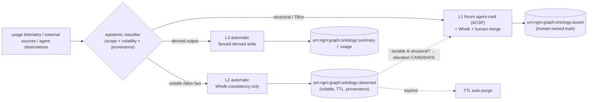

# ADR-122 — Two-speed writeback: governance routing by epistemic class

**Status:** Proposed
**Date:** 2026-06-14
**Decision-type:** Security / Governance (policy)
**Parent:** ADR-121 (self-improving writeback loop — the *mechanism* this routes). **Relates:** ADR-110 / ADR-041 (ACSP forum agent-card / Judgment Broker — the human-gated lane), ADR-099 (Whelk EL reasoner — the automatic consistency gate), ADR-105 (IRI scheme), PRD-020 (WS-9/10/11, open Q #8/#9), the dual-ingest design (mainKnowledgeGraph=formal vs workingGraph=informal/elevation-eligible — the static analog of this runtime split).

> The operator observed that a single human gate is too coarse: *some* self-improvement should be gated through the forum agent-card surface, while *some* (evolving news / truths) is best fully automatic. This ADR makes that the policy: **writeback is routed to a governance lane by the epistemic class of the change, not by a single rule.** It refines ADR-121's hard line rather than weakening it.

---

## 1. Context

ADR-121 draws one hard line: asserted truth (`:assert` TBox) is never auto-written; everything else (derived output, post-merge refresh) may be automatic. That binary is correct but coarse. It lumps together two very different kinds of "knowledge the loop might add":

- **Structural truth** — a new class, a `subClassOf`, a new relation, a disjointness axiom, a definition, a maturity promotion. Long-lived, high-stakes, reshapes the ontology backbone. Getting it wrong corrupts reasoning for everything downstream.
- **Volatile facts** — "the current version of library X is 3.2", "project Z shipped today", "the latest figure for Y is N". Time-bounded *instance* assertions (ABox), often externally-sourced and verifiable, individually low-stakes, and **expected to change**. Routing each of these through a human forum approval would create an unworkable backlog and is epistemically pointless — by the time a human approves "today's value", it is yesterday's.

The named-graph model already gives us the compartments to express this: `:assert` (TBox truth), `:inferred` (Whelk-derived), `:summary`/`:usage` (derived layer output, ADR-121 W0). This ADR adds one more — `:observed` (volatile ABox facts) — and defines the **routing policy** across all of them.

There is a pleasing symmetry: the existing **dual-ingest** design already separates `mainKnowledgeGraph/pages` (formal, ontology) from `workingGraph/pages` (informal, elevation-eligible). ADR-122 is the **runtime analog**: `:observed` is the working/informal tier that fills automatically; `:assert` is the formal tier that only humans promote into.

---

## 2. Decision — three lanes, routed by epistemic class

Every writeback candidate is classified and routed to exactly one lane. The discriminator is **what kind of knowledge it is**, scored on three axes (scope: TBox-structural vs ABox-instance; volatility: durable vs time-bounded; provenance: human/derivation vs external-source).

| Lane | What goes here | Target graph | Gate | Reversibility |
|---|---|---|---|---|
| **L1 — Human-gated (slow)** | TBox / structural truth: new classes, `subClassOf`, new object/data properties, disjointness, refined definitions, maturity ≥ `established`, anything that reshapes the backbone | `urn:ngm:graph:ontology:assert` | **Forum agent-card (ACSP, kinds 31400-31405) + Whelk EL + human merge** (the ADR-121 W1 path) | git history / PR revert |
| **L2 — Automatic-with-consistency (fast)** | Volatile ABox observations: time-bounded instance facts, externally-sourced "evolving news/truths", current-state assertions | `urn:ngm:graph:ontology:observed` (NEW, fenced) | **Automatic** — Whelk consistency check only (reject if it contradicts the TBox); **no human**; mandatory provenance + TTL | TTL auto-expiry + `/derived/regenerate`-style purge |
| **L3 — Automatic-derived (fast)** | The augmentation layer's own derived output: Class Summaries, usage telemetry | `:summary` / `:usage` (ADR-121 W0) | **Automatic** — fenced endpoint, no Whelk needed (not asserted knowledge) | fully regenerable |

### The bridge between lanes (the safety invariant)

**L2 NEVER auto-promotes into L1.** A volatile fact in `:observed` can become a *candidate* for elevation to asserted truth — and that elevation is an L1 event: it goes through the forum agent-card + Whelk + human merge like any other structural change. The automatic lane *feeds* the gated lane as evidence; it never bypasses it. This is what preserves ADR-121's hard line: nothing reaches `:assert` without the human/Whelk gate, no matter how it entered the system.

### Classification rules (default-conservative)

The classifier defaults to **L1 (human gate) unless a candidate clearly qualifies for L2/L3**:
- **L3** iff the write targets `:summary`/`:usage` and is produced by the augmentation layer itself.
- **L2** iff *all* hold: (a) the change is an ABox assertion about an *instance*, not a TBox axiom; (b) its predicate is on a **volatile-predicate allowlist** (default-conservative, e.g. `vc:currentVersion`, `vc:latestValue`, `vc:statusAsOf`, `vc:observedAt` — expanded only on evidence); (c) it carries a source provenance meeting a trust floor (verified source did:nostr or an allowlisted external source) and a TTL; (d) Whelk confirms it does not contradict the TBox.
- **L1** otherwise — and *always* for: new classes, any `rdfs:subClassOf`/`owl:*` axiom, property definitions, disjointness, maturity ≥ `established`, or anything not on the L2 allowlist.

Ambiguous or novel-predicate candidates fall to L1 by construction. The allowlist grows by human decision (itself an ADR/governance act), never by the loop.

---

## 3. Consequences

**Positive**
- Matches governance cost to epistemic stakes: humans spend attention on structural truth, not on "today's value of X". Removes a backlog that would otherwise kill the flywheel.
- Volatile facts flow at machine speed but stay epistemically quarantined (`:observed`, provenance + TTL), never masquerading as asserted truth, never silently promoted.
- Reuses the named-graph compartments and the ACSP forum surface already designed; the only new graph is `:observed`.
- Strengthens, not weakens, ADR-121's hard line: the L2→L1 bridge makes "nothing reaches `:assert` without the gate" explicit and enforced server-side.
- Mirrors the existing dual-ingest formal/informal split at runtime — conceptually consistent with how the corpus is already organised.

**Negative / managed**
- A misclassification that routes a structural change to L2 would write unreviewed knowledge. Mitigation: default-to-L1; the L2 allowlist is predicate-scoped and human-curated; Whelk still gates L2 for TBox contradiction; `:observed` is epistemically separate and read consumers can exclude it.
- An external source could flood `:observed` or inject false facts. Mitigation: trust floor (verified/allowlisted source), TTL expiry, rate limits, and provenance on every triple so a bad source's writes are purgeable in one query.
- Read consumers must be `:observed`-aware: by default the augmentation read path serves `:assert` (+ optionally `:inferred`); `:observed` facts are surfaced only when explicitly requested and clearly labelled as volatile (extends ADR-112's Provenance Scope with an `observed` value).
- The classifier is a new component with its own failure modes; it is deliberately simple (allowlist + scope check + Whelk), auditable, and conservative.

**Neutral**
- `:observed` and the L2 lane are default-off (gated with the rest of the loop, ADR-121 HC4); volatile auto-writeback is opt-in per deployment.

---

## 4. Alternatives considered

1. **Single human gate for all writeback (ADR-121 as-is).** Rejected as too coarse per the operator: it either blocks volatile facts entirely or forces pointless human review of ephemeral data.
2. **Fully automatic for everything Whelk-consistent.** Rejected: Whelk checks *logical consistency*, not *truth* or *desirability*; auto-committing structural axioms because they don't contradict is how an ontology silently drifts and ossifies bias. Structure needs human judgment.
3. **Confidence-threshold routing (auto if confidence > X, else human).** Rejected as the *primary* discriminator: confidence is orthogonal to stakes — a high-confidence structural change is still high-stakes and belongs at L1. Confidence is used *within* L2 (as a trust floor), not as the lane selector.
4. **Promote `:observed` → `:assert` automatically after N confirmations.** Rejected: that is auto-writing asserted truth by the back door. Promotion is always an L1 (human-gated) event; confirmations only raise a candidate's priority in the forum queue.

---

## 5. Verification

Declared implemented when:
1. The classifier routes a structural candidate to L1 and a volatile-allowlisted ABox fact to L2 (routing test); ambiguous/novel predicates fall to L1.
2. `POST` of an `:observed` fact succeeds automatically with provenance + TTL; the same payload as a TBox axiom is **rejected** from L2 and routed to L1 (fence + scope test).
3. A Whelk-contradicting `:observed` write is rejected (consistency test).
4. An `:observed` fact never reaches `:assert` without traversing the forum agent-card + human merge (bridge test); auto-promotion is impossible by construction.
5. Expired `:observed` facts are purged on TTL; a bad source's facts are removable in one provenance-scoped query (reversibility test).
6. The read path defaults to `:assert`(+`:inferred`); `:observed` is served only when the `observed` Provenance Scope is requested and is labelled volatile (read-isolation test).

Until then, two-speed routing is reported as **installed, not delivered**, and the loop runs L1-only (the conservative default).
