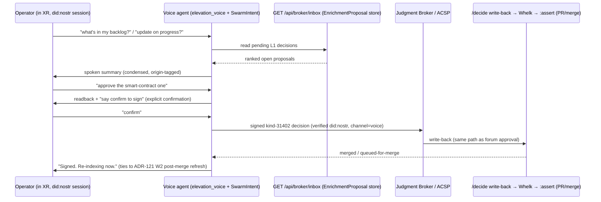

# ADR-123 — Voice-mediated governance: conversational sign-off of the elevation backlog in the immersive system

**Status:** Proposed
**Date:** 2026-06-14
**Decision-type:** Architecture + Security (authorisation surface) + UX
**Parent:** ADR-122 (two-speed routing — this is the human surface for the L1 lane), ADR-121 (the loop that fills the backlog). **Relates:** ADR-110 / ADR-041 (ACSP forum agent-card / Judgment Broker — the *other* client of the same decision queue), ADR-120 (did:nostr identity — the authority behind a voice approval), PRD-020 (WS-12), `src/actors/elevation_voice.rs` + `crates/visionclaw-actors/src/voice_commands.rs` (`SwarmIntent`) + `src/actors/voice_interface_actor.rs` + `agentbox/management-api/routes/voice-intent.js` (the voice stack reused), `src/handlers/enrichment_proposals_handler.rs` (`/decide` write-back) + `agentbox/mcp/servers/governance-bridge.js` (panel kinds 31400/31402/31404).

> The operator: "we have a voice agent in the immersive system; we should be able to ask users about sign-off in a natural-language way — if they ask about inbox or backlog or for an update on progress — and the voice agent should process those open decisions with authority." This ADR makes the immersive voice agent a **first-class, authenticated client of the governance decision queue** — a second surface alongside the forum agent-card, not a lower-trust shortcut.

---

## 1. Context

ADR-122 routes structural self-improvement to **L1 — the human-gated lane**: enrichment proposals queue in the Judgment Broker and are decided via the forum agent-card (ACSP, kinds 31400-31405). That surface is a web/forum UI. But the operator works inside the **immersive (XR) knowledge-graph environment**, where the natural interface is the **voice agent**, not a browser tab. Asking the operator to leave the world to a forum to approve "add class X as a subclass of Y" is friction that will leave the backlog unattended — and an unattended L1 queue stalls the whole flywheel (ADR-121).

The pieces already exist:
- A voice stack: `voice_commands.rs` defines `SwarmIntent` (SpawnAgent, QueryStatus, UpdateGraph, …) with **confirmation preambles** ("Confirm agent creation", "Confirm graph change") — i.e. a readback-before-act discipline is already the pattern. `voice_interface_actor.rs` and — tellingly — **`elevation_voice.rs`** already exist, so voice-mediated elevation is partly anticipated.
- A voice→intent binding: agentbox `voice-intent.js` maps a transcript to a deterministic action via `transcriptToAction`, gated by `[sovereign_mesh].voice_intent` (default off).
- A decision write-back: `POST /api/enrichment-proposals/{id}/decide` and `broker-bridge.js POST /api/broker/bridge/cases/:id/decide`.
- The panel/decision queue: `governance-bridge.js` (publish panel 31400 / request action 31402 / update 31404).

**Gap (also a ghost):** there is **no `GET /api/broker/inbox`** in Rust (verified earlier) — the panel/voice surface has no list of pending cases to read. And the `/decide` path still rides the `writeback_triggered` no-op (ADR-121 kills that). So the voice surface needs a real **pending-decision inbox** and a real write-back.

---

## 2. Decision

Make the immersive **voice agent an authenticated client of the L1 governance queue.** When the operator asks — in natural language — about their **inbox**, **backlog**, or for an **update on progress**, the voice agent reads the pending-decision queue, presents each open decision conversationally, and lets the operator **approve / reject / amend with authority**, producing the same signed decision the forum agent-card would.

### 2.1 New intents (extend `SwarmIntent`)
Add governance intents to the existing enum, with confirmation preambles in the established style:
- `ReviewBacklog { filter? }` — "what needs my sign-off / what's in my inbox / give me a progress update" → reads the inbox, speaks a ranked summary.
- `ApproveProposal { id }` / `RejectProposal { id, reason? }` / `AmendProposal { id, change }` — decide on a specific case.
- `ExplainProposal { id }` — "tell me more about that one" → deeper spoken detail (rationale, blast radius, provenance, confidence).

### 2.2 The decision queue surface (closes the broker-inbox gap)
Implement the missing **`GET /api/broker/inbox`** (and `GET /api/broker/inbox/{id}`) backed by the durable `EnrichmentProposal` store that ADR-121 introduces (replacing the in-memory `WRITEBACK_DECISIONS` ghost). The voice agent and the forum agent-card read the **same** queue — one source of truth, two surfaces.

### 2.3 Conversational presentation (reuse the condensation discipline)
Pending proposals are summarised to **spoken length** (one or two sentences each: *what* changes, *why*, *blast radius*, *confidence*, *who/what proposed it*) by the same terse-summarisation discipline used for Class Summaries (ADR-113) — a backlog readback must fit working memory, not recite raw diffs. Machine-originated proposals (ADR-121 W2) are spoken with their origin tag so the operator can trust-tier them by ear.

### 2.4 Authority — voice approvals carry full weight, not a discount (the hard choice)
A voice approval is **authenticated to the operator's verified did:nostr** (the immersive session is identity-bound; ADR-120) and emits the **same signed kind-31402 decision / `/decide` write-back** as a forum approval. **No lower bar because it is voice.** Concretely:
- The voice session must be identity-bound (the operator's did:nostr), not anonymous.
- Every high-stakes decision requires an **explicit spoken confirmation readback** before the write ("You're approving: add *SmartContract* as a subclass of *DigitalAsset*, blast radius 12 classes. Say 'confirm' to sign."), reusing the `voice_commands.rs` confirmation-preamble pattern.
- The signed decision records the channel (`voice`), the verified pubkey, the transcript, and a confirmation token — full provenance, indistinguishable in authority from a forum decision, distinguishable in audit by channel.

### 2.5 Scope
The voice surface governs the **L1 lane only** (the human-gated, structural changes). L2 (volatile `:observed`) and L3 (derived) are automatic — nothing to approve. So "process open decisions with authority" == be the in-world ACSP approval client for L1.

---

## 3. Consequences

**Positive**
- Removes the friction that would leave the L1 backlog unattended — the operator governs the ontology *from inside the world they are working in*, by talking.
- Reuses the entire voice stack (`elevation_voice.rs`, `SwarmIntent`, `voice-intent.js`) and the governance queue/panels; the genuinely new work is the inbox endpoint + the governance intents + spoken summarisation.
- **Closes the `/api/broker/inbox` ghost** and shares one decision queue between voice and forum — no divergent state.
- Natural trigger ("inbox / backlog / progress update") makes governance a *pull* the operator initiates, not a *push* that nags.

**Negative / managed**
- **Voice is error-prone; approval is high-stakes.** Mitigation: identity-bound session + explicit spoken confirmation readback + full transcript provenance + the decision is reversible via the same PR/git path. No silent one-word approvals of structural change.
- **Authority spoofing / replay.** Mitigation: did:nostr session binding (ADR-120); a confirmation token per decision; channel recorded for audit; rate limiting.
- **Mishearing a class/relation name** could approve the wrong thing. Mitigation: the readback names the exact IRIs and blast radius; "confirm" gates the write; amendments are first-class (`AmendProposal`).
- **Scope creep into L2/L3.** Explicitly out of scope — the voice surface only sees the L1 queue; it cannot write `:observed`/`:summary` (those are automatic, fenced).

**Neutral**
- Gated by `[sovereign_mesh].voice_intent` (extant) + a governance sub-gate; default off until WS-12 verification.

---

## 4. Alternatives considered

1. **Forum agent-card only (ADR-110 as-is).** Rejected as the *whole* answer: it works but is out-of-world for the immersive operator; the backlog stalls. Voice is additive, not a replacement — both remain.
2. **Voice can approve with a lower trust bar (convenience).** Rejected: a voice approval that carried less authority would create a weak side-door into asserted truth. Voice approvals are full-weight, identity-bound, confirmation-gated.
3. **Voice auto-approves high-confidence proposals.** Rejected: that is auto-writing asserted truth (violates ADR-121 hard line / ADR-122 L1). Voice *presents and signs*; the human still decides each one.
4. **A separate voice-only decision store.** Rejected: divergent state. Voice and forum read/write the one `EnrichmentProposal` queue.

---

## 5. Verification

Declared implemented when:
1. `GET /api/broker/inbox` returns the durable pending L1 queue; voice and forum show the same cases.
2. "What's in my backlog?" yields a spoken, condensed, origin-tagged summary of real pending proposals.
3. An approve intent requires an explicit spoken confirmation readback naming the exact IRIs + blast radius before any write.
4. A voice approval emits a signed decision bound to the operator's verified did:nostr, channel-tagged `voice`, and traverses the **same** `/decide`→Whelk→merge path as a forum approval (parity test).
5. The voice surface cannot decide L2/L3 items (scope test) and cannot approve without an identity-bound session (auth test).
6. A signed voice decision is reversible via the PR/git path (reversibility test).

Until then, voice governance is reported as **installed, not delivered**, and L1 sign-off remains forum-only (the conservative default).
