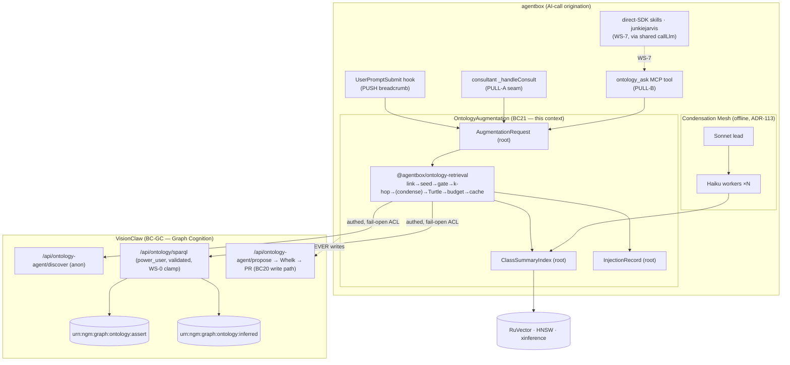

# DDD: Ontology Augmentation Bounded Context

**Context name:** `OntologyAugmentation` (BC21 — provisional, pending BC catalogue update)
**Date:** 2026-06-14
**Author:** VisionClaw platform team (PRD-020 ruflo mesh)
**Related:** PRD-020 (parent), ADR-112 (retrieval spine), ADR-113 (condensation mesh), ADR-114–120 (register), `docs/ddd-agentbox-integration-context.md` (BC20 — the *write/spawn* ACL this context sits beside), `docs/ddd-graph-cognition-context.md` (BC-GC — the VisionClaw cognition spine this context reads from), ADR-099/105/106 (ontology rigour / IRI / SPARQL), ADR-110/041 (governed write)

## 1. Purpose

Define the bounded context that lets **every agentbox AI call read VisionClaw's formal ontology/KG, structurally and pervasively, without overpowering context windows.** This context is a **read-only Anti-Corruption Layer + retrieval/condensation engine**: it translates an agent's free-text intent into a bounded, provenance-scoped subgraph drawn from VisionClaw's named graphs, and it owns the token economics that keep that subgraph small.

It is deliberately the **mirror image** of BC20 (`AgentboxIntegration`), which mediates the *write/spawn/elevation* direction (agent → governed proposal → VisionClaw). BC21 mediates only the *read/augment* direction (VisionClaw ontology → agent reasoning). The two never share a mutation path: BC21 is structurally incapable of writing.

Without this context, every consultant, hook, and skill that wanted ontology grounding would re-implement HNSW seeding, SPARQL k-hop, serialisation, and budgeting — five-to-fifteen times, each with its own (un)budgeted overflow risk, and each able to wander into the ungoverned write surface. With it, retrieval and budget discipline live in one shared library, and the read/write boundary is a context boundary.

## 2. Ubiquitous language

| Term | Meaning in this context |
|---|---|
| **Augmentation Request** | An agent's request for ontology grounding: `{query, model_tier, max_tokens, depth, mode, provenance, full}`. The aggregate root of a retrieval. |
| **Seed Class** | A top-k ontology class IRI resolved from the query — by HNSW (PULL) or by synchronous local trigram match over the pre-warmed cache (PUSH). |
| **Subgraph** | The bounded k-hop neighbourhood around the Seed Classes; the unit of grounding returned to a caller. |
| **Class Summary** | The compact (~100–150 tok) embeddable distillate of a class's v2 JSON-LD `Class` block + depth-1 neighbourhood. The atom of the index. |
| **Breadcrumb** | The single ≤80-tok `[ONTOLOGY]` line injected per turn by the PUSH channel — a pointer, not a payload ("seed X (mature, blockchain) → expand via `ontology_ask`"). |
| **Token Budget** | The model-tier ceiling (booster≤80 / haiku≤500 / sonnet≤2,000 / opus≤6,000) enforced by the governor. A budget is part of every Augmentation Request. |
| **Provenance Scope** | `asserted` \| `inferred` \| `proposed`. Defaults to `asserted`; `inferred`/`proposed` only on explicit request and always labelled. Never presented as ground truth interchangeably. |
| **Relevance Floor** | The MIN_RELEVANCE null-gate; below it the PUSH channel emits **nothing** (0 tokens). |
| **Fail-Open** | A degraded ontology yields empty grounding and the caller proceeds ungrounded — never an error, never a blocked turn. An **availability** property only; auth/validation failures are loud, not fail-open. |
| **Condensation Mesh** | The offline Sonnet-lead + Haiku-worker orchestration that builds/refreshes the Class Summary index (ADR-113). |
| **Liveness Proof** | The per-channel matrix + startup canary that proves the binding is *exercised*, not merely *wired* (anti-PRD-018). |
| **Drill-Down** | An explicit `full:true` page-body fetch — outside the pervasive path, tier-gated, chunk-capped. |
| **Augment Seam** | The `_handleConsult` pre-call injection point (PULL-A). |
| **Coverage Matrix** | The audited per-origination-site statement of which channel reaches each AI call (PRD-020 §2.3). The honest definition of "pervasive". |

## 3. Strategic placement

> **Status:** aspirational design — not implemented as of 2026-06-14. No `OntologyRetrieval`, `ClassSummaryIndex`, or `InjectionRecord` types exist yet; the partial precursor is `ontology-bridge.js` (12 tools, but fail-open-empty on the read path today — wrong endpoint, no auth, PREFIX prologue).

## 4. Strategic patterns

### 4.1 Context relationships

- **OntologyAugmentation → Graph Cognition (VisionClaw):** **Customer / Supplier**, read-only, through the `vcFetch` ACL. BC21 is **Conformist** to VisionClaw's named-graph model (`urn:ngm:graph:ontology:assert|:inferred`) and PROV-O vocabulary — it does not negotiate the supplier's schema, it translates from it.
- **OntologyAugmentation → RuVector Memory:** **Shared Kernel** — the xinference embedding pipeline and HNSW namespace conventions are shared with the rest of agentbox memory. The `ontology-classes` namespace is owned by this context but lives in the shared store.
- **OntologyAugmentation → consultant / hook channels:** **Open-Host Service** — the published language is the `ontology_ask` MCP tool contract and the `@agentbox/ontology-retrieval` library API. Channels are thin clients.
- **OntologyAugmentation ↔ AgentboxIntegration (BC20):** **Separate Ways on the write axis.** BC20 owns agent→VisionClaw *writes/spawn/elevation* (the governed propose loop, `bc20-provenance-bridge.js`). BC21 owns *reads only*. The contexts are adjacent but share no aggregate and no mutation path — the read/write split is the context boundary.

### 4.2 The read/write boundary is the context boundary

The single most important strategic invariant: **BC21 has no write operations.** The governed write path (`ontology_propose → Whelk → PR / ACSP panel → human merge`) belongs to BC20 and VisionClaw's Ontology Governance, and is reused unchanged. BC21's ACL is physically a *different module* from BC20's provenance bridge. This makes "read pervasive, write governed" a structural property, not a discipline that can erode.

## 5. Aggregate detail

### 5.1 AugmentationRequest (root)
- **Owns:** `query`, `model_tier`, `max_tokens`, `depth`, `mode (menu|expand)`, `provenance`, `full`.
- **Produces:** a `Subgraph` (Turtle) + telemetry, via the library pipeline.
- **Invariants:**
  - I1 — The returned subgraph's token count **never** exceeds the resolved Token Budget; the clamp is applied after serialise, and (for PUSH) again locally in the hook.
  - I2 — `full:true` is rejected below `sonnet`; where allowed, each page body is chunked to ≤ budget.
  - I3 — Never mutates VisionClaw; the aggregate has no write port.
  - I4 — On any availability failure, resolves to an empty Subgraph (`{turtle:"", tokens_used:0}`) and the caller proceeds ungrounded; on an auth/validation failure, records `fail_open_count{cause}` and surfaces loudly to the self-test.

### 5.2 ClassSummaryIndex (root)
- **Owns:** the RuVector `ontology-classes` namespace — one Class Summary vector per authored class (~4,952) + degraded stub entries (~9,766).
- **Lifecycle:** built and refreshed by the **Condensation Mesh** (ADR-113), incrementally on GitHubSync/elevation.
- **Invariants:**
  - I5 — A stub class returns `label + referencing relation`, never empty (graceful degradation).
  - I6 — Structured fields of a Class Summary (IRI, relations, domain, maturity) are SPARQL-verifiable against the source; only the prose `definition` is generative. The Sonnet lead validates structure before upsert.
  - I7 — Index sizing accounts for ~14,718 total vectors (authored + stubs), not 4,952.

### 5.3 InjectionRecord (root)
- **Owns:** per-call telemetry — `{channel, origination_site, seed_iris, tokens_injected, latency_ms, cache_hit, provenance, outcome}` and the per-channel `last_successful_injection` timestamp.
- **Invariants:**
  - I8 — Records whether a downstream consumer *received* context (not merely that the brain emitted it) — the property whose absence left PRD-018's forces dead.
  - I9 — Counters split fail-open by cause; an auth/validation cause is never reported as benign "degraded".

## 6. Domain events

`OntologyContextRequested` · `SeedClassesResolved` · `SubgraphExpanded` · `SubgraphCondensed` (opus deep-expand) · `BudgetTruncated` · `ContextInjected` (PUSH) / `ContextAugmented` (PULL) · `RetrievalFailedOpen{cause}` · `ClassSummaryIndexRefreshed{changed_count}` · `LivenessProbeSucceeded` / `LivenessProbeFailed{channel}`.

These are observable signals for the verifiability story (§8), not (yet) a published event stream.

## 7. Anti-corruption layer

`vcFetch` (authed, fail-open, **cause-split** errors) + the bounded-SPARQL+Turtle serialiser are the ACL between BC21's language (Seed Class, Subgraph, Provenance Scope) and VisionClaw's REST/SPARQL surfaces and named graphs.

- **Translation in:** free-text query → seed terms → `memory_search(ns:ontology-classes)` IRIs → `SELECT … FROM <urn:ngm:graph:ontology:assert> LIMIT n` (or anon `/ontology-agent/discover`).
- **Translation out:** SPARQL-Results JSON / triples → terse, prefix-once Turtle `Subgraph`; `vc:derivation="inferred"` + `prov:wasGeneratedBy` runId preserved as the `inferred` Provenance Scope.
- **Hardening obligations (PRD-020 WS-0/WS-1):** attach `Bearer` + `X-Nostr-Pubkey` (or NIP-98); prefer the **anonymous** `discover/read` surface to avoid Admin-token concentration; pre-validate SPARQL with the **real** validator semantics (PREFIX-tolerant; WITH/SERVICE-denied); a bridge-start self-test that does one authed SELECT and fails loudly.
- **What this ACL must NOT do:** call `/api/ontology/load`; carry a write; or coerce a 401/403/400 into silent empty.

The existing `bc20-provenance-bridge.js` remains the **separate** ACL for the cross-namespace write/elevation direction (`urn:visionclaw:concept/kg`). The two ACLs are never merged.

## 8. Validation strategy (anti-PRD-018)

The context is validated as *live* only when, per ADR-119:
1. **Per-channel liveness matrix** — `last_successful_injection` non-stale for every enabled origination site; partial deadness across the fan-out is visible.
2. **Startup canary** — a forced non-zero injection through **each enabled channel** asserted to land downstream (a swarm-spawned-worker echo test for the opaque tier; a `context_excerpt`-changed contract test for PULL-A; a stdout-capture assert for PUSH).
3. **Backing assertions** — `axiomsProcessed>0`; a known SELECT on `:assert` non-empty; an HNSW canary returns IRIs.
4. **Budget tests** — no path exceeds its tier budget under adversarial inputs incl. `full:true`; a naïve `SELECT ?s ?p ?o` returns ≤ cap (WS-0).
5. **Governance tests** — unauthenticated `propose` rejected; forged `agent_id` overridden; `SERVICE` rejected; `/load` power_user-gated.

Default-off ≠ delivered: the context is reported as **installed** until at least one channel is enabled-and-proven-hot (WS-6).

## 9. Migration & coexistence

- **Phase 0 (today):** `ontology-bridge.js` exists but its read path is fail-open-empty (wrong endpoint `/api/ontology/query`, no auth, PREFIX prologue). Treat as a precursor, not a working ACL.
- **WS-0/WS-1:** harden VisionClaw (clamp, `SERVICE`, `/load`, propose auth) and the ACL (auth, paths, self-test) **before** any pervasive wiring.
- **WS-2/WS-3:** stand up the Condensation Mesh + `ClassSummaryIndex`, then the `@agentbox/ontology-retrieval` library.
- **WS-4/WS-5:** PULL then PUSH channels.
- **WS-6:** verifiability before any default-on.
- **WS-7:** close the coverage-matrix long tail (shared `callLlm`, per-CLI `$HOME` grounding).
- **Coexistence:** the governed write loop (BC20 / kg-elevation) is untouched throughout; BC21 is additive and read-only.

## 10. Open questions (linked to PRD-020 §10)

1. PUSH default state (recommend off, flip post-WS-6).
2. Consultant augment default (recommend off + per-call arg).
3. WS-0 Rust-clamp ownership (this PRD vs separate VisionClaw ticket).
4. Index refresh cadence (per-sync incremental vs nightly).
5. ADR-120 timing (recommend P0 — `propose` is a live hole).
6. Whether the swarm-subagent tier is reachable by the hook (WS-5 spike — determines if BC21 can honestly claim the opaque tier).
7. Pin condensation model IDs for reproducible summaries (recommend yes).

## 11. Outcomes tracking

Instrument BC21 as a task-scoped shard of the CLAUDE.local.md **Guidance Control Plane** experiment: track cost-per-successful-outcome and context-window pressure with the binding on vs off, per channel, before promoting any default from local to CLAUDE.md via ADR. The recall-economics claim (ADR-112 §3 — condensation as an offline recall multiplier) is itself a measurable hypothesis: compare task success with the full Class-Summary index vs a raw-only baseline at equal per-call budget.

---

## 12. Self-improvement & governance extension (ADR-121 / 122 / 123)

The operator chose to land the full self-improving ideal. This **expands BC21's scope** from read-only to *read + bounded write*: BC21 now (a) materialises its own derived output, (b) writes volatile facts, and (c) generates enrichment candidates — but it **still never writes asserted truth**. Asserted writes remain BC20/Ontology-Governance. The expansion is expressed as **three writeback lanes** (ADR-122), each with its own substrate, gate, and aggregate.

### 12.1 Writeback lanes (the two-speed model)

| Lane | Knowledge class | Graph | Gate | Owner context |
|---|---|---|---|---|
| **L1** | structural / TBox truth | `:assert` | forum agent-card (ACSP) + Whelk + human merge | **BC20 / Governance** (BC21 only *proposes*) |
| **L2** | volatile ABox observations ("evolving news/truths") | `:observed` (NEW, fenced) | automatic + Whelk-consistency + provenance + TTL; **never auto-promoted to L1** | **BC21** |
| **L3** | derived layer output (Class Summaries, usage) | `:summary` / `:usage` | automatic, fenced endpoint | **BC21** |

**Invariant I10 (the bridge):** an `:observed` (L2) fact may become an *elevation candidate* for `:assert`, but that promotion is always an L1 event (human + Whelk). No path auto-promotes L2/L3 → L1. The server-side graph fence (a write to `/api/ontology/derived` is rejected unless its graph ∈ {`:summary`,`:usage`}; `:observed` writes reject TBox axioms) makes this structural, not disciplinary.

### 12.2 New ubiquitous language
- **Writeback Lane** — L1/L2/L3 (above).
- **Volatile Fact** — a time-bounded ABox observation in `:observed` with source provenance + TTL.
- **Enrichment Candidate** — a usage-mined proposal (new class / refined definition / new relation / maturity bump) bound for the L1 governed queue.
- **Elevation** — promotion of a candidate (or an `:observed` fact) into `:assert`; always L1.
- **Decision Queue / Backlog** — the durable `EnrichmentProposal` store of pending L1 decisions, read by both the forum agent-card and the voice agent (`GET /api/broker/inbox`).
- **Governance Decision** — a signed approve/reject/amend on a backlog item, carrying the deciding did:nostr + channel (`forum`|`voice`).
- **Epistemic Classifier** — the router that assigns a candidate to L1/L2/L3 by scope×volatility×provenance (defaults to L1).
- **Loop Run** — one execution of the W2 cycle (mine → propose → [merge] → re-condense → re-index), the PROV-O `prov:Activity` every writeback is attributed to.

### 12.3 New aggregates
- **DerivedWrite (root)** — a fenced write to `:summary`/`:usage`; owns target graph, triples, provenance, TTL (usage). *Invariant:* cannot target `:assert`/`:inferred`/`:observed`-TBox; fully regenerable.
- **ObservedFact (root)** — a volatile ABox assertion in `:observed`; owns source, confidence, `observedAt`, TTL. *Invariants:* Whelk-consistent with TBox; never auto-promoted; expires on TTL; purgeable by one provenance-scoped query.
- **EnrichmentCandidate (root)** — a usage-mined L1 proposal; owns evidence signal, confidence, dedup key, machine did:nostr. *Invariants:* confidence ≥ threshold, deduped, rate-limited, Whelk-consistent before entering the queue.
- **EnrichmentProposal (root)** — the **durable** backlog item (replaces the in-memory `WRITEBACK_DECISIONS` ghost); owns state, the proposed change, and its Governance Decisions. *Invariant:* every decision is signed + channel-tagged + reversible via the PR/git path.

### 12.4 New domain events
`DerivedGraphWritten` · `VolatileFactObserved` · `VolatileFactExpired` · `EnrichmentCandidateMined` · `CandidateRoutedToLane{L1|L2|L3}` · `ProposalQueued` · `BacklogReviewed{channel}` · `GovernanceDecisionSigned{channel, verdict}` · `ProposalMerged` · `LoopRunCompleted` · `LoopAutoDisabled{reason}`.

### 12.5 Relationships changed/added
- **BC21 → BC20 / Governance:** **Customer/Supplier on the write axis now too** — BC21 produces `EnrichmentCandidate`s and hands them to BC20's governed propose→Whelk→merge spine. BC21 still owns no asserted write.
- **Voice Governance (ADR-123) → the Decision Queue:** an **Open-Host Service** client. The immersive voice agent (`elevation_voice.rs` + `SwarmIntent`) reads the same `EnrichmentProposal` backlog the forum agent-card reads, and signs Governance Decisions with full did:nostr authority (confirmation-gated). It is a *surface onto BC20's governed write*, not a new write authority — and it governs **L1 only** (L2/L3 are automatic, nothing to approve).
- **L2 (`:observed`) ↔ external sources:** an **Anti-Corruption boundary** with a trust floor (verified/allowlisted source did:nostr) + TTL; bad-source facts are purgeable wholesale.

### 12.6 Reversibility & verifiability (ties to §8)
Derived/volatile graphs are disposable (`/derived/regenerate`, TTL purge); the loop is default-off, kill-switched, and **outcome-gated** (auto-disables if it doesn't improve the Guidance-Control-Plane metric). Every writeback is PROV-O-stamped to a Loop Run; per-stage liveness counters prove each stage *fires and lands* — never a flag that merely claims success (the `writeback_triggered` failure mode is designed out, not re-introduced).
