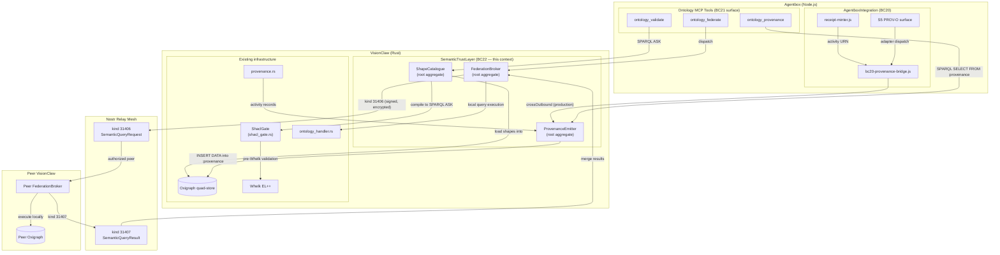

# DDD: Semantic Trust Layer Bounded Context

**Context name:** `SemanticTrustLayer` (BC22 — provisional, pending BC catalogue update)
**Date:** 2026-06-21
**Author:** VisionClaw platform team (opus exploration mesh)
**Related:** PRD-022 (parent), ADR-127 (keystone), `docs/ddd-ontology-augmentation-context.md` (BC21 — read-only augmentation, this context's sibling), `docs/ddd-agentbox-integration-context.md` (BC20 — write/spawn ACL), `docs/ddd-mesh-federation-context.md` (BC-MF — relay mesh topology), `docs/ddd-bead-provenance-context.md` (BC-BP — bead lifecycle), ADR-011 (SERVICE block), ADR-075 (IS-Envelope), ADR-099 (Whelk), ADR-112 (retrieval spine), ADR-124 (git-mark/block-trail)

## 1. Purpose

Define the bounded context that ensures **every fact in the ontology graph can be validated against a shape, every assertion can be traced to its origin, and every instance's knowledge can be queried from any peer** — the trust trinity (validate, audit, federate) as a structural property rather than a runtime discipline.

This context sits beside BC21 (OntologyAugmentation, read-only retrieval) and BC20 (AgentboxIntegration, write/spawn ACL). BC21 asks "what does the ontology say about X?" — BC22 asks "can we trust that answer?" BC20 governs *who may propose mutations* — BC22 validates *what shape those mutations must satisfy* before they reach the governed path.

Without this context, validation is inline code in Rust (SHACL-lite, advisory, non-blocking), provenance is JSON fields in event payloads (URN strings, not queryable graph), and federation is event-push only (relay mesh, no query-pull). With it, validation is W3C-standard shapes in a dedicated graph, provenance is SPARQL-queryable PROV-O triples, and federation extends from event-push to query-pull over the same relay mesh.

The critical architectural constraint: **this context never touches the governed write path**. The `propose → Whelk → PR → human merge` flow belongs to BC20 and VisionClaw's Ontology Governance. BC22 adds a *pre-flight check* (SHACL shapes) to the ingest pipeline that feeds that path, and a *post-hoc record* (PROV-O triples) that audits its output. It does not alter the flow itself.

## 2. Ubiquitous language

| Term | Meaning in this context |
|---|---|
| **Shape** | A W3C SHACL `NodeShape` or `PropertyShape` stored as Turtle in `urn:ngm:graph:shapes`. The formal contract that a domain entity must satisfy. |
| **Shape Catalogue** | The set of all loaded shapes — 5 initial: `OntologyClassShape`, `InferredAxiomShape`, `BridgeRecordShape`, `KnowledgeNodeShape`, `AgentNodeShape`. |
| **Validation Report** | The structured output of shape validation: a list of `ShaclViolation` records (focus node, constraint, severity, message). Analogous to `ShaclGateReport` from SHACL-lite but W3C-compliant. |
| **Gate Mode** | `enforcing` (violations reject the payload) or `advisory` (violations log + metric + proceed). Write paths default enforcing; read paths default advisory. |
| **Provenance Triple** | A quad in `urn:ngm:graph:provenance` using the PROV-O vocabulary (`prov:Activity`, `prov:wasAssociatedWith`, `prov:startedAtTime`, `prov:used`, `prov:generated`, `prov:wasInformedBy`). |
| **Activity Record** | The reified RDF representation of an action: who (agent DID), when (timestamp), what (verb), with what evidence (used), producing what (generated), caused by what (prior decision). |
| **Append-Only Invariant** | The `:provenance` graph accepts only `INSERT DATA`. No deletion, ever. Archival moves triples to cold storage but never destroys them. |
| **Federated Query** | A SPARQL query dispatched to one or more peer VisionClaw instances over the Nostr relay mesh, signed with `did:nostr`, encrypted via NIP-44 v2. |
| **Peer Authorization** | The allowlist of `did:nostr` identities whose federated queries a VisionClaw instance will execute. Default: empty (no federation). |
| **Semantic Query Request** | Nostr kind 31406 — the signed, encrypted envelope carrying a federated SPARQL query. IS-Envelope kind `semantic_query`. |
| **Semantic Query Result** | Nostr kind 31407 — the signed response carrying a partial result set + source DID + graph version hash. |
| **Result Merge** | The process of combining results from multiple peers: IRI deduplication, local-wins for conflicts, provenance annotation for non-local triples. |
| **Trust Surface** | An externally observable property of the system: shapes loaded (validate), provenance queryable (audit), peers reachable (federate). Each has a canary. |

## 3. Strategic placement

> **Status:** aspirational design — not implemented as of 2026-06-21. No `ShapeCatalogue`, `ProvenanceEmitter`, or `FederationBroker` types exist yet. Precursors: SHACL-lite gate (`shacl_gate.rs`), PROV-O URN minting (`uris.js` + `provenance.rs`), relay mesh (agentbox ADR-009).

## 4. Strategic patterns

### 4.1 Context relationships

- **SemanticTrustLayer → Graph Cognition (VisionClaw internals):** **Customer / Supplier** on the Oxigraph quad-store. BC22 creates two new named graphs (`:shapes`, `:provenance`) in the shared store. It does not modify `:assert` or `:inferred`. The quad-store's transaction model is the shared kernel.

- **SemanticTrustLayer → OntologyAugmentation (BC21):** **Published Language.** BC21 consumes shapes (to validate its retrieval results advisorily) and provenance (to scope results by `asserted | inferred | proposed`). BC22 publishes three MCP tools as BC21's extended surface. BC21 never writes shapes or provenance — it is a read-only consumer.

- **SemanticTrustLayer → AgentboxIntegration (BC20):** **Conformist on the write axis.** BC22 receives activity records from BC20 (via `bc20-provenance-bridge.js`) and reifies them. It does not alter BC20's write path. The SHACL gate sits *before* BC20's governed proposal path — it is a pre-condition, not a mutation.

- **SemanticTrustLayer → MeshFederation (BC-MF):** **Partner.** BC22 uses the relay mesh as a transport for federated queries (kinds 31406/31407). It does not alter the relay topology, the DID identity model, or the ACSP event kinds 31400–31405. The federation broker is a *new consumer* of the relay mesh, not a new relay.

- **SemanticTrustLayer → BeadProvenance (BC-BP):** **Shared Kernel on provenance vocabulary.** Both contexts emit PROV-O triples (BC-BP for bead lifecycle, BC22 for ontology actions). They share the `:provenance` named graph and the `prov:` vocabulary. The `vc:action` and `vc:derivation` predicates are BC22-specific extensions.

### 4.2 The three invariants

1. **Shapes are authoritative.** If data fails shape validation on the enforcing path, it is rejected — even if Whelk would accept it. Shapes are a stricter contract than OWL consistency (they enforce structural requirements like "must have a label", which OWL does not model).

2. **Provenance is append-only.** The `:provenance` graph never loses a triple. Archival compacts but does not destroy. This is the audit-trail guarantee.

3. **Federation is authorized.** No instance executes a federated query from an unknown peer. The default is closed (no peers authorized). Federation is opt-in per deployment, per peer.

## 5. Aggregate detail

### 5.1 ShapeCatalogue (root aggregate)

| Field | Type | Invariant |
|---|---|---|
| `shapes` | `Map<IRI, CompiledShape>` | Every shape has ≥1 target class and ≥1 constraint |
| `graph_iri` | `IRI` | Always `urn:ngm:graph:shapes` |
| `loaded_at` | `DateTime` | Set on successful migration; startup canary checks non-null |
| `mode` | `GateMode` | `enforcing` or `advisory` — set per call site, not globally |

**Commands:**
- `LoadShapes(ttl_files: Vec<Path>)` — parse, compile to SPARQL ASK queries, INSERT DATA into `:shapes` graph
- `Validate(data: RdfGraph, mode: GateMode) → ValidationReport` — run compiled ASK queries against data

**Events emitted:**
- `ShapesLoaded { count, graph_version }` — on successful load
- `ShaclViolationDetected { focus_node, shape, constraint, severity }` — on each violation
- `ValidationPassed { shapes_checked, data_triples }` — on clean pass

### 5.2 ProvenanceEmitter (root aggregate)

| Field | Type | Invariant |
|---|---|---|
| `graph_iri` | `IRI` | Always `urn:ngm:graph:provenance` |
| `triple_count` | `u64` | Monotonically increasing (append-only) |
| `archival_threshold` | `Duration` | Default 90 days; triples older than this are archived |

**Commands:**
- `ReifyActivity(activity: ActivityRecord)` — translate URN-based record to PROV-O triples, INSERT DATA into `:provenance`
- `QueryProvenance(sparql: String) → ProvenanceResult` — execute read-only SPARQL against `:provenance`
- `ArchiveOld(before: DateTime)` — move triples to cold storage (offline, operator-triggered)

**Events emitted:**
- `ProvenanceRecorded { activity_urn, agent_did, timestamp }` — on each reification
- `ProvenanceArchived { count, before, archive_location }` — on archival

### 5.3 FederationBroker (root aggregate)

| Field | Type | Invariant |
|---|---|---|
| `authorized_peers` | `Set<HexPubkey>` | Only these peers' queries are executed locally |
| `pending_queries` | `Map<EventId, FederatedQuery>` | Queries awaiting responses; timeout-gated |
| `merge_strategy` | `MergeStrategy` | `local_wins` (default) or `provenance_annotated` |
| `timeout` | `Duration` | Default 30s; configurable per query |

**Commands:**
- `Federate(query: String, scope: "mesh", budget: QueryBudget) → MergedResult` — validate, dispatch to authorized peers, collect, merge
- `HandleInbound(event: Kind31406) → Option<Kind31407>` — validate peer auth, execute locally, respond
- `AuthorizePeer(pubkey: HexPubkey)` — add to allowlist
- `RevokePeer(pubkey: HexPubkey)` — remove from allowlist

**Events emitted:**
- `FederatedQueryDispatched { query_hash, peer_count, ttl }` — on dispatch
- `FederatedQueryCompleted { query_hash, result_count, sources }` — on merge complete
- `FederatedQueryTimedOut { query_hash, responded, total }` — on timeout
- `UnauthorizedQueryRejected { source_did }` — on unauthorized inbound

## 6. Domain events

| Event | Producer | Consumer(s) | Channel |
|---|---|---|---|
| `ShapesLoaded` | ShapeCatalogue | Liveness canary, Prometheus | In-process |
| `ShaclViolationDetected` | ShapeCatalogue | Ingest pipeline (reject/warn), Prometheus | In-process |
| `ValidationPassed` | ShapeCatalogue | Ingest pipeline (proceed), telemetry | In-process |
| `ProvenanceRecorded` | ProvenanceEmitter | BC21 (provenance scope), Prometheus | In-process + Nostr 30078 |
| `ProvenanceArchived` | ProvenanceEmitter | Operator dashboard | In-process |
| `FederatedQueryDispatched` | FederationBroker | Prometheus, MCP streaming | In-process + Nostr 31406 |
| `FederatedQueryCompleted` | FederationBroker | MCP tool response | In-process + Nostr 31407 |
| `UnauthorizedQueryRejected` | FederationBroker | Security audit log, Prometheus | In-process |

## 7. Anti-Corruption Layer

### 7.1 BC22 ↔ BC20 (agentbox integration)

The BC20 provenance bridge (`bc20-provenance-bridge.js`) is the ACL. It translates:
- `urn:agentbox:activity:<scope>:<id>` → `urn:visionclaw:execution:<sha256-12>` (content-addressed)
- `urn:agentbox:bead:<scope>:<id>` → `urn:visionclaw:bead:<scope>:<sha256-12>` (structural pass-through)
- Agentbox PROV-O vocabulary (S5 `agbx:action`, `agbx:slot`) → VisionClaw `vc:action`, `vc:derivation`

The bridge is **not extended** by this context — it already handles the relevant kinds. The change is that `crossOutbound()` is called from the production receipt path, not just the test tier.

### 7.2 BC22 ↔ Peer VisionClaw (federation)

The FederationBroker is the ACL for cross-instance queries. It enforces:
- **Inbound**: peer must be in `authorized_peers` + query must pass `validate_read_only_sparql()` + budget must not exceed local caps
- **Outbound**: results are annotated with `vc:source_did` + provenance graph version hash; the local instance never trusts peer results as `asserted` — they are always `vc:derivation = "federated"`

### 7.3 BC22 ↔ SHACL-lite (existing inline checks)

SHACL-lite (`shacl_lite.rs`) is not removed. It remains as the **fallback** ACL when the shapes graph is unavailable (Oxigraph startup race, migration failure). The two systems do not conflict because:
- SHACL-lite checks a subset of what the shapes check (required fields only)
- If shapes pass, SHACL-lite will also pass (shapes are strictly more constrained)
- If shapes are unavailable, SHACL-lite provides baseline validation

## 8. Validation strategy (liveness proof)

Following the PRD-018 doctrine ("wired ≠ working"), each aggregate has a startup canary and a runtime proof:

| Aggregate | Startup canary | Runtime proof |
|---|---|---|
| ShapeCatalogue | Load shapes + validate a known-good class → `ValidationPassed` | `shacl_shapes_loaded > 0` metric; `shacl_validations_total` increments on every write |
| ProvenanceEmitter | Reify a synthetic activity record → query it back via SPARQL | `provenance_triples_total > 0` metric; new triple on every governed proposal |
| FederationBroker | (Only when `federation.authorized_peers` is non-empty) dispatch a `SELECT 1` to self → receive result | `federation_peers_reachable > 0` metric; `federation_queries_total` increments |

Canaries run at startup and on the `GET /api/ontology-physics/trust-status` endpoint (ADR-127 WS-5). The endpoint reports `shapesLoaded`, `provenance.triplesStored`, gate modes, and federation status. A failing canary logs at `WARN` and sets a `trust_surface_degraded{component}` metric — it does not crash the process (fail-open for availability, loud for observability).

## 9. Migration & coexistence

### Phase 1 — SHACL shapes (WS-0 + WS-1, standalone)

1. Author 5 `.ttl` shape files in `crates/visionclaw-ontology/shapes/`
2. Add SPARQL migration to load shapes into `:shapes` graph
3. Upgrade `ShaclGate` to dual-mode (enforcing/advisory)
4. Run shapes against full production ontology — resolve any violations before switching to enforcing
5. Ship with `enforcing` on write paths, `advisory` on read paths

**Coexistence**: SHACL-lite continues running in parallel. Both produce metrics. SHACL-lite is retired when shapes have been enforcing for 30 days with zero false positives.

### Phase 2 — PROV-O reification (WS-2, parallel with Phase 1)

1. Create `:provenance` named graph via SPARQL migration
2. Implement `ProvenanceEmitter` in `crates/visionclaw-adapters/`
3. Wire `provenance.rs` → `ProvenanceEmitter`
4. Wire `bc20.crossOutbound()` into production receipt path
5. Wire S5 surface into adapter dispatch middleware

**Coexistence**: URN-based activity records continue to exist in event payloads. The reified triples are the queryable *representation* of the same facts, not a replacement. Both coexist permanently.

### Phase 3 — Federation (WS-3, depends on WS-2)

1. Define Nostr kinds 31406/31407 in relay consumer
2. Implement `FederationBroker` in VisionClaw
3. Add IS-Envelope kind `semantic_query`
4. Deploy two instances on test relay mesh; validate cross-instance query
5. Ship with `federation.authorized_peers` default empty

**Coexistence**: Event-driven federation (kinds 31400–31405) is unchanged. Query-driven federation (31406/31407) is additive. Both coexist permanently — they serve different use cases (push vs pull).

## 10. Open questions (linked to PRD-022 §9)

| # | Question | Impact on this context |
|---|---|---|
| 1 | Read-path SHACL validation cost | If >10ms per query, advisory mode adds visible latency. May need async or sampling. |
| 2 | Federation result caching | If relay latency >5s, a `:federation:cache` named graph with TTL reduces repeat-query cost. |
| 3 | `rudof` crate stability | If stable, ShapeCatalogue replaces SPARQL-ASK engine with `rudof` processor. |
| 4 | PROV-O chain depth | If common chains exceed 10 hops, `prov:wasInformedBy` links cap at 3 and the remainder are URN pointers. |
| 5 | Shape governance | Who approves changes to `.ttl` shape files? Same PR/review process as ontology changes? Likely yes. |
