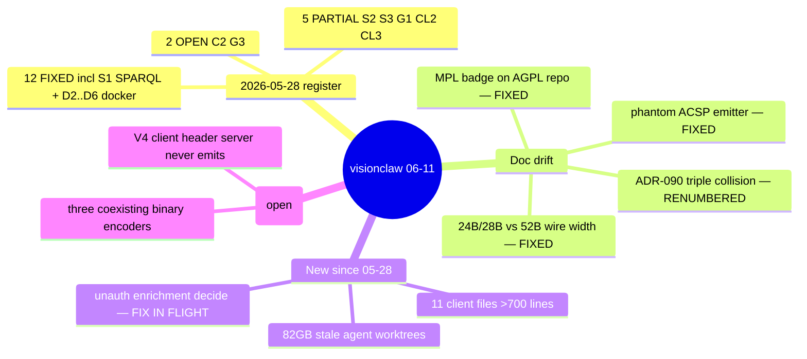

# Anomaly Register — VisionClaw host (ecosystem audit 2026-06-11)

Diagram-driven audit (ruflo mesh: 1 sonnet interface cartographer + 2 opus auditors + 2 opus fixers, Fable queen). Successor to the 2026-05-28 production register (`docs/architecture/diagrams/00-anomaly-register.md` is the older 2026-06-03 settings/GPU register — both retained). Ground-truth map: [interface-sequences.md](interface-sequences.md).

## 2026-05-28 register re-verification (verdicts with evidence)

**FIXED (12):** S1 (ontology power_user wrap + read-only SPARQL validator), C1 (reclassified — no bus ever wired; direct hexser dispatch), C4 (Neo4j tx defaults gone), C5 (.temp gone; settings_validation_fix.rs is live with 3 importers), G2 (persistent sort buffers + mem::swap), D2 (digest-pinned bases), D3 (fail-fast agent key), D4 (USER appuser), D5 (scoped GPU env), D6 (unwraps removed), CL1 (lazy XR), CL4 (websocket/index.ts 492 lines).

**PARTIAL (5):**
- S2 — `utils/auth.rs:46` still lets `Authenticated` satisfy `WriteGraph`, but every known mutator surface now carries explicit `RequireAuth::power_user()` route wraps. Tighten `has_permission` to finish.
- S3 — old literal `/settings` routes are dead (module disabled at `api_handler/mod.rs:135`), but live `/api/settings/*` GETs use `OptionalAuth` then discard it (`settings_routes.rs:1066`) — reads effectively anonymous.
- G1 — circuit-breaker real and wired (`MAX_CONSECUTIVE_GPU_FAILURES=5` → degraded+halt); CPU fallback remains an intentional warn-stub (GPU mandatory). Fails safe, not over.
- CL2 — `: any` 322 + `as any` 42 = 364 (down from 373).
- CL3 — reconnect/heartbeat timers balanced; binaryProtocol capped at 65536 entries; no remaining leak found.

**STILL-OPEN (2):** C2 settings read-modify-write race (`write_handlers.rs:44→198`, no version guard) — but the whole module is the *disabled* handler path; confirm dead → delete instead of fix. G3 — 3 `#[ignore]` gpu_stability tests on a stale API.

**ACCEPTED:** D1 docker.sock mount is `:ro`, dev-profile-only, explicitly commented.

## New findings since 2026-05-28

| ID | Sev | Where | Finding | Status |
|----|-----|-------|---------|--------|
| N1 | HIGH | `enrichment_proposals_handler.rs:178` + `main.rs:936` | Unauthenticated `POST /api/enrichment-proposals/{id}/decide`; `broker_pubkey` self-asserted from body (default "anon"); persists, broadcasts, triggers writeback — Sybil surface on the broker loop (introduced 023c847b0) | **Fix in flight this sweep** (auth gate matching sibling mutator precedent) |
| N2 | MED | `.claude/worktrees/` | 82 GB / 52 stale `agent-*` worktrees (gitignored). Pollutes grep and disk. | Flagged — operator call before deletion (`git worktree list` then prune + remove stale dirs) |
| N3 | MED | protocol | Three coexisting binary encoders: 28-byte V3F0 (`v3_frame.rs`, unused on the position path), 52-byte V3-extended (`binary_protocol.rs`, actual wire), 6-byte V4 header (client-send only, `frameTypes.ts:8` — server never emits it). Classic parallel-implementation divergence; consolidate or document authority. | Open |
| N4 | LOW | `endpoints.ts:85,350` | Client `updatePhysics` does GET-then-PUT; unified `POST /api/settings` has no JS caller; unknown setting paths silently fall back to localStorage-only. | Open |
| N5 | MED | `optimized_settings_actor.rs:596` | Settings writes don't broadcast to co-present clients (stale until reload). | Open |
| N6 | LOW | `position_updates.rs:742` vs subscribe path | Drag enforces pubkey check; position-stream subscribe doesn't — unauthenticated clients can receive the stream. Decide: public-viz by design, or gate. | Open |
| N7 | LOW | client | 11 files >700 lines (GemNodes 934, InstancedLabels 890, OnboardingWizard 794, settings.ts 780, CommandInput 761…) vs the 500-line project rule. | Open |
| N8 | LOW | code stragglers | Rename debt the docs already match: CUDA loader symbol still `visionflow_unified` (`ptx_loader.rs`), core crate still logs/refers to `webxr` (`visionclaw-protocol lib.rs:16`, RUST_LOG targets). Fix in code, then sweep docs. | Open |
| N9 | INFO | `solid_proxy_handler.rs:1874` | Without `solid-pod-embed` feature all `/solid/*` → 503; client has no guard. `filter_auth.rs:241` Phase-2 SQLite persistence is a stub. | Open |

## Doc drift resolved this sweep

README/docs-README phantom ACSP emitter (`ServerNostrActor`, 31400/31402 — never existed; reframed to the bead-provenance bridge reality per `agent-control-surface-panels.md`); MPL 2.0 badge/section → AGPL-3.0-only; 24B/28B wire-width claims → 52-byte `WireNodeDataItemV3` (+ ADR-061 amendment note); 23→21 actors; dead compose-file commands → `./scripts/launch.sh up dev`; Neo4j present-tense claim → Oxigraph+SQLite; GraphManager hooks-layer note; `src/uri/mod.rs` citations; ADR-090 collision → renumbered ADR-103/ADR-104; self-referential footer.

**Left for operator decision:** ADR-089 (CQRS-bus removal, Proposed) vs the "114 CQRS handlers" headline — reconcile status once the direct-dispatch reclassification (C1) is accepted. XR-domain docs (Vircadia/WebXR→Godot) untouched — in-flight work.

## 2026-07-22 doc-drift audit update (13-agent adversarial sweep + Phase A code landing)

Six-axis adversarial doc-drift audit (`docs/audit-doc-drift-2026-07-22.md`) re-verified this register against current `main` plus same-day Phase A code landings. Closures and re-labels below are append-only additions to the entries above — original rows are left intact for history.

**CLOSED — N-neo4j-substrate:** Oxigraph + SQLite verified as the sole live store (`Cargo.toml`, `src/adapters/oxigraph_graph_repository.rs`; no `neo4j_adapter.rs` on `main`). Doc-side Neo4j-as-live banners land separately per ADR-131/ADR-132 (`docs/adr/ADR-132-neo4j-removal-oxigraph-adoption.md`).

**N3 — rewritten CLOSED (was Open, "three coexisting binary encoders"):**

> **Correction (2026-07-22):** N3 above described three coexisting encoders including a "V4 client header server never emits." That framing is now obsolete on two counts: (1) Phase A code work (2026-07-22) **deleted** the dead 28-byte V3F0 encoder outright — both copies (`src/protocol/v3_frame.rs`, `crates/visionclaw-protocol/src/protocol/v3_frame.rs`) plus their re-exports (`src/protocol/mod.rs:9`, `crates/.../lib.rs:32`) — and **removed** the V4 delta scaffolding (`DeltaNodeData`, `MessageType::PositionDelta`, `PROTOCOL_V4`) from `src/utils/binary_protocol.rs`; the client's `frameTypes.ts` default is now `PROTOCOL_V3` with accurate comments. (2) The "server never emits V4 header" framing was itself half-wrong even before deletion — the server **does** emit a bare-tag `0x23` agent-action frame (`encode_agent_actions`, commit `67503fb39` fixed the client-side decode of it), it was just never a V4 *header* frame. Live wire, verified: **52B `0x03` `WireNodeDataItemV3` node-position frames + bare-tag `0x23` agent-action frames.** No dead encoder remains on `main`. **Status: CLOSED.**

**Re-labelled — "24B/28B vs 52B wire width — FIXED" (2026-05-28 mindmap, line 15):** downgraded from FIXED. The 2026-05-28 sweep only landed a doc banner (ADR-061's "Amended" note); the ADR-061 D1 body and the `9 + 28*N` telemetry formula stayed unedited at 28B, which overstated closure as if the design itself had changed. **Now genuinely resolved as of 2026-07-22**: ADR-061 carries dated Superseded-by-ADR-102 banners on its Status header, D1, and the telemetry formula (all body prose retained per append-only culture), and the underlying dead 28B V3F0 encoder is deleted (see N3 above). Re-label: **banner-only-then-resolved-2026-07-22** — the doc gap and the code gap are now both closed, not just the doc gap as the original "FIXED" label implied.

**New entries — OPENED-AND-CLOSED 2026-07-22:**

| ID | Sev | Where | Finding | Status |
|----|-----|-------|---------|--------|
| N-webxr-desktop-vr | HIGH | `client/src/immersive/threejs/VRGraphCanvas.tsx:43`, `services/platformManager.ts:289`, `features/.../GraphManager.tsx:61` | `xrStore.enterVR()` never called `platformManager.setXRMode(true)`, so an entered VR session rendered desktop-flat; live desktop-as-VR bug shipped in every browser build. | **OPENED-AND-CLOSED 2026-07-22** — closed by immersive-tree deletion (ADR-071 Phase 3, partial): `client/src/immersive/` (incl. `VRGraphCanvas.tsx`) and its `App.tsx` wiring deleted outright, `tsc` clean, removing the buggy code path entirely rather than patching it. Residual XR surface (`quest3AutoDetector.ts`, Vircadia services, XR settings-schema entries) deferred to the final-mile sprint — see `docs/how-to/operations/troubleshooting.md` XR/VR Issues section, 2026-07-22 correction. |
| N-ontology-telemetry-noop | HIGH | `agentbox/mcp/servers/lib/ontology-retrieval.js:128,172,202` | ADR-119 liveness telemetry sink defaulted to no-op `{ record(){} }`; `fail_open_count` and the liveness matrix were unobservable — the exact "wired ≠ working" trap ADR-119 was meant to avoid. | **OPENED-AND-CLOSED 2026-07-22** — closed by C2: new `agentbox/mcp/servers/lib/ontology-telemetry.js` (JSONL sink + counters + boot canary, fail-open); `fail_open_count` now observable via the `ontology_health` response field `_agentbox_ontology_ask_telemetry` and `getTelemetrySnapshot()`. 20/20 node tests pass. |
| N-sparql-clamp-halfshipped | MED | `src/handlers/ontology_handler.rs:720-768,827-845` | ADR-117 `sparql_query` enforced read-only + forbade `SERVICE` but injected no default `LIMIT` / row cap / byte cap before calling `sparql_select_json` raw — an authed caller could issue an unbounded SELECT against Oxigraph. | **OPENED-AND-CLOSED 2026-07-22** — closed by C3: server-side clamp shipped (`clamp_sparql_limit` + `cap_result_rows`) — LIMIT injection default 10000, hard row cap 10000, 8 MiB byte cap, explicit `truncated` flag. `tests/ontology_sparql_clamp.rs` 7/7 pass. `/ontology/query` response shape is now `{results, rowCount, truncated}`. |
| N-crashbug-branch-trap | MED | git branch `crashbug` (tip `d1f7f254`) | Unmerged branch carried the full Neo4j-dependent `BrokerActor` stack (`broker_actor.rs` 625L, `server_nostr_actor.rs`, `neo4j_broker_adapter.rs` 337L) — any merge/cherry-pick would reintroduce a Neo4j dependency into an Oxigraph+SQLite stack. | **OPENED-AND-CLOSED 2026-07-22** — local branch deleted and archive-tagged for history; **remote branch deletion still pending operator action** (not yet pushed/executed on the remote as of this sweep). |
