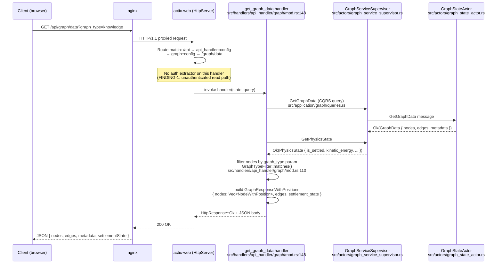
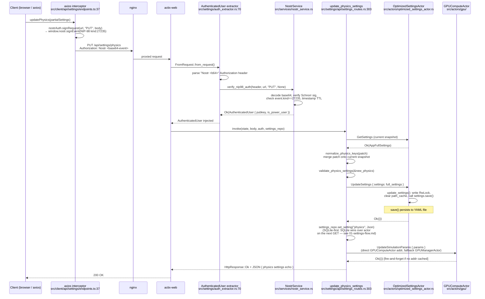
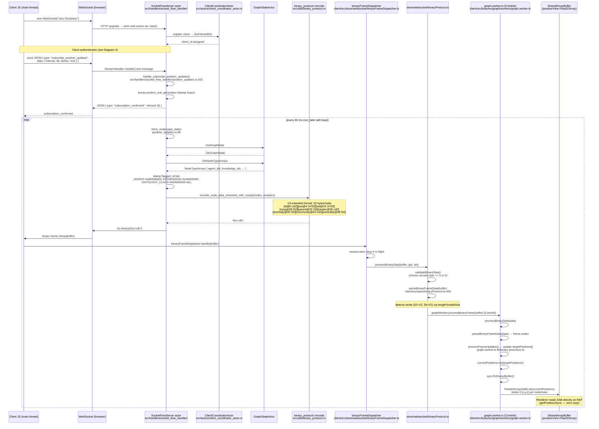
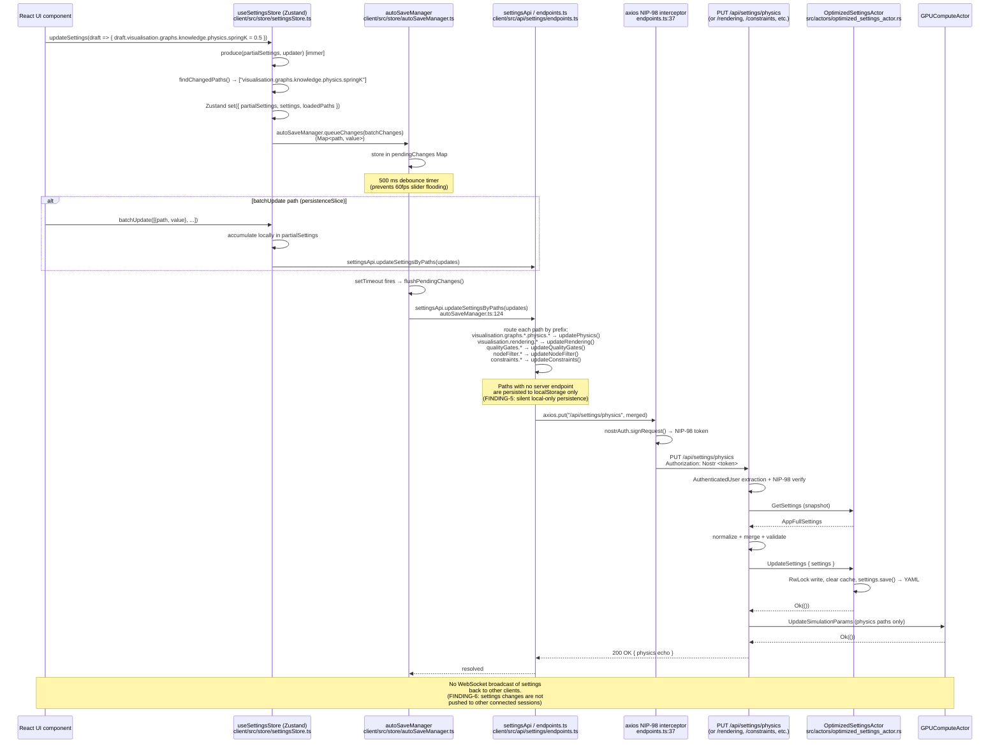
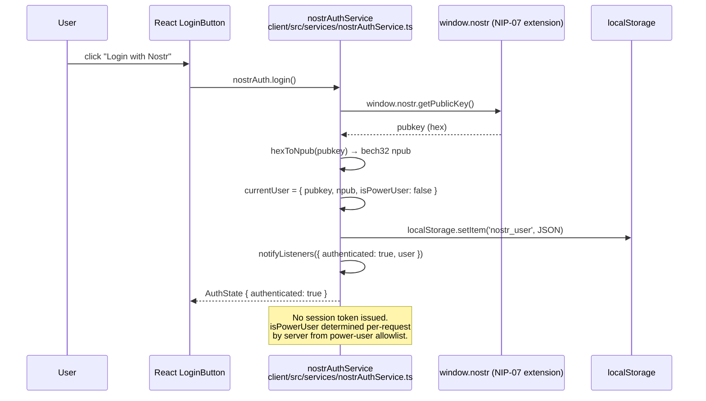
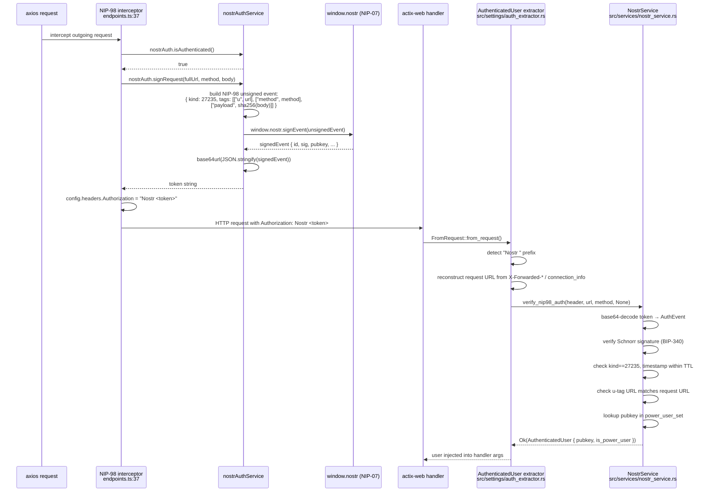
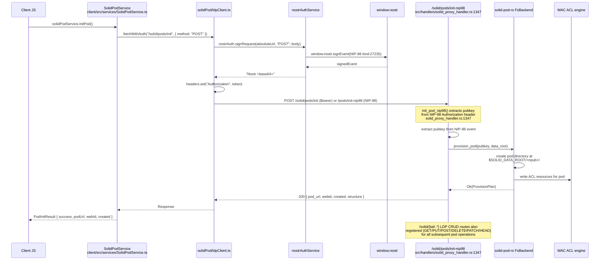
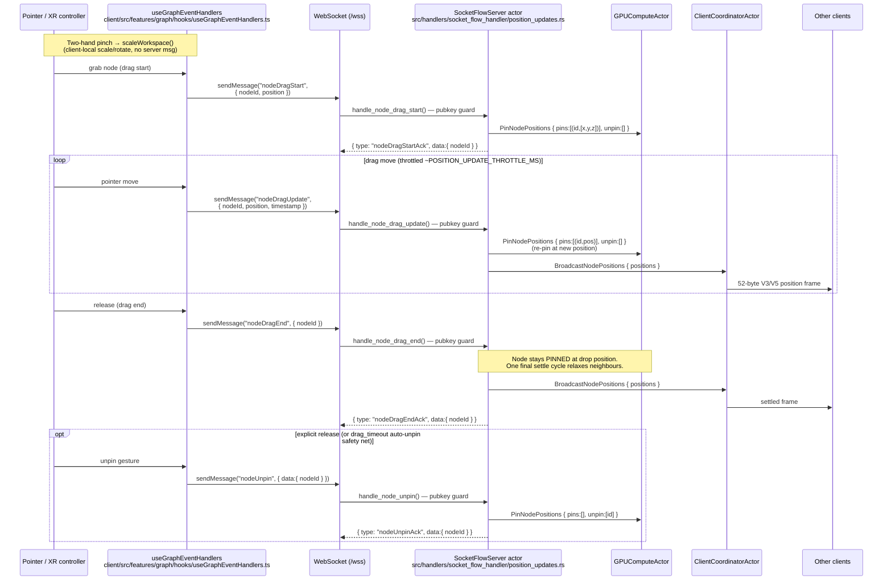
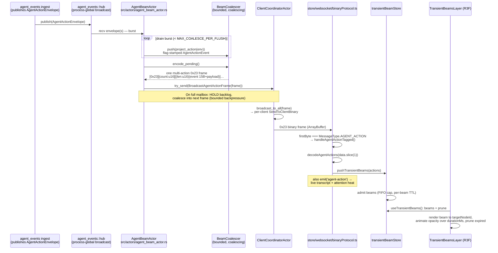
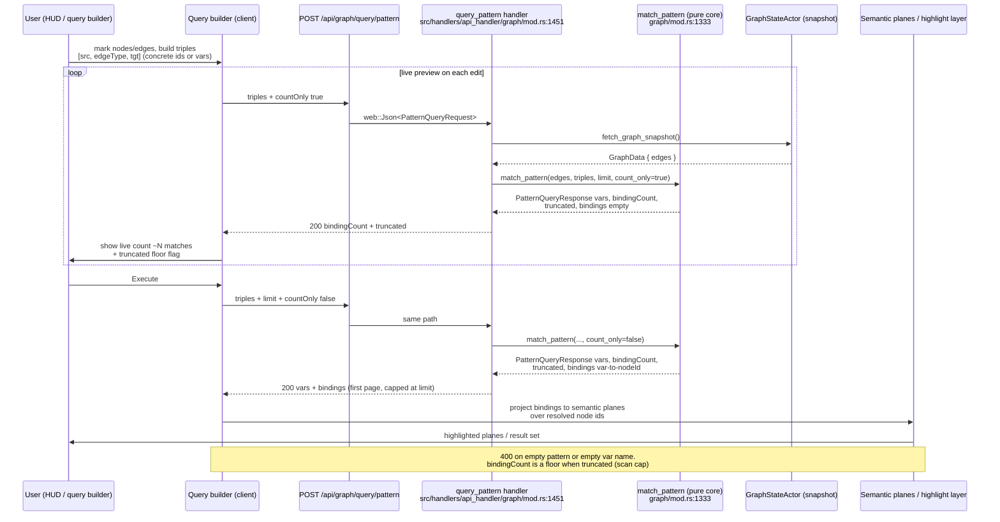

# VisionClaw Interface Surface — Sequence Diagrams

Cartography audit of the actual interface surface, built from source code.
All file:line references are relative to the repo root.

---

## 1. REST Request Lifecycle

### 1a. GET /api/graph/data — Read Path

Route registered at `src/main.rs:882` under `/api` scope → `api_handler::config` →
`graph::config` (`src/handlers/api_handler/graph/mod.rs:627`) → `/graph/data GET → get_graph_data`.

Auth is **optional** on this route: `get_graph_data` does NOT extract `AuthenticatedUser`.
The handler pulls data directly from `GraphServiceSupervisor` via CQRS query handlers.



### 1b. PUT /api/settings/physics — Write Path

Route: `src/main.rs:888` → `/api/settings` scope (RateLimit 60/min) →
`visionclaw_server::settings::api::configure_routes` →
`src/settings/api/settings_routes.rs:1314` → `physics PUT → update_physics_settings`.

`AuthenticatedUser` extractor is mandatory here (`src/settings/api/settings_routes.rs:303`).



---

## 2. WebSocket Binary Position Pipeline

### Connection → Position Subscription → Frame Decode → SAB Write

`/wss` route: `src/main.rs:867` → `socket_flow_handler` (actix-web-actors WebSocket upgrade).



---

## 3. Settings Round-Trip

### Client settingsStore → autoSaveManager → settingsApi → Server → OptimizedSettingsActor



---

## 4. Auth Interface

### 4a. Nostr NIP-07 Browser Extension Login (Client Side)



### 4b. NIP-98 Per-Request Signing (REST)



### 4c. WebSocket NIP-98 Authentication

```mermaid
sequenceDiagram
    participant C as Client JS
    participant WS as WebSocket (/wss)
    participant SFH as SocketFlowServer actor
    participant NS as NostrService

    C->>WS: connect ws://host/wss (no auth on HTTP upgrade)
    Note over SFH: client_id assigned, pubkey=None initially
    C->>WS: send JSON { type: "authenticate",<br/>event: "<base64-NIP98-event>" }
    WS->>SFH: StreamHandler text message
    SFH->>SFH: handle_authenticate()<br/>src/handlers/socket_flow_handler/filter_auth.rs:7
    SFH->>NS: verify_nip98_auth("Nostr <event>", ws_url, "GET", None)
    NS-->>SFH: Ok(AuthenticatedUser { pubkey, is_power_user })
    SFH->>SFH: self.pubkey = Some(pubkey)<br/>self.is_power_user = power_user
    SFH->>SFH: ClientCoordinatorActor.do_send(AuthenticateClient { client_id, pubkey, ... })
    SFH-->>WS: JSON { type: "authenticate_success", pubkey, is_power_user }
    WS-->>C: authenticate_success
    Note over C,SFH: Post-auth, the drag/pin verbs (nodeDragStart/Update/End,<br/>nodeUnpin) all re-check act.pubkey.is_none() and reject<br/>unauthenticated clients (VULN-01 guard).<br/>Full GPU-pin flow → §5a; two-hand pinch is client-local.
```

### 4d. Solid Pod Login / Init



---

## 5. Interaction & Swarm Surfaces (2026-08 wave)

Diagrams for the capabilities landed by the Graph2VR / swarm / query-builder
wave (ADR-138 pinned-node mask + force-channel registry, ADR-139 Graph2VR
two-hand manipulation, ADR-140 XR agent swarm `0x23` beams, visual query
builder `/api/graph/query/pattern`). Message names verified against
`src/handlers/socket_flow_handler/message_routing.rs` and the client transport
(`client/src/features/graph/hooks/useGraphEventHandlers.ts`).

### 5a. Node Drag → GPU Pin → Broadcast → Unpin

Grab-and-place is server-authoritative (ADR-03 D7): the client no longer pins in
the graph worker; every drag verb is a JSON WebSocket message that drives a GPU
`PinNodePositions { pins, unpin }` and (on move/end) a `BroadcastNodePositions`
re-entry so co-present clients see the held node. `nodeDragEnd` leaves the node
**pinned in place**; only an explicit `nodeUnpin` (or the drag-timeout safety
net) releases it. Two-hand pinch is a separate **client-local** workspace
scale/rotate (Graph2VR, `interactionModes/vrArMode.ts` → `scaleWorkspace`) that
sends no server message and is shown as the dashed local branch.



### 5b. Agent-Beam `0x23 AGENT_ACTION` Broadcast → XR Beam Render

Embodied agent actions (ADR-140 / ADR-059 Phase 2b). The `agent_events` ingest
publishes each `AgentActionEnvelope` to the process-global `agent_events::hub`.
`AgentBeamActor` subscribes, coalesces a burst into one `BeamCoalescer`,
identity-blindly projects each envelope onto a flag-stamped action
(`project_action` → `to_binary_event`), and encodes the whole backlog as ONE
multi-action `0x23` frame (`encode_agent_actions`). It rides the existing binary
fan-out via `BroadcastAgentActionFrame` → `ClientCoordinatorActor.broadcast_to_all`
— no new client registry. On the client, the frame's lead tag
(`MessageType.AGENT_ACTION`) routes it to `handleAgentActionTagged`, which
decodes to transient beams pushed into `transientBeamStore`; `TransientBeamsLayer`
renders and ages them out.



### 5c. Visual Query Builder — Mark → countOnly Preview → Execute → Planes

The visual query builder (ADR-141 wave) turns a marked sub-graph into a triple
pattern and enumerates its bindings over the live in-memory typed graph via
`POST /api/graph/query/pattern` (`src/handlers/api_handler/graph/mod.rs:1451`,
read-only, 120/min). The HUD first sends `countOnly:true` for a live
binding-count preview (no bindings materialised), then re-sends with
`countOnly:false` on execute to page the bindings, which the client renders as
semantic planes / highlights over the resolved node ids.



---

## 6. Audit Findings

### F-1 — Unauthenticated Read on /api/graph/data

**Severity: MEDIUM**
**Location:** `src/handlers/api_handler/graph/mod.rs:148`
**Classification:** Unauth read path

`get_graph_data` does not extract `AuthenticatedUser` or `OptionalAuth`. The entire knowledge
graph (nodes, edges, positions, metadata) is returned without any identity check. (Write paths
are protected at the route layer, not the handler signature — see the F-7 correction below.)
The settings GET routes similarly serve unauthenticated
callers (`src/settings/api/settings_routes.rs` `get_settings` has no auth param) but apply
`redact_settings_secrets()` to strip API keys — however physics, rendering and all other
sub-routes (`get_physics_settings`, `get_rendering_settings`, etc.) are also unauthenticated
reads.

---

### F-2 — Duplicate Binary Encode Implementations (Protocol Version Disagreement)

**Severity: HIGH**
**Locations:**
- Server V3 frame module: `src/protocol/v3_frame.rs` — `V3_MAGIC = 0x5633_4630`, **28 bytes/node** (header 8 + nodes×28 + trailer 4)
- Server legacy encoder: `src/utils/binary_protocol.rs` — **52 bytes/node** (V3 extended: adds sssp@28, parent@32, cluster@36, anomaly@40, community@44, centrality@48)
- Client decoder: `client/src/types/binaryProtocol.ts:76` — `BINARY_NODE_SIZE_V3 = 52`, auto-detected by `length % 52`
- Client BinaryWebSocketProtocol: `client/src/services/binaryProtocol/frameTypes.ts:8` — `PROTOCOL_VERSION = PROTOCOL_V4 = 4`
**Classification:** Duplicate encoder / protocol constant disagreement

The `src/protocol/v3_frame.rs` module documents itself as "the single source of encode/decode
logic" for the broadcast path (28-byte NodeRow). The actual position subscription loop
(`position_updates.rs:555`) calls `binary_protocol::encode_node_data_extended_with_sssp` which
produces **52-byte** records prefixed by a 1-byte protocol-version header (`buffer.push(3)`,
`src/utils/binary_protocol.rs`; V5 frames wrap the same body with `[version=5][8-byte seq]`).
The client's `validateBinaryData` checks `version byte == 3 or 5`
(`store/websocket/binaryProtocol.ts:198`) and the decoder reads the version byte first
(`types/binaryProtocol.ts:165`); the `length % nodeSize` heuristic is only a fallback for
unknown version bytes. The `BinaryWebSocketProtocol` class in
`services/BinaryWebSocketProtocol.ts` uses a different 6-byte V4 header format
(`MESSAGE_HEADER_SIZE=6`, `PROTOCOL_VERSION=V4=4`) which is never emitted by the server's
position subscription path. The V3 frame format in `v3_frame.rs` (28 bytes) is never decoded on
the client. Three incompatible wire formats coexist; the one actually flowing is the 52-byte
legacy format.

---

### F-3 — /api/settings/physics GET Has No Server-Side Route Caller

**Severity: LOW**
**Location:** `client/src/api/settings/endpoints.ts:85` calls `GET /api/settings/physics`
then `PUT /api/settings/physics`; `src/settings/api/settings_routes.rs:1314` registers both.
**Classification:** Route with no client caller (for other routes)

The client `updatePhysics()` performs a GET-then-PUT pattern (read-modify-write) as a workaround
for partial updates. This means every physics slider change issues two requests. The sub-routes
`/api/settings/node-filter`, `/api/settings/constraints`, `/api/settings/quality-gates`, and
`/api/settings/rendering` follow the same pattern. The `updateSettingsByPaths` path in
`endpoints.ts:364` also dispatches through these individual PUT endpoints, not through the
unified `POST /api/settings` bulk endpoint registered at `settings_handler/routes.rs:27`.
The unified POST endpoint is therefore a **dead server route** from the JS client's perspective:
no client caller routes through it.

---

### F-4 — Client Protocol Version Constant V4 Never Emitted by Server

**Severity: MEDIUM**
**Location:** `client/src/services/binaryProtocol/frameTypes.ts:8` (`PROTOCOL_VERSION = PROTOCOL_V4 = 4`), `SUPPORTED_PROTOCOLS = [V2, V3, V4]`
**Classification:** Protocol constant disagreement

The `BinaryWebSocketProtocol.createMessage()` stamps a V4 header (1-byte type, 1-byte version=4,
4-byte payloadLength). The server `binary_protocol.rs` encoder does not produce this header.
Server position frames begin with a 1-byte protocol version (3 or 5), then 52-byte node
records starting with `u32 node_id`. The V4 client header parser
(`parseHeader`) and the server's legacy encoder are talking different formats on the same socket.
The client's `processBinaryData` path in `store/websocket/binaryProtocol.ts` short-circuits to
`parseBinaryNodeData` / `parseBinaryFrameData` (which understands the raw 52-byte legacy format),
so the `BinaryWebSocketProtocol` class is effectively unused on the receive path — but its
`createMessage` is used when the **client sends** binary (BroadcastAck, voice). The server decode
in `binary_protocol.rs:BinaryProtocol::decode_message` uses its own message type byte scheme and
may not align with the client V4 header for the BroadcastAck path.

---

### F-5 — Settings Paths With No Server Endpoint Silently Fall Through to localStorage Only

**Severity: MEDIUM**
**Location:** `client/src/api/settings/endpoints.ts:350`
**Classification:** Client API calling absent route

The `updateSettingByPath` function has an explicit `else` branch:

```
logger.debug(`Path "${path}" persisted to localStorage only (no server endpoint)`);
```

Paths not matching `visualisation.graphs.*.physics.*`, `visualisation.rendering.*`,
`qualityGates.*`, `nodeFilter.*`, `constraints.*`, or `isVisualSettingsPath()` are never sent
to the server. This includes at minimum: `clientTweening.*`, `xr.*`, `system.*`,
`nostr.*`, and any new feature paths. The client settingsStore persists these via zustand
`persist` to `localStorage` under key `graph-viz-settings-v2`. On page reload these values are
hydrated from localStorage but never validated against the server. Server-side writes (e.g.
admin reset via `POST /api/settings/reset`) will not propagate the client-only paths back to the
browser.

---

### F-6 — Settings Updates Not Broadcast to Other Connected Sessions

**Severity: MEDIUM**
**Location:** `src/actors/optimized_settings_actor.rs:596` (`update_settings`); `src/settings/api/settings_routes.rs:364`
**Classification:** Missing cross-session sync

When `update_physics_settings` (or any write handler) calls `UpdateSettings` on
`OptimizedSettingsActor`, the actor writes the in-memory RwLock and saves to YAML. There is no
`BroadcastMessage` to `ClientCoordinatorActor` to push `settingsChanged` to all connected WebSocket
clients. Other browser tabs or co-present users will have stale physics/rendering settings until
they reload. The `BroadcastMessage` actor message exists (`src/actors/messages.rs`) and is used for
other scenarios, but not wired after settings writes. Compare: the drag path explicitly calls
`BroadcastNodePositions` after every settle cycle.

---

### F-7 — WITHDRAWN (queen verification): update_graph/refresh_graph ARE auth-gated at the route layer

**Severity: none (false positive)**
**Location:** `src/handlers/api_handler/graph/mod.rs:648–660`
**Classification:** verified-protected

Initial reading of the handler signatures suggested missing auth, but the protection lives in
the route registration, not the extractors: `/update` is wrapped with
`RequireAuth::power_user()` (bulk reload is a privileged operation) and `/refresh` with
`RequireAuth::authenticated()` (read-back). Verified 2026-06-11 against `graph/mod.rs:652,659`.
Only the unauthenticated **read** path (F-1) stands.

---

### F-8 — WebSocket Drag Handlers Require pubkey but Subscribe Does Not

**Severity: LOW**
**Location:** `src/handlers/socket_flow_handler/position_updates.rs:742` (nodeDragStart VULN-01 guard)
**Classification:** Inconsistent auth enforcement

`handle_node_drag_start/update/end` check `act.pubkey.is_none()` and reject unauthenticated
clients. `handle_subscribe_position_updates` has no such guard. An unauthenticated client can
subscribe and receive a full position stream. This is consistent with the unauthenticated REST
read path (F-1) but may be surprising: position data leaks to pre-auth connections.

---

### F-9 — Filter Persistence Phase 2 (SQLite) Not Yet Implemented

**Severity: LOW**
**Location:** `src/handlers/socket_flow_handler/filter_auth.rs:237`; `src/settings/api/settings_routes.rs:21`
**Classification:** Dead code / incomplete feature

The `filter_update` WebSocket handler stores filters in-memory on the `ClientCoordinatorActor`
only. The comment at `filter_auth.rs:241` reads: "Filter is applied in-memory only until Phase 2
SQLite migration is complete." Similarly `UserFilter` in `settings_routes.rs:21` carries a
`todo!("Phase 2: migrate UserFilter to SqliteSettingsRepository / SQLite schema")`. Filters are
lost on server restart.

---

### F-10 — Solid Routes Gated on solid-pod-embed Feature Flag; Stub Returns 503

**Severity: INFO**
**Location:** `src/handlers/solid_proxy_handler.rs:1874` (stub `configure_routes`)
**Classification:** Conditional route

Without the `solid-pod-embed` Cargo feature, all `/solid/*` routes return 503. The client
`SolidPodService.initPod()` makes no feature-flag check before calling `/solid/pods/init`.
A build without `solid-pod-embed` will surface 503 errors at runtime with no client-side guard.

---

## Wire Format Reference

### Server Position Broadcast (actual on-wire, "V3 extended")
`src/utils/binary_protocol.rs` — `encode_node_data_extended_with_sssp()`

```
Frame header: 1 byte protocol version (3 = V3; 5 = V5, followed by an 8-byte
broadcast-sequence u64 before the node records).

Per-node (52 bytes):
  Offset  Size  Field
    0      4    node_id u32 (bits 31-26 = type flags: AGENT=0x80000000, KNOWLEDGE=0x40000000,
                             OntClass=0x04000000, OntInd=0x08000000, OntProp=0x10000000)
    4     12    pos [f32; 3]  (x, y, z)
   16     12    vel [f32; 3]  (vx, vy, vz)
   28      4    sssp_distance f32
   32      4    sssp_parent   i32
   36      4    cluster_id    u32
   40      4    anomaly_score f32
   44      4    community_id  u32
   48      4    centrality    f32  (ADR-031 D2)
```

Client constants at `client/src/types/binaryProtocol.ts:72–91` match this layout exactly.

### V3 Frame Format (visionclaw-protocol crate — UNUSED on position path)
`src/protocol/v3_frame.rs` — `V3_MAGIC = 0x5633_4630`

```
Header (8 bytes):
  Offset  Size  Field
    0      4    magic u32 = 0x5633_4630 (LE: bytes [0x30,0x46,0x33,0x56])
    4      4    frame_id u32 (monotonic)

Per-node (28 bytes):
  Offset  Size  Field
    0      4    node_id u32
    4     12    pos [f32; 3]
   16     12    vel [f32; 3]

Trailer (4 bytes):
  Offset  Size  Field
    0      4    node_count u32
```

Total: `8 + 28*N + 4` bytes.  Client has no decoder for this format.

### BinaryWebSocketProtocol V4 Header (client-emitted messages only)
`client/src/services/binaryProtocol/frameTypes.ts:175`

```
Header (6 bytes for non-GRAPH_UPDATE, 7 bytes for GRAPH_UPDATE):
  Offset  Size  Field
    0      1    MessageType u8
    1      1    version u8 = 4
    2      4    payloadLength u32 (LE)
   [6]     1    graphTypeFlag u8 (GRAPH_UPDATE only)
```

Server decode in `src/utils/binary_protocol.rs:BinaryProtocol::decode_message` has its own
message-type enum that may not align with the client MessageType values.
