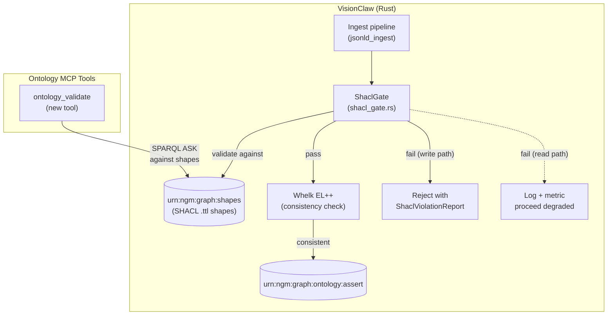
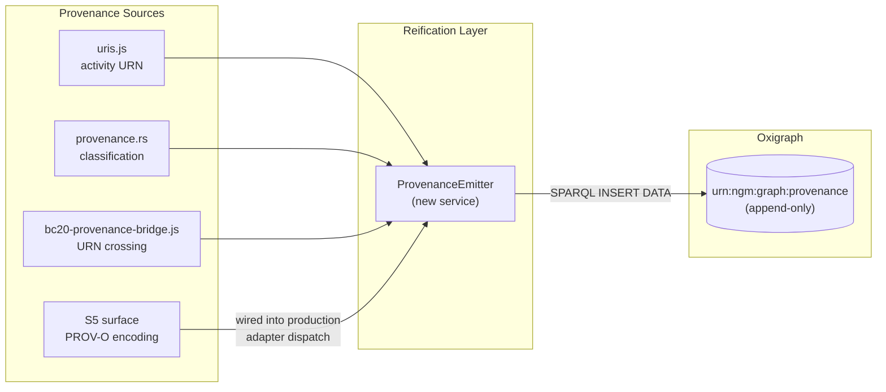
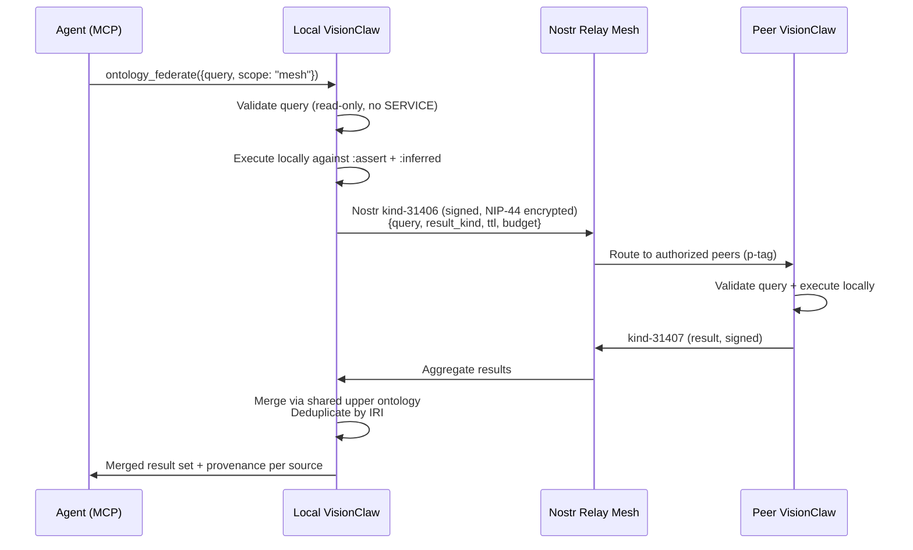

# PRD-022 — Semantic Trust Layer: W3C Shape Validation, Provenance Reification, and Relay-Mediated Federation

**Status:** Partially implemented — WS-1 (SHACL shape enforcement, shape-driven gate enforcing by default) and WS-2 (PROV-O reification into the unified `urn:ngm:graph:provenance` ledger with a SPARQL-backed query surface) landed 2026-08-15. Remaining workstreams unchanged.
**Date:** 2026-06-21

> **EXECUTION NOTE (read first):** This is a **design + workstream plan**. No agentbox or VisionClaw code is changed by this PRD. Implementation is the WS-0…WS-5 workstreams below, each gated by the evidence bars in §7. The driving thesis: agent memory that cannot be **validated, audited, and federated** is untrusted memory — and the gap between VisionFlow's current state and that standard is narrower than it appears.

---

## 1. Summary

The DreamLab ecosystem ships three of the four pillars required for trusted agent memory: formal ontology (OWL 2 EL via Whelk-rs + Oxigraph RDF), cryptographic provenance (git-marks + block-trails + Schnorr-signed identity via `did:nostr`), and a SPARQL endpoint per instance. Three gaps remain between "shipped" and "trust-grade":

1. **SHACL validation** — SHACL-lite exists (`shacl_lite.rs`, `shacl_gate.rs`) as inline shape checks with advisory non-blocking gating. No W3C SHACL shapes exist as `.ttl` files; no formal shape processor validates data before agents consume it.
2. **PROV-O reification** — Activity URNs are minted (`uris.js`, `provenance.rs`) and the S5 PROV-O surface is implemented (`s05-provenance.js`), but provenance is not reified as RDF triples in Oxigraph. The `bc20.crossOutbound()` receipt crossing is test-only, not production. Completion is ~65%.
3. **Federated semantic query** — Each instance has a SPARQL endpoint. Cross-org federation works via Nostr relay mesh (kinds 31400–31405). But no query-driven federation exists — an agent cannot issue a semantic query that spans multiple VisionClaw instances.

**Approach:** Upgrade the existing infrastructure in three parallel workstreams — one per gap — using the existing Oxigraph quad-store, the Nostr relay mesh, and the adapter/middleware pipeline as substrates. No new services. No new identity primitives.

**Scope decision (2026-06-21, operator):** WS-3 (relay-mediated SPARQL federation) and the `ontology_federate` MCP tool are **deferred** to Phase 2, triggered by the first multi-instance deployment. The relay mesh already federates event-driven data; query-driven federation solves a problem that does not yet have a concrete deployment. The design (§4.3) is retained for that future phase. WS-0 + WS-1 + WS-2 + WS-5 ship as Phase 1.

### Binding constraints (verified)

1. **SPARQL SERVICE stays blocked.** ADR-011 S1 blocks `SERVICE` at the handler boundary (`ontology_handler.rs:50-70`) for SSRF/data-exfiltration prevention. This PRD does not unblock it. Federation uses a relay-mediated dispatch, not arbitrary outbound SPARQL.
2. **SHACL gating is fail-closed on the write path, fail-open on the read path.** Shape violations on ingest (write) reject the payload. Shape violations on query (read) are advisory — they log and metric but never block a consumer.
3. **PROV-O reification uses a dedicated named graph.** `urn:ngm:graph:provenance` is append-only for activity triples. It does not participate in Whelk reasoning and is not covered by ontology forces.
4. **Verifiable liveness (anti-PRD-018).** Each workstream ships a canary test that exercises the path end-to-end and asserts a non-trivial result. "Wired ≠ working" is non-negotiable.
5. **Adapter contract is non-negotiable.** All durable state flows through the five adapter slots (agentbox ADR-005). SHACL shapes are loaded through the pods adapter; provenance triples are emitted through the events adapter; federation queries traverse the orchestrator adapter.

### Reuse inventory — what already exists (verified file:line)

| Asset | Path | Status | Role in PRD-022 |
|---|---|---|---|
| SHACL-lite shape checks | `crates/visionclaw-ontology/src/services/jsonld_validator/shacl_lite.rs` | **live, advisory** | Upgraded to fail-closed; shapes externalised as `.ttl` |
| SHACL ingest gate | `crates/visionclaw-ontology/src/services/jsonld_ingest/shacl_gate.rs` | **live, non-blocking** | Gate mode toggleable: advisory → enforcing |
| SHACL vocab registration | `crates/visionclaw-ontology/src/services/vocab_registry.rs` | **live** | Reused — `sh:` namespace already registered |
| Oxigraph quad-store | `crates/visionclaw-adapters/src/oxigraph_ontology_repository.rs` | **live** | New named graphs: `:shapes`, `:provenance` |
| SPARQL migration framework | `crates/visionclaw-adapters/src/sparql_migrations.rs` | **live** | Migrations load shapes + provenance bootstrap |
| Read-only SPARQL validator | `src/handlers/ontology_handler.rs:720-770` | **live** | Extended to enforce shapes-graph read-only |
| SERVICE block | `src/handlers/ontology_handler.rs:50-70` | **live** | Unchanged — federation bypasses SERVICE entirely |
| PROV-O activity URN minting | `agentbox/management-api/lib/uris.js` (kind: `activity`) | **live** | Reified as RDF triples in `:provenance` graph |
| S5 PROV-O surface | `agentbox/management-api/middleware/linked-data/surfaces/s05-provenance.js` | **live, opt-in** | Wired into production adapter dispatch |
| Provenance viewer pane | `agentbox/management-api/middleware/linked-data/viewer/panes/provenance-pane.js` | **live** | Extended with SPARQL-backed provenance queries |
| BC20 provenance bridge | `agentbox/management-api/lib/bc20-provenance-bridge.js` | **live, test-only** | Wired into production receipt crossing |
| Receipt minter | `agentbox/management-api/lib/receipt-minter.js` | **live** | Activity URNs flow into `:provenance` graph |
| Provenance classification | `src/agent_events/provenance.rs` | **live** | Extended with reified PROV-O triple emission |
| Nostr relay mesh | agentbox ADR-009, `docs/developer/sovereign-mesh.md` | **live** | Transport for federated SPARQL sub-queries |
| IS-Envelope contract | ADR-075, `tests/contract/upstream_vectors/is-envelope-v1.json` | **live** | New kind `semantic_query` for federation |
| Shared upper ontology | Oxigraph `urn:ngm:graph:ontology:assert` | **live** | Semantic alignment for cross-instance merges |
| Whelk reasoner | `crates/visionclaw-adapters/src/whelk_inference_engine.rs` | **live** | Validates shapes reference valid OWL classes |

---

## 2. High-level view

### 2.1 The trust trinity — current state vs target

| Capability | W3C standard | VisionFlow current state | Gap | Target |
|---|---|---|---|---|
| **Validate** | SHACL | SHACL-lite (inline Rust, advisory, non-blocking) + IS-Envelope (JSON Schema at federation boundary) + OWL 2 EL constraints (Whelk) | No `.ttl` shape files, no W3C processor, advisory-only | W3C SHACL shapes in Oxigraph, fail-closed on write |
| **Audit** | PROV-O | URN-based activity records + git-marks + block-trails + Schnorr-signed identity + S5 PROV-O surface (agentbox) | Not reified as RDF triples in Oxigraph; S5 not consumed in production; bc20 crossing test-only | PROV-O triples in `:provenance` graph, SPARQL-queryable |
| **Federate** | SPARQL SERVICE | SPARQL endpoint per instance + Nostr relay mesh (event-driven, kinds 31400–31405) + shared upper ontology | No query-driven federation; SERVICE blocked for security | Relay-mediated SPARQL federation over did:nostr mesh |

### 2.2 Why three parallel workstreams, not one monolith

Each gap has a different blast radius and a different substrate:

- **SHACL** touches Oxigraph (Rust) and the ingest pipeline. No agentbox surface.
- **PROV-O** bridges Oxigraph (Rust) and the agentbox adapter pipeline (Node.js). Cross-substrate.
- **Federation** is Nostr-relay-mediated, extending the existing mesh topology. Primarily agentbox + relay.

They share one invariant: every piece must be exercisable from the existing `ontology-bridge.js` MCP tools (PRD-020's BC21 read surface) and queryable via SPARQL. But their implementation paths are independent. Parallelize.

### 2.3 Architectural principle: extend, don't replace

The existing SHACL-lite, PROV-O URN minting, and relay mesh are not wrong — they are incomplete. Each workstream extends the shipped infrastructure rather than replacing it:

- SHACL-lite's inline rules become the runtime fallback if the shapes graph is unavailable (fail-open on read)
- PROV-O URNs remain the primary identifier; reified triples are the queryable representation of the same facts
- The relay mesh remains the federation transport; this PRD adds a query protocol on top

---

## 3. Goals & non-goals

### Goals

1. **W3C SHACL shapes** for the core domain types (`owl:Class`, `BridgeRecord`, `KnowledgeNode`, `AgentNode`, `InferredAxiom`) loaded into Oxigraph and validated on the write path.
2. **PROV-O reification** as RDF triples in a dedicated `urn:ngm:graph:provenance` named graph, SPARQL-queryable with `prov:Activity`, `prov:wasGeneratedBy`, `prov:wasAssociatedWith`, `prov:atTime`.
3. **Relay-mediated SPARQL federation** allowing an agent to issue a semantic query that the local instance decomposes, dispatches to authorized peers over the Nostr relay mesh (signed with `did:nostr`, encrypted via NIP-44 v2), and aggregates into a merged result set.
4. **Three new MCP tools** on `ontology-bridge.js`: `ontology_validate` (run SHACL on a payload), `ontology_provenance` (query who asserted what, when), `ontology_federate` (cross-instance semantic query).
5. **Verifiable liveness** for each path — startup canary + integration tests that prove the pipeline is exercised.
6. **Zero regression** to the governed write path (`propose → Whelk → PR → human merge`).

### Non-goals

- Unblocking SPARQL `SERVICE` (security boundary is permanent).
- Full OWL 2 DL reasoning (Whelk is EL; no upgrade).
- SHACL-AF (Advanced Features) — core SHACL only.
- Real-time federated queries (<100ms) — federation is async, relay-mediated, seconds-scale.
- Replacing IS-Envelope validation with SHACL at the Nostr boundary (IS-Envelope remains the federation-boundary contract; SHACL validates domain data, not message envelopes).

---

## 4. Architecture

### 4.1 SHACL validation pipeline



**Shape loading**: `.ttl` shape files in `crates/visionclaw-ontology/shapes/` are loaded into `urn:ngm:graph:shapes` via the SPARQL migration framework at startup. Shapes reference classes in the asserted graph by IRI.

**Validation strategy**: SPARQL-ASK-based shape validation. Each SHACL shape compiles to a SPARQL ASK query that detects violations. This avoids a full SHACL processor dependency while achieving W3C-compatible validation for the SHACL Core constraint types used (property constraints, cardinality, datatype, class). If the `rudof` crate (Rust SHACL ecosystem) matures to a stable release during implementation, it becomes the preferred processor.

**Dual-mode gating**: The `ShaclGate` in `shacl_gate.rs` gains a `mode` parameter:
- `enforcing` (default on write paths): violations → reject + `ShaclViolationReport` domain event
- `advisory` (default on read paths): violations → log + `shacl_violations_total{shape,severity}` metric + proceed

### 4.2 PROV-O reification



**Triple shape**: Each activity record becomes a set of quads in the `:provenance` graph:

```turtle
@prefix prov: <http://www.w3.org/ns/prov#> .
@prefix agbx: <urn:agentbox:ns:> .
@prefix vc:   <urn:visionclaw:ns:> .

<urn:visionclaw:execution:abc123def456>
    a prov:Activity ;
    prov:wasAssociatedWith <did:nostr:deadbeef...> ;
    prov:startedAtTime "2026-06-21T14:30:00Z"^^xsd:dateTime ;
    prov:used <urn:ngm:axiom:789abc012345> ;
    prov:generated <urn:visionclaw:bead:deadbeef...:fed987654321> ;
    vc:action "propose" ;
    vc:derivation "asserted" .
```

**Append-only invariant**: The `:provenance` graph accepts only `INSERT DATA`. No `DELETE`, `DROP`, or `CLEAR` is permitted. The SPARQL migration framework enforces this structurally.

**Production wiring**: The S5 surface (`s05-provenance.js`) is wired into the adapter dispatch middleware chain (after privacy filter, before JSON-LD encoder) for all adapter slots except `orchestrator` (which is `off` per ADR-008). Every durable write that transits an adapter slot emits a PROV-O activity record.

### 4.3 Relay-mediated SPARQL federation



**New Nostr event kinds** (extending ACSP 31400–31405):
- `31406` — `SemanticQueryRequest`: signed, encrypted, carries a read-only SPARQL query + result format + TTL + token budget
- `31407` — `SemanticQueryResult`: signed, carries partial result set + source `did:nostr` + execution metadata

**Security model**: Peer instances only execute queries from identities in their `federation.authorized_peers` allowlist (Nostr p-tag routing). Queries are validated by the same `validate_read_only_sparql()` function that gates the local endpoint — no peer can trick another into executing a mutation or SERVICE call.

**Merge strategy**: Results from multiple instances are merged using IRI deduplication. When two instances assert the same class IRI with different properties, the shared upper ontology's `owl:equivalentClass` and `rdfs:subClassOf` relations determine the canonical representation. Conflicting non-ontological properties are returned as-is with provenance tags (which instance asserted what).

**IS-Envelope extension**: The federation messages travel as IS-Envelope kind `semantic_query` (new kind, extending ADR-075 D1), gift-wrapped per NIP-59. This preserves the existing message contract and adds federation without a new transport.

---

## 5. Workstreams

### WS-0 — SHACL shapes authoring + shapes graph (Rust, VisionClaw)

| Item | Detail |
|---|---|
| **Deliverable** | `.ttl` shape files for 5 core types; SPARQL migration to load into `:shapes`; shapes graph read endpoint |
| **Depends on** | Nothing (standalone) |
| **Evidence gate** | `SPARQL ASK` against each shape returns expected violations on known-bad test data; zero violations on the current production ontology |
| **Risk** | Shapes that are too strict will reject valid existing data → mitigate by running shapes against the full production graph before enforcing |

**Shapes to author** (priority order):
1. `OntologyClass` — must have `rdfs:label`, `rdfs:subClassOf` (except `owl:Thing`), `vc:domain`
2. `InferredAxiom` — must have `prov:wasGeneratedBy` with a valid reasoner run IRI
3. `BridgeRecord` — target must not be a `LinkedPage` stub (the existing SHACL-lite rule, now as `.ttl`)
4. `KnowledgeNode` — must have `vc:source_file`, `vc:public` boolean
5. `AgentNode` — must have `vc:agent_pubkey` matching `did:nostr:` pattern

### WS-1 — SHACL gate upgrade (Rust, VisionClaw)

| Item | Detail |
|---|---|
| **Deliverable** | `ShaclGate` upgraded from advisory to dual-mode (enforcing/advisory); SPARQL-ASK-based validation engine; `ShaclViolationReport` domain event |
| **Depends on** | WS-0 (shapes must exist) |
| **Evidence gate** | Write path rejects a payload missing `rdfs:label` with a `ShaclViolationReport`; read path logs but proceeds; Prometheus metric `shacl_violations_total` increments |
| **Risk** | Performance of SPARQL-ASK per shape on write path → mitigate with shape compilation to pre-prepared queries at startup |

### WS-2 — PROV-O reification (Rust + Node.js, cross-substrate)

| Item | Detail |
|---|---|
| **Deliverable** | `urn:ngm:graph:provenance` named graph; `ProvenanceEmitter` that reifies activity URNs as RDF triples; S5 surface wired into production adapter dispatch; `bc20.crossOutbound()` wired into production receipt path |
| **Depends on** | Nothing (standalone) |
| **Evidence gate** | After a governed proposal cycle, `SPARQL SELECT ?act ?agent ?time FROM <urn:ngm:graph:provenance>` returns the activity record with correct `did:nostr` agent, timestamp, and generated bead URN |
| **Risk** | Append-only `:provenance` graph grows unbounded → mitigate with TTL-based archival (move triples older than 90 days to cold storage, retain content-addressed URNs as tombstones) |

### WS-3 — Relay-mediated federation (Node.js + Rust, agentbox + VisionClaw)

| Item | Detail |
|---|---|
| **Deliverable** | Nostr kinds 31406/31407; IS-Envelope kind `semantic_query`; `ontology_federate` MCP tool; peer authorization allowlist; result merge with provenance |
| **Depends on** | WS-2 (provenance tagging of federation results) |
| **Evidence gate** | Two VisionClaw instances on the same relay mesh; agent on instance A queries `ontology_federate({query: "SELECT ?c WHERE { ?c a owl:Class }", scope: "mesh"})`; result set includes classes from both instances with source provenance |
| **Risk** | Relay latency makes federation unusable for interactive queries → mitigate by documenting seconds-scale expectation; cache federated results with TTL; async result delivery via MCP streaming |

### WS-4 — MCP tools + agent surface (Node.js, agentbox)

| Item | Detail |
|---|---|
| **Deliverable** | Three new tools on `ontology-bridge.js`: `ontology_validate`, `ontology_provenance`, `ontology_federate`; registered in `mcp.json` |
| **Depends on** | WS-1 (validate), WS-2 (provenance), WS-3 (federate) |
| **Evidence gate** | Each tool returns a structured result from a real ontology interaction (not a stub); startup canary exercises all three |

### WS-5 — Liveness + telemetry (cross-cutting)

| Item | Detail |
|---|---|
| **Deliverable** | Startup canary per workstream; Prometheus metrics (`shacl_validations_total`, `shacl_violations_total`, `provenance_triples_total`, `federation_queries_total`); Grafana dashboard |
| **Depends on** | WS-0…WS-4 (canaries exercise each path) |
| **Evidence gate** | `curl /api/ontology-physics/trust-status` returns `shacl.shapesLoaded > 0`, `provenance.triplesStored`, gate modes, federation status |

---

## 6. Risk matrix

| Risk | Likelihood | Impact | Mitigation |
|---|---|---|---|
| SHACL shapes reject valid production data | Medium | High (blocks ingest) | Run shapes against full graph before enforcing; dual-mode gate defaults to advisory for 2 weeks |
| PROV-O `:provenance` graph grows unbounded | Medium | Medium (disk/query perf) | TTL-based archival; content-addressed URN tombstones |
| Federation latency exceeds agent patience | High | Low (async fallback) | Document seconds-scale expectation; MCP streaming; cache with TTL |
| SPARQL-ASK shape validation is too slow on write path | Low | Medium (ingest latency) | Pre-compile shapes to prepared queries at startup; benchmark before enforcing |
| Peer instances return conflicting class definitions | Medium | Medium (merge ambiguity) | Shared upper ontology alignment; provenance tags on every result triple |
| `rudof` SHACL crate is unstable | Medium | Low (fallback exists) | SPARQL-ASK-based validation is the primary path; `rudof` is an optimization |

---

## 7. Success metrics

| Metric | Threshold | Measurement |
|---|---|---|
| SHACL shapes coverage | 100% of core types (5/5) have shapes | `SELECT (COUNT(*) as ?n) FROM <urn:ngm:graph:shapes>` |
| SHACL violations on production graph | 0 after shape authoring | Run shapes against prod before enforcing |
| PROV-O triples per activity | ≥5 triples per activity record | `SELECT (COUNT(*) as ?n) FROM <urn:ngm:graph:provenance>` |
| Provenance query latency | <500ms for "who asserted class X" | SPARQL query timing |
| Federation peers reachable | ≥1 peer in test deployment | `ontology_federate` returns results from ≥2 instances |
| Liveness canaries passing | 3/3 (SHACL + PROV-O + federation) | Startup self-test |
| Zero regression on governed write path | `propose → Whelk → PR → merge` unchanged | Integration test suite |

---

## 8. Relationship to TrustGraph thesis

This PRD is a direct response to the TrustGraph thesis that agent memory must be **validated, audited, and federated** to be trusted. VisionFlow's position:

| TrustGraph pillar | TrustGraph approach | VisionFlow approach (post PRD-022) | Differentiator |
|---|---|---|---|
| **Formal ontology** | RDF + OWL | Oxigraph RDF + OWL 2 EL (Whelk) + 92 CUDA semantic physics kernels | GPU-accelerated ontological reasoning at 60Hz |
| **Validate** | SHACL shapes | W3C SHACL shapes in Oxigraph + Whelk consistency gate + IS-Envelope at federation boundary | Three-layer validation: schema (IS-Envelope) → shape (SHACL) → logic (Whelk) |
| **Audit** | RDF provenance | PROV-O reified triples + git-marks + block-trails + Schnorr-signed `did:nostr` + Bitcoin taproot anchoring | Cryptographic provenance that is externally verifiable without VisionFlow infrastructure |
| **Federate** | SPARQL SERVICE | Relay-mediated SPARQL federation over `did:nostr` mesh + shared upper ontology + IS-Envelope transport | Identity-authenticated federation with per-peer authorization (not anonymous SERVICE) |

The post's core thesis — *"the survivors will be the ones with memory you can validate, audit, and federate"* — is the design principle this PRD implements.

---

## 9. Open questions

| # | Question | Owner | Resolution path |
|---|---|---|---|
| 1 | Should SHACL shapes also validate data read *from* Oxigraph on the query path, or only data written *to* it? | Platform | WS-1 spike: measure read-path validation cost. Likely advisory-only. |
| 2 | Should federation results be cached in a local named graph (`urn:ngm:graph:federation:cache`) or only in-memory? | Platform | WS-3 spike: if relay latency >5s, graph-backed cache with TTL. |
| 3 | Should `rudof` SHACL crate be adopted if it reaches 1.0 during implementation, or do we stay with SPARQL-ASK? | Platform | Evaluate at WS-1 gate. `rudof` 1.0 replaces SPARQL-ASK; pre-1.0 stays backup. |
| 4 | Should PROV-O triples include the full decision chain (`prior_decision_id` as `prov:wasInformedBy`), or only the immediate activity? | Platform | WS-2 spike: if chain depth >10 is common, cap at 3 hops and link remainder by URN. |
| 5 | What is the TTL for federated query results before they are considered stale? | Operator | Default 300s; configurable per query. Operator decision. |
