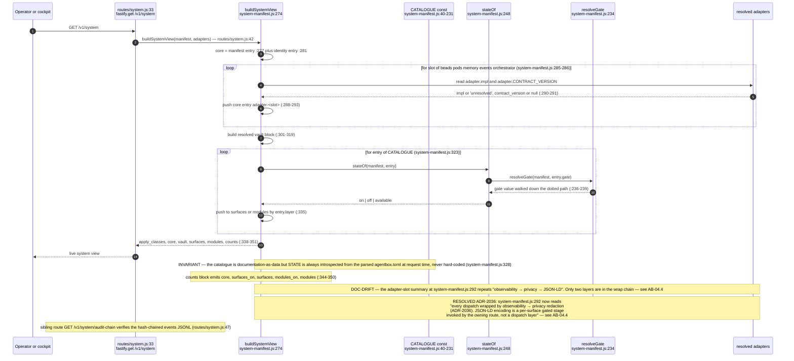
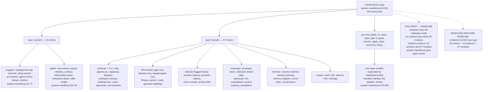
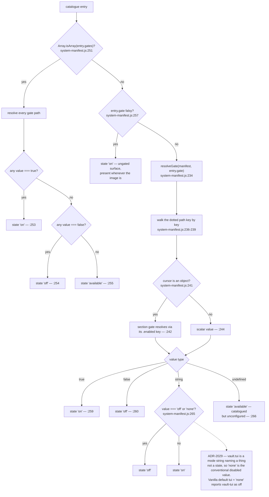
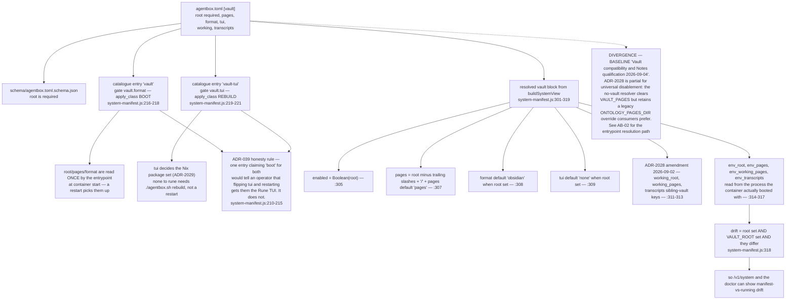
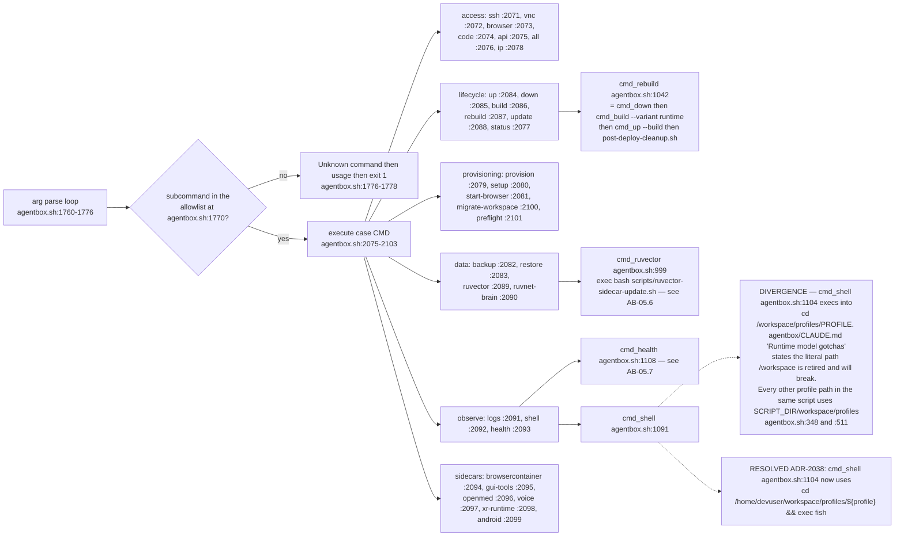
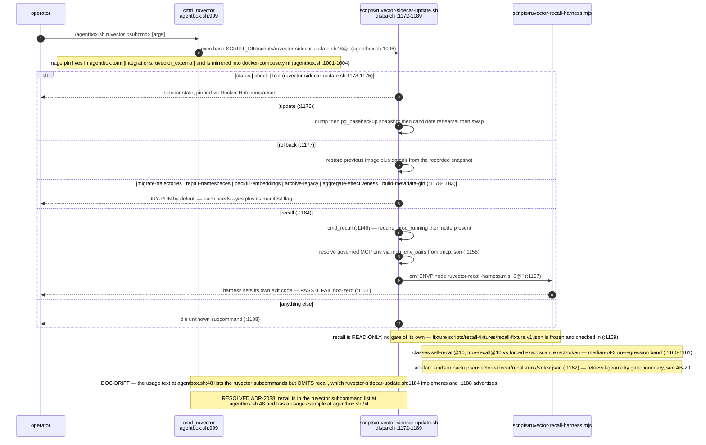
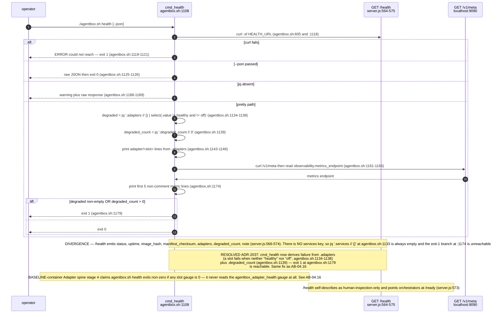
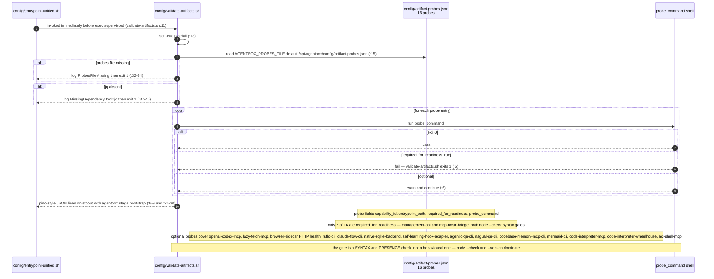
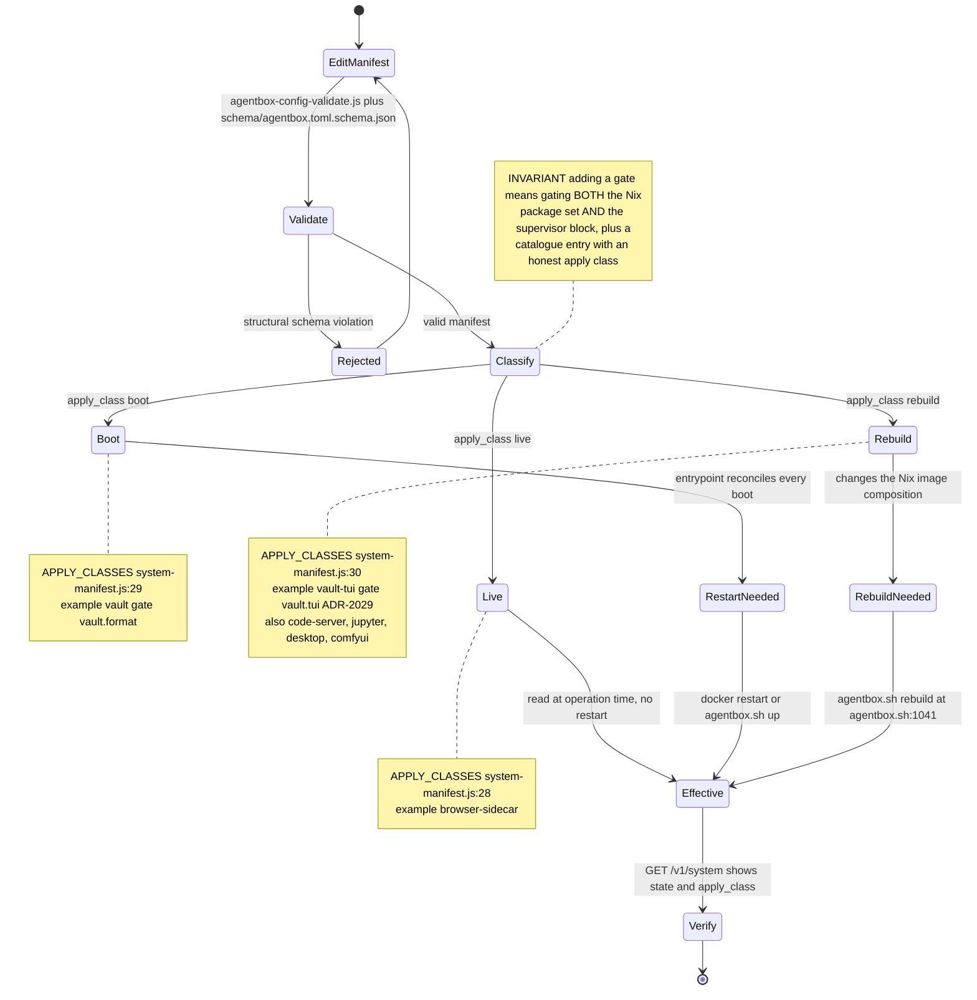
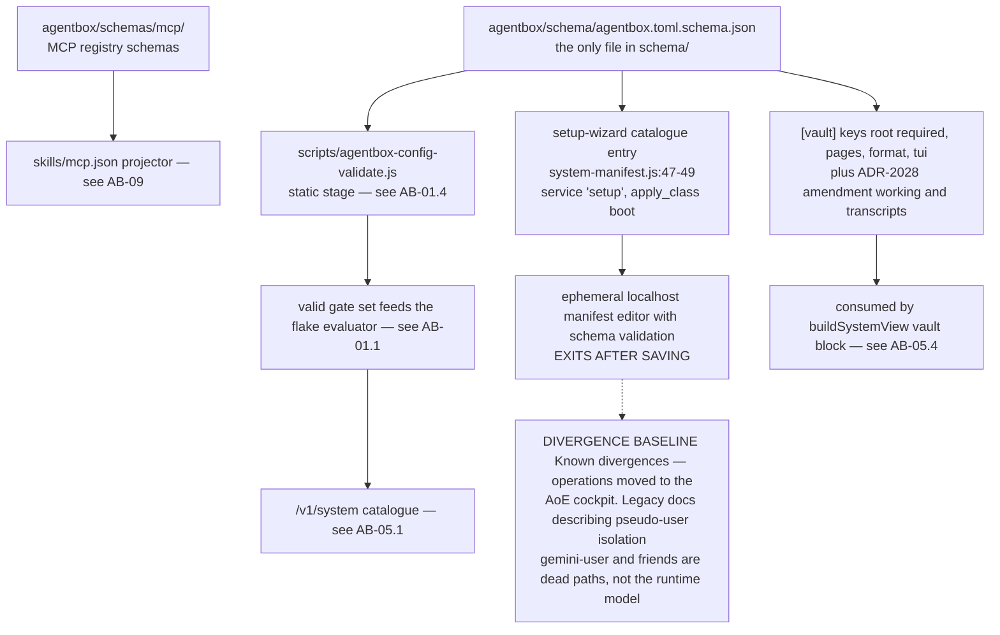

## AB-05.1 GET /v1/system — catalogue plus live introspection

## AB-05.2 Catalogue shape and the real surface/module census

## AB-05.3 stateOf — how a gate value becomes a state word

## AB-05.4 [vault] — the single corpus path authority, catalogued as two entries

## AB-05.5 agentbox.sh top-level subcommand dispatch

## AB-05.6 agentbox.sh ruvector — a dispatch table split across two files

## AB-05.7 agentbox.sh health — exit-code contract

## AB-05.8 Artifact validation gate — the last check before exec supervisord

## AB-05.9 Apply-class as an operator decision procedure

## AB-05.10 Schema surfaces and the setup wizard boundary

