## AB-10.1 Door inventory and port topology

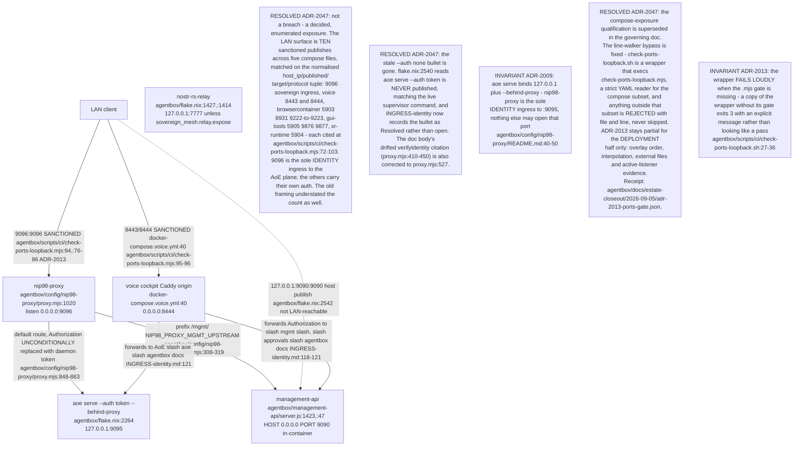

## AB-10.2 proxy.mjs boot sequence — config, routes, verifier load

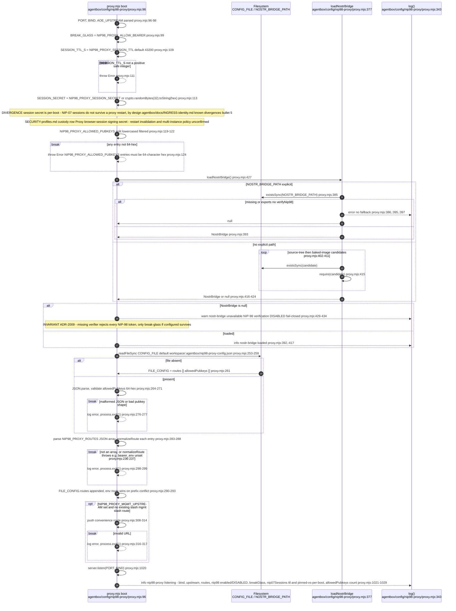

## AB-10.3 verifyIdentity — full auth precedence

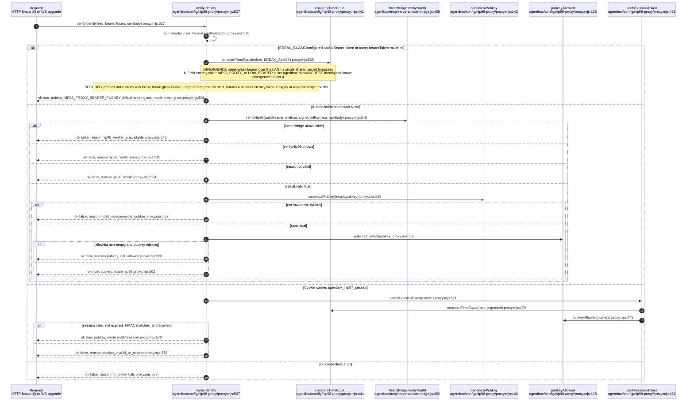

## AB-10.4 verifyNip98 internals — header, tags, payload, signature, replay

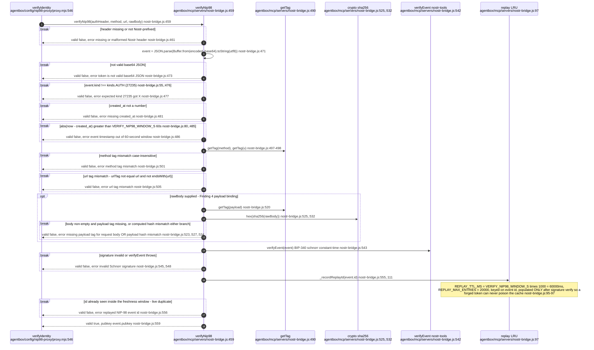

## AB-10.5 Request auth state machine

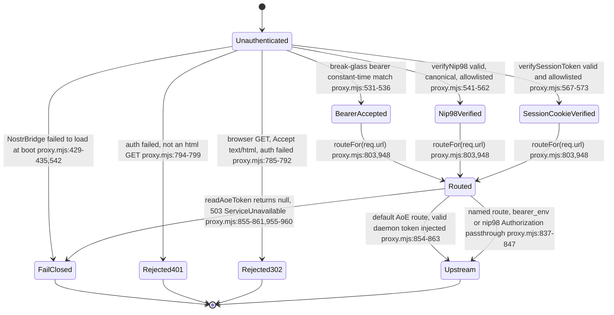

## AB-10.6 AoE board door — default upstream, daemon-token replacement

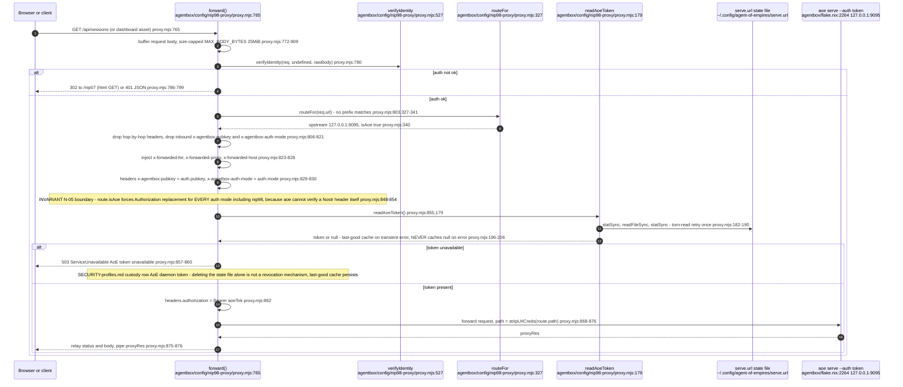

## AB-10.7 /mgmt/* router door — bearer_env gated behind NIP-98

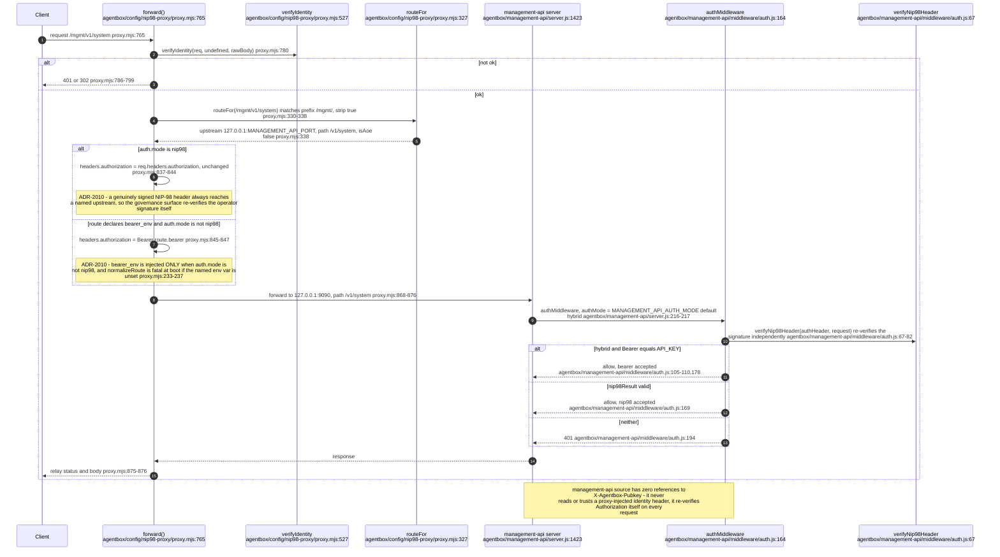

## AB-10.8 NIP-07 browser session handshake

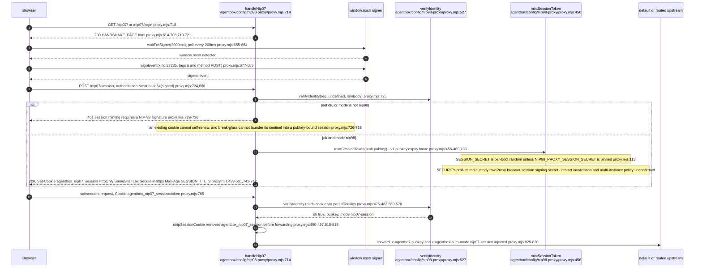

## AB-10.9 WebSocket upgrade auth path

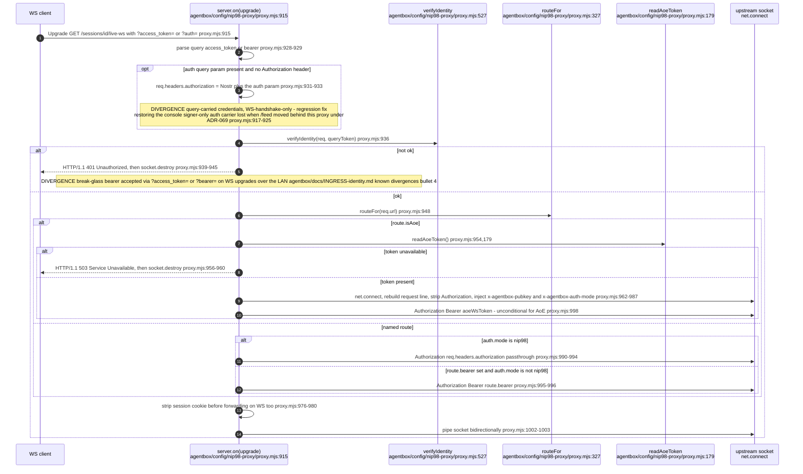

## AB-10.10 Direct :9090 path vs proxied :9090 path

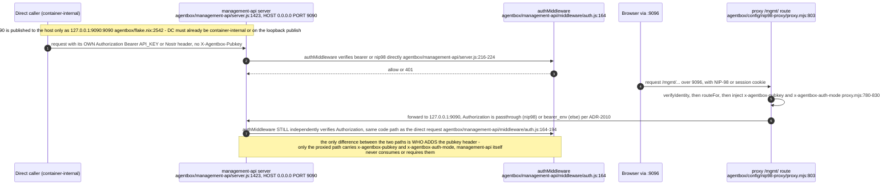

## AB-10.11 Direct :9095 token-bearing consumer — nostr-gateway aoeRequest

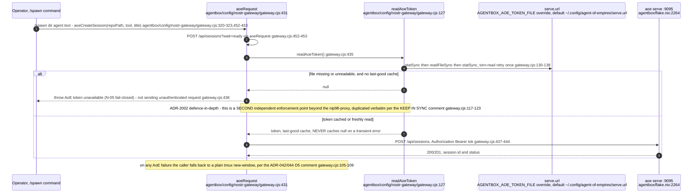

## AB-10.12 selftest.mjs assertion families

```mermaid
flowchart TB
    HARNESS["selftest.mjs harness<br/>agentbox/config/nip98-proxy/selftest.mjs:271 main()"]
    PUT["proxy.mjs under test<br/>plus separate child processes for boot-config-specific cases"]
    FAKE["fake AoE, mgmt and governance upstreams"]
    A["A - no credentials, 401<br/>selftest.mjs:308"]
    B["B - break-glass bearer, 200, identity injected, Authorization stripped<br/>selftest.mjs:314"]
    C["C - valid NIP-98, 200, skips gracefully if nostr-tools unresolvable<br/>selftest.mjs:336"]
    D["D - WebSocket upgrade, forwarded with injected identity<br/>selftest.mjs:365"]
    E["E - routed prefix ADR-045, mgmt on second upstream, unrouted falls through<br/>selftest.mjs:417"]
    F["F - NIP-07 sessions, handshake page, redirect, cookie auth, strip, forged/expired reject<br/>selftest.mjs:451"]
    G["G - spoofed identity headers stripped and replaced, ADR-2009<br/>selftest.mjs:550"]
    H["H - verifier faults, absent/throwing/non-canonical, zero upstream contact, ADR-2009/2011<br/>selftest.mjs:598"]
    I["I - allowlist removal denies the next request, including a live session, ADR-2009<br/>selftest.mjs:689"]
    J["J - cookie expiry and restart under a rotated HMAC key, rejected<br/>selftest.mjs:730"]
    K["K - tokenless denial, AoE daemon token NOT injected, ADR-2002<br/>selftest.mjs:759"]
    L["L - bearer gated behind NIP-98 on a named route, ADR-2010<br/>selftest.mjs:781"]
    M["M - hex-canonical identity helper, 0600 key file, restart stability, ADR-2011 (see AB-11)<br/>selftest.mjs:870"]
    N1["45 assertions pass with no skips when NODE_PATH resolves nostr-tools - README.md:189-206"]

    HARNESS --> PUT
    HARNESS --> FAKE
    PUT --> FAKE
    HARNESS -.-> A
    HARNESS -.-> B
    HARNESS -.-> C
    HARNESS -.-> D
    HARNESS -.-> E
    HARNESS -.-> F
    HARNESS -.-> G
    HARNESS -.-> H
    HARNESS -.-> I
    HARNESS -.-> J
    HARNESS -.-> K
    HARNESS -.-> L
    HARNESS -.-> M
```

