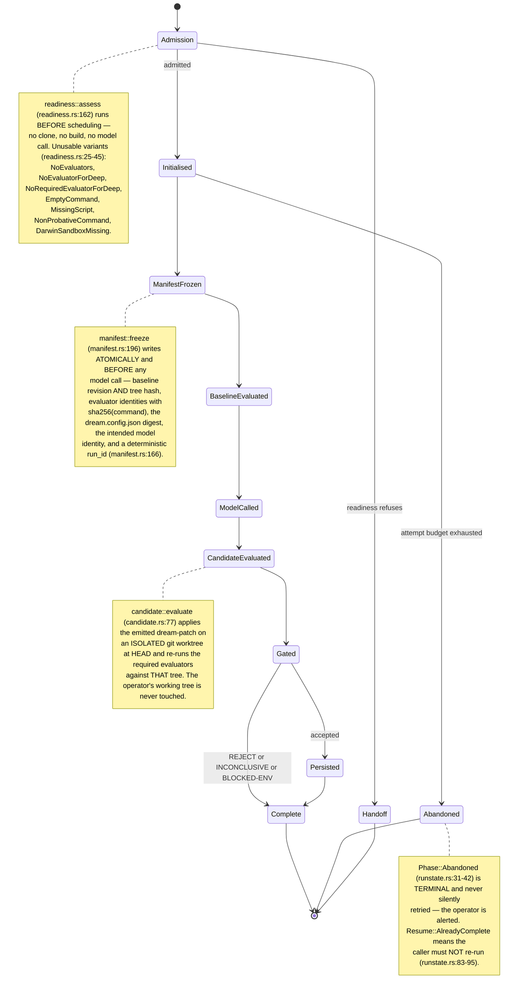
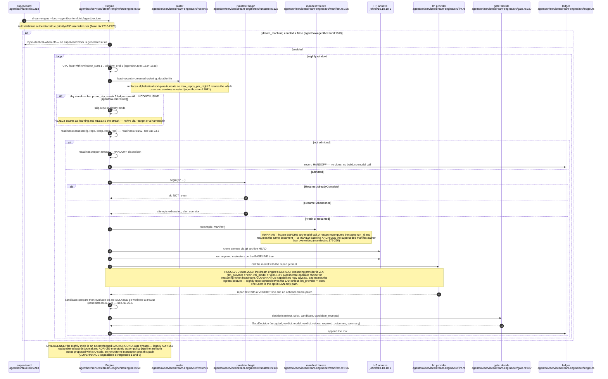
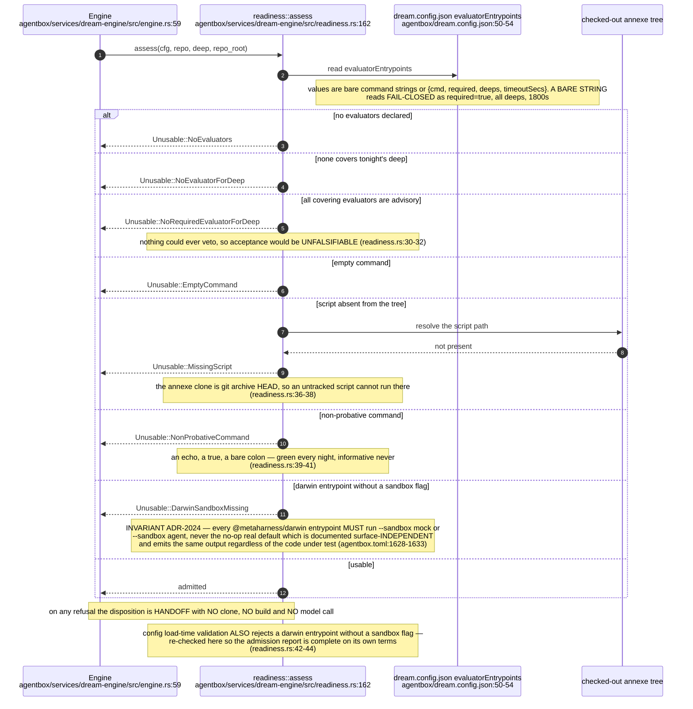
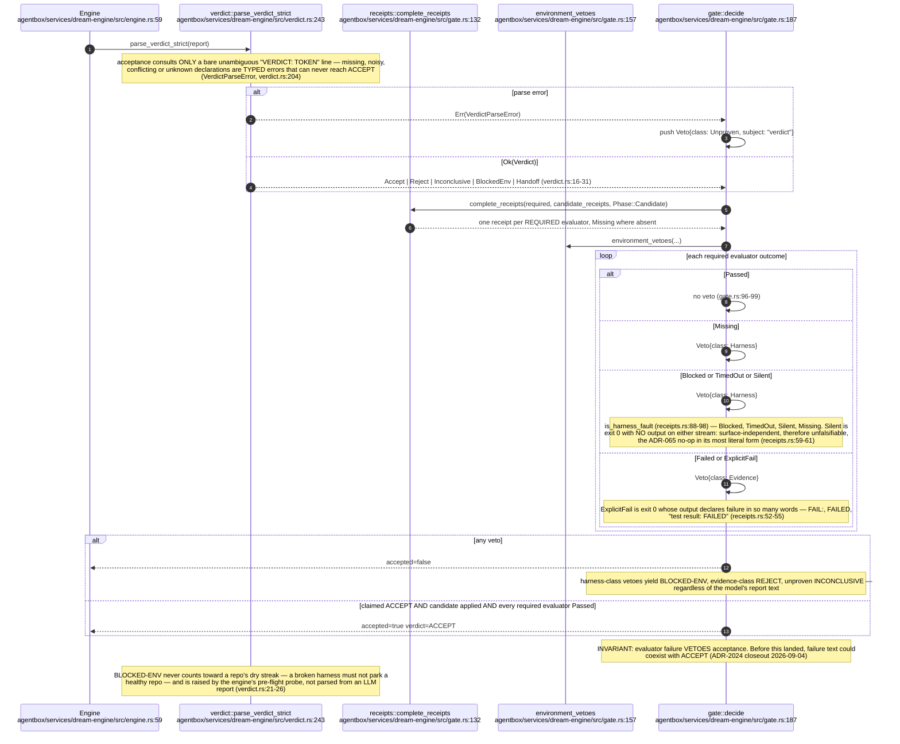
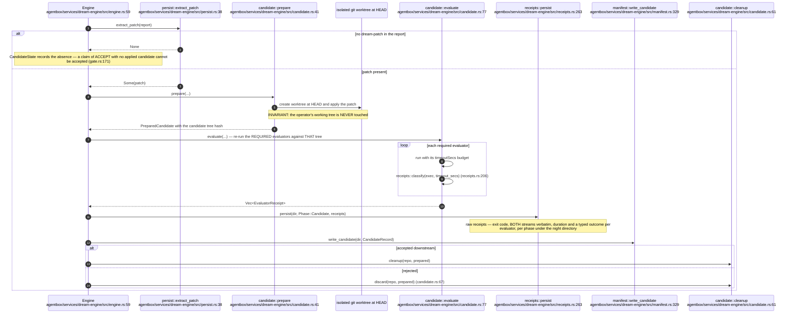
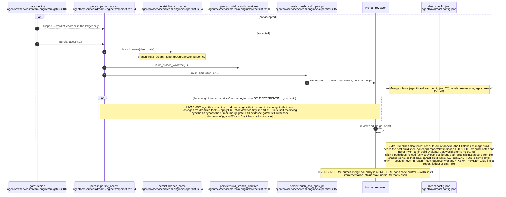
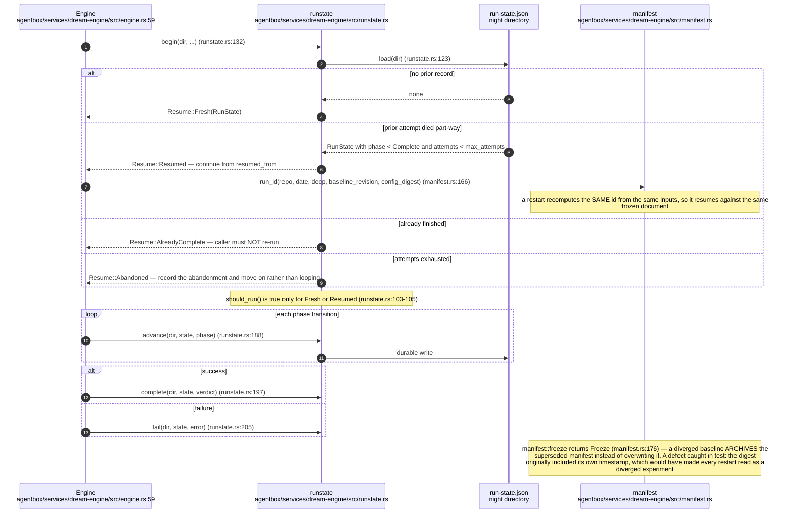
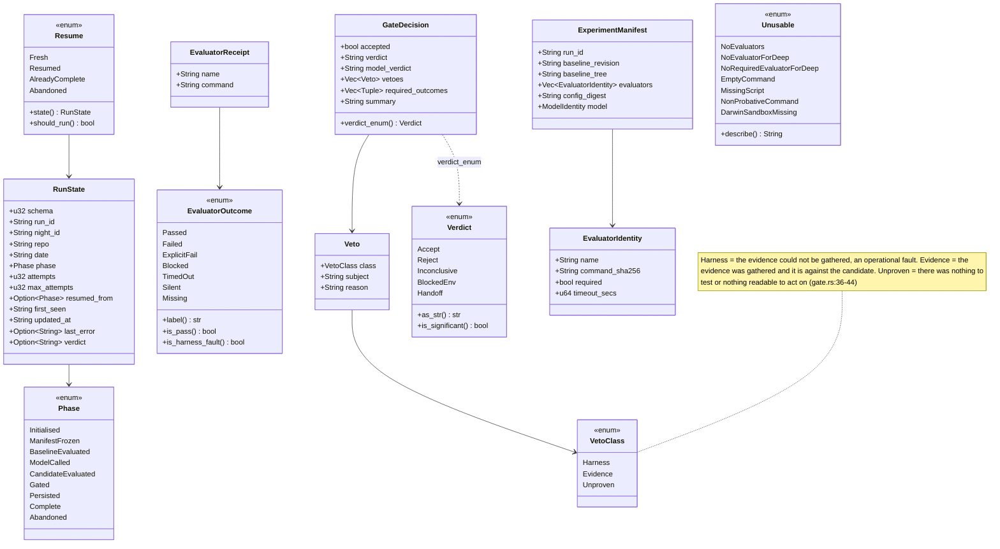
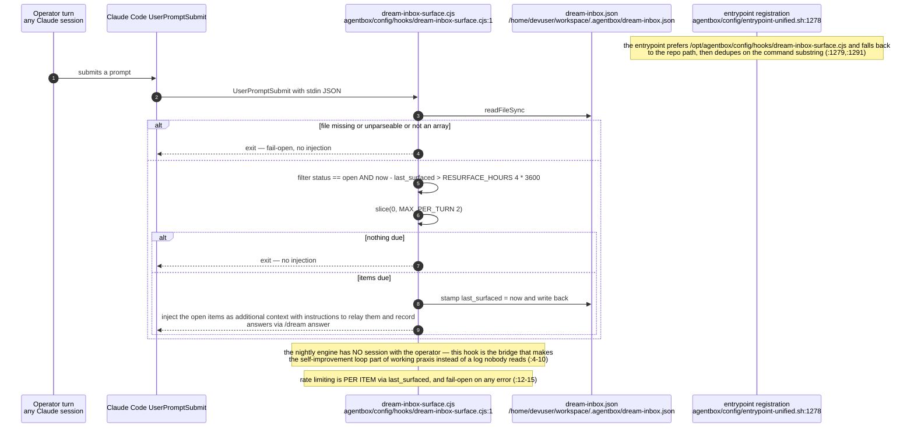
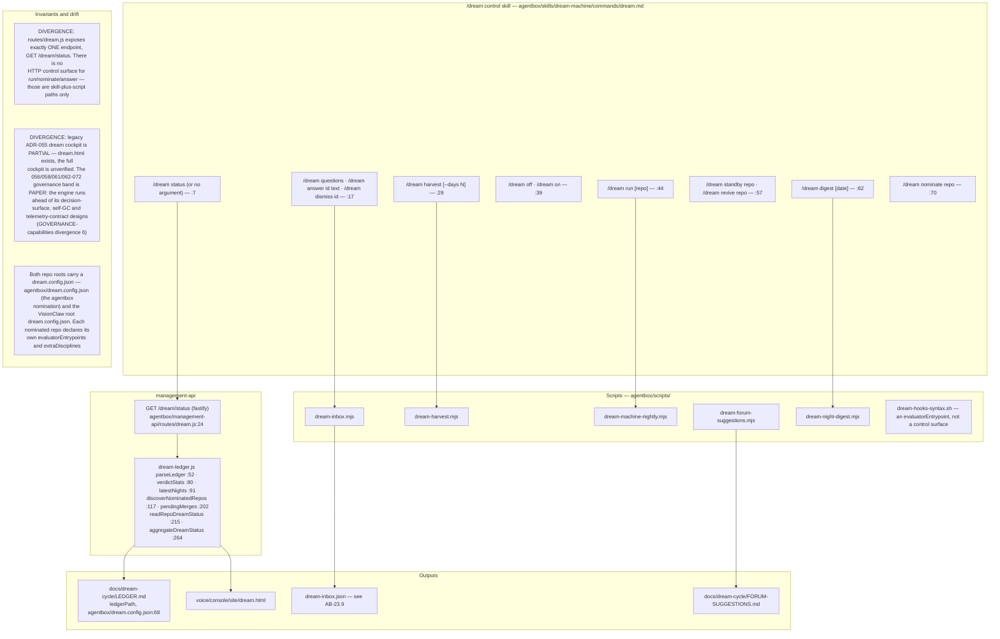

## AB-23.1 One repo-night — run phases

## AB-23.2 Nightly cycle — every gate as a branch

## AB-23.3 Evaluator-readiness admission — refusal before scheduling

## AB-23.4 The deterministic required-check gate

## AB-23.5 Candidate re-evaluation on an isolated worktree

## AB-23.6 Persistence and the human merge gate

## AB-23.7 Run journal — restart, resume and abandonment

## AB-23.8 Core types

## AB-23.9 Dream-inbox surfacing hook

## AB-23.10 Control and reporting surfaces

