## VC-02.1 Supervision-tree topology — AppState::new boot order
```mermaid
flowchart TB
    APP["AppState::new<br/>src/app_state.rs:410"]
    CC["ClientCoordinatorActor<br/>src/app_state.rs:709<br/>Addr~ClientCoordinatorActor~"]
    AB["AgentBeamActor<br/>src/app_state.rs:719<br/>no Addr held — hub-subscription lifetime"]
    MD["MetadataActor<br/>src/app_state.rs:802<br/>Addr~MetadataActor~"]
    GSS["GraphServiceSupervisor<br/>src/app_state.rs:807-809<br/>Addr~GraphServiceSupervisor~"]
    REBIND["SetClientCoordinatorAddr<br/>src/app_state.rs:818"]
    GPU["GPUManagerActor boundary<br/>src/app_state.rs:965<br/>Note: GPU internals see VC-10"]
    SPA["gpu::ShortestPathActor<br/>src/app_state.rs:969<br/>Addr~ShortestPathActor~"]
    CCA["gpu::ConnectedComponentsActor<br/>src/app_state.rs:970<br/>Addr~ConnectedComponentsActor~"]
    SET["OptimizedSettingsActor<br/>src/app_state.rs:1170<br/>Addr~OptimizedSettingsActor~"]
    AM["AgentMonitorActor<br/>src/app_state.rs:1193<br/>Addr~AgentMonitorActor~"]
    PS["ProtectedSettingsActor<br/>src/app_state.rs:1206<br/>Addr~ProtectedSettingsActor~"]
    WS["WorkspaceActor<br/>src/app_state.rs:1209<br/>Addr~WorkspaceActor~"]
    ONT["OntologyActor<br/>src/app_state.rs:1222<br/>Option~Addr~OntologyActor~~"]
    TO["TaskOrchestratorActor<br/>src/app_state.rs:1272<br/>Addr~TaskOrchestratorActor~"]
    EL["ElevationActor<br/>src/app_state.rs:1292<br/>anon start — no Addr retained"]
    VI["VoiceInterfaceActor<br/>src/app_state.rs:1308<br/>anon start — no Addr retained"]
    DE["DecisionElevationActor<br/>src/main.rs:541<br/>started OUTSIDE AppState::new"]

    APP --> CC
    CC --> AB
    CC -.->|"rebind"| REBIND
    AB --> MD
    MD --> GSS
    GSS -.->|"do_send"| REBIND
    GSS --> GPU
    GPU --> SPA
    SPA --> CCA
    CCA --> SET
    SET --> AM
    AM --> PS
    PS --> WS
    WS --> ONT
    ONT --> TO
    TO --> EL
    EL --> VI
    VI -.->|"same process, later in main()"| DE

    N1["INVARIANT (BASELINE Invariants) — the live ClientCoordinatorActor clients register<br/>with must be the CC instance above, not GraphServiceSupervisor's own child.<br/>REBIND at :818 makes GSS forward broadcasts through CC's non-empty registry."]
    REBIND --- N1
```

## VC-02.2 GraphServiceSupervisor::initialize_actors — child start order and wiring
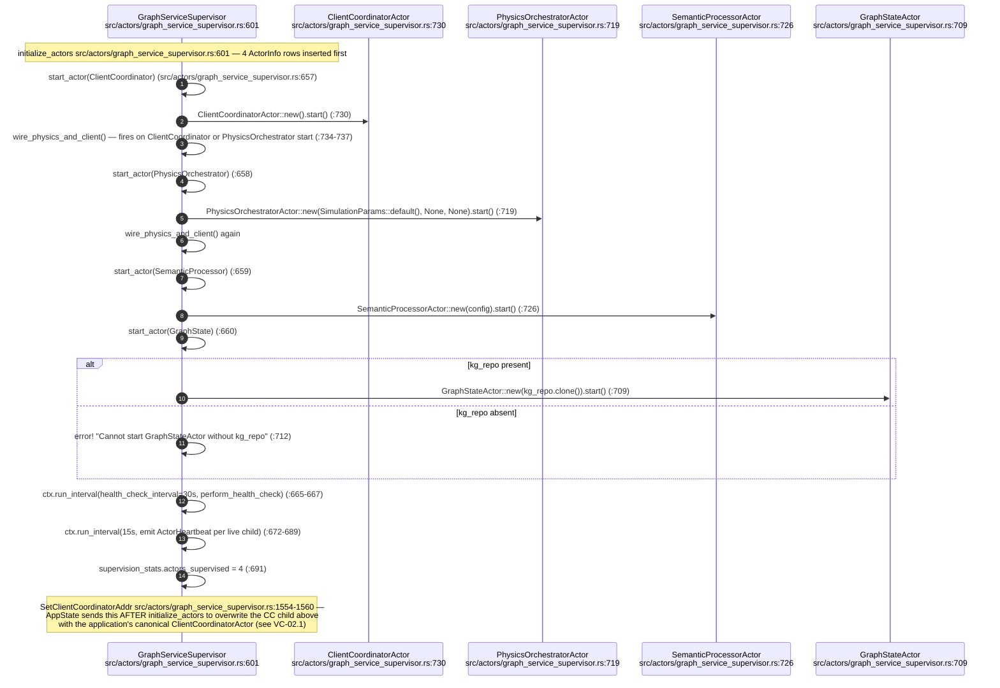

## VC-02.3 GraphServiceSupervisor message routing table
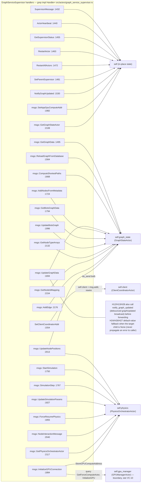

## VC-02.4 Generic SupervisorActor (src/actors/supervisor.rs) restart/backoff lifecycle
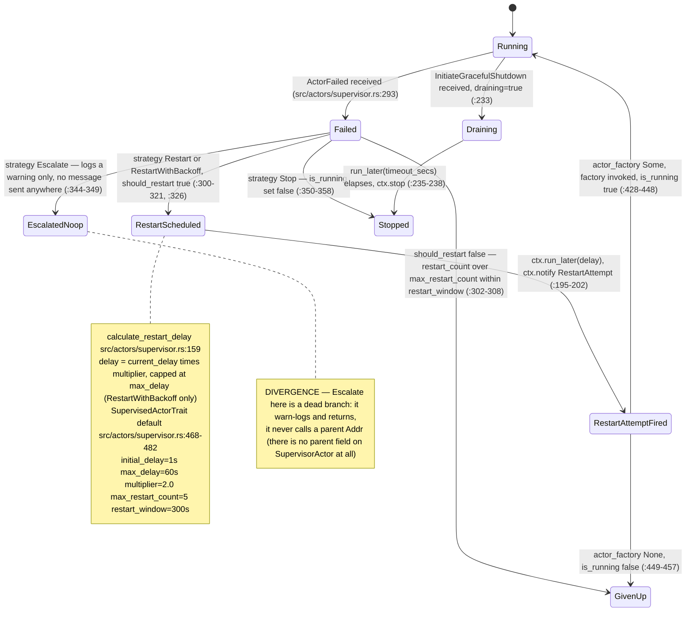

## VC-02.5 Generic SupervisorActor restart sequence — failure to give-up
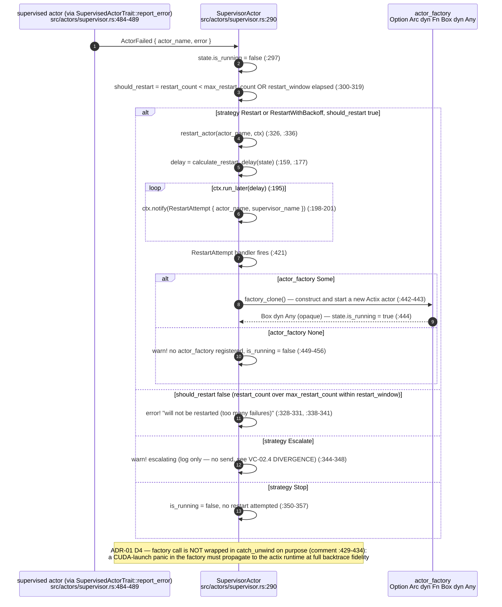

## VC-02.6 Drain and shutdown — supervisor.rs InitiateGracefulShutdown, GraphServiceSupervisor stop, and lifecycle.rs
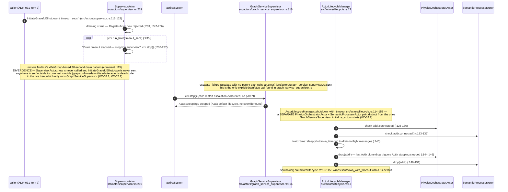

## VC-02.7 DIVERGENCE — lifecycle.rs's ActorLifecycleManager is dead code
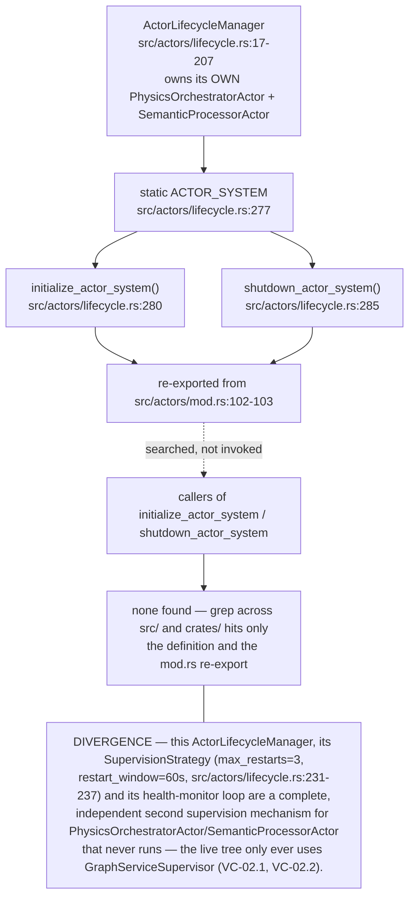

## VC-02.8 event_coordination.rs — coordination event publish/consume (ADR-2007 partial)
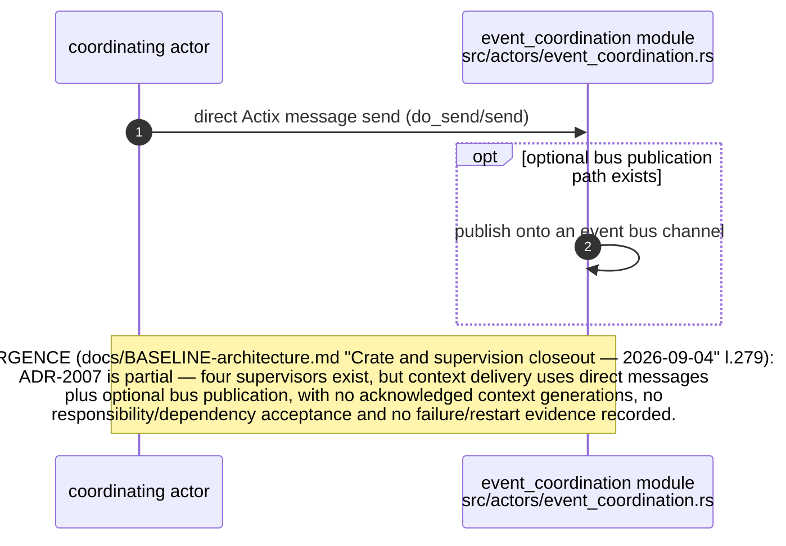

## VC-02.9 Message catalogue — client_messages, graph_messages, broadcast_messages
```mermaid
classDiagram
    class ClientCoordinatorActor {
      <<actor>>
      src/actors/client_coordinator_actor.rs
    }
    class RegisterClient {
      +ClientRecipients recipients
      result() Result~usize,String~
    }
    class ClientRecipients {
      +Recipient~SendToClientBinary~ binary
      +Recipient~SendToClientText~ text
      +Recipient~SendInitialGraphLoad~ initial_load
    }
    class UnregisterClient {
      +usize client_id
    }
    class BroadcastMessage {
      +String message
    }
    class GraphServiceSupervisor {
      <<actor>>
    }
    class GetGraphData {
      result() Result~Arc,String~
    }
    class UpdateGraphData {
      +Arc~ServiceGraphData~ graph_data
      result() Result~(),String~
    }
    class UpdateNodePositions {
      +List~u32,BinaryNodeData~ positions
      +Option~MessageId~ correlation_id
      result() Result~(),String~
    }
    class AddNodesFromMetadata {
      +MetadataStore metadata
      result() Result~(),String~
    }
    class AddEdge {
      +Edge edge
      result() Result~(),String~
    }
    class NodeInteractionMessage {
      +u32 node_id
      +NodeInteractionType interaction_type
      +Option~List~f32~~ position
      result() Result~(),VisionClawError~
    }
    RegisterClient *-- ClientRecipients
    ClientCoordinatorActor ..> RegisterClient
    ClientCoordinatorActor ..> UnregisterClient
    ClientCoordinatorActor ..> BroadcastMessage
    GraphServiceSupervisor ..> GetGraphData
    GraphServiceSupervisor ..> UpdateGraphData
    GraphServiceSupervisor ..> UpdateNodePositions
    GraphServiceSupervisor ..> AddNodesFromMetadata
    GraphServiceSupervisor ..> AddEdge
    GraphServiceSupervisor ..> NodeInteractionMessage
    note for GetGraphData "src/actors/messages/ — RegisterClient/UnregisterClient/BroadcastMessage\nowned by client_coordinator_actor.rs consumer; Result types confirmed from\nHandler impls at graph_service_supervisor.rs:1495,1694,2013,1724,2176,2040"
```

## VC-02.10 Message catalogue — supervision and heartbeat messages
```mermaid
classDiagram
    class GraphServiceSupervisor {
      <<actor>>
    }
    class SupervisorMessage {
      <<enum>>
      UpdateGraphData
      ReloadGraphFromDatabase
      StartSimulation
      StopSimulation
      SimulationStep
      UpdateSimulationParams
      UpdateNodePositions
      BroadcastMessage
      result() Result~(),VisionClawError~
    }
    class ActorHeartbeat {
      +ActorType actor_type
      +Instant timestamp
      +ActorHealth health
      +Option~ActorStats~ stats
    }
    class GetSupervisorStatus {
      result() SupervisorStatus
    }
    class RestartActor {
      +ActorType actor_type
      result() Result~(),VisionClawError~
    }
    class RestartAllActors {
      result() Result~(),VisionClawError~
    }
    class SetParentSupervisor {
      +Addr~SupervisorActor~ parent
    }
    class SetClientCoordinatorAddr {
      +Addr~ClientCoordinatorActor~ addr
    }
    class NotifyGraphUpdated {
      +str reason
    }
    class ActorFailed {
      +String actor_name
      +VisionClawError error
    }
    GraphServiceSupervisor ..> SupervisorMessage
    GraphServiceSupervisor ..> ActorHeartbeat
    GraphServiceSupervisor ..> GetSupervisorStatus
    GraphServiceSupervisor ..> RestartActor
    GraphServiceSupervisor ..> RestartAllActors
    GraphServiceSupervisor ..> SetParentSupervisor
    GraphServiceSupervisor ..> SetClientCoordinatorAddr
    GraphServiceSupervisor ..> NotifyGraphUpdated
    GraphServiceSupervisor ..> ActorFailed
    note for SetClientCoordinatorAddr "src/actors/graph_service_supervisor.rs:1550-1560 —\nfield and handler both confirmed by direct read"
```

## VC-02.11 GraphStateActor — representative read and write sequence
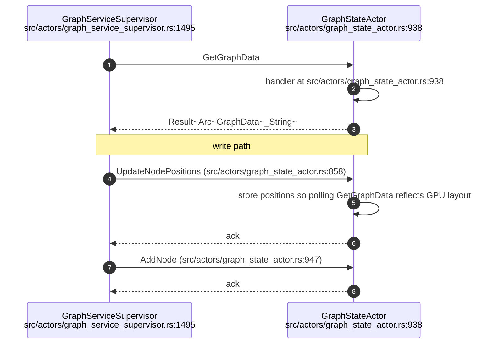

## VC-02.12 PhysicsOrchestratorActor — handled messages and broadcast invariant
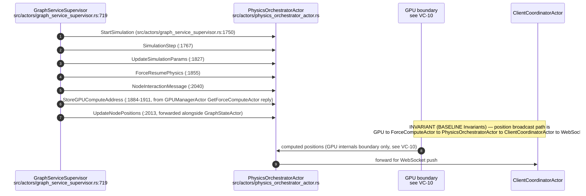

## VC-02.13 ClientCoordinatorActor + client_filter.rs — actor-side message surface
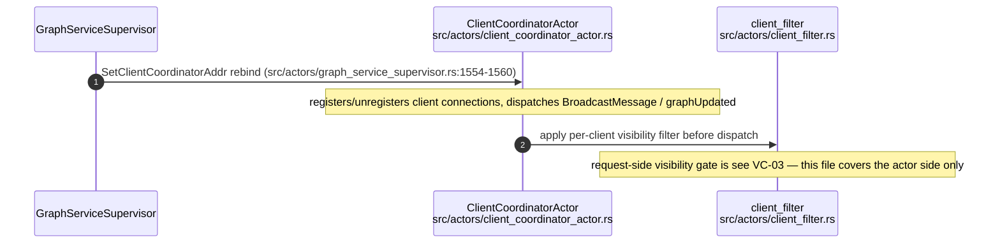

## VC-02.14 MetadataActor and OntologyActor — message surfaces
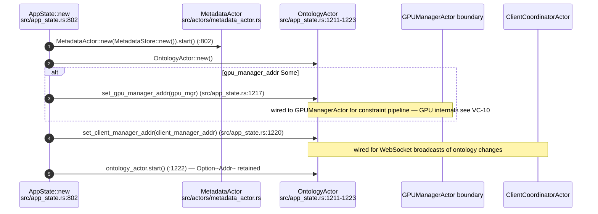

## VC-02.15 SemanticProcessorActor and OptimizedSettingsActor — message surfaces
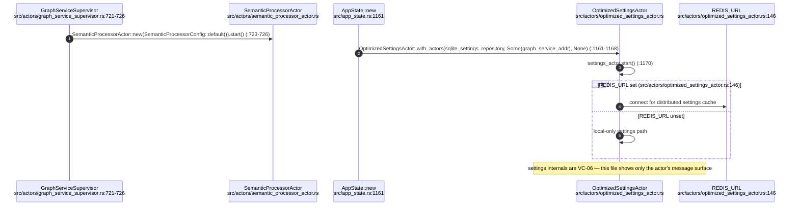

## VC-02.16 ProtectedSettingsActor and WorkspaceActor — message surfaces
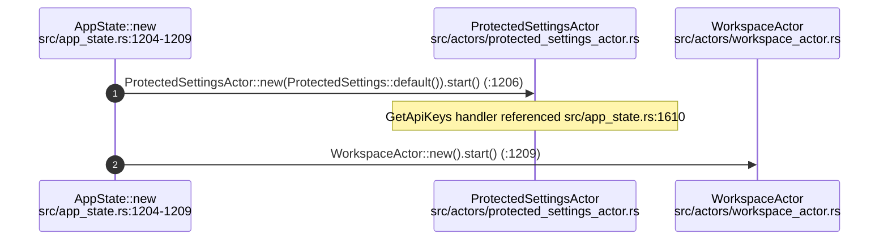

## VC-02.17 PresenceActor and TaskOrchestratorActor — message surfaces
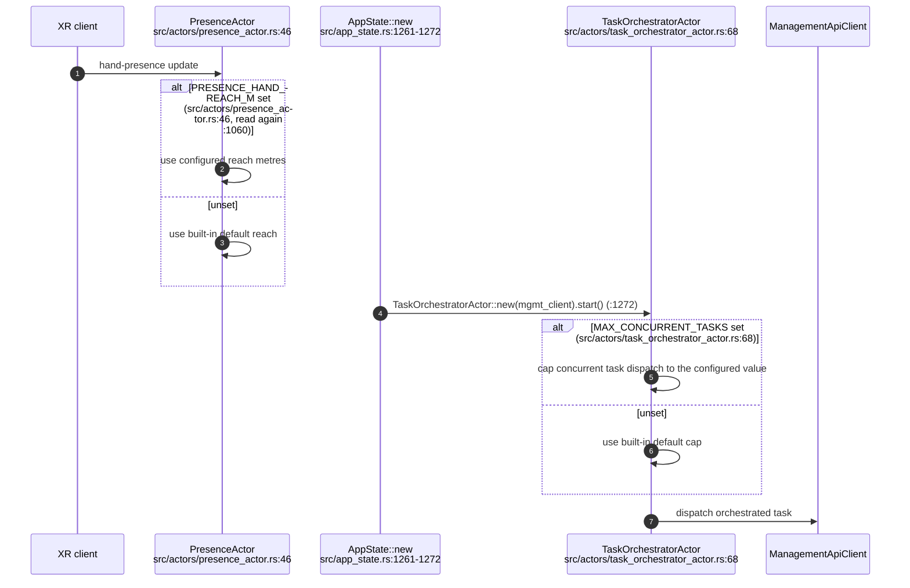

## VC-02.18 ElevationActor (+ elevation_voice.rs) and DecisionElevationActor
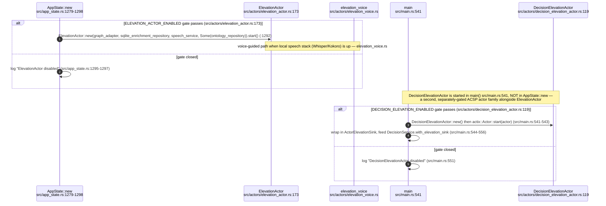

## VC-02.19 VoiceInterfaceActor (+ voice_commands.rs) and MultiMcpVisualizationActor
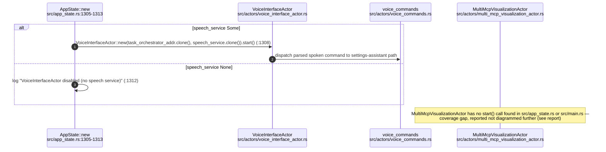

## VC-02.20 AgentMonitorActor and AgentBeamActor — message surfaces
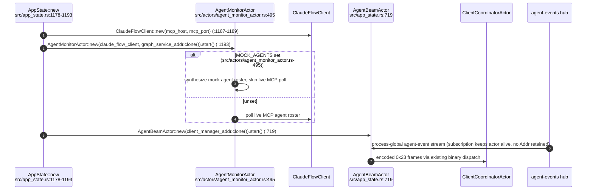
