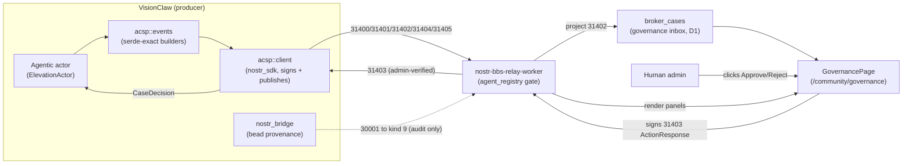
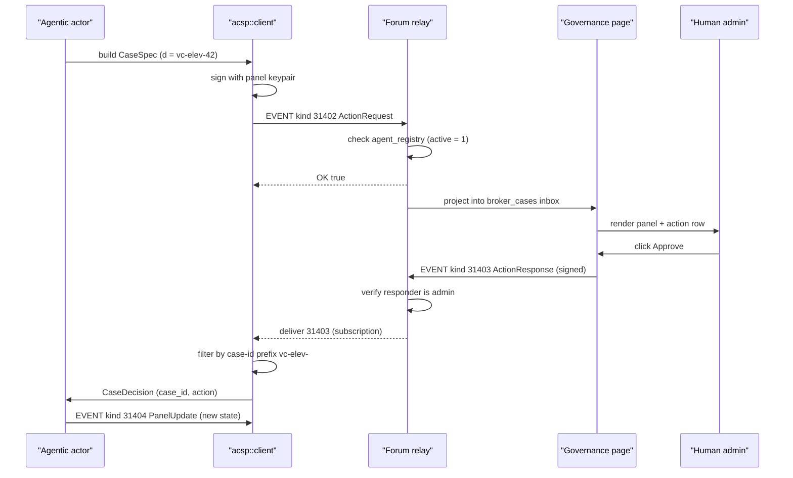

# Agent Control Surface

> [VisionClaw Docs](../README.md) · [Explanation](README.md)

When a VisionClaw agentic actor needs a human to make a decision, or wants to
expose live operational state for the team to watch, it does not invent a
private REST approval endpoint. It speaks the **Agent Control Surface Protocol
(ACSP)** — a fixed set of Nostr event kinds (**31400-31405**) that render as
interactive control panels on the DreamLab forum governance page
(`/community/governance`). VisionClaw is an ACSP **producer**: the code lives in
`src/services/acsp/`, emits the agent-side kinds, and listens for the one
human-side kind that comes back signed.

This page explains the model, the kind vocabulary, and the decision loop. The
exact wire schema (per-kind JSON, the `field_type` catalogue, dos and don'ts) is
owned by the agentbox subsystem and is **not duplicated here** — see the
[agentbox producer reference](../../agentbox/docs/developer/agent-control-surface-panels.md).
The governing decision is [ADR-110](../adr/ADR-110-agentic-actors-acsp-control-surfaces.md).

## Why a protocol instead of an endpoint

Three forces pushed VisionClaw onto a shared protocol rather than a bespoke
approval surface:

- **One governance surface for the whole mesh.** Decisions for agent work
  happen where the team already governs — the forum — instead of behind a
  per-actor API the team never sees.
- **Signed, attributable, durable decisions.** Every request and every response
  is a Schnorr-signed Nostr event. The responder is a known admin pubkey; the
  decision is replayable audit history, not a transient HTTP 200.
- **The consumer pipeline already exists.** The forum relay accepts the agent
  kinds from registry-listed pubkeys, projects requests into a governance inbox,
  and renders panels via the forum client. The only missing piece was a
  producer — which is exactly what ADR-110 ships.

The rejected alternative was extending VisionClaw's existing
`enrichment-proposals` REST path. That would have created a second, private
approval queue with a different identity model from the rest of the substrate,
and every new actor would need fresh endpoints and UI. ACSP gives each actor a
custom control surface for free.

## The two Nostr egress paths are not the same thing

VisionClaw publishes to Nostr through **two independent paths** with different
keys, kinds, and failure semantics. Conflating them is the most common source of
confusion, so state the boundary plainly:

| Path | Module | Kinds | Purpose | Decision-bearing? |
|------|--------|-------|---------|-------------------|
| **ACSP control surface** | `src/services/acsp/` | 31400-31405 | Interactive governance panels and human sign-off | Yes — 31402 asks, 31403 answers |
| **Bead-provenance bridge** | `src/services/nostr_bridge.rs` | 30001 → kind 9 (NIP-29 group message) | Audit trail of agent activity into a forum group | No — it has no actions, no inbox, no response kind |

The bead bridge is an audit log. It records what happened; it cannot *ask* for
anything and nothing can answer it. ACSP is the human-in-the-loop seam. Do not
extend `nostr_bridge.rs` to emit panels — provenance forwarding and panel
production have different keys, different kinds, and different failure modes.

## The kind vocabulary (31400-31405)

ACSP is six Nostr event kinds. All are NIP-33 parameterised-replaceable: each
carries a non-empty `["d", panelId]` tag, and re-publishing the same
`(kind, pubkey, d)` triple replaces the prior event. Five are produced by the
agent; one (31403) is produced **only** by a human admin through the forum UI.

| Kind | Name | Producer | Role |
|------|------|----------|------|
| **31400** | `PanelDefinition` | Agent | Declare a control panel — schema, fields, actions, layout |
| **31401** | `PanelState` | Agent | Publish the full current panel data snapshot |
| **31402** | `ActionRequest` | Agent | Open a broker case requesting a human decision (governance inbox) |
| **31403** | `ActionResponse` | **Human admin only** | Approve/reject an action request; the relay rejects this kind from any non-admin pubkey |
| **31404** | `PanelUpdate` | Agent | Incremental state diff, shallow-merged into the last 31401 snapshot |
| **31405** | `PanelRetired` | Agent | Retire a panel (empty content, `d` tag only); removed from the page |

The kind constants are mirrored in `src/services/acsp/events.rs`
(`KIND_PANEL_DEFINITION = 31400` … `KIND_PANEL_RETIRED = 31405`). The Rust
structs (`PanelDefinition`, `ActionRequest`, `ActionResponse`, plus the
`FieldDef`/`ActionDef`/`CaseSpec` vocabularies) are serde-exact mirrors of the
consumer structs in nostr-rust-forum's `governance.rs`, with round-trip tests
locking the wire shapes against the agentbox reference examples.

A few invariants matter at the architecture level, even though the byte-level
detail belongs to the agentbox reference:

- **Content keys are snake_case** (`field_type`, `refresh_secs`, `context_url`);
  **enum values are kebab-case** (`action-inbox`, `inbox-table`, `primary`).
- **31402 broker-case metadata travels in tags, not content.** Priority,
  category, subject kind, subject id and title are projected into the
  `broker_cases` inbox straight from tags — the relay never parses the content
  to find them. Putting priority in content silently produces a `medium`
  default.
- **Strict serde fails silently.** An unknown enum value or a camelCase key
  makes the consumer drop the panel, while the relay still answers `OK true`.
  "Relay accepted it but no panel appears" almost always means a content shape
  error.

## Pipeline topology

Four hops, each with a single responsibility:

1. **Producer** — `src/services/acsp/` plus the owning actor build and sign the
   agent kinds and publish them to `FORUM_RELAY_URL`.
2. **Relay** — `nostr-bbs-relay-worker` accepts the agent kinds **only** from
   pubkeys present (and `active = 1`) in its `agent_registry` D1 table, rejecting
   others with `OK false "blocked: pubkey not in agent registry"`. It projects
   31402 events into the `broker_cases` governance inbox and treats 31403 as
   admin-only.
3. **Consumer** — `nostr-bbs-forum-client` (`panel_registry` + `GovernancePage`)
   strict-serde parses content and renders panels and action rows at
   `/governance`.
4. **Website** — `dreamlab-ai-website` serves the forum SPA under
   `/community/`, so panels surface at `/community/governance`.

## The decision loop

The interesting part of ACSP is the round trip: an agent opens a case, a human
answers it, and the answer is routed back to exactly the actor that asked. The
producer is publish-only plus **one** long-lived subscription — it adds no new
inbound HTTP surface to VisionClaw.

The routing-back mechanism is namespace-by-`d`-tag. Each agentic actor owns a
**case-id prefix** (the elevation actor uses `vc-elev-`). `acsp::client` runs a
single kind-31403 subscription; `decision_from_event` accepts a response only
when its `d` tag starts with the owning actor's prefix, converts it into a
`CaseDecision { case_id, action, responder_pubkey }`, and hands it to that actor
over an mpsc channel. The relay's pool owns reconnection — the subscription is a
long-running task that reconnects with backoff, never connect-per-publish.

## The agentic-actor pattern

ACSP's `client` is shared infrastructure; actors **compose** it rather than
re-implementing transport. An agentic actor owns four things:

- a **panel id** (the NIP-33 `d` tag),
- a **case-id prefix** for routing decisions back to itself,
- its **panel definition** (kind 31400), and
- its **decision handler** (what to do when a `CaseDecision` arrives).

`ElevationActor` (`src/actors/elevation_actor.rs`) is the reference
implementation and the template for queued candidates — sync governance, physics
health, agent telemetry. It closes the informal-to-formal ontology loop:

- **Select** — rank unauthored `owl_class` frontier stubs by degree; cap open
  cases at five; keep a session skip-list for rejected candidates.
- **Draft** — generate a canonical Title Case page name and a JSON-LD Class
  block (`urn:ngm:class:<slug>`, majority domain inferred from referencing
  neighbours, `maturity: draft`).
- **Case** — open a `knowledge_enrichment` 31402 with an `automation_proposal`
  subject and fields carrying name/domain/definition/referenced-by/path — the
  custom control surface the reviewer needs.
- **Decide** — `approve` calls `GitHubPRService::create_ontology_pr`, committing
  the draft to the corpus repo as a reviewable PR (the existing sync ingests it
  on merge); `reject` skips. Panel state updates after every transition.

Voice is a first-class guide into this loop. Conversation inside the immersive
interface feeds a decaying demand ledger that ranks elevation candidates;
explicit commands ("elevate X", "formalise X") jump the queue and are confirmed
aloud through local Kokoro TTS. See ADR-110 §D3b for the speech path and its
intent gate.

## Identity and the registration gate

ACSP identity is `did:nostr:<hex-pubkey>` — the same mesh identity that bead
provenance uses. There is no API token: registration plus the Schnorr signature
on every event is the entire authorisation.

The one operational prerequisite is that the panel pubkey must be added to the
relay's `agent_registry` before any publish succeeds. The client logs the pubkey
at startup; a relay admin registers it via the NIP-98-gated
`POST /api/governance/agents/register`. Until then every publish is rejected with
`blocked: pubkey not in agent registry`. Signing uses a dedicated panel keypair
(`ACSP_PANEL_NOSTR_PRIVKEY`, falling back to `VISIONCLAW_NOSTR_PRIVKEY`) so that
panel production can be rate-limited and revoked independently of bead
provenance. The whole producer is env-gated — `FORUM_RELAY_URL` plus a signing
key present, with each actor behind its own flag (`ELEVATION_ACTOR_ENABLED=1`).

## See also

- [agentbox: Agent Control Surface Panels](../../agentbox/docs/developer/agent-control-surface-panels.md) — canonical wire schema (per-kind JSON, `field_type` catalogue, troubleshooting)
- [Actor Hierarchy](actor-hierarchy.md) — where agentic actors sit among the Actix actors
- [Ontology Pipeline](ontology-pipeline.md) — the elevation loop's corpus and OWL context
- [Subsystems](subsystems.md) — VisionClaw and agentbox as composed subsystems
- [Security Model](security-model.md) — identity, signing, and the registration gate in context
- [ADR-110: Agentic Actors Project Control Surfaces into the Forum (ACSP)](../adr/ADR-110-agentic-actors-acsp-control-surfaces.md) — the governing decision
