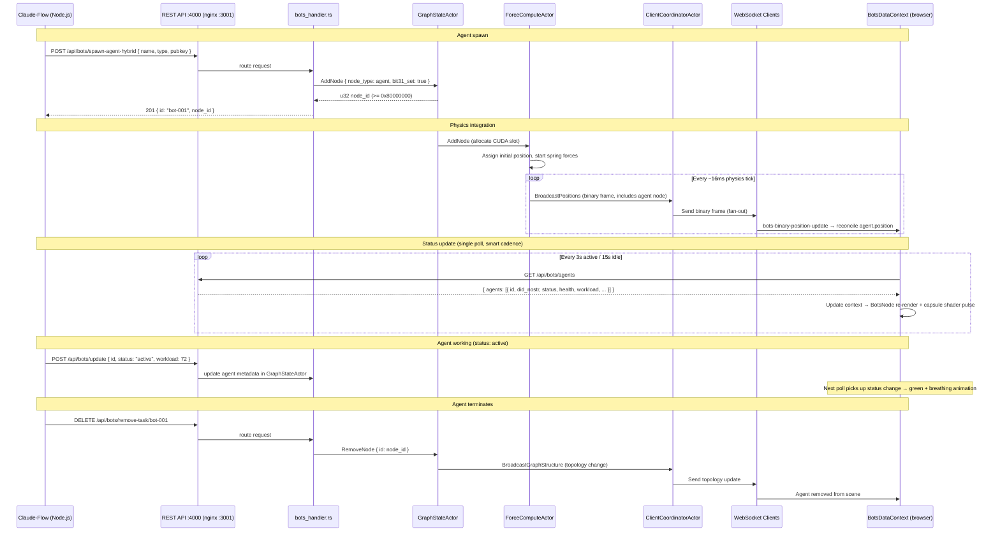
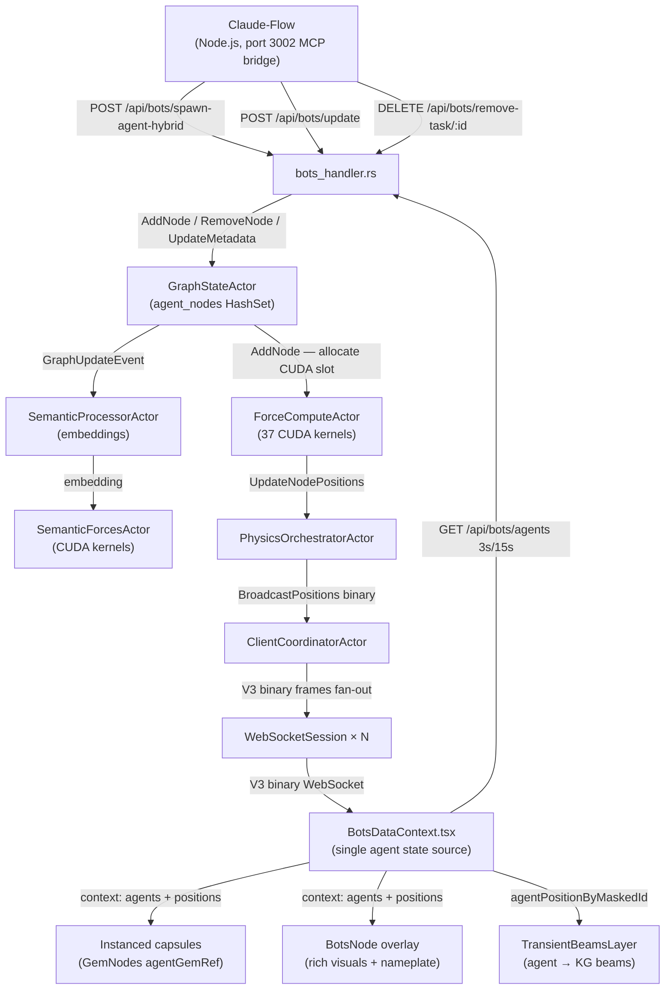

# Agent-to-Physics State Bridge

## Overview

Claude-Flow agents running in the Node.js multi-agent container are first-class citizens of the VisionClaw 3D graph. Every agent that registers with the backend becomes a graph node that participates in the GPU physics simulation alongside knowledge and ontology nodes. The backend assigns the agent node a position in 3D space, applies spring forces between it and related nodes, and streams that position to every connected WebSocket client at up to 60 FPS. When the agent changes status — spawning, executing, waiting, failing — the status field in its graph node metadata changes, and the client re-colours and re-animates the geometry accordingly.

This document explains the full stack: how agent identity is encoded in u32 node IDs, how the client maps agent telemetry to colour and animation, and what happens to physics when an agent node is added or removed mid-simulation.

### Consolidated client render architecture (2026-07)

Agent bodies render through **exactly two client layers**, from a **single state source**:

1. **Instanced agent capsules** — one `InstancedMesh` for the whole agent population, rendered by `GemNodes` (the `agentGemRef` population inside `GraphManager.tsx`) using `AgentCapsuleMaterial` (a TSL shader). Positions come from the shared server-physics position buffer (the `SharedArrayBuffer` / SAB the whole graph reads); the shader applies a canonical status→activity pulse so an idle swarm visibly rests while an active one visibly works. This is the *scalable body*: it costs one draw call regardless of agent count and is gated by `nodeTypeVisibility.agent`.

2. **`BotsNode` overlay** — one rich per-agent mesh, rendered by `BotsVisualization` from `BotsDataContext`. It carries the extras the instanced mesh cannot: seven-state geometry, the queen corona ring, the `declaredIntent` pre-action flash, per-swarm hue tint, high-token-rate vibration / memory-pressure shake, and the billboard **nameplate** (including the `did:nostr` sovereign-identity line, COM-14 / ADR-125).

A third layer — the standalone `AgentNodesLayer` component with its own 5-second `/api/bots/agents` poll — was **retired** in the July 2026 consolidation. It duplicated the `BotsNode` body and stacked a second nameplate on every agent. Its identity helpers (`agentTrustKey`, `shortDid`, `isDidKeyed`) moved to `client/src/features/bots/agentIdentity.ts`; its beam-anchor responsibility (below) moved to `BotsDataContext`. The retired component is recoverable from git history.

**Single state source.** `BotsDataContext` owns all agent state. Its `useAgentPolling` hook (via `AgentPollingService`) is the *only* `/api/bots/agents` poll — smart-polling at 3 s while agents are active and 15 s while idle — and it reconciles binary position frames from the WebSocket into each agent's `position`. Both consuming surfaces (`BotsVisualization → BotsNode`, and `GraphManager`'s beam anchor) read from this one context; there is no second telemetry poll.

---

## Agent Node Identity

### Bit-flag encoding

Every graph node is addressed by a `u32`. The upper six bits carry type information; the lower 26 bits carry the sequential counter value assigned by `NEXT_NODE_ID`. The relevant bit assignments are:

| Bit | Mask | Meaning |
|-----|------|---------|
| 31 | `0x80000000` | Agent node |
| 30 | `0x40000000` | Knowledge node |
| 26–28 | `0x1C000000` | Ontology subtype |
| 0–25 | `0x03FFFFFF` | Sequential node ID |

Bit 31 being set means every agent node ID is numerically greater than `2,147,483,647` (`2^31 - 1`). This is relevant when comparing node IDs: JavaScript numbers are 64-bit floats, so a 32-bit unsigned value with bit 31 set must be handled with care — use `String()` coercion when storing IDs as Map keys or performing equality checks, and `getActualNodeId()` (from `types/binaryProtocol`) to strip the flag bits before matching against the agent registry.

### GraphStateActor's agent set

`GraphStateActor` maintains a dedicated `agent_nodes: HashSet<u32>` alongside the main graph cache. This set is used when:

- Broadcasting graph structure changes — agent nodes are serialised separately so clients can apply agent-specific rendering
- Filtering `GET /api/graph/data?graph_type=agent` requests
- Cleaning up positions on agent deregistration

The `agent_nodes` set is in addition to the shared reverseNodeIdMap that covers all node types.

### Sovereign identity (COM-14 / ADR-125)

An agent may additionally carry a `did:nostr:<hex>` DID, minted by agentbox at spawn and carried through `/api/bots/agents` on the snake_case `did_nostr` field (matching the Rust `Agent` serialisation). The DID is the agent's **trust key**; the `task_id` (`id`) is only the fallback key until a DID arrives (DDD invariant 1: no surface keys an agent by `task_id` alone). The pure helpers live in `client/src/features/bots/agentIdentity.ts`:

- `isDidKeyed(agent)` — true iff a non-empty `did_nostr` is present
- `agentTrustKey(agent)` — the `did_nostr` when carried, else the `id` fallback
- `shortDid(did)` — the legible nameplate form `nostr:<first6>…<last4>`

`BotsVisualization` keys each `BotsNode` by `agentTrustKey(agent)`, so a node's React identity follows its trust key rather than a transient array index. These helpers are unit-tested renderer-free in `agentIdentity.test.ts`.

### Geometry

The **instanced capsule** is the uniform body for every agent: a Capsule of radius 0.3, height 0.6, scaled per-node and animated by the `AgentCapsuleMaterial` status→activity pulse. This is what most agents read as at a glance.

The **`BotsNode` overlay** dispatches a richer per-status (and, when busy, per-type) geometry so lifecycle state is legible up close:

| Agent status | THREE.js geometry |
|--------------|-------------------|
| `error` | `TetrahedronGeometry(r * 1.2)` |
| `terminating` | `OctahedronGeometry(r)` |
| `initializing` | `BoxGeometry(r, r, r)` |
| `idle` | `SphereGeometry(r * 0.8)` |
| `offline` | `CylinderGeometry(r * 0.5, r * 0.5, r)` |
| `busy` + `queen` | `IcosahedronGeometry(r * 1.3, 1)` |
| `busy` + `coordinator` | `DodecahedronGeometry(r * 1.1)` |
| `busy` + `architect` | `ConeGeometry(r, r * 1.5, 8)` |
| `active` / `busy` (default) | `SphereGeometry(r)` |

`r` (the `BotsNode` `clampedSize`) is derived from CPU usage, workload, activity and token rate, clamped to `[0.5, 3.0]`. Knowledge nodes (Icosahedron r=0.5) and ontology nodes (Sphere r=0.5) use fixed geometries that do not change by subtype.

---

## Agent State → Visual Encoding

### Canonical state→visual mappings

All agent renderers draw their state→visual mappings from one module, `client/src/features/bots/agentVisualConstants.ts`, so the instanced capsule shader and the `BotsNode` overlay never drift:

- `AGENT_STATUS_COLORS` / `agentStatusColor(status)` — the canonical status→base colour (e.g. `active → #2ECC71`, `busy → #F39C12`, `idle → #95A5A6`, `error → #E74C3C`, `initializing → #3498DB`, `terminating → #9B59B6`, `offline → #607D8B`).
- `healthGlowColor(health, colors?)` — a six-tier health→glow ramp (bioluminescent membrane hue), four tiers of which are user-configurable under control-centre **Agents → Health** (`visualisation.graphTypeVisuals.agent.healthColors`):

| Health range | Glow colour (default) |
|---|---|
| ≥ 95 | `#00FF00` (bright green) |
| ≥ 80 | `#2ECC71` (medium green) |
| ≥ 65 | `#F1C40F` (yellow) |
| ≥ 50 | `#F39C12` (amber) |
| ≥ 25 | `#E67E22` (orange) |
| < 25 | `#E74C3C` (red) |

### Animation by status (BotsNode)

The `BotsNode` `useFrame` hook drives distinct animation modes, all zero-alloc (every THREE object it touches per frame is a ref):

**Active / Busy** — organic breathing whose speed scales with `tokenRate` and `health`; the outer membrane breathes with a phase delay, the nucleus pulses its opacity, and busy nodes churn (rotation). A high token rate adds a vertical float; memory pressure > 80 % adds a shake; critical health < 25 % adds an alarm pulse.

**Error** — distress flicker: irregular spasming from the product of two out-of-phase sine waves, with the membrane expanding and contracting sharply.

**Idle / other** — minimal life sign: base scale with a slow nucleus opacity pulse.

**declaredIntent flash** — when a new non-empty `declaredIntent` arrives, a brief (~600 ms) whole-node swell plus core brighten fires as the "about to act" cue before the agent moves (PRD-023 / ADR-130).

The **instanced capsule** shader applies the lighter-weight canonical status→activity pulse across the whole population; `BotsNode` supplies the per-agent detail above.

### Queen corona

When `agent.type === 'queen'`, `BotsNode` renders a slowly-rotating golden corona torus around the body and widens the membrane, so the hive queen is unmistakable in a busy swarm.

### Nameplate overlay

`BotsNode` renders a single billboard nameplate per agent — `Html` on WebGPU renderers (troika `Text` Line2 geometry triggers `drawIndexed(Infinity)` and kills the WebGPU render pass), `@react-three/drei Text` inside a `Billboard` on WebGL. It shows:

- The agent **name** (or the first 8 characters of the id)
- The agent **type** in the base colour
- **status | health% | token-rate** in the health-glow colour
- The **`did:nostr` identity nameplate** — `shortDid(agent.did_nostr)` in cyan (`#7dd3fc`) monospace, rendered only when `did_nostr` is present (COM-14 / ADR-125). Since `AgentNodesLayer` was retired, `BotsNode` is the **sole** did:nostr renderer, and each agent now carries **exactly one** nameplate.

On WebGL the nameplate additionally exposes five click-to-cycle display modes (overview / performance / tasks / network / resources) for deeper per-agent telemetry; the did line sits above the mode indicator so it never collides with the mode cluster.

---

## State Sync Mechanism

### Registration path

When a Claude-Flow agent spawns, it announces itself to the Rust backend via the `POST /api/bots/spawn-agent-hybrid` endpoint (route table in `src/handlers/api_handler/bots/mod.rs` — there is no `/api/bots/register` route). The `bots_handler.rs` handler creates a graph node with `node_type = agent`, sets bit 31 in the assigned u32 ID, adds it to `GraphStateActor.agent_nodes`, and enqueues an `AddNode` message to `GraphStateActor`. `GraphStateActor` in turn publishes a `GraphUpdateEvent` so `SemanticProcessorActor` generates an initial embedding for the agent (using the agent name and description as content).

The registration response returns the assigned `bot_id`; the agent stores this for subsequent telemetry pushes.

### Telemetry polling

`BotsDataContext`'s `useAgentPolling` hook (backed by `AgentPollingService`) is the single agent telemetry poll. It uses smart polling:

- `GET /api/bots/agents` → `{ agents: BotsAgent[] }` — full status snapshot for all registered agents, polled every **3 s while active**, backing off to **15 s while idle**
- `GET /api/bots/status` → MCP connection status, polled every 5 s

Position updates do **not** wait for the poll: `BotsDataContext` subscribes to `bots-binary-position-update` WebSocket frames and reconciles them onto each agent's `position` by matching `String(getActualNodeId(nodeId)) === agent.id`. Status/health/token telemetry is poll-driven (an inherent few-second lag from a runtime status change to the visual colour change); position is push-driven at physics frame rate.

### Beam anchor (transient agent-action beams)

The flagship transient agent-action beams (binary type `0x23`, `TransientBeamsLayer`) draw from an agent node to a KG node. `GraphManager` resolves the beam's `source_agent_id` to a world position through `agentPositionByMaskedId` — a `Map<maskedIdString, position>` built directly from `useBotsData().botsData.agents`. Because that map is sourced from `BotsDataContext` (whose positions are reconciled from the binary SAB) rather than from a separate telemetry snapshot, the beam anchor tracks live physics instead of a few-seconds-stale poll. The resolver masks the incoming `source_agent_id` with `getActualNodeId()` (stripping the AGENT_NODE_FLAG bit) before the lookup, so ids that arrive flagged still resolve.

### Physics position assignment

On `AddNode`, `GraphStateActor` notifies `ForceComputeActor` of the new node. `ForceComputeActor` allocates a slot in its CUDA position and velocity buffers and assigns the node an initial position (randomised within the scene bounding box). On the next physics tick, spring forces between the agent node and its connected knowledge nodes begin to pull it toward the cluster it is associated with.

The periodic full broadcast (every 300 iterations) ensures clients that connect after GPU convergence still receive the agent node's position. Agent nodes — being loosely connected relative to dense knowledge sub-graphs — tend to remain kinetically active longer, which means the delta-compressor in `BroadcastOptimizer` continues to include them in incremental frames.

### Deregistration path

When an agent terminates, it (or a cleanup process) calls `DELETE /api/bots/remove-task/{id}`. The `bots_handler.rs` handler sends `RemoveNode { id }` to `GraphStateActor`, which removes the node from the cache and the `agent_nodes` set, and broadcasts the topology change to all clients.

---

## Sequence Diagram: Agent Lifecycle

---

## Data Flow Diagram

---

## Reasoning State Visualisation

When an agent is in a long-running reasoning phase — such as a DeepSeek R1 chain-of-thought, a multi-step tool loop, or a Claude-Flow coordinator waiting on sub-agent results — the intermediate state is conveyed through the combination of `status`, `currentTask`, and `declaredIntent`:

- The agent pushes `POST /api/bots/update` with `{ status: "active", currentTask: "Analysing subgraph clustering..." }`. The `active` status triggers the organic breathing animation and the emerald body colour, and `currentTask` appears in the `BotsNode` nameplate.
- `declaredIntent` (when present) fires the pre-action flash — the "about to: …" legibility cue before the agent acts.
- `workload`, `activity`, `cpuUsage` and `tokenRate` scale the `BotsNode` body size; a high token rate also drives the activity ring and orbiting token particles.
- The glow membrane colour degrades from green toward red as `health` drops, providing a channel for system-level health independent of task status.

There is no sub-step progress signalled to the physics layer. The only granularity available is the coarse `status` enum plus the free-text `currentTask` and `declaredIntent` fields. If an agent transitions through intermediate tool calls, it must explicitly push `POST /api/bots/update` for each state change; the backend does not infer progress from Claude-Flow internal events.

---

## Known Limitations

### Status polling latency

Status/health telemetry is poll-driven, not push-driven (only *position* is pushed via the binary frame). With the smart-polling cadence a status transition may take a few seconds to appear visually — up to ~3 s while the swarm is active, longer while idle. Position, by contrast, updates at physics frame rate.

### No granular sub-task progress

Only coarse states are available in the physics layer. Multi-step reasoning phases, individual tool calls, and internal sub-agent handoffs are not individually reflected in the 3D visualisation. `currentTask` and `declaredIntent` accept free text but are display-only; they do not affect physics parameters.

### One-way bridge

The Agent-to-Physics bridge is strictly one-directional. Agent nodes receive positions from the GPU physics simulation (spring-pulled toward associated knowledge nodes), but no API exists for an agent to query its own current 3D position, move itself, or influence physics parameters directly. The physics system treats agent nodes identically to knowledge nodes for force computation purposes.

### Fallback position stability

Until the first physics broadcast arrives, `BotsVisualization` assigns each agent an initial circle-layout position (radius 25, angle by index) keyed by agent id, so agents never all stack at the origin. Once the binary reconciliation delivers server positions, `BotsNode` lerps smoothly from the fallback toward the live position.

---

## Cross-References

- `docs/explanation/actor-hierarchy.md` — `GraphStateActor` message contracts (`AddNode`, `RemoveNode`, `UpdatePositions`), `PhysicsOrchestratorActor` tick sequence, and `ClientCoordinatorActor` binary broadcast pipeline
- `docs/reference/agents-catalog.md` — complete VisionClaw agent skill catalog; the `type` field on an agent corresponds to agent skill identifiers from this catalog
- `docs/reference/rest-api.md` — `/api/bots/*` endpoint contracts; see the "AI / Agent Endpoints" section for request/response schemas
- `docs/explanation/client-architecture.md` — broader Three.js rendering pipeline within which the agent layers operate
- `client/src/features/bots/contexts/BotsDataContext.tsx` — the single agent state source (poll + binary reconciliation)
- `client/src/features/bots/components/BotsVisualization.tsx` / `BotsNode.tsx` — the rich per-agent overlay, nameplate, and animation behaviour
- `client/src/features/bots/agentVisualConstants.ts` — canonical `AGENT_STATUS_COLORS`, `agentStatusColor`, and `healthGlowColor` state→visual mappings
- `client/src/features/bots/agentIdentity.ts` — COM-14 identity helpers (`agentTrustKey`, `shortDid`, `isDidKeyed`)
- `client/src/features/graph/components/GraphManager.tsx` — instanced agent capsules (`agentGemRef`) and the `TransientBeamsLayer` beam anchor
