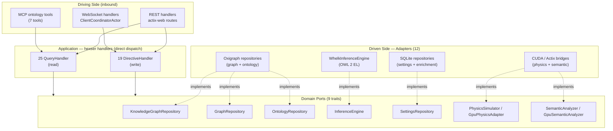
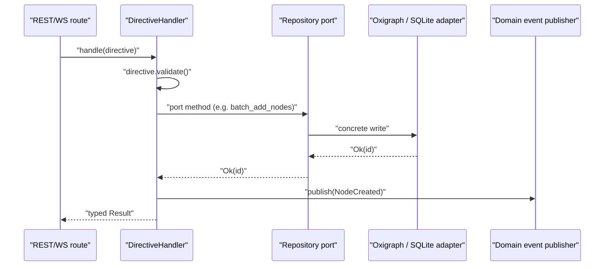
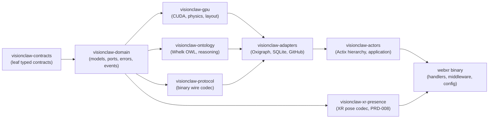

# Backend Architecture

> [VisionClaw Docs](../README.md) · [Explanation](README.md)

The VisionClaw backend is a Rust service (Actix-Web, listening on `:4000`) built on hexagonal architecture: a technology-agnostic domain core surrounded by **9 port traits** and their **12 adapter** implementations. Application logic is expressed as **44 hexser handlers** (19 `DirectiveHandler`, 25 `QueryHandler`) that are invoked through **direct dispatch** — there is no in-process command/query bus (ADR-089). The whole tree is split into **8 workspace crates** along the hexagonal boundary so a one-line change recompiles in roughly two minutes instead of twelve (ADR-090).

This page explains the shape and the reasoning. For the live actor supervision tree see [Actor Hierarchy](actor-hierarchy.md); for the GPU layout engine see [Physics & GPU Engine](physics-gpu-engine.md).

---

## Hexagonal at a glance

The dependency rule points inwards. The domain core knows nothing about HTTP, CUDA, Oxigraph or Actix; it only knows the port traits it declares. Adapters on the outside implement those traits against concrete technology, and the binary wires concrete adapters to handlers at startup. Swapping a persistence backend — as happened when Neo4j was replaced by an embedded Oxigraph + SQLite store (ADR-2004) — touches only the adapter layer, never the domain or application layers.

---

## Direct hexser dispatch — there is no CQRS bus (ADR-089)

Write operations are `Directive` structs handled by a `DirectiveHandler`; read operations are query structs handled by a `QueryHandler`. The two responsibilities are kept separate — a directive validates then mutates and emits a domain event; a query is read-only and never publishes events. That is the Command Query Responsibility Segregation *discipline*, and it is what the codebase uses.

What the codebase does **not** have is a CQRS *bus*. An early `src/cqrs/` scaffold (~3,200 lines: an `InMemoryBus`, middleware chain, projections) was registered in `main.rs` but every handler was a no-op with zero consumers and zero coverage. ADR-089 deleted it. The production path is **direct dispatch**: a route handler constructs the directive or query and calls the matching `DirectiveHandler`/`QueryHandler` (or an actor mailbox for live, in-memory state) directly. There is no `TypeId` routing table, no bus timeout wrapper, and no event-bus middleware in the hot path.

The 44 handlers live in `src/application/`, grouped into five domains:

| Domain module | Responsibility |
|---|---|
| `application/settings/` | User and system configuration, physics profiles |
| `application/knowledge_graph/` | Node/edge CRUD, batch position updates, search |
| `application/ontology/` | OWL class/property/axiom storage, inference results, validation |
| `application/physics/` | Simulation parameter directives and physics-state queries |
| `application/graph/` | Read-only graph projections (query-only domain) |

Each domain exposes its directives in `directives.rs` and its queries in `queries.rs`; the `graph` domain is query-only (it reads the live actor-held graph). The split is 19 `DirectiveHandler` to 25 `QueryHandler` across the five modules.

### Graph-navigation and layout route handlers

Not every read is a hexser handler. The graph-navigation and layout surfaces that the desktop and XR clients drive are **actix-web route handlers** on the driving side that read live, actor-held graph state directly (query-only, no directive/event path). They were added for the Graph2VR-class interaction and constrained-layout programmes; the wire shapes are documented in [reference/rest-api.md](../reference/rest-api.md) (§"Node navigation, fold, and pattern-query routes" and §"Layout Endpoints"), so only the code map is given here:

| Route(s) | Handler | Source |
|---|---|---|
| `GET /api/graph/node/{id}/relations` | `get_node_relations` | `src/handlers/api_handler/graph/mod.rs` |
| `POST /api/graph/node/{id}/expand` | `expand_neighbours` (predicate-count-first, additive merge) | `src/handlers/api_handler/graph/mod.rs` |
| `GET /api/graph/fold` | `fold::get_fold_plan` (level 0–3 fold ladder) | `src/handlers/api_handler/graph/fold.rs` |
| `POST /api/graph/query/pattern` | `query_pattern` (triple patterns, ≤16 triples / 8 vars) | `src/handlers/api_handler/graph/mod.rs` |
| `GET /api/layout/modes`, `POST /api/layout/mode`, `POST /api/layout/radial`, `GET /api/layout/status`, `POST /api/layout/zones` | `configure_layout_routes` — `set_layout_mode`, `set_radial_layout` (ADR-141) | `src/handlers/layout_handler.rs` |

The layout routes are the API face of the [ADR-141](../archive/adr/ADR-141-constrained-layout-engine-programme.md) constrained-layout programme: `set_layout_mode` selects one of `forceDirected`/`hierarchical`/`radial`/`spectral`/`temporal`/`clustered`, and `set_radial_layout` re-keys the GPU radial-bias term through a `SetRadialLayout` actor message with `RadialMode` `dagRank`/`typeTier`/`ego` (`crates/visionclaw-domain/src/types/layout.rs`). GPU-resident modes route into the physics actor; the CPU one-shot modes (spectral/temporal) compute placement in the handler. The `expand`/`relations` handlers implement the "ask what relations exist, then pull one predicate" model shared with the XR radial menu.

### Directive lifecycle

Query handlers follow the same shape minus the validation and event steps: construct the query, call the read port, return the typed result. Because queries never mutate, the read path can be cached or fanned out independently of write consistency.

---

## The 9 ports

Ports are `#[async_trait]` traits that are `Send + Sync`, so the binary shares each implementation as `Arc<dyn Port>` across Actix worker threads. Three legacy ports plus two webxr-local ports live in `src/ports/`; the remaining four are canonical in `crates/visionclaw-domain/src/ports/` and re-exported through `src/ports/mod.rs` for backwards-compatible call sites.

| # | Port trait | Purpose | Defined in |
|---|---|---|---|
| 1 | `GraphRepository` | Core node/edge access for actors and handlers | `src/ports/graph_repository.rs` |
| 2 | `PhysicsSimulator` | Abstract simulation step, force/constraint application | `src/ports/physics_simulator.rs` |
| 3 | `SemanticAnalyzer` | CPU community detection and pattern analysis | `src/ports/semantic_analyzer.rs` |
| 4 | `KnowledgeGraphRepository` | Graph CRUD, batch ops, position persistence, search | `src/ports/knowledge_graph_repository.rs` |
| 5 | `SettingsRepository` | Config persistence, batch ops, physics profiles | `src/ports/settings_repository.rs` |
| 6 | `InferenceEngine` | OWL reasoning: infer axioms, consistency, entailments | `visionclaw-domain` |
| 7 | `OntologyRepository` | OWL class/property/axiom storage and validation | `visionclaw-domain` |
| 8 | `GpuPhysicsAdapter` | GPU force compute, layout, device management | `visionclaw-domain` |
| 9 | `GpuSemanticAnalyzer` | GPU PageRank, clustering, pathfinding, embeddings | `visionclaw-domain` |

---

## The 12 adapters

Adapters live in `src/adapters/` (some extracted into `crates/visionclaw-adapters/` with thin shim re-exports per ADR-090). They are constructed in `app_state.rs` / `main.rs` and injected into handlers as trait objects. A test double for any port is an in-memory struct with no change to the layers above it.

| Adapter | Implements | Technology |
|---|---|---|
| `OxigraphGraphRepository` | `GraphRepository`, `KnowledgeGraphRepository` | Embedded Oxigraph, SPARQL 1.1 |
| `OxigraphOntologyRepository` | `OntologyRepository` | Embedded Oxigraph, ontology named graph |
| `SqliteSettingsRepository` | `SettingsRepository` | SQLite + LRU cache |
| `SqliteEnrichmentRepository` | enrichment-proposal lifecycle store | SQLite (`data/enrichment.sqlite3`) |
| `ActorGraphRepository` | `GraphRepository` | Actix message bridge to `GraphStateActor` |
| `WhelkInferenceEngine` | `InferenceEngine` | Whelk-rs OWL 2 EL reasoner |
| `GpuSemanticAnalyzerAdapter` | `GpuSemanticAnalyzer` | CUDA kernels |
| `ActixPhysicsAdapter` | `GpuPhysicsAdapter` | Actor wrapper over CUDA |
| `ActixSemanticAdapter` | `SemanticAnalyzer` | Actor wrapper |
| `PhysicsOrchestratorAdapter` | `PhysicsSimulator` | Actor coordination |

The two remaining adapters are the implicit Actix transport bridges — an HTTP route adapter and a WebSocket broadcast adapter — that translate between actix-web / WebSocket frames and application calls; they bring the count to 12. The `ActorGraphRepository` is the interesting one: it satisfies the `GraphRepository` port by sending Actix messages to `GraphStateActor`, letting non-actor handler code reach live, actor-owned graph state through the standard port interface rather than reaching into the actor directly.

The graph store is an **embedded Oxigraph** RDF triple store with **SQLite** for settings and enrichment proposals (ADR-2004). The former Neo4j / Bolt / Cypher adapters were deleted; there is no external database and no database browser UI.

---

## Eight workspace crates and the dependency DAG (ADR-090)

The backend was a single 123k-line `webxr` crate. With `codegen-units = 1` for release builds, LLVM treated the whole thing as one compilation unit, so any edit triggered a ~12-minute optimisation pass. ADR-090 split it along the hexagonal boundary into 8 library crates plus the thin `webxr` binary, dropping single-crate rebuilds to ~2 minutes. Each crate uses `codegen-units = 16`; only the final binary link applies LTO.

The workspace dependency graph is enforced to be acyclic — CI fails the build (`cargo tree`) if a cycle appears. The canonical inner-to-outer ordering is `contracts → domain → {gpu, ontology, protocol} → adapters → actors → server`.

`visionclaw-contracts` is a leaf with no workspace dependencies. `visionclaw-domain` holds the pure domain model and the port traits. The `gpu` and `ontology` Cargo features propagate from the root crate down to the crates that need them, so a non-GPU or non-ontology build compiles only the relevant code.

---

## Where the actor system fits

Hexagonal structure governs *dependencies*; the runtime is an Actix actor system that owns live, mutable state (the in-memory graph, the GPU simulation, WebSocket sessions). Roughly **35 long-lived actors** run under a supervision tree — 19 service/orchestration actors and 16 GPU-compute actors — plus per-connection WebSocket session actors. Handlers reach actor-held state either through the `ActorGraphRepository` port adapter or, for orchestration messages, by sending directly to a supervisor mailbox.

The boundary is deliberate: ports keep the domain testable and technology-agnostic, while actors provide the concurrency and lifecycle management that a real-time graph renderer needs. The full supervision tree, message routing, and the GPU position-broadcast pipeline are documented in [Actor Hierarchy](actor-hierarchy.md) and [Physics & GPU Engine](physics-gpu-engine.md).

---

## Why this shape

- **Replaceable infrastructure.** Ports let the Neo4j → Oxigraph/SQLite migration (ADR-2004) land entirely in the adapter layer.
- **Honest dispatch.** Removing the dead CQRS bus (ADR-089) collapsed a misleading "114-handler bus" headline into the real architecture: 44 directly-dispatched hexser handlers plus actor mailboxes.
- **Fast iteration.** The 8-crate split (ADR-090) turns the build from a 12-minute monolith pass into ~2-minute incremental rebuilds without sacrificing release-binary performance.
- **Separation of concerns.** Directives validate-then-mutate-then-emit; queries are pure reads — which lets the read path be optimised independently of write consistency.

---

## See also

- [Actor Hierarchy](actor-hierarchy.md) — the ~35-actor Actix supervision tree and message routing
- [Bounded Contexts](bounded-contexts.md) — DDD context map behind the crate boundaries
- [Subsystems](subsystems.md) — how the backend, client, and agentbox subsystem compose
- [Ontology Pipeline](ontology-pipeline.md) — the OWL reasoning and enrichment flow that drives the ontology ports
- [Physics & GPU Engine](physics-gpu-engine.md) — the CUDA layout engine behind the GPU adapters
- [Technology Choices](technology-choices.md) — Rust, Actix-Web, Oxigraph rationale
- [REST API reference](../reference/rest-api.md) · [WebSocket protocol](../reference/websocket-protocol.md) · [Binary protocol](../reference/binary-protocol.md)
- Governing decisions: [ADR-089 — CQRS Dead Bus Removal](../archive/adr/ADR-089-cqrs-bus-removal.md) · [ADR-090 — Hexagonal Crate Modularisation](../archive/adr/ADR-090-hexagonal-crate-modularisation.md) · [ADR-141 — Constrained-Layout Engine Programme](../archive/adr/ADR-141-constrained-layout-engine-programme.md) (the layout route handlers)
