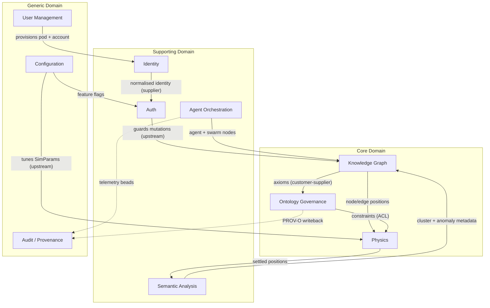

# Bounded Contexts

> [VisionClaw Docs](../README.md) · [Explanation](README.md)

VisionClaw is decomposed into **ten bounded contexts**, each owning a slice of the
ubiquitous language and a small set of aggregates. The decomposition is strategic
DDD: it draws the lines along which the codebase splits into the **8 workspace
crates** of the hexagonal architecture (`visionclaw-contracts`, `-domain`,
`-protocol`, `-adapters`, `-gpu`, `-ontology`, `-actors`, `-xr-presence`; see
[ADR-090](../archive/adr/ADR-090-hexagonal-crate-modularisation.md)). Contexts talk to each
other through **9 ports and 12 adapters**, and through **44 hexser handlers**
(19 `DirectiveHandler` + 25 `QueryHandler`) invoked directly — there is **no CQRS
message bus** ([ADR-089](../archive/adr/ADR-089-cqrs-bus-removal.md)).

This page is the **map**. Each context links out to its detailed deep-dive record
under [../ddd/](../archive/ddd/README.md) and to the longer `ddd-*-context.md` explanation
pages. Read those for aggregates, domain events, invariants, and anti-corruption
layers; read this for the shape of the whole.

## Classification

Following Evans' distinction, the ten contexts are graded by strategic value:

- **Core** — where VisionClaw earns its keep. Differentiating, hard to copy,
  worth the best engineering: **Knowledge Graph**, **Ontology Governance**, **Physics**.
- **Supporting** — necessary and bespoke, but not the differentiator:
  **Auth**, **Identity**, **Agent Orchestration**, **Semantic Analysis**.
- **Generic** — solved problems, kept deliberately thin and replaceable:
  **User Management**, **Audit / Provenance**, **Configuration**.

## Context map

*The ten bounded contexts grouped by strategic classification. Solid arrows are
synchronous data/handler flows; dashed arrows are provenance side-channels. Labels
name the DDD integration pattern in play (upstream/downstream, customer-supplier,
anti-corruption layer).*

## The ten contexts

| Context | Class | Aggregate root | Owning crate / key modules | Integration role | Deep dive |
|---|---|---|---|---|---|
| **Knowledge Graph** | Core | `GraphData` (`Node`, `Edge`, `GraphMetadata`) | `visionclaw-domain` + `OxigraphGraphRepository` adapter | Published Language — RDF triples over the [graph schema](../reference/graph-schema.md); open-host to every downstream context | [graph-cognition](../archive/ddd/ddd-graph-cognition-context.md) · [semantic-pipeline](ddd-semantic-pipeline.md) |
| **Ontology Governance** | Core | `Ontology` (`OntologyClass`, `OntologyAxiom`, `InferredRelation`) | `visionclaw-ontology` — Whelk-rs OWL 2 EL reasoner, SHACL-lite, PROV-O, 7 MCP tools | Customer-supplier on Knowledge Graph (consumes axioms); ACL supplier of constraints to Physics | [ontology-augmentation](../archive/ddd/ddd-ontology-augmentation-context.md) · [semantic-trust-layer](../archive/ddd/ddd-semantic-trust-layer-context.md) |
| **Physics** | Core | `PhysicsSimulation` (`SimParams`, `ForceConfig`, `ConstraintData`) | `visionclaw-gpu` — 82 CUDA kernels, 55x speedup | Conformist on graph positions; consumes Config and ontology constraints | [physics-gpu-engine](physics-gpu-engine.md) · [semantic-physics-domain](../archive/ddd/semantic-physics-domain.md) |
| **Auth** | Supporting | `NostrSession` (`UserSession`, `ApiKey`, `FeatureAccess`) | `visionclaw-adapters` — `NostrService`, `AuthExtractor` | Upstream guard for all mutation paths; anti-corruption at the HTTP edge | [identity-contexts](ddd-identity-contexts.md) · [security-model](security-model.md) |
| **Identity** | Supporting | `IdentityBinding` (`DIDDocument`, `WebIDProfile`) | `visionclaw-adapters` — did:nostr ↔ WebID ↔ passkey normaliser | Supplier of normalised identity to Auth and User Management | [identity-contexts](ddd-identity-contexts.md) · [mesh-federation](../archive/ddd/ddd-mesh-federation-context.md) |
| **Agent Orchestration** | Supporting | `AgentSwarm` (`Agent`, `SwarmStatus`, `TelemetryMessage`) | `visionclaw-actors` — polling + bridge actors | ACL into the agentbox subsystem; produces agent nodes for the graph | [nostr-mobile-bridge](../archive/ddd/ddd-nostr-mobile-bridge-context.md) · [agentbox-integration](../archive/ddd/ddd-agentbox-integration-context.md) |
| **Semantic Analysis** | Supporting | `AnalyticsState` (`ClusteringTask`, `AnomalyState`, feature vectors) | `visionclaw-actors` — clustering, anomaly, feature-engineering | Customer-supplier — Physics positions in, cluster/anomaly metadata back to Knowledge Graph | [clustering-analytics](../archive/ddd/clustering-analytics-domain.md) · [feature-engineering](../archive/ddd/ddd-feature-engineering-context.md) |
| **User Management** | Generic | `Pod` (`Account`) | Solid sidecar — auto-provision, accounts | Supplier of pods + accounts to Identity; thin, replaceable | [identity-contexts](ddd-identity-contexts.md) · [user-agent-pod-design](user-agent-pod-design.md) |
| **Audit / Provenance** | Generic | `ProvenanceRecord` / `Bead` | `visionclaw-domain` — PROV-O entities, git/needle beads | Conformist sink; provenance is a Published Language (PROV-O) | [bead-provenance](../archive/ddd/ddd-bead-provenance-context.md) |
| **Configuration** | Generic | `AppSettings` (`PhysicsSettings`, `VisualSettings`, `FeatureFlags`) | `visionclaw-adapters` — `SqliteSettingsRepository` | Upstream tuning supplier to Physics and Auth; one authoritative source per category | [reference/configuration](../reference/configuration.md) · [ddd-bounded-contexts (BC5)](ddd-bounded-contexts.md) |

## How the contexts relate

The map uses the standard DDD relationship vocabulary. The patterns that carry the
most weight in VisionClaw:

- **Published Language.** Knowledge Graph exposes the RDF graph schema; Audit /
  Provenance exposes PROV-O. Downstream contexts conform to these schemas rather
  than negotiating bespoke contracts. The wire encodings (binary V2/V3/V4) are the
  transport-layer published language of the same graph.
- **Customer-Supplier.** Knowledge Graph is the supplier to both Ontology
  Governance (axioms upward) and Semantic Analysis (positions downward, metadata
  back). Each supplier honours a stable contract its customers depend on.
- **Anti-Corruption Layer.** Auth wraps every inbound HTTP request, translating
  external Nostr/Passkey/OIDC credentials into an internal `NostrSession` before any
  core context sees them. Agent Orchestration runs an ACL against the agentbox
  subsystem so external orchestration concepts never leak into the graph domain.
- **Conformist.** Physics conforms to whatever positions and constraints upstream
  hands it — it does not push back on the graph's shape. Audit / Provenance conforms
  to PROV-O as emitted by its producers.
- **Upstream / Downstream.** Configuration sits upstream of Physics and Auth: a
  parameter change flows down, never up. Identity sits upstream of Auth and User
  Management.

The hexagonal boundary ([ADR-090](../archive/adr/ADR-090-hexagonal-crate-modularisation.md))
makes these relationships physical: a context's contract lives in
`visionclaw-contracts` as a **port**, and the crossing is an **adapter** in
`visionclaw-adapters`. A context can only reach another through a port, so the map
above is enforced by the crate graph, not merely documented.

## Reading order

1. Start here for the strategic shape.
2. Drop into the legacy ten-BC tactical map in
   [ddd-bounded-contexts.md](ddd-bounded-contexts.md) for aggregate-by-aggregate
   invariants and key file lists.
3. Follow a context's deep-dive link (table above) for domain events, the
   ubiquitous-language glossary of that context, and its anti-corruption layers.
4. For the cross-subsystem boundary into agentbox, see
   [../../agentbox/docs/developer/architecture.md](../../agentbox/docs/developer/architecture.md)
   — VisionClaw links into the agentbox subsystem through Agent Orchestration; it
   never duplicates it.

## See also

- [DDD Bounded Contexts (tactical ten-BC map)](ddd-bounded-contexts.md)
- [DDD Identity Bounded Contexts](ddd-identity-contexts.md)
- [DDD Semantic Pipeline](ddd-semantic-pipeline.md)
- [Backend Architecture](backend-architecture.md) · [Actor Hierarchy](actor-hierarchy.md) · [Subsystems](subsystems.md)
- [DDD domain records index](../archive/ddd/README.md)
- Governing decisions: [ADR-089 — CQRS Bus Removal](../archive/adr/ADR-089-cqrs-bus-removal.md) · [ADR-090 — Hexagonal Crate Modularisation](../archive/adr/ADR-090-hexagonal-crate-modularisation.md) · [ADR-011 — Auth Enforcement](../archive/adr/ADR-011-auth-enforcement.md) · [ADR-112 — Ontology Augmentation Retrieval Spine](../archive/adr/ADR-112-ontology-augmentation-retrieval-spine.md) · [PRD-022 — Semantic Trust Layer](../archive/prd/PRD-022-semantic-trust-layer.md)
