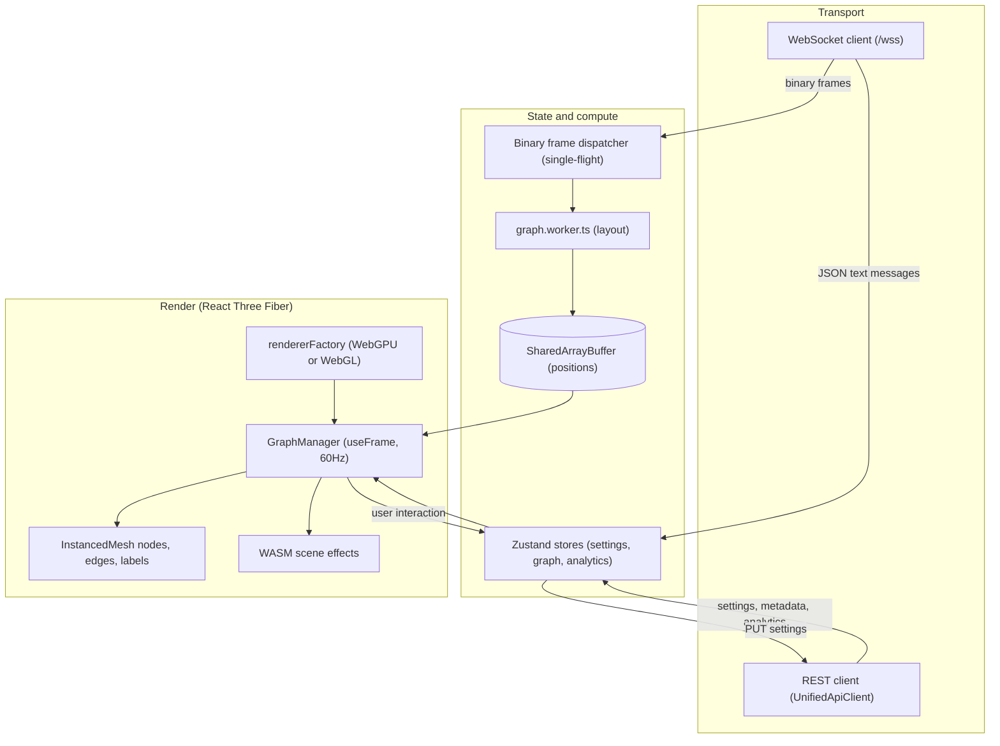
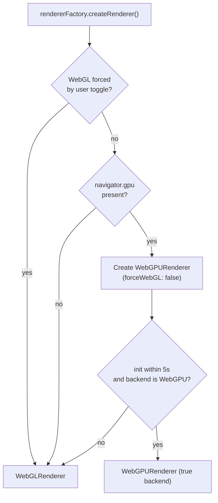
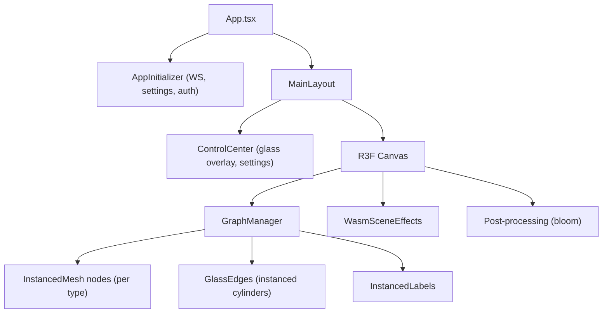
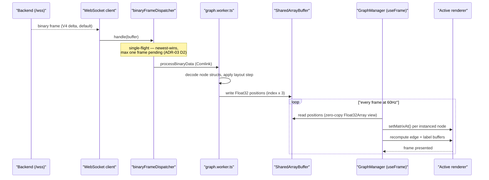

# Client Architecture

> [VisionClaw Docs](../README.md) · [Explanation](README.md)

The VisionClaw client is a React 19 single-page application that renders an interactive 3D knowledge graph in the browser. It is the only first-class viewport onto the graph: the backend computes layout on the GPU and streams positions, while the client owns presentation, interaction, and local state. This page explains the shape of that client and the reasoning behind its three load-bearing decisions — a **dual renderer** (WebGPU preferred, WebGL fallback), **InstancedMesh** geometry, and a **zero-copy SharedArrayBuffer** position pipeline driven by the binary WebSocket protocol.

The codebase is **465 TypeScript/TSX files** (**422 non-test**) totalling roughly **103K lines**, organised into **16 feature modules** under `client/src/features/`. Three.js is consumed through React Three Fiber (R3F), so the scene graph is declared as React components and reconciled like any other React tree.

## Why the client is shaped this way

A knowledge graph at scale is a hard rendering problem: tens of thousands of nodes and edges, each moving every frame while a force-directed layout converges. Three constraints follow from that, and they drive the whole design.

- **Per-object draw calls do not scale.** Issuing one draw call per node collapses the frame budget well before the graph is interesting. The client uses `InstancedMesh` so an entire node type is a single draw call regardless of count.
- **Per-frame serialisation does not scale.** Positions arrive ~60 times per second. Copying or JSON-decoding them across the worker boundary each frame would dominate the budget. The client uses a `SharedArrayBuffer` (SAB) so positions are written once and read zero-copy by both the layout worker and the render loop.
- **Browser GPU backends are not uniform.** WebGPU is faster and the strategic target, but Firefox, older Safari, and the Quest 3 Oculus Browser either lack `navigator.gpu` or fall back unpredictably. The client probes at runtime and selects a clean backend rather than trusting a hybrid path.

Everything below is a consequence of those three constraints.

## Layered structure

The client separates a thin **transport** tier (WebSocket + REST), a **state** tier (Zustand stores and the layout worker), and a **render** tier (R3F scene under the active renderer). Data flows transport → state → render; user intent flows back render → state → transport.

The split keeps the hot path (binary frames → SAB → render) free of React re-renders: position updates never flow through the Zustand store, so the React tree does not reconcile 60 times a second. Only structural changes (a new node, a settings edit, an analytics result) touch the stores.

## The dual renderer

R3F is initialised with a custom renderer chosen at runtime by `rendererFactory.ts`. The factory prefers a true WebGPU backend and falls back to a clean WebGL renderer rather than accepting WebGPU's internal WebGL2 emulation, which on some browsers produced oversized render targets.

The factory exposes an `isWebGPURenderer` flag so materials can branch on backend capability, and a user-facing override (the [Control Center](control-center.md)'s System & Developer group, "WebGPU Renderer" action, persisted in `localStorage` as `visionclaw-force-webgl`). The 5-second timeout guard exists because the Quest 3 Oculus Browser can hang during WebGPU adapter negotiation; on timeout the client discards the half-initialised renderer and proceeds on WebGL. Immersive XR is a **separate** native binary, not this renderer — see [XR Architecture](xr-architecture.md).

## Component composition

`GraphManager` is a composition shell, not a monolith: its data-subscription, edge-buffer, event, filtering, and colour concerns are delegated to hooks under `client/src/features/graph/hooks/`. The component wires the hooks together and owns the render tree, which keeps the file within the project's 500-line limit while the per-frame work lives in focused, testable units.

Each node type renders as its own `InstancedMesh` — one draw call for all knowledge nodes, one for ontology, one for agents — so GPU cost is constant in node count. Per-instance transform and colour are written each frame via `setMatrixAt` / `setColorAt`. Edges are instanced unit-height cylinders scaled and rotated per edge; labels use a two-phase `useFrame` that patches glyph positions every frame and rebuilds layout less often.

## The data-flow pipeline: binary frame to pixels

This is the hot path and the reason the client performs. A binary frame arrives, is dispatched under a single-flight discipline, crosses into the layout worker, lands in the SharedArrayBuffer, and is read zero-copy by the render loop. No copy, no JSON, no React reconciliation on the per-frame path.

Two design choices make this safe under load:

- **Single-flight dispatch.** `createBinaryFrameDispatcher` processes at most one frame across the `await` that crosses the worker (Comlink) boundary. A frame arriving while one is in flight replaces the single pending slot — newest wins, stale frames are dropped and counted. This bounds memory and latency: the client always renders the freshest layout rather than draining a backlog. Each WebSocket connection gets its own dispatcher instance, so in-flight and pending state never leak across reconnects.
- **Zero-copy positions.** The worker writes positions once into the SAB; `GraphManager` reads them through a `Float32Array` view over the same memory. Nothing is serialised or copied per frame. The same view is captured once at the top of each `useFrame` tick and reused for every consumer (nodes, edges, labels) so all reads see a consistent snapshot.

## Binary wire format

Positions ride a compact binary protocol rather than JSON, for bandwidth and decode cost. Three node-payload generations exist; the client decodes all of them by stride detection:

| Version | Node payload | Role |
|---------|--------------|------|
| V2 | 36 bytes/node | Legacy — position + velocity, no analytics tail |
| V3 | 52 bytes/node (`BINARY_NODE_SIZE_V3`) | Adds the analytics tail (SSSP, cluster, anomaly, community, centrality) per ADR-031 |
| V4 | delta-encoded, **current default** | 6-byte message header, `uint32` SSSP identifiers; transmits only changed nodes |

The message envelope is a 6-byte header (`MESSAGE_HEADER_SIZE`) — `[type:u8][version:u8][payloadLength:u32]` — with a 7th byte for graph-update frames carrying a `GraphTypeFlag`. Node identifiers are sequential `u32` values whose high bits encode type (agent, knowledge, ontology); the client must coerce identifiers to `String()` before using them as map keys or in `===` comparisons, because the backend emits them numerically. The exhaustive field layout, message-type enum, and bandwidth maths live in the reference, not here:

- [Binary protocol reference](../reference/binary-protocol.md) — byte-level field layout per version.
- [WebSocket protocol reference](../reference/websocket-protocol.md) — message types, subscription handshake, control bits, heartbeats.

## State management

Application state is Zustand. The hot position path deliberately bypasses it; everything else flows through stores, the largest being `settingsStore`.

- **Settings are lazy-loaded.** Only a small set of essential paths is fetched at startup; non-essential sections are loaded on demand via `ensureLoaded(['section.*'])` inside a `useEffect`. This cuts initial settings load dramatically versus fetching the full tree up front.
- **Writes are debounced and batched.** `autoSaveManager` accumulates changes in a map and flushes the queue as a single batched API call after ~500ms of inactivity, with a `beforeunload` force-flush so edits made just before tab close are not lost.
- **Subscriptions are path-based.** Components subscribe to a specific dot-notation path rather than the whole store, so a bloom-intensity change re-renders only the bloom consumer, not the tree.

Physics settings are server-authoritative: the backend's GPU layout is the single source of truth, so on hydration server physics values are re-overlaid on top of any locally persisted overlay. The full settings read/write sequence is documented in [Physics & GPU Engine](physics-gpu-engine.md) and governed by ADR-039.

## WASM scene effects

Particle and environment effects are implemented in a Rust crate compiled to WASM and bridged into the R3F scene through a thin TypeScript layer (`scene-effects-bridge.ts` → `useWasmSceneEffects` → `WasmSceneEffects`). The bridge follows the same zero-copy discipline as the position pipeline: the Rust module exposes raw pointers via `get_*_ptr()` / `get_*_len()`, and the bridge constructs `Float32Array` views directly over `WebAssembly.Memory.buffer`. The views stay valid only while the WASM heap is not reallocated, so effect code avoids growing memory while views are held.

## See also

- [System Overview](system-overview.md) — how the client sits within the whole VisionClaw system.
- [Backend Architecture](backend-architecture.md) — the Actix backend and hexagonal ports that feed the client.
- [Actor Hierarchy](actor-hierarchy.md) — the actors that compute layout and broadcast positions.
- [Physics & GPU Engine](physics-gpu-engine.md) — CUDA force computation and the settings pipeline behind the positions.
- [Control Center](control-center.md) — the settings UI that writes into that pipeline.
- [XR Architecture](xr-architecture.md) — the separate native immersive client.
- [Binary protocol reference](../reference/binary-protocol.md) and [WebSocket protocol reference](../reference/websocket-protocol.md) — wire-level detail.
- Governing ADRs: [ADR-012 WebSocket store decomposition](../adr/ADR-012-websocket-store-decomposition.md), [ADR-013 render performance](../adr/ADR-013-render-performance.md), [ADR-031 GPU analytics correctness and wiring](../adr/ADR-031-gpu-analytics-correctness-and-wiring.md), [ADR-039 settings consolidation](../adr/ADR-039-settings-consolidation.md), [ADR-061 binary protocol unification](../adr/ADR-061-binary-protocol-unification.md).
