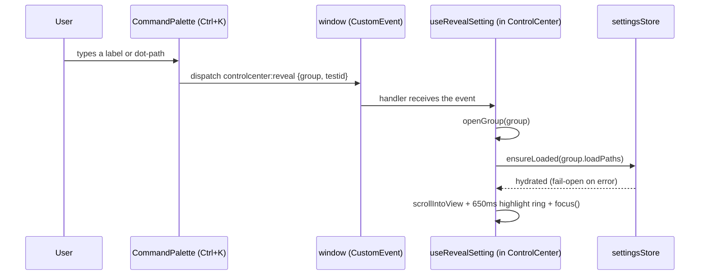

# Control Center

> [VisionClaw Docs](../README.md) · [Explanation](README.md)

The VisionClaw client used to dock a 360px tabbed panel (`IntegratedControlPanel`,
nine tabs: graph, physics, effects, analytics, quality, system, xr, ai, developer)
permanently against the graph canvas. It carried all 168 settings fields plus the
Solid Pod and Ontology panels, but gave every field equal visual weight regardless
of how often it was touched, and its `buttonKey` tab-shortcut badges were dead —
nothing bound the keys they displayed.

`client/src/features/control-center/` (~40 files, none over 500 lines) replaces it
with a re-imagined shell: the canvas is the hero, controls are a glass DOM overlay
that appears on demand, and the 205 fields are organised by **user intent** instead
of by implementation area. This page explains the design thesis, the component map,
and the registry that keeps it honest against the backend. The governing decision is
[ADR-129](../adr/ADR-129-control-center-reimagination.md).

## Design thesis

Three commitments shape every part of the rebuild:

- **The canvas is hero.** At rest, nothing but the graph is visible except a
  bottom-center dock and a top-right status cluster — no permanent side panel
  claims screen width. Everything else is summoned and dismissed.
- **Glass DOM, not canvas UI.** Every control is a real HTML element (native
  `<input type="range">`, Radix `Switch`/`Select`) styled with a translucent
  `backdrop-filter` recipe (`.cc-glass`, `styles/control-center.css`), never a
  WebGL/R3F element. This is what makes the whole surface keyboard-navigable and
  automatable — a native range input gives `aria-valuemin/max/now` and a `.value`
  for free.
- **Three-layer progressive disclosure.** L1 (five macro dials, always visible in
  the dock) covers the common case with one twist of a dial. L2 (nine semantic
  groups in a slide-out panel) covers deliberate tuning. L3 (205 individual field
  rows inside a group, or any one of them via `Ctrl+K`) covers the rare precise
  edit. Nobody has to wade through 205 rows to change bloom intensity.

None of this touches the write path or the physics engine. Edits still flow
`control → store.set(path) → zustand (immer) → autoSaveManager.queueChange` (500ms
debounce → bucketed `PUT`s), and R3F still reads positions and settings through the
existing subscription/trie paths — see [Client Architecture](client-architecture.md)
and [Physics & GPU Engine](physics-gpu-engine.md) for that machinery, which is
unchanged.

## The frozen registry — single source of truth

The previous panel's `unifiedSettingsConfig.ts` is gone, but every dot-path string
it carried survives verbatim. Backend routing in `client/src/api/settings/endpoints.ts`
prefix-matches on these strings, so renaming one silently breaks server sync —
the rebuild's hardest constraint was to restructure *presentation only*.

`registry/manifest.ts` is the icon-free data spine (pure data, no React/lucide
import, so the `ts-node` manifest emitter can import it without a bundler);
`registry/settingsRegistry.ts` attaches Lucide icons on top of it for the browser
build:

| Export | What it is |
|---|---|
| `GROUP_DATA` / `REGISTRY` | The nine `RegistryGroup` objects, in rail order (hotkeys `1`–`9`) |
| `ALL_FIELDS` / `ALL_PATHS` | Every field, and every frozen backend path, flattened |
| `testIdFor(field, groupId)` | Deterministic `data-testid`: `setting-{dot.path}` for path fields, `setting-{groupId}.{key}` for transient/action fields |
| `serverBucketFor(path)` | Mirrors `endpoints.ts`'s prefix routing, so the manifest can assert a field lands on its correct `PUT` bucket |
| `buildManifest()` | Flattens the registry into the committed `registry/settings-manifest.json` |

`registry/__tests__/registry.test.ts` is the zero-drift gate: it checks the field
count (205 — the 168 frozen legacy fields plus the 37-field Agents group), the
exact per-group counts, the hotkey order, and — against
`registry/__tests__/legacy-paths.fixture.json` (captured from the old
`unifiedSettingsConfig.ts` before it was deleted) — that no *migrated* path was
added or dropped in either direction. The Agents group (hotkey `9`) post-dates
that frozen baseline, so its new `visualisation.graphs.visionclaw.*` /
`visualisation.graphTypeVisuals.agent.*` paths are asserted against an explicit
declared set instead (test `(c2)`), keeping the legacy fixture pristine.
`pnpm gen:manifest` (`client/scripts/emit-settings-manifest.ts`) regenerates the
committed manifest from the registry; CI fails if it has drifted.

### Endpoint bucket routing

`serverBucketFor()` replicates (does not import) the same prefix rules
`endpoints.ts` uses to route a `PUT`:

| Path prefix | Bucket |
|---|---|
| `visualisation.graphs.*.physics.*` | `physics` |
| `visualisation.rendering.*` | `rendering` |
| `qualityGates.*` | `qualityGates` |
| `nodeFilter.*` | `nodeFilter` |
| `constraints.*` | `constraints` |
| any other `visualisation.*` | `visual` |
| everything else (or no `path` — a `localKey`/`action` field) | `null` — client/localStorage-only |

The manifest's `server`/`clientOnly` fields let the browser-automation coverage
pass assert a live network trace hits the field's correct bucket — catching a
path-prefix regression at the moment it happens, not weeks later.

## The nine semantic groups

The old nine implementation-area tabs (graph, physics, effects, analytics,
quality, system, xr, ai, developer) collapse into eight intent-oriented groups;
a ninth **Agents** group was added afterwards to make agent/swarm look-and-feel
settings-manageable. Every migrated field still lives at its original path; only
the grouping changed. Totals are enforced by the registry test above.

| # | Group | Fields | Old tab(s) | Covers |
|---|---|---|---|---|
| 1 | Motion & Forces | 48 | physics | Core forces, simulation, repulsion/spacing, bounds, layout forces, constraints, semantic/layout (`qualityGates.*`), smooth movement (tweening) |
| 2 | Look & Materials | 29 | graph, effects | Node/edge styling, graph-type visuals, lighting/rendering, selection colour, bloom/glow, gem material |
| 3 | Labels & Text | 10 | graph | Label visibility, font, colour, outline, distance threshold, layout cadence |
| 4 | Filtering & Quality | 32 | graph, quality, analytics | Node-type visibility, node filtering, GPU quality gates, cluster visualisation, run grouping, cluster hulls |
| 5 | Effects & Atmosphere | 22 | effects | Scene particles, energy wisps, fog, embedding cloud, node/selection animation |
| 6 | Immersion (XR) | 5 | xr | XR quality, render scale, hand tracking, haptics (local-only) |
| 7 | Intelligence (AI) | 6 | ai | Perplexity model/tokens/temperature, Kokoro TTS voice/speed/URL |
| 8 | System & Developer | 16 | effects, system, developer | Renderer toggle + info, authentication (Nostr), backend URL, debug logging switches |
| 9 | Agents | 37 | *(new)* | Agent/swarm node material, edge appearance, labels (`…graphs.visionclaw.*`), the per-agent-type colour palette (`…rendering.agentColors.*`), four health→glow colour bands, and behaviour visuals — swarm tint, bioluminescence, nucleus glow, breathing, membrane, health bar, action-beam radius/opacity (`…graphTypeVisuals.agent.*`) |

### Agents (hotkey 9)

The server resolves the graph keys `"visionclaw" | "agent" | "bots"` to
`visualisation.graphs.visionclaw` (`app_settings.rs`), so agent nodes/edges/labels
persist under `visualisation.graphs.visionclaw.{nodes,edges,labels}.*` — real
fields on both the Rust `GraphSettings` and the client typed mirror. The
**Agent Nodes / Agent Edges / Agent Labels** subgroups expose that appearance.
**Agent Type Colours** exposes the per-type palette `rendering.agentColors.*` —
typed both sides (client `AgentColorsSettings` ↔ server `AgentColorsDTO`, sourced
from `DevConfig.agent_colors`) and read by `BotsShared.getVisionClawColors`; it
routes to the real `rendering` `PUT` bucket. **Health** exposes four configurable
health→glow stops (`graphTypeVisuals.agent.healthColors.{excellent,good,warning,
critical}`) that drive `agentVisualConstants.healthGlowColor` — the bioluminescent
membrane hue that `AgentNodesLayer` and `BotsNode` share; its defaults reproduce
the historical six-tier ramp exactly, so untouched they change nothing. **Behaviour**
exposes the client-typed `graphTypeVisuals.agent.*` knobs consumed by `GemNodes` /
`AgentNodesLayer` (bioluminescence, nucleus glow, breathing, membrane, health bar)
plus `swarmTint` — a client-only hue-offset toggle read by
`BotsVisualization → BotsNode` — and the action-beam styling (`beamRadius`,
`beamOpacity`) that `GraphManager` feeds to `TransientBeamsLayer` for the embodied
`0x23 AGENT_ACTION` beams. `AgentNodesLayer` now reads its node size, colour,
edge colour/opacity and breathing from these same typed paths, replacing the
former phantom `settings.agents.visualization.*` keys that existed in neither the
client nor the Rust settings tree. Agent visibility remains owned by GraphManager's
`nodeTypeVisibility.agent` gate. These controls port the surviving capability of the
removed `BotsControlPanel`/`ConfigurationMapper` orphans (its camera, lighting and
preset knobs were dropped — the modern system owns camera/lighting elsewhere and
has a macros system for presets).

Two bespoke panels sit in the same rail below the nine groups, wrapping their
existing internals unchanged: **Solid Pod** (`panel-solid` → `SolidTabContent`)
and **Ontology** (`panel-ontology` → `OntologyTabContent` inside an
`ErrorBoundary`).

## Component map

`client/src/features/control-center/` — see the directory itself for the full
file list; the load-bearing seams are:

| Path | Role |
|---|---|
| `ControlCenter.tsx` | Root overlay. Mounts the dock, the slide-out panel, and the status cluster; wires hotkeys, reveal, and the ported SpacePilot/SpaceDriver connection logic verbatim from the old panel. |
| `primitives/GlassDock.tsx`, `GlassPanel.tsx`, `MacroDial.tsx` | The three genuinely new primitives — a translucent dock shell, a translucent panel shell, and a radial dial control. Every other control composes existing design-system Radix primitives. |
| `macros/MacroBar.tsx`, `useMacro.ts`, `registry/macros.ts` | The L1 dock row: five macro dials plus a physics toggle, a reset-layout action, and nine group-launcher icon buttons (it maps `REGISTRY`). |
| `panels/SettingsPanel.tsx` | The L2 slide-out: a left icon rail (nine groups + Solid/Ontology) and a body that renders a `GroupSection` or a bespoke panel, with a label/key/description/path/subgroup search filter. |
| `status/StatusCluster.tsx` | Top-right compact cluster — health dot + agent-count badge, expanding on hover/focus into the three existing status widgets unchanged. |
| `echo/*` | Echo Pulse — a single-draw-call R3F ring that pulses from the affected node on a slider/dial *commit* (not per-tick), mounted once in `GraphCanvas.tsx`'s scene root. Feature-flagged and reduced-motion-gated. |
| `state/useControlCenterUI.ts` | Ephemeral UI state (open panel, active group, dock collapsed, echo-pulse flag, resizable panel width) — deliberately separate from the settings store so none of it can leak into the frozen path contract (168 migrated + 37 Agents = 205 fields). |

### Macro dials (L1)

Five dials write to *existing* frozen paths through a transfer function over
`t ∈ [0..1]` and read them back for their at-rest position — no macro introduces
a new path:

| Macro | Drives (primary path) | Effect at `t=1` |
|---|---|---|
| Density | `…physics.repelK` (40→400), `restLength`, `centerGravityK` | Looser, more spread-out layout |
| Luminosity | `visualisation.glow.intensity` (0→1.5), ambient light, gem emissive | Brighter, more luminous scene |
| Motion | `…physics.globalSpeed` (0.05→2.0), inverse damping, temperature | Faster, livelier simulation |
| Focus | `…labels.labelDistanceThreshold` (1200→300), font size | Fewer, nearer, larger labels |
| Atmosphere | `…sceneEffects.particleOpacity` (0→0.8), wisp/fog opacity | Denser particles, wisps, fog |

Focus deliberately does not touch `nodeFilter.*` — writing the node filter on
every drag tick re-ran the client-side filtering pass over the whole corpus and
caused nodes (and their labels) to pop in and out as `minConnections` quantised.

## Interaction model

At rest, only the **GlassDock** (bottom-center: five macro dials, physics
toggle, reset action, nine group-launcher icons, and an "Ask" button opening the
ported `CommandInput`) and the **StatusCluster** (top-right compact pill) are
visible.

| Key | Action |
|---|---|
| `1`–`9` | Open the slide-out panel to that semantic group (realises the old panel's dead `buttonKey` badges) |
| `Ctrl/Cmd+.` | Toggle the dock between expanded and a single collapse pill |
| `Esc` | Close the slide-out panel — but a capture-phase listener checks for an open Radix popper/listbox first and yields to it, so dismissing a `Select` dropdown doesn't also collapse the panel |
| `Ctrl/Cmd+K` | **Not bound in the Control Center** — owned by the existing `CommandPalette`; `registry/paletteCommands.ts` registers one "reveal setting" command per field (205 of them) into that same registry, fuzzy-searchable by label or dot-path |
| `?` | Broadcasts `controlcenter:help` (no subscriber is currently wired — see Known gaps) |

Digit and `?` hotkeys are suppressed while a text input, `<select>`, or
content-editable element is focused, so typing in the Ask box or a text field
never triggers them.

### Palette reveal flow

### Resizable panel

The slide-out `SettingsPanel` defaults to 380px and is user-resizable between
320px and 900px via a drag handle (`primitives/useResizable.ts`); the width is
clamped and persisted to `localStorage` only (`controlCenter.panelWidth`), never
sent to the backend — a UI preference, not a settings path.

## Hydration model

`coreSlice.ensureLoaded()` existed before the rebuild but nothing called it, so
any of the ~140 fields outside the ~30 `ESSENTIAL_PATHS` read `undefined` on a
cold `localStorage`. The rebuild wires it at every entry point instead of
fetching everything at boot:

- **`MacroBar` mounts** → `useEnsureMacroPathsLoaded()` hydrates the subtrees the
  five dials derive from (several sit outside `ESSENTIAL_PATHS`).
- **A group opens for the first time** → `GroupSection`'s `onFirstMount` calls
  `useEnsureGroupLoaded()` → `ensureLoaded(group.loadPaths)`. `ensureLoaded` is
  itself idempotent (filters already-loaded paths), so re-opening a group is a
  no-network no-op.
- **Palette reveal** → `useRevealSetting` hydrates the target group before
  scrolling/focusing.
- **`CommandInput` (the Ask box) gains focus for the first time** →
  `ensureLoaded(ALL_PATHS)`, so the settings-assistant LLM context has live
  values across all 205 fields, one-time and intent-driven rather than at boot.

Every `ensureLoaded` call is wrapped fail-open: a hydration miss leaves a row on
its default value rather than throwing.

## CommandInput compatibility

`CommandInput.tsx` (the Ask box's underlying component, ported unchanged) reads
`Object.values(UNIFIED_SETTINGS_CONFIG)` for its LLM-context builder.
`registry/commandInputCompat.ts` reshapes `GROUP_DATA` into that exact legacy
shape as a drop-in replacement for the deleted `ControlPanel/unifiedSettingsConfig`,
so the Ask box's behaviour is unchanged — only its import path moved.

## Status cluster and the agents surface

`StatusCluster` is a top-right pill (health dot + agent-count badge + a
SpacePilot dot that only appears once a device connects) that expands on
hover/focus into the three existing widgets, unchanged: `SystemHealthIndicator`,
`BotsStatusPanel`, `SpacePilotStatus`. The heavy widgets mount only while
expanded, so the at-rest pill carries no live-subscription cost of its own — its
health colour is derived from props `ControlCenter` already threads through, not
a second WebSocket subscription.

`BotsStatusPanel` and the agent-spawning dialog it hosts
(`MultiAgentInitializationPrompt`, split under the 500-line cap into
`AgentTypeGrid`/`AgentTopologyFields`/`AgentSkillsSection`) were restyled to the
same glass design language — backdrop-blur dialog, `cc-*` typography, CSS-variable
tokens — while keeping their amber accent as the agents' visual identity and
leaving all behaviour and API calls unchanged. `AgentTelemetryStream` received
the same typography/token pass.

## Test hooks and dev handles

- **`data-testid` convention**: path fields → `setting-{dot.path}` (dots kept);
  transient/action fields → `setting-{groupId}.{key}`; groups → `group-{id}`;
  panels → `panel-{id}`; macros → `macro-{id}`; status → `status-cluster`.
- **`registry/settings-manifest.json`** (committed, `pnpm gen:manifest`-generated,
  CI freshness-checked): the machine-readable map of every field's testid,
  control type, group, and server bucket, consumed by the browser-automation
  coverage pass.
- **DEV-only globals**: `window.__settingsStore` (the Zustand settings store) and
  `window.__controlCenterUI` (the shell's UI store), set only under
  `import.meta.env.DEV`, for CDP-driven test automation.

## Known gaps

- **`GET /api/settings/rendering` serialisation gap.** The client-side
  `RenderingSettings` type carries `maxEdgesCeiling` and `softwareFallback`
  (`client/src/api/settings/types.ts`), but no Rust handler serialises either
  field back on a read — writes are accepted and persist through the normal
  `localStorage` overlay, but a fresh session cannot recover them from the
  server. Confirmed by the absence of any `max_edges_ceiling`/`maxEdgesCeiling`
  reference anywhere in the Rust backend.
- **`AgentControlPanel` / `SkillsTab` were removed** (historical). Neither was
  imported anywhere except each other and their own barrel re-export, with no
  mount point in the registry — they were deleted in dead-code pass 2 along with
  60+ other verified-orphan modules. The ~20-option `settings.agents.*` surface
  they once exposed was a *phantom*: those keys existed in neither the client
  typed tree nor Rust `AppFullSettings`, so `AgentNodesLayer` always fell back to
  hardcoded defaults. That gap is now closed — agent look-and-feel lives at the
  real `visualisation.graphs.visionclaw.*` / `graphTypeVisuals.agent.*` paths and
  is edited through the **Agents** group (hotkey 9) above; the phantom reads were
  removed from `AgentNodesLayer`.
- **`?` help hotkey has no subscriber.** `useControlCenterHotkeys` broadcasts
  `controlcenter:help` on `?`, but no component currently listens for it.

## See also

- [Client Architecture](client-architecture.md) — the renderer, WASM bridge, and
  binary position pipeline this UI sits on top of; unchanged by this rebuild.
- [Physics & GPU Engine](physics-gpu-engine.md) — what the Motion & Forces group's
  48 fields actually drive on the GPU.
- [Agent Control Surface](agent-control-surface.md) — the ACSP governance-panel
  protocol, a separate concern from the client-side agent status/spawner surface
  described here.
- [ADR-129: Control Center Re-imagination](../adr/ADR-129-control-center-reimagination.md)
  — the governing decision.
- [ADR-046: Enterprise UI Architecture](../adr/ADR-046-enterprise-ui-architecture.md)
  — a historical, superseded-by-removal (ADR-103) enterprise sidebar proposal;
  unrelated to this rebuild but referenced here because it describes the same
  `IntegratedControlPanel` this page replaces, as it stood in 2026-04.
