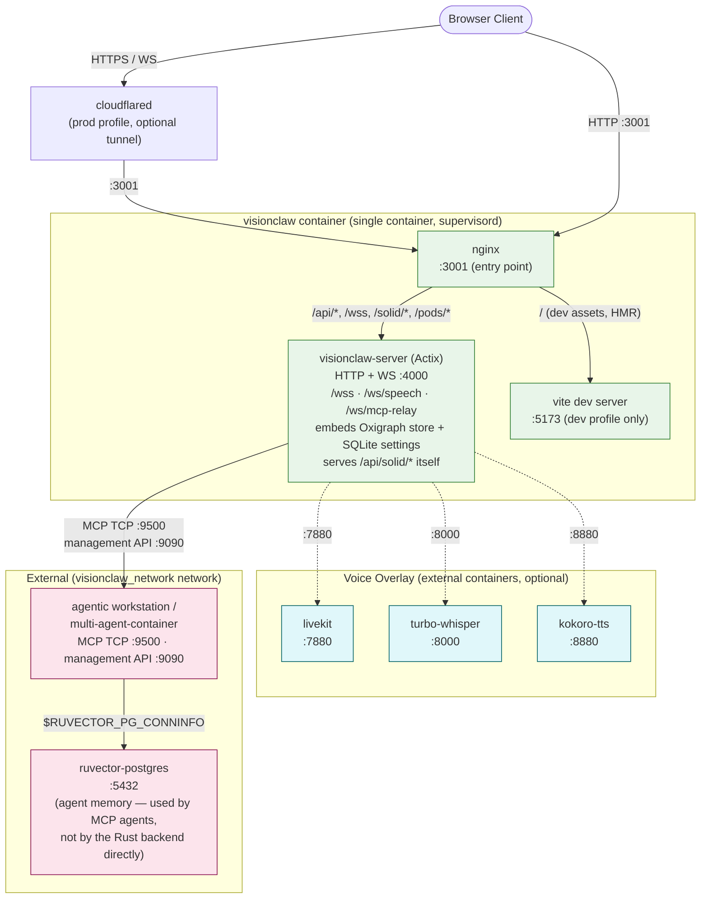
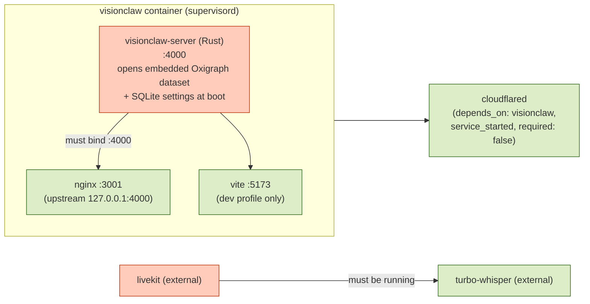
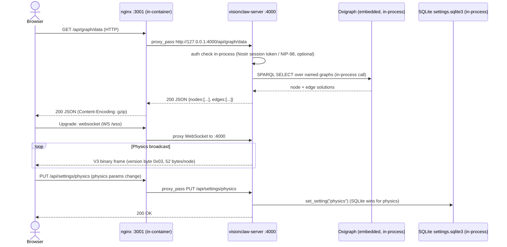

# Deployment Topology

VisionClaw runs as a composed set of Docker containers whose arrangement is not accidental — each boundary exists to enforce a specific isolation contract. This document explains what the topology looks like, why the dependency graph is shaped the way it is, and how data moves between services once a request enters the stack. Understanding this structure is prerequisite knowledge for diagnosing startup failures, planning capacity, and reasoning about what breaks when any individual service is unavailable.

The topology is intentionally layered: a reverse proxy sits at the perimeter, stateless compute services sit in the middle tier, and stateful data stores sit at the base. No browser client ever connects directly to a database. No database ever initiates a connection outward. This separation keeps the blast radius of any compromise small and makes TLS termination, auth enforcement, and rate limiting straightforward to apply at a single chokepoint.

---

## Service Map

> **UPDATED 2026-06-12.** Ground truth is `docker-compose.unified.yml`, which
> defines exactly three services: `visionclaw` (dev profile, ports
> `3001:3001` and `4000:4000`), `visionclaw-production` (prod profile, port
> `3001:3001`), and `cloudflared` (prod, optional). **nginx, the Rust
> backend, and the Vite dev server all run inside the single `visionclaw`
> container** under supervisord — they are not separate compose services.
> There are no `postgres`, `redis`, `qdrant`, `opensearch`, or `jss`
> services in the current compose: the backend has no relational-database
> client at all (graph store is embedded Oxigraph, settings are SQLite, and
> Solid pod routes are served by the backend itself at `/api/solid/*`).
> Voice services (`livekit:7880`, `turbo-whisper:8000`, `kokoro-tts:8880`)
> and `ruvector-postgres` are **external** containers on the shared
> `visionclaw_network`. Rows below describing other services are retained
> for historical context only.

The table below lists every service defined across the compose files. The `profile` column shows which Docker Compose profile activates the service — `dev` means it runs only during development, `prod` means production-only, and `all` means it runs under any profile invocation.

| Service | Port(s) | Role | Profile | depends_on |
|---------|---------|------|---------|------------|
| `nginx` | 3001 (HTTP) | Reverse proxy — routes `/api/*` to Actix-web, `/` to Vite; terminates TLS in prod | dev | visionclaw |
| `visionclaw` | 4000 (HTTP + WS: `/wss`, `/ws/speech`, `/ws/mcp-relay`) | Rust Actix-web backend (`visionclaw-server` binary, `visionclaw_container`) — graph API, physics orchestration, WebSocket binary stream. Embeds the Oxigraph RDF triple store in-process (ADR-11) and SQLite settings; connects out to the agent container's MCP TCP server (:9500). No relational-database dependency | dev, prod | — |
| `vite` | 5173 (HTTP), 24678 (WS HMR) | Vite dev server — Three.js/React frontend with Hot Module Replacement | dev | visionclaw |
| `jss` | 3030 (HTTP), 9090 (Solid WS) | JavaScript Solid Server — Linked Data Platform for per-user RDF pods | all | visionclaw |
| `solid-pod` | 9090 (HTTP) | Solid pod storage endpoint (separate from JSS in some deployments) | prod | jss |
| `postgres` | 5432 (TCP) | PostgreSQL 16 — relational store for application state, session data, RBAC | all | — |
| `redis` | 6379 (TCP) | Redis 7 — session cache, rate-limit counters, pub/sub for physics convergence events | all | — |
| `qdrant` | 6333 (HTTP REST), 6334 (gRPC) | QDrant vector database — embedding-based similarity search for knowledge retrieval | all | — |
| `opensearch` | 9600 (HTTP) | OpenSearch — full-text search across markdown knowledge base | all | — |
| `livekit` | 7880 (HTTP/WS signaling), 7881 (TCP RTC), 7882 (UDP media) | WebRTC room server for voice overlay | dev, prod (voice overlay) | — |
| `turbo-whisper` | 8100 (HTTP/WS) | Speech-to-text — Whisper inference endpoint for voice transcription | dev, prod (voice overlay) | livekit |
| `kokoro-tts` | 8880 (HTTP) | Text-to-speech — Kokoro inference endpoint for voice synthesis | dev, prod (voice overlay) | — |
| `cloudflared` | — (outbound only) | Cloudflare Tunnel — exposes local dev stack to a public HTTPS URL without port forwarding | dev (optional) | nginx |
| `ruvector-postgres` | 5432 (TCP, external network `visionclaw_network`) | External RuVector PostgreSQL instance — MiniLM-L6-v2 384-dim vector store for agent memory | all (external) | — |

> Note: `ruvector-postgres` is an **external** service on the `visionclaw_network` network. It is not started by VisionClaw's compose files — it must be running before the stack starts. The Rust backend and MCP agents connect to it via `$RUVECTOR_PG_CONNINFO`.

---

## Network Architecture

The following diagram shows all services as nodes. Solid arrows represent active connections initiated by the tail service. Port labels show the listening port on the target. Dashed arrows indicate optional or profile-conditional connections.



In development, Nginx proxies both the Vite dev server (for the frontend) and the Actix-web API, presenting a unified origin at `:3001`. This avoids CORS issues during development without requiring any special client configuration. In production, Vite is replaced by pre-built static assets served directly by Nginx, so the Vite container is not present.

---

## Service Dependency Chain

Startup ordering happens **inside** the single `visionclaw` container (supervisord), not between compose services: the Rust backend opens its embedded Oxigraph dataset and populates it from local files at startup; nginx and the Vite dev server come up alongside it and proxy to `:4000` once the backend binds. The only compose-level dependency is `cloudflared → visionclaw` (`condition: service_started, required: false`).



The critical path at startup is:

1. The `visionclaw` container starts; inside it the Rust backend opens its embedded Oxigraph dataset and populates it from local files before serving graph data. (There is no graph-database container — ADR-11. There is no relational database dependency; the backend has no PostgreSQL client.)
2. nginx (`:3001`) and, in the dev profile, the Vite dev server (`:5173`) proxy to the backend on `:4000`.
3. `cloudflared` (prod, optional) starts after the `visionclaw` container.
4. External voice containers (`livekit`, `turbo-whisper`, `kokoro-tts`) start independently of the compose stack; `turbo-whisper` needs `livekit`.

If the embedded Oxigraph store fails to populate at startup, the backend enters a **DEGRADED** state (it does not silently serve empty graph data) — see `app_state.set_degraded(...)` in `src/main.rs` and the `/readyz` readiness probe.

---

## Data Flow Between Services

The sequence diagram below traces a complete browser request for the main knowledge graph through the stack and back.



Key observations from this flow:

- **Auth is checked in-process** — the backend issues UUID session bearer tokens after NIP-98 verification (`nostr_service.rs`) and holds session state itself. There is no Redis hop on the hot path (a `redis` integration exists only behind an optional cargo feature).
- **Graph data comes from the embedded Oxigraph triple store** (ADR-11), queried in-process via SPARQL over named graphs — there is no network round-trip to a separate graph-database container. Live node positions are held in RAM by the physics actors and only snapshotted back to Oxigraph periodically; the hot loop never reads positions back from Oxigraph (cold start does, so layout resumes rather than restarting).
- **Physics position data flows over the `/wss` WebSocket**, not HTTP polling. The current wire format is **V3** (`docs/binary-protocol.md`): a version byte `0x03` followed by 52-byte node records (id+flags, position, velocity, SSSP distance/parent, cluster id, anomaly score, community id, centrality).
- **Settings persist to SQLite** (`SqliteSettingsRepository`); SQLite wins for physics parameters. Agent memory writes to RuVector happen from the MCP agent tooling (which owns the MiniLM-L6-v2 embedding pipeline), not from the Rust backend.

---

## Profile System

Docker Compose profiles allow a single compose file to describe multiple deployment configurations. VisionClaw uses three profiles.

### `dev` Profile

Activated with `--profile dev`. Starts:

- `nginx` (reverse proxy on :3001)
- `visionclaw` (`visionclaw-server` Rust backend, compiled on startup from source — allow ~5 minutes on first run; embeds the Oxigraph store in-process)
- `vite` (dev server with HMR on :5173 and :24678)
- `postgres`
- `redis`
- `qdrant`
- `opensearch`
- `jss` (optional Solid sidecar)
- `cloudflared` (optional, if `CLOUDFLARE_TUNNEL_TOKEN` is set)

The dev profile mounts the source tree as bind volumes so that Rust recompilation and Vite HMR reflect code changes without image rebuilds. The tradeoff is that the first cold start is slow because Cargo must compile the full Rust workspace inside the container.

```bash
docker compose -f docker-compose.unified.yml --profile dev up -d
```

### `prod` Profile

Activated with `--profile prod`. Starts:

- `nginx` (serving pre-built static assets + proxying API)
- `visionclaw` (pre-compiled `visionclaw-server` binary baked into the image — starts in seconds; embeds the Oxigraph store in-process)
- `postgres`, `redis`, `qdrant`, `opensearch`
- `jss`

No Vite container runs in production. Static assets are built during the image build step (`npm run build`) and copied into the Nginx image layer. The Rust binary is also compiled at image build time, not at container startup.

```bash
docker compose -f docker-compose.unified.yml --profile prod up -d
```

### Voice Overlay (compose file overlay)

The voice pipeline is not a profile but a separate compose file overlay. It adds `livekit`, `turbo-whisper`, and `kokoro-tts` to whichever profile is active.

```bash
# Development with voice
docker compose \
  -f docker-compose.unified.yml \
  -f docker-compose.voice.yml \
  --profile dev up -d

# Production with voice
docker compose \
  -f docker-compose.unified.yml \
  -f docker-compose.voice.yml \
  --profile prod up -d
```

The voice overlay requires additional environment variables: `LIVEKIT_API_KEY`, `LIVEKIT_API_SECRET`, and `LIVEKIT_URL`. See [Environment Variables Reference](../reference/configuration/environment-variables.md) for the full list.

### XR Profile (`docker-compose.vircadia.yml`) — DEPRECATED

> **Deprecated**: Vircadia has been removed from the stack. The XR client is now a native Godot 4 APK that connects directly to the VisionClaw backend via the binary protocol WebSocket and presence WebSocket. See [XR Architecture](xr-architecture.md) and [ADR-071](../adr/ADR-071-godot-rust-xr-replacement.md). This compose file will be removed in a future release.

---

## Volume Mounts

Persistent data is managed through named Docker volumes. Bind mounts (host path → container path) are used only in the `dev` profile for source code and configuration files.

### Named Volumes

| Volume | Container path | Purpose | Profile |
|--------|---------------|---------|---------|
| `postgres_data` | `/var/lib/postgresql/data` in `postgres` | PostgreSQL data directory — all relational tables | all |
| `redis_data` | `/data` in `redis` | Redis persistence (AOF or RDB snapshots) | all |
| `visionclaw_data` | `/app/data` in `visionclaw` | Application data — downloaded markdown, metadata, processed knowledge files, **and the embedded Oxigraph dataset** (`/app/data/oxigraph/`, RocksDB column families — ADR-11) | all |
| `visionclaw_logs` | `/app/logs` in `visionclaw` | Rust tracing output, Nginx access logs | all |
| `npm-cache` | `/root/.npm` in `visionclaw` | npm package cache (speeds up reinstalls) | dev |
| `cargo-cache` | `/usr/local/cargo/registry` in `visionclaw` | Cargo registry cache (avoids re-downloading crates) | dev |
| `cargo-target-cache` | `/app/target` in `visionclaw` | Rust build artifact cache (incremental compilation) | dev |
| `jss_pods` | `/data/pods` in `jss` | JavaScript Solid Server pod storage — per-user RDF/Turtle files | all |
| `qdrant_storage` | `/qdrant/storage` in `qdrant` | QDrant collections and vector index data | all |
| `opensearch_data` | `/usr/share/opensearch/data` in `opensearch` | OpenSearch index shards | all |

### Dev Bind Mounts

In the `dev` profile, the following host directories are mounted read-write into containers:

| Host path | Container path | Service | Purpose |
|-----------|---------------|---------|---------|
| `./client/src` | `/app/client/src` | `visionclaw` | TypeScript/React source for Vite HMR |
| `./src` | `/app/src` | `visionclaw` | Rust source for cargo-watch recompilation |
| `./config` | `/app/config` (read-only) | `visionclaw` | Runtime configuration files |
| `./data` | `/app/data` | `visionclaw` | Development data directory |

> Cargo build caches (`cargo-cache`, `cargo-target-cache`) are named volumes rather than bind mounts. This prevents the Linux container filesystem from interfering with macOS host filesystem case-sensitivity issues and keeps build artefacts inside the Docker volume subsystem where I/O performance is consistent.

---

## Scaling Considerations

Not all services can be scaled horizontally. The table below classifies each service and explains the constraint.

### Stateless Services (Horizontal Scale Permitted)

| Service | Scale strategy | Notes |
|---------|---------------|-------|
| `nginx` | Multiple replicas behind a load balancer | Session affinity not required — all state is in downstream stores |
| `visionclaw` HTTP handlers | Multiple replicas with a load balancer | Stateless per-request handlers; connection pool per replica |
| `turbo-whisper` | Multiple replicas, round-robin or GPU-affinity routing | GPU-bound; one replica per physical GPU is the practical limit |
| `kokoro-tts` | Multiple replicas | CPU or GPU-bound depending on model size |

When running multiple `visionclaw` replicas, the WebSocket physics broadcast path requires sticky sessions or a pub/sub fan-out layer (Redis pub/sub is already present). Each replica runs its own physics simulation actor; without coordination, different clients connected to different replicas will see different node positions. The recommended approach for multi-replica deployments is a single physics-authoritative instance behind a sticky load balancer for WebSocket connections, with HTTP API handlers freely distributed.

### Stateful Services (Singletons in Standard Deployment)

| Service | Constraint | Path to scale |
|---------|------------|--------------|
| Oxigraph store (embedded in `visionclaw`) | Single-writer RocksDB-backed triple store opened in-process; it is not a separate, independently scalable service (ADR-11) | Scaling the graph store means scaling the backend it lives inside — i.e. a single graph-authoritative `visionclaw` instance. A separately replicated SPARQL endpoint would be a future architecture change, not a config toggle |
| `postgres` | Single primary; read replicas possible with streaming replication | Patroni or Citus for HA; PgBouncer for connection pooling at scale |
| `redis` | Single instance in default config | Redis Cluster or Redis Sentinel for HA; Valkey is a drop-in alternative |
| `qdrant` | Single node in default config | QDrant distributed mode with a collection replication factor ≥ 2 |
| `opensearch` | Single node in default config | OpenSearch cluster with dedicated data and coordinating nodes |
| `jss` | Pod storage is on a named volume tied to the single instance | Solid pod replication requires a shared storage backend (NFS, S3-compatible) |
| `livekit` | Stateful room server; participants connect to a specific room | LiveKit Cloud or LiveKit distributed mode with Redis-backed room registry |
| `ruvector-postgres` | External singleton; owns the embedding pipeline | Patroni HA + read replicas for the vector store; write path must remain single-primary |

The GPU physics engine (`visionclaw` with CUDA) is a special case. The `ForceComputeActor` self-initialises GPU context at startup and broadcasts positions to all connected clients. This actor is inherently stateful and single-instance per deployment. Horizontal scaling of the physics engine would require partitioning the graph across GPU workers and a synchronisation protocol for cross-partition edge forces — this is not implemented in the current architecture.

---

## Cross-References

For step-by-step deployment instructions, environment variable values, and troubleshooting commands, see:

- [Deployment Guide](../how-to/deployment-guide.md) — prerequisites, quick start, profile activation commands, production hardening checklist
- [Docker Compose Options Reference](../reference/configuration/docker-compose-options.md) — full YAML snippets for every service configuration option, GPU setup, resource limits, logging drivers
- [Environment Variables Reference](../reference/configuration/environment-variables.md) — complete variable table with types, defaults, and examples for all services
- [System Overview](./system-overview.md) — higher-level architectural context, technology choices, and bounded context diagram
- [Security Model](./security-model.md) — how authentication, authorisation, and network isolation are enforced across the topology
- [RuVector Integration](./ruvector-integration.md) — detailed explanation of the external vector memory service, embedding pipeline, and HNSW search behaviour
