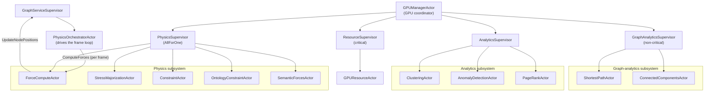
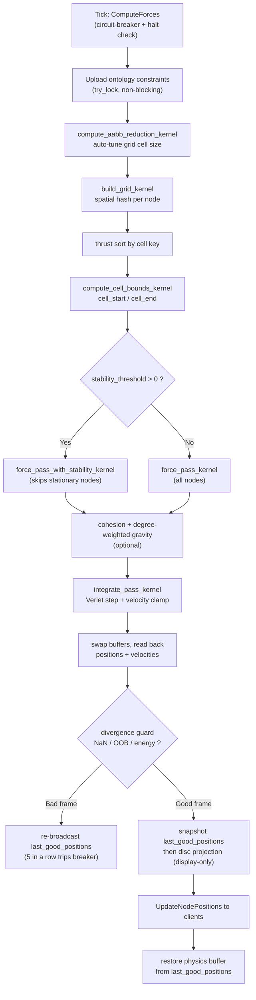

# Physics and GPU Engine

> [VisionClaw Docs](../README.md) · [Explanation](README.md) · Physics and GPU Engine

VisionClaw lays out the knowledge graph in 3-D space with a force-directed
simulation that runs on the GPU. The server owns the simulation: it is the single
source of truth for every node position, and clients only ever receive and render
position updates. This page explains how the engine is structured — the CUDA
kernel inventory, the supervised actor tree that drives it, the per-frame force
pipeline, the analytics that ride on the same GPU context, and the broadcast loop
that keeps clients consistent.

For the exact tunable parameters and their bounds, see
[Physics Parameters](../reference/physics-parameters.md). For the wire encoding,
see [Binary Protocol](../reference/binary-protocol.md).

---

## Why the GPU

Force-directed layout is dominated by node-node repulsion, which is naively
O(n²) per frame. At interactive scale this is the difference between a usable
graph and a slideshow:

| Stage | 100K nodes, CPU (Rayon) | 100K nodes, GPU (CUDA) |
|-------|-------------------------|------------------------|
| One force step | ~246 ms | ~4.5 ms |
| Effective frame rate | ~4 FPS | ~222 FPS |

That is a **55× speedup** end-to-end, drawn from three sources working together:
massive thread-level parallelism, the GPU's order-of-magnitude higher memory
bandwidth, and a spatial-hash grid that reduces the repulsion pass from O(n²) to
near O(n). A Rayon + SIMD CPU path exists as a fallback and stays interactive up
to roughly 10K nodes, but real-time layout of the full graph requires the GPU.

The simulation is adaptive: it runs at up to 60 Hz while the layout is settling
and drops to a low idle rate once kinetic energy falls below the stability
threshold, so a stable graph costs almost nothing to maintain.

---

## CUDA kernel inventory

The GPU code lives in `crates/visionclaw-gpu/src/cuda_sources/` and is the
canonical, exhaustive inventory: **82 `__global__` kernels across 9 `.cu` files,
5,854 lines of CUDA**. The kernels split into the core physics path, the
ontology-aware semantic forces, and the GPU-resident analytics suite.

| File | Kernels | LOC | Role | Owning actor(s) |
|------|--------:|----:|------|-----------------|
| `visionclaw_unified.cu` | 27 | 2,300 | Grid build, force pass (classic + stability variant), Verlet integration, kinetic-energy + stability checks, degree-weighted gravity, semantic blend | `ForceComputeActor` |
| `gpu_clustering_kernels.cu` | 24 | 1,231 | K-Means, Louvain community detection, DBSCAN, LOF / z-score anomaly, stress majorization, SSSP edge relax | `ClusteringActor`, `AnomalyDetectionActor`, `StressMajorizationActor`, `ShortestPathActor` |
| `semantic_forces.cu` | 15 | 911 | DAG layering, type / role / physicality / maturity clustering, attribute springs, collision | `SemanticForcesActor`, `OntologyConstraintActor` |
| `pagerank.cu` | 7 | 515 | PageRank with dangling-mass handling and convergence check | `PageRankActor` |
| `gpu_connected_components.cu` | 3 | 184 | Label-propagation connected components | `ConnectedComponentsActor` |
| `gpu_landmark_apsp.cu` | 3 | 170 | Landmark APSP, Barnes-Hut stress majorization | `ShortestPathActor`, `StressMajorizationActor` |
| `sssp_compact.cu` | 2 | 107 | SSSP frontier compaction (atomic + scan) | `ShortestPathActor` |
| `gpu_aabb_reduction.cu` | 1 | 110 | AABB reduction for spatial-grid auto-sizing | `ForceComputeActor` |
| `dynamic_grid.cu` | 0 | 326 | `__device__` grid helpers (no launchable kernels) | shared |
| **Total** | **82** | **5,854** | | |

All kernels share a single `UnifiedGPUCompute` context behind an
`Arc<Mutex<…>>`. Physics and analytics actors lock the *same* mutex, which is why
analytics work is scheduled between physics steps rather than concurrently with
them, and why an analytics panic inside the critical section can stall the
physics loop. The supervision tree below exists to isolate and recover from
exactly that class of failure.

---

## The GPU actor tree

The GPU subsystem is **16 Actix actors** organised as a supervision tree. The
physics loop is driven from the service layer: `GraphServiceSupervisor` owns the
`PhysicsOrchestratorActor`, which ticks the `ForceComputeActor` once per frame.
Underneath, `GPUManagerActor` coordinates four subsystem supervisors that own the
GPU worker actors and isolate faults between subsystems.

### Restart policies

Each supervisor picks a recovery policy matched to how coupled its children are:

- **PhysicsSupervisor — AllForOne.** Physics state is interdependent: a failed
  `ForceComputeActor` invalidates cached constraint and semantic buffers held by
  its siblings. On any child failure the supervisor re-spawns all five physics
  actors together and re-wires the `OntologyConstraintActor` to the fresh
  `ForceComputeActor` address.
- **ResourceSupervisor — critical.** GPU initialisation is a prerequisite for
  everything else; failure here escalates rather than silently degrading.
- **AnalyticsSupervisor / GraphAnalyticsSupervisor — non-critical, isolated.**
  The analytics algorithms are independent of one another, so a single failure is
  contained and restarted without disturbing the physics path.

The 16 actors are: the two service-layer drivers (`GraphServiceSupervisor`,
`PhysicsOrchestratorActor`) are counted separately from the GPU module; within
the GPU module the count is `GPUManagerActor`, four supervisors
(`ResourceSupervisor`, `PhysicsSupervisor`, `AnalyticsSupervisor`,
`GraphAnalyticsSupervisor`), `GPUResourceActor`, the five physics actors, the
three analytics actors, and the two graph-analytics actors. See the
[Actor Hierarchy](actor-hierarchy.md) for the full system-wide tree.

---

## The per-frame force pipeline

One physics step is a fixed sequence of kernel launches inside a single mutex
critical section, run on a `spawn_blocking` thread so the blocking `std::sync`
lock never starves the Tokio executor. The orchestrator issues `ComputeForces`;
the actor returns projected positions for broadcast and a pristine,
un-projected physics buffer for the next step.

### Repulsion and spring laws

A single force kernel selects its force laws at runtime via `c_params`, so there
is no compile-time fork between layout modes:

- **Repulsion.** With `lin_log_mode = 1` and node degrees available, the kernel
  uses the ForceAtlas2 degree-scaled law `scaling_ratio·(d_i+1)·(d_j+1)/dist`;
  otherwise it uses the classic `repel_k / (dist² + ε)`.
- **Springs.** With `lin_log_mode = 1` the attraction is
  `log1p(dist)·edge_weight·spring_scale` (LinLog / FA2); with `lin_log_mode = 0`
  it is `spring_k·(dist − rest_length)·edge_weight·spring_scale` (Hooke).

The stability variant of the force kernel adds a per-node early exit for nodes
whose velocity is below the stationary threshold — the dominant cost saving once
the graph begins to settle. Both kernels are live; selection is driven entirely
by `stability_threshold`.

### Integration and clamping

Integration is Verlet with a configurable timestep and velocity damping to
suppress oscillation. Velocity is clamped on the GPU against the user-configurable
`max_velocity`, and again on the host against a hard `MAX_VELOCITY_MAGNITUDE`
backstop after readback. The divergence guard rejects any frame containing NaN /
Inf, positions beyond `MAX_COORD`, velocities beyond the magnitude cap, or a mean
kinetic energy above `MAX_KINETIC_ENERGY`; five consecutive bad frames trip a
circuit breaker that re-broadcasts the last good positions and pauses integration.

The canonical defaults for every parameter referenced here live in
[Physics Parameters](../reference/physics-parameters.md); the engine never
hard-codes literals on the hot path.

---

## Pinned nodes and the force-channel registry

Two structural additions sit alongside the force pipeline: a GPU-resident mask that
freezes individual nodes, and an enumerable registry that names every force term.

### Pinned-node mask

Interactive drags and layout pins need a node held at a fixed position without
freezing the rest of the graph. The engine carries a per-node **pinned mask**
(`pinned_mask: DeviceBuffer<i32>`, `src/utils/unified_gpu_compute/construction.rs`)
uploaded from the host via `upload_pinned_mask` (`memory.rs:151`): `0` = free,
non-zero = pinned. The mask is handed to the integrate kernel
(`execution.rs`, `pinned_mask.as_device_ptr()`), which **skips integration for a
pinned node** — holding it at its host-supplied position — while the node still
exerts repulsion and spring forces on its neighbours, so a dragged or pinned node
perturbs the layout around it exactly as expected. The host source of truth is
`PhysicsOrchestratorActor::user_pinned_nodes` (`src/actors/physics_orchestrator_actor.rs`),
populated by `PinNodePositions` from server-authoritative drags. The mask slice is
padded to the allocated buffer length with `0`, so over-allocated trailing slots
never read as pinned. This is the pinned-node half of
[ADR-138](../adr/ADR-138-gpu-force-channel-registry.md).

### Force-channel registry

The layout's force terms are configured through a flat, `repr(C)`, 180-byte
`SimParams` struct of ad-hoc scalars (`repel_k`, `spring_k`, `center_gravity_k`, …)
plus a `feature_flags` bitset. That layout offers no enumerable "what channels
exist, are they on, and how strong are they" view, and nothing forces a new kernel
term to be registered anywhere. [ADR-138](../adr/ADR-138-gpu-force-channel-registry.md)
adds a **named force-channel registry** as a *mapping layer* over the existing
struct — the migration seam toward an eventual array-backed `SimParams`, with **zero**
change to the struct layout, the CUDA kernels, or the settings wire.

The registry is a bounded `ForceChannel` enum (`src/models/force_channels.rs`) whose
`ALL` array enumerates the ten live channels in a stable order: **Repulsion,
Separation, Spring, Centering, Gravity, ClusterCohesion, Constraints, DagRadialBias,
Annealing, Boundary**. Each channel maps to the *existing* backing scalar
(`strength_of`) and, where applicable, a `FeatureFlags` bit (`feature_flag`);
`ForceChannel::state` reads a `{enabled, strength}` view out of `SimParams` — flag-
gated channels reflect their bit, the rest reflect `strength > 0` (the same test the
kernels apply) — and `ForceChannel::apply` writes it back preserving kernel
semantics. When the array-backed refactor lands, only the bodies of `state`/`apply`
change; every caller keeps working. The `DagRadialBias` channel (`dag_bias_k`, fed by
the per-node DAG rank in `upload_node_rank`) is the GPU term the radial layout modes
of [ADR-141](../adr/ADR-141-constrained-layout-engine-programme.md) re-key.

### Render offload and runtime quality dials

[ADR-137](../adr/ADR-137-xr-render-offload-and-runtime-quality-dials.md) is a client-
side decision but it changes two things this engine's output must respect. First,
**runtime-derived instance budgets**: clients now size their node/edge draw budgets
from the received topology (bounded by a safety ceiling) rather than the old
hardcoded caps, so the engine's full broadcast is not silently clipped downstream.
Second, **initial-load quality is a settings dial** — `initialNodeLimit`
(`/api/settings/physics`) replaces the compiled-in initial node limit, and full-3D
layout is the default (`axisCompressionZ` removed; the dual-disc flatten is opt-in).
The immersive client offloads its per-frame position-hunt and buffer packing to a
Rust `RenderStore` (`xr-client/rust/src/render_store.rs`); see
[XR Architecture](xr-architecture.md) for that path. The server-side display-only
disc projection described below is unchanged.

---

## Semantic forces from the ontology

The base physics layout is shaped by the OWL ontology. The `SemanticForcesActor`
and `OntologyConstraintActor` translate class axioms into GPU forces so that the
spatial layout reflects the knowledge structure, not just edge connectivity:

- **Hierarchy and clustering** — DAG layering by subclass depth, plus type,
  role, physicality and maturity clustering that pull nodes of the same OWL class
  toward a shared centroid.
- **Axiom-derived constraints** — `DisjointWith` becomes separation repulsion,
  `SubClassOf` becomes a hierarchical attraction spring, `EquivalentClasses` and
  `SameAs` become colocation, `PartOf` becomes a containment boundary.
- **Attribute springs and collision** — edge weights become semantic spring
  strengths; size-aware collision keeps large nodes from overlapping.

Semantic forces and base physics forces are computed independently (both read
positions, neither writes during the pass) and then combined by the
`blend_semantic_physics_forces` kernel under a priority weight. NaN / Inf guards
fall the blend back to pure physics if semantic forces diverge, and constraints
ramp in over a configurable number of frames to avoid destabilising the layout
when the ontology loads. See the [Ontology Pipeline](ontology-pipeline.md) for
how axioms reach the GPU.

---

## GPU-resident analytics

The same GPU context that runs physics also runs the analytics suite, scheduled
between physics steps so it never contends with a frame. Per ADR-031 each
algorithm writes exactly one field of the per-node analytics record, which the
binary protocol then ships to clients alongside positions:

| Algorithm | Actor | Wire field | Kernels |
|-----------|-------|------------|---------|
| K-Means clustering | `ClusteringActor` | `cluster_id` | `gpu_clustering_kernels.cu` |
| Louvain community detection | `ClusteringActor` | `community_id` | `gpu_clustering_kernels.cu` |
| PageRank centrality | `PageRankActor` | `centrality` | `pagerank.cu` |
| LOF / z-score anomaly | `AnomalyDetectionActor` | `anomaly_score` | `gpu_clustering_kernels.cu` |
| SSSP shortest paths | `ShortestPathActor` | `sssp_distance`, `sssp_parent` | `sssp_compact.cu`, `gpu_clustering_kernels.cu`, `gpu_landmark_apsp.cu` |
| Connected components | `ConnectedComponentsActor` | (server-side) | `gpu_connected_components.cu` |

SSSP distances feed back into the layout: when the SSSP spring-adjust flag is
active, graph-distance is used to set spring rest lengths so the Euclidean layout
better reflects geodesic distance. The single-writer-per-field rule from ADR-031
is what makes it safe for these independent algorithms to share one analytics
record without races. See [ADR-031](../adr/ADR-031-gpu-analytics-correctness-and-wiring.md)
for the correctness and wiring decisions.

---

## Delivering positions to clients

After each good step the actor applies a display-only disc projection (described
in [System Overview](system-overview.md) and the architecture diagrams), sends
`UpdateNodePositions` up to `GraphServiceSupervisor`, then restores the
un-projected physics buffer so the next step integrates from pristine state. The
GPU buffers are never touched by the projection.

Positions reach clients as a compact binary frame; the current default is the V4
delta encoding, with the V3 52-byte full record (`BINARY_NODE_SIZE_V3`) as the
non-delta baseline. The encoder packs node id, position, velocity, and the
analytics fields above. Full layouts are in [Binary Protocol](../reference/binary-protocol.md)
and the framing in [WebSocket Protocol](../reference/websocket-protocol.md).

### Periodic full broadcast

Delta compression filters out nodes that have not moved. Once the layout
converges, *every* node stops moving and a pure delta stream sends nothing — so a
client that connects after convergence would receive no positions at all. The
engine guards against this with a **periodic full broadcast every 300 iterations**,
checked on both the "some nodes moving" and "all nodes converged" branches. This
caps the worst-case wait for a late-joining client at 300 frames, independent of
whether the graph is still settling. The warm-up window (the first several hundred
frames) settles the initial layout at full strength before the idle rate takes
over.

---

## Build and hardware notes

The CUDA sources are compiled by `build.rs`, which post-processes the emitted PTX
to keep it loadable on the deployed driver — newer `nvcc` toolchains emit a PTX
ISA version the runtime driver rejects, so `build.rs` downgrades the
`.version` directive to prevent `CUDA_ERROR_INVALID_PTX` at module load. In
multi-stage Docker builds the target architecture must be promoted from `ARG` to
`ENV` so it propagates into child stages; otherwise the kernels compile for the
wrong compute capability. On CachyOS hosts the toolkit lives at `/opt/cuda`, not
`/usr/local/cuda`. The crate boundaries that keep this GPU code isolated behind
ports are set out in [ADR-090](../adr/ADR-090-hexagonal-crate-modularisation.md).

When no CUDA device is available the engine falls back to a Rayon + SIMD CPU path
(AVX2 / SSE4.1 with a scalar fallback for non-x86), which stays interactive up to
roughly 10K nodes. Above that, the GPU is required for sub-frame step times.

---

## See also

- [System Overview](system-overview.md) — where the physics engine sits in the whole system
- [Actor Hierarchy](actor-hierarchy.md) — the full supervised actor tree
- [Backend Architecture](backend-architecture.md) — the service layer that drives the physics loop
- [Ontology Pipeline](ontology-pipeline.md) — how OWL axioms become GPU constraints
- [Physics Parameters](../reference/physics-parameters.md) — every tunable and its bounds
- [Binary Protocol](../reference/binary-protocol.md) · [WebSocket Protocol](../reference/websocket-protocol.md) — how positions reach clients
- Governing ADRs: [ADR-031 — GPU Analytics Correctness and Wiring](../adr/ADR-031-gpu-analytics-correctness-and-wiring.md), [ADR-090 — Hexagonal Crate Modularisation](../adr/ADR-090-hexagonal-crate-modularisation.md), [ADR-137 — XR Render Offload and Runtime Quality Dials](../adr/ADR-137-xr-render-offload-and-runtime-quality-dials.md), [ADR-138 — GPU Force-Channel Registry](../adr/ADR-138-gpu-force-channel-registry.md), [ADR-141 — Constrained-Layout Engine Programme](../adr/ADR-141-constrained-layout-engine-programme.md)
