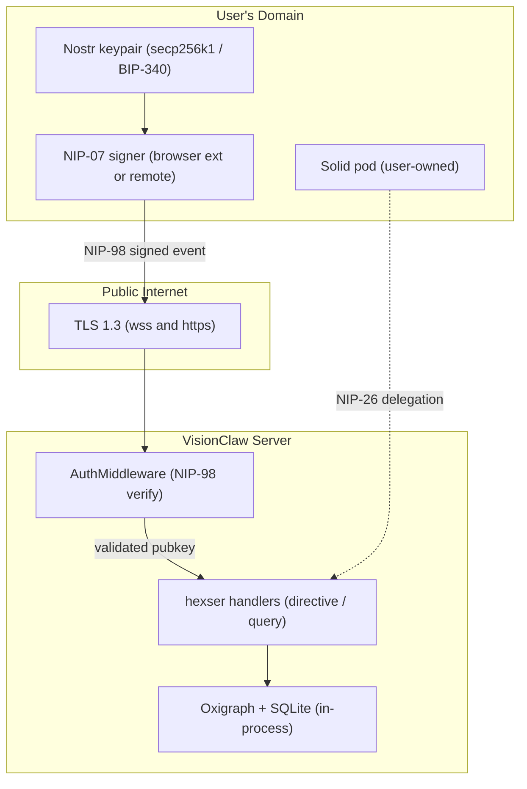
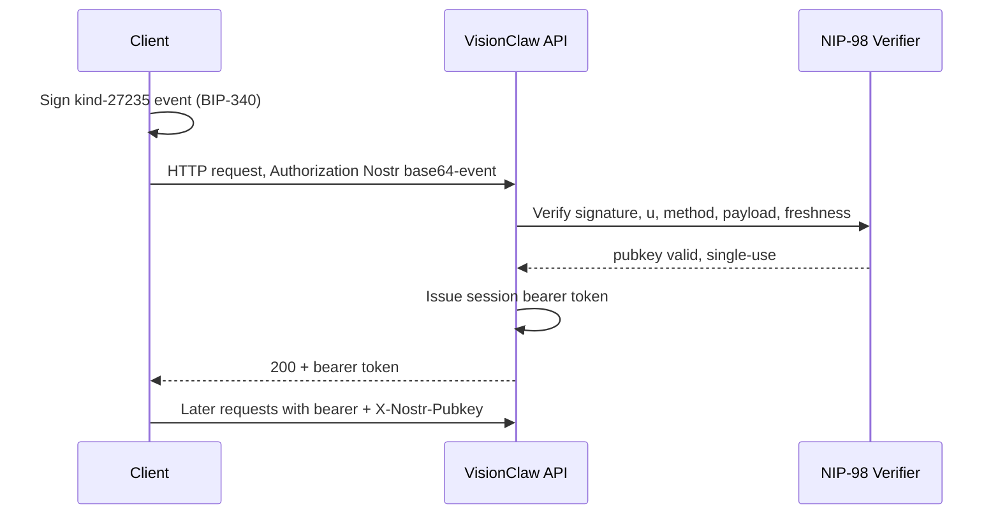
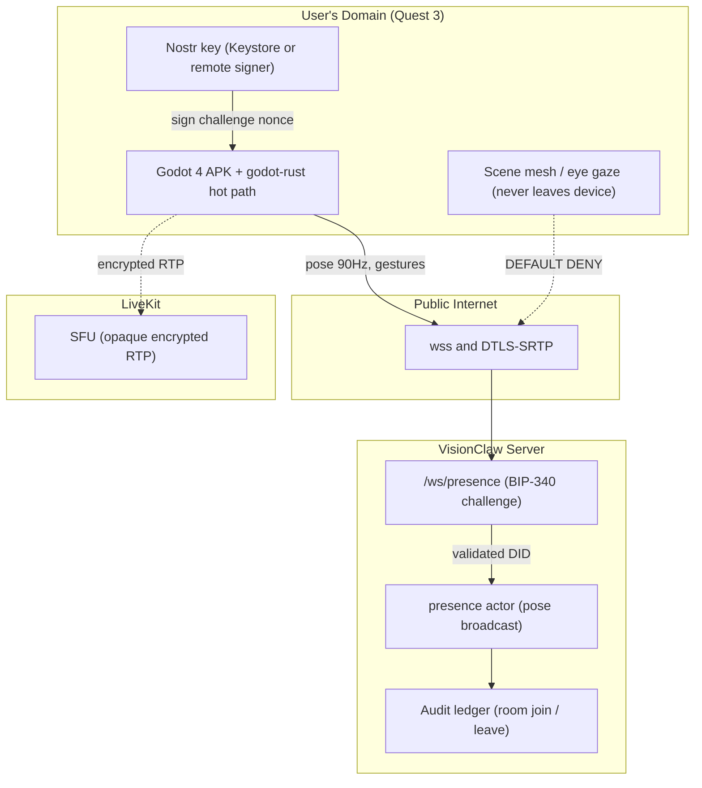

# VisionClaw Security Model

> [VisionClaw Docs](../README.md) · [Explanation](README.md)

VisionClaw has no central credential store, no password database, and no
server-held private keys. Identity is a Nostr keypair the user controls;
personal data lives in the user's own Solid pod; authorisation is enforced at
the handler boundary inside the backend. This document explains the model, the
threats it defends against, and the constraints it deliberately accepts.

---

## 1. Security philosophy

Three principles shape every decision below.

**Decentralised identity.** Identity is rooted in a secp256k1 Nostr keypair.
The public key (`npub` / hex) is the user's stable, self-certifying identifier
across the entire system. There is no authentication server holding secrets to
steal — a user's identity *is* their private key.

**Data sovereignty.** User-generated overlays, agent memories and personal
preferences live in the user's Solid pod, not in the shared graph store. The
server cannot read pod data without an active, user-granted delegation.
Revoking the delegation removes the server's access immediately.

**Semantic governance.** The OWL ontology layer expresses coarse-grained access
patterns at query time. Node types (knowledge, ontology, agent) carry class
flags in their IDs; handlers inspect those flags before mutating. Access rules
are ontology constraints, not ad-hoc checks scattered through the codebase.

### Trust boundary



The dashed edge is an optional, user-initiated delegation. The server never
holds the user's private key.

---

## 2. Authentication

### Nostr keypairs and BIP-340

Keys use secp256k1 — the curve Bitcoin uses. The private key is a 32-byte
scalar; the public key is its compressed point. All Nostr signatures are
**BIP-340 Schnorr** signatures over that curve. The same signature primitive
underlies every authentication path in VisionClaw: NIP-98 HTTP auth, the XR
presence handshake, and NIP-26 delegations. VisionClaw never generates a key on
the user's behalf.

### NIP-07 browser signing

In the browser the private key never enters VisionClaw's JavaScript. A NIP-07
extension (Alby, nos2x) — or a remote signer — holds the key and exposes
`window.nostr.signEvent()`. The client constructs the event to sign and hands it
to the extension; only the signed result returns. This keeps the key off the
page origin and out of `localStorage`, so an XSS payload cannot exfiltrate it.

### NIP-98 HTTP authentication

NIP-98 is a Nostr-native HTTP scheme. The client builds a kind-27235 event,
signs it (BIP-340), base64-encodes it, and sends it as an `Authorization`
header. No password or shared secret is involved.

| Tag | Meaning | Required |
|-----|---------|----------|
| `u` | Full request URL including query string | Always |
| `method` | HTTP method, uppercase (`GET`, `POST`, …) | Always |
| `payload` | SHA-256 hex digest of the request body | POST / PUT only |

Server-side validity gates:

- `created_at` within 60 seconds of server clock (replay window).
- Schnorr signature over the event ID verifies against the embedded `pubkey`.
- Single-use: a short-lived replay cache keyed on event ID rejects re-sends.

```typescript
import { finishEvent } from 'nostr-tools';

const authEvent = finishEvent({
  kind: 27235,
  created_at: Math.floor(Date.now() / 1000),
  tags: [
    ['u', 'https://api.example.com/api/settings/bulk'],
    ['method', 'POST'],
    ['payload', sha256HexOfBody],
  ],
  content: '',
}, privateKey);

const authHeader = `Nostr ${btoa(JSON.stringify(authEvent))}`;
```



### Session bearer tokens

A full NIP-98 signature on every request is wasteful for high-frequency calls.
After the first successful validation the server issues a session bearer token:

- Bound to the validated `pubkey`; rejected if presented with a mismatched
  `X-Nostr-Pubkey` header (ADR-011 rule 5 — the header is validated against the
  active session, never trusted raw).
- Lifetime from `AUTH_TOKEN_EXPIRY` (default 3600 s); no auto-refresh.
- Stored client-side; the client re-authenticates via NIP-98 after expiry.

```http
Authorization: Bearer <session_token>
X-Nostr-Pubkey: <hex_pubkey>
```

### DID resolution

The Nostr `pubkey` is treated as a lightweight, self-certifying DID
(`did:nostr:<hex>`). There is no external resolver call. The user's pod profile
at `…/profile/card` links the Nostr identity to a WebID via a `foaf:Person`
record, making the identity resolvable in Linked Data contexts.

### Why not JWT

The legacy email/password JWT login was removed: it needed a credential store
(an attack surface), JWTs had no revocation, and the shared signing secret was
routinely left at its insecure default. NIP-98 bootstraps sessions with **zero
server-side secrets** and built-in replay protection. The old JWT secret env
var is a dead relic — remove it from any compose file.

---

## 3. Authorisation

### Handler-boundary enforcement (no CQRS bus)

VisionClaw uses hexser command/query handlers — **19 `DirectiveHandler`**
(writes) and **25 `QueryHandler`** (reads). There is no central message bus
(ADR-089): each handler is invoked directly, and authorisation is enforced at
that boundary before the domain model is touched.

- **Directives** (POST/PUT/DELETE) require an authenticated session; the
  validated `pubkey` is injected and becomes the `author` of any state change.
- **Queries** (GET): graph and ontology reads are public-or-optional; settings
  and user-specific analytics require authentication.

`RequireAuth` middleware is applied at the route-scope level, not per handler
(ADR-011): WebSocket upgrades and mutating REST endpoints fail **closed** — no
"log and allow", and query-string token auth is disabled in production.

### Optional auth and visibility tiers

A binary authenticated/unauthenticated split cannot serve both a public
showcase graph and per-user private nodes. ADR-028-ext introduces an
`AccessLevel::Optional` variant gated by `NIP98_OPTIONAL_AUTH`:

| Caller | `/api/graph/data` sees |
|--------|------------------------|
| No `Authorization` header | `visibility = public` nodes only |
| Valid NIP-98 header | public nodes + own private nodes |
| Cross-user private nodes | opacified stubs (existence acknowledged, content redacted) |

An **invalid** header still returns 401 — optional means "may be absent", not
"may be wrong". The graph-store query filters on `visibility` and
`owner_pubkey`; cross-user private nodes are never silently dropped and never
leaked in full.

### Roles

**NIP-98 auth roles** (graph / settings / ontology handlers):

| Role | Assigned by | Capabilities |
|------|-------------|--------------|
| `ReadOnly` | Default / unauthenticated | Read public graph, view ontology hierarchy, health endpoints |
| `WriteGraph` | Authenticated pubkey | + create/update/delete graph nodes and edges |
| `WriteSettings` | Authenticated pubkey | + own settings, provision own pod |
| `Admin` | `pubkey` in `POWER_USER_PUBKEYS` | + physics params, force resync, admin diagnostics, ontology management |

Admin status is membership in a comma-separated env list resolved at startup —
no role is stored in a database, so there is no privilege escalation via data
mutation.

**Enterprise RBAC roles** (broker/governance handlers) layer a level hierarchy:
`Admin (4) > Broker (3) > Auditor (2) > Contributor (1)`. A request passes if
the caller's level is ≥ the required level. The `nip98-auth` Cargo feature
resolves the role from a verified NIP-98 pubkey; without it, the middleware
reads `X-Enterprise-Role` (dev / trusted-reverse-proxy mode).

### Auth-service consolidation (ADR-088)

Six auth modules (≈2,349 lines) grew independently. ADR-088 consolidates them
behind a single `AuthService` trait yielding an `AuthIdentity`
(`Nostr { pubkey, delegation }` / `Enterprise` / `Anonymous`), a
`CompositeAuthService` chain (Nostr → Enterprise → Anonymous), and one Actix
`AuthMiddleware`. Critically it **removes `SETTINGS_AUTH_BYPASS`**: dev mode
returns `AuthIdentity::Anonymous` for localhost origins under
`APP_ENV=development`, and no bypass path exists in production.

### Public vs protected operations

| Operation | Auth |
|-----------|------|
| `GET /api/graph/data` | Optional (anonymous → public tier) |
| `GET /api/ontology/hierarchy` | No |
| `GET /api/health/*` | No |
| `GET/PUT /api/settings/*` | Yes (own settings only) |
| `POST/DELETE /api/graph/*` | Yes, power user |
| `POST /api/bots/*` | Yes |
| Solid pod (`/solid/pods/{npub}/*`) | Yes, delegated NIP-26 token |
| WebSocket upgrade (`/wss`, `/ws/presence`) | Token / challenge at upgrade |

Node IDs encode type in their upper flag bits; handlers check the flag before
mutating (ontology nodes immutable to standard users; agent nodes mutable by
the owning pubkey only). Settings are keyed by `pubkey`, so there is no
cross-user settings leakage.

---

## 4. Data sovereignty (Solid pods)

### What lives where

| Data | Location | Why |
|------|----------|-----|
| Knowledge / ontology nodes | Shared in-process Oxigraph + SQLite | Public or organisation-wide |
| Physics / UI preferences | Settings, keyed by pubkey | Per-user preference |
| Agent episodic / semantic memory | User's Solid pod | User owns agent memory |
| Session summaries, WebID profile | User's Solid pod | Personal / self-sovereign |
| Delegation tokens | User's Solid pod (`/delegations/`) | User grants and revokes |

### Web Access Control

Each pod is provisioned with a `.acl` resource at its root following WAC (Web
Access Control) semantics. The default grant is:

- **Owner** (the `npub` WebID): read, write, append, control.
- **VisionClaw server WebID**: read, write, scoped to `agent-memory/`.
- **Public**: no access.

The Solid pod server (`solid-pod-rs`, port 8484) validates the delegation chain
on every request before honouring the WAC rule.

### NIP-26 delegation and revocation

1. User authenticates to VisionClaw via NIP-07.
2. VisionClaw mints an ephemeral, session-scoped agent keypair.
3. User signs a NIP-26 delegation: "delegate `{agent_pubkey}` until `{expiry}`".
4. The delegation is stored in the user's pod under `/delegations/`.
5. Agents sign NIP-98 requests to the pod server with the delegated key.
6. The pod server validates the delegation chain and grants access as the user.

On revocation or expiry the pod server rejects subsequent delegated requests;
agents lose access on the next call (403). No pod payload is cached server-side,
so the agent degrades gracefully to shared graph data only.

### GDPR posture

Personal data lives in the user's pod, so VisionClaw need not service deletion
requests for pod content — the user deletes it. The shared store holds only
public knowledge nodes. Server-side settings are keyed by a pseudonymous
`pubkey` and purgeable via `DELETE /api/settings/user`. The server **must not**
log pod payloads or setting values (§8).

---

## 5. Transport security

### TLS

All production traffic uses TLS 1.2+ (1.3 preferred), Mozilla Intermediate
cipher profile, with a trusted CA — no self-signed certificates in production.
HTTP redirects 80 → 443; WebSocket is `wss://` only (`ws://` permitted for
`localhost` in development); the pod server is served over HTTPS.

### WebSocket upgrade

The upgrade is validated before the connection is accepted:

1. `Upgrade: websocket` header present and correct.
2. Bearer token in the query string (`?token=…`) — the WebSocket API forbids
   custom headers at upgrade time.
3. `validate_session()` checks the token against the session store; invalid or
   expired tokens are rejected with 401 **before** the upgrade completes.
4. After upgrade the client sends an explicit `authenticate` message
   `{token, pubkey}`, re-validated server-side.
5. Connections that fail to authenticate within 5 seconds are closed.

Passing the token in the URL means it can appear in access logs and history.
Mitigation: short-lived tokens (`AUTH_TOKEN_EXPIRY=300` for WS sessions) and
strict WSS so the URL is never visible in transit.

### BIP-340 presence auth

The XR presence channel (`/ws/presence`) does not trust a claimed DID. Before
the upgrade succeeds the server issues a 32-byte random nonce; the client signs
`(nonce || ts)` with its Nostr key; the server verifies the **BIP-340 Schnorr**
signature against the claimed pubkey. The nonce is single-use within a
60-second window (mirroring the NIP-98 replay rule), so a captured handshake
cannot be replayed. This closes DID forgery (T-WS-1, §7) and fails closed per
ADR-011.

### Binary protocol

The position-update protocol carries only numeric node IDs and `f32`
position/velocity components — no pubkeys, no tokens, no identifying fields. An
eavesdropper learns only that nodes moved. The current default is the **V4
delta** format; the fixed **V3** layout uses a 52-byte node record
(`BINARY_NODE_SIZE_V3`), V2 used 36 bytes. The version byte is validated on
every frame; unknown versions are rejected, not truncated, and payload length
must match the declared node count exactly. Adding any per-frame field requires
an ADR superseding the protocol unification decision — enforced by a schema
snapshot test, so PII cannot accrete silently into the wire format.

### Input validation boundaries

Defensive validation at every untrusted edge:

| Boundary | Validation |
|----------|------------|
| WebSocket messages | `JSON.parse` in try/catch; malformed messages logged and discarded |
| Binary frames | Header size, declared-vs-actual length, version check, per-record multiple, truncation skip |
| Query responses | Request-ID matching, per-query timeout |
| Remote avatar data | Position/rotation parsed with null checks |
| Hand-tracking joints | Joint-array bounds check before mesh update |

### CSP and rate limiting

The client `index.html` ships a Content-Security-Policy restricting script,
style and connection sources — mitigating XSS and exfiltration in the WebXR
client. Rate limiting is per-IP at the gateway:

| Parameter | Default | Env var |
|-----------|---------|---------|
| Window | 60 s | `RATE_LIMIT_WINDOW_MS` |
| Max requests | 100 / window | `RATE_LIMIT_MAX_REQUESTS` |
| WebSocket connections | 100 concurrent | `WS_MAX_CONNECTIONS` |

Exceeding the limit returns `429`; clients are expected to back off
exponentially.

---

## 6. Secret management (SOPS + age)

Secrets are encrypted at rest with **Mozilla SOPS v3 + age** (ADR-109), not
left as plaintext on disk. The 15 live secrets — LLM API keys, a GitHub PAT,
database passwords and `SERVER_NOSTR_PRIVKEY` — are split:

- `secrets.enc.yaml` — SOPS-encrypted (AES-256-GCM per value), **committed to
  git**. Git history becomes the audit trail.
- `.env.example` — non-secret vars and placeholders for documentation.

Each operator holds one age keypair (`~/.config/sops/age/keys.txt`); the public
key is listed in `.sops.yaml`. `scripts/sops-env.sh` decrypts and exports at
runtime via `sops exec-env`. Rotation re-encrypts with a new public key and
commits — zero new infrastructure, both tools being single static binaries.

These secrets must hold non-default values before production:

| Variable | Purpose |
|----------|---------|
| `SESSION_SECRET` | Session token signing key (required) |
| `WS_AUTH_TOKEN` | WebSocket pre-auth token (required) |
| `SERVER_NOSTR_PRIVKEY` | Server's own Nostr identity |
| `POSTGRES_PASSWORD` | RuVector / PostgreSQL password |
| `POWER_USER_PUBKEYS` | Comma-separated admin pubkeys |

Nostr private keys belong to users (and the operator) and are never rotated by
the request path; rotating `SESSION_SECRET` invalidates all live tokens and
forces re-authentication.

### Production hardening (`APP_ENV=production`)

- **Release env hygiene**: a release build hard-exits (code 2) on any dev escape
  hatch — `SETTINGS_AUTH_BYPASS`, `VISIONCLAW_DEV_MODE`,
  `ALLOW_INSECURE_DEFAULTS`, `--allow-skip-auth`. `SETTINGS_AUTH_BYPASS` is
  removed entirely under ADR-088; no bypass path exists in production.
- Secret types implement masking `Debug`, so credentials cannot leak into logs.
- The Docker socket (`/var/run/docker.sock`) is not mounted into any container,
  removing a container-escape vector.

---

## 7. XR APK threat model (STRIDE)

The Godot 4 native Quest 3 client (`godot-rust`/gdext APK), the Rust presence
service (`/ws/presence` + presence broadcast actor), the avatar pose stream and
LiveKit voice add an untrusted-device threat surface that the browser client
does not. This section folds the STRIDE/DREAD analysis into the security model;
the device is untrusted from the server's perspective.

### Assets, ranked by impact-if-compromised

| Asset | Sensitivity | Class |
|-------|-------------|-------|
| APK release signing key | Critical | Operational secret |
| User Nostr private key (Keystore or remote signer) | Critical | Identity secret |
| Eye-gaze vectors (Pro path only) | Critical | Biometric, GDPR Art. 9 |
| Scene mesh / spatial anchors | Critical | Physical-location PII (Art. 9) |
| Hand kinematics (joint angles) | High | Behavioural biometric (Art. 9 if persisted) |
| Voice / audio stream (LiveKit) | High | Voice biometric |
| Avatar pose stream (90 Hz) | Medium | Pseudonymous behavioural pattern |
| Room metadata (ids, member DIDs, join/leave) | Medium | Pseudonymous PII |

### Trust boundary



### STRIDE summary and top threats

- **Spoofing** — the highest threat is a forged DID at the presence handshake,
  closed by the BIP-340 challenge (§5). Avatar impersonation is blocked by
  minting avatar IDs server-side at join; voice spoofing by deriving the LiveKit
  `participant_identity` from a server-issued, DID-gated token.
- **Tampering / DoS** — malformed frames are bounded (per-frame node cap, exact
  length validation, `catch_unwind` per-room isolation, fuzz harness); floods
  are per-session rate-limited (excess dropped); impossible pose and
  non-anatomical hand kinematics are rejected by `validate_pose()`.
- **Information disclosure (PII)** — the defining XR risk. **Scene mesh is
  default-deny** (no serialiser; adding it to any wire format needs an ADR),
  **eye gaze is opt-in** and on-device only, **pose and hand kinematics are
  in-flight only** (broadcast and dropped), and passthrough texture is
  non-readable in user space.
- **Repudiation** — only a minimal membership ledger `(room_id, pubkey,
  join_ts, leave_ts)` is kept for moderation; pose and voice are not logged.

| Threat | STRIDE | Priority | Primary mitigation |
|--------|--------|----------|--------------------|
| Forged DID at handshake | S | Critical | BIP-340 single-use challenge |
| Malformed frame → OOM/panic | T/D | Critical | Bounds + fuzz + per-room isolation |
| Pose-frame flood | D | Critical | Per-session rate limit, drop excess |
| Avatar impersonation in room | S | High | Server-minted avatar IDs |
| Sybil DIDs flood public room | D | High | Invite-list ACL; IP-rate-limit joins |
| Pose injection (velocity/OOB) | T | High | `validate_pose()` gate |
| Scene-mesh exfiltration | I | High | Default-deny, no serialiser |
| Room enumeration | I | High | UUIDv4 ids, opaque error |
| Eye-tracking leak | I | High | Opt-in consent, on-device only |
| APK reverse-engineering for keys | I | Medium | Android Keystore / remote signer |

### Compliance

Lawful basis for pose/voice is contract performance (the user joined the room).
Eye gaze, scene mesh, persisted hand kinematics and voice-for-identification are
GDPR Art. 9 special-category data: **none are persisted or transmitted
server-side by default**, and enabling any requires explicit consent and a
documented DPIA. Data minimisation holds — the server stores only the
pseudonymous membership ledger; right-to-erasure inherits the §4 posture and
extends `DELETE /api/settings/user` to purge the ledger.

---

## 8. Audit trail

These events are written to structured JSON logs (stdout) at `INFO`+:

| Event | Fields |
|-------|--------|
| NIP-98 auth attempt | `pubkey`, `method`, `url`, `result`, `ip`, `ts` |
| Session token issued / rejected | `pubkey`, `expiry` / `reason`, `ip` |
| Directive received / rejected | `pubkey`, `command_type`, `entity_id` / `reason` |
| WebSocket opened / closed | `ip`, `pubkey`, `duration_s`, `reason` |
| Presence room join / leave | `pubkey`, `room_id`, `ts` |
| Pod delegation validated / denied | `pubkey`, `delegated_key`, `resource` |
| Settings mutation | `pubkey`, `setting_key` (value **not** logged) |
| Rate limit exceeded | `ip`, `endpoint` |

The backend emits OpenTelemetry spans mirroring these fields
(`OTEL_EXPORTER_OTLP_ENDPOINT`). **What must never be logged**: pod payloads,
setting values, full mutation request bodies, NIP-98 event `content`, and
persisted IP addresses.

---

## 9. Known constraints

These are recorded trade-offs, not oversights.

- **No mTLS between internal services.** Backend ↔ pod server ↔ RuVector ↔
  PostgreSQL use plain TCP inside the Docker network (the graph store is
  in-process, so it has no network hop). Multi-host deployments should add a
  service mesh.
- **No automated secret rotation.** `AUTH_TOKEN_EXPIRY` bounds token lifetime,
  but rotating `SESSION_SECRET` is a manual SOPS re-encrypt + restart.
- **Token in WebSocket URL.** Unavoidable (no custom headers at upgrade);
  mitigated with short-lived tokens and enforced WSS.
- **Nostr DIDs are Sybil-prone.** Mitigation sits at the room-membership layer
  (invite-list ACLs, per-IP join limits), not the identity layer.

---

## See also

- [XR Architecture](xr-architecture.md) — presence channel and avatar pipeline
- [Solid Sidecar Architecture](solid-sidecar-architecture.md) — pod server, WAC, NIP-98 handler
- [User-Agent Pod Design](user-agent-pod-design.md) — NIP-26 delegation and per-user provisioning
- [Backend Architecture](backend-architecture.md) — hexser directive/query handlers
- [DDD Bounded Contexts](ddd-bounded-contexts.md) — context boundaries and ownership
- [Technology Choices](technology-choices.md) — Oxigraph, Nostr, Solid rationale
- [Binary Protocol](../reference/binary-protocol.md) · [WebSocket Protocol](../reference/websocket-protocol.md) · [REST API](../reference/rest-api.md) · [URN ↔ Solid mapping](../reference/urn-solid-mapping.md)
- [Nostr Auth How-To](../how-to/features/nostr-auth.md) · [Security Operations](../how-to/operations/security.md) · [Server Nostr Identity](../how-to/operations/server-nostr-identity.md)
- Governing ADRs: [ADR-011 Auth Enforcement](../adr/ADR-011-auth-enforcement.md) · [ADR-028-ext Optional Auth](../adr/ADR-028-ext-optional-auth.md) · [ADR-088 Auth Service Extraction](../adr/ADR-088-auth-service-extraction.md) · [ADR-109 SOPS Secrets Management](../adr/ADR-109-sops-secrets-management.md)
