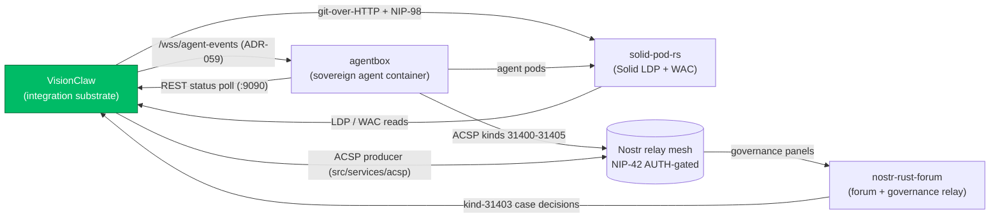

# Sibling Subsystems and Federation Seams

> [VisionClaw Docs](../README.md) · [Explanation](README.md)

VisionClaw is the **integration substrate** of the DreamLab ecosystem. It owns the knowledge graph, the GPU physics layout, the broker workbench, and the write-back saga. It does not own agent execution, pod storage, or community messaging — those belong to three sibling repositories that federate with VisionClaw rather than living inside it.

This document maps each sibling to its role and, critically, to the **seam** it exposes to VisionClaw. A seam is a small, typed contract: a WebSocket endpoint, a Nostr event kind, an HTTP auth header. There is no shared database, no shared process, and no shared build. Federation is held together by three contracts — `did:nostr:<64-hex>` identity, the IS-Envelope message shape, and a NIP-42-gated relay mesh — described in [Ecosystem Convergence](./ecosystem-convergence.md). Here we describe only the boundaries.

VisionClaw itself is 8 Cargo workspace crates (`visionclaw-{contracts,domain,protocol,adapters,gpu,ontology,actors,xr-presence}`). The siblings are separate repositories with independent release cadences. Each connects through a named port or relay kind, never through linked source.

---

## The federation at a glance

Every arrow carries the same `did:nostr` identity primitive. No arrow carries a database connection. The four repositories share keys and message shapes, not schemas or storage.

---

## agentbox — the agent container

**Repository:** [github.com/DreamLab-AI/agentbox](https://github.com/DreamLab-AI/agentbox) · **In-tree as:** git submodule at `agentbox/` ([agentbox ADR-004: upstream sync](../../agentbox/docs/reference/adr/ADR-004-upstream-sync.md))

agentbox is the sovereign, Nix-built container that runs `did:nostr`-keyed AI agents. It is the **only** data-manipulation surface in the ecosystem: agents reason over the knowledge base and propose enrichments; VisionClaw never edits triples directly. agentbox carries its own documentation pack — **do not duplicate its internals here.** Read it at source:

- [agentbox docs README](../../agentbox/docs/README.md) — the subsystem index
- [Developer · Architecture](../../agentbox/docs/developer/architecture.md) — 5 adapter slots (beads, pods, memory, events, orchestrator), 18 `urn:agentbox:<kind>` URN kinds, 113 skills
- [Developer · Identity Mesh](../../agentbox/docs/developer/identity-mesh.md) — per-agent `did:nostr` custody and NIP-26 delegation
- [Developer · Sovereign Mesh](../../agentbox/docs/developer/sovereign-mesh.md) — the cross-substrate agent loop
- [User · Nostr Relay](../../agentbox/docs/user/nostr-relay.md) — the embedded relay (loopback `:7777`)

### The VisionClaw-facing seam

Three contracts bridge agentbox to VisionClaw. Everything else stays inside agentbox.

| Seam | Direction | Contract |
|------|-----------|----------|
| **`/wss/agent-events`** | agentbox → VisionClaw | Authenticated WebSocket ingest. Inbound `agent_action` events carry the legacy numeric IDs **plus** optional `source_urn`, `target_urn`, and `pubkey` (agentbox URN grammar). They drive a transient beam + gluon spring effect against the existing GPU semantic-forces kernels — no new CUDA. Outbound `focus`/`select`/`hover`/`drag` events push user attention back so agents can react. Governed by [ADR-059](../adr/ADR-059-bidirectional-agent-channel-server.md). |
| **ACSP kinds 31400–31405** | both → relay → forum | The Agent Control Surface Protocol. VisionClaw's producer (`src/services/acsp/`) publishes panel definitions (31400), panel state (31401/31404), broker cases (31402), and consumes signed case decisions (31403). agentbox agents publish operational state on the same kinds. The relay mesh AUTH-gates these to registry-listed agent pubkeys. |
| **REST status poll `:9090`** | VisionClaw → agentbox | Legacy one-way path: `agent_monitor_actor` polls the agentbox management API for `AgentStatus` records. [ADR-059](../adr/ADR-059-bidirectional-agent-channel-server.md) supersedes this with the bidirectional channel above; the poll remains until the `:9500` state-poll cutover lands. |

The **BC20 anti-corruption layer** is the bounded-context boundary that translates between the two URN namespaces — `urn:visionclaw:<kind>:<hex>:<local>` and `urn:agentbox:<kind>:[<scope>:]<local>` — at the federation edge. Neither side leaks its internal aggregates into the other. See [Bounded Contexts](./bounded-contexts.md) for the full context map.

A fourth, read-only seam runs the other way: agentbox's **ontology bridge** ([agentbox ADR-023](../../agentbox/docs/reference/adr/ADR-023-ontology-bridge.md)) proxies agents into VisionClaw's 7 [MCP ontology tools](../reference/mcp-tools.md) (`discover`, `read`, `query`, `traverse`, `propose`, `validate`, `status`) against the embedded Oxigraph SPARQL store. Agents ground their reasoning in the formal ontology without holding a database handle.

Integration scope and acceptance criteria live in [PRD-004: Agentbox–VisionClaw Integration](../prd/PRD-004-agentbox-visionclaw-integration.md).

---

## solid-pod-rs — the pod foundation

**Repository:** [github.com/DreamLab-AI/solid-pod-rs](https://github.com/DreamLab-AI/solid-pod-rs) · **Role:** Cargo dependency and Solid pod sidecar (`:8484`)

solid-pod-rs is a separate repository providing a Rust Solid server: LDP resources, Web Access Control (WAC), OIDC and NIP-98 authentication, a git-over-HTTP backend, mashlib rendering, and `did:nostr` resolution. It is the **source of truth** for knowledge bases. VisionClaw consumes it two ways: as a library crate, and as a running sidecar pod.

### The VisionClaw-facing seam

VisionClaw treats every pod as a git remote, not as an API. Access is granted by the pod owner adding VisionClaw's `did:nostr` to a WAC ACL — never by issuing a platform token.

| Seam | Contract |
|------|----------|
| **git-over-HTTP + NIP-98** | VisionClaw clones a knowledge base from a pod and pushes enrichments back, signing each transport with a NIP-98 header derived from its server `did:nostr`. The push carries provenance trailers (URN, proposed-by, approved-by, broker-case, reasoning-hash). |
| **LDP read + WAC gate** | The pod mediates who may read and write through its `.acl` resources. VisionClaw holds no separate permission model; the pod's WAC is authoritative. |
| **URN ↔ Solid mapping** | The deterministic mapping from `urn:visionclaw:` identifiers to pod resource URLs is the addressing seam. See [URN/Solid Mapping](../reference/urn-solid-mapping.md). |

VisionClaw runs its own pod as a sidecar — see [Solid Sidecar Architecture](./solid-sidecar-architecture.md) and [User-Agent Pod Design](./user-agent-pod-design.md). Practical recipes are in [Solid integration](../how-to/integration/solid-integration.md), [Solid pod creation](../how-to/integration/solid-pod-creation.md), and [git-over-HTTP](../how-to/integration/git-over-http.md). solid-pod-rs internals stay in their own repository; this map gives only the boundary.

---

## nostr-rust-forum — the coordination plane

**Repository:** [github.com/DreamLab-AI/nostr-rust-forum](https://github.com/DreamLab-AI/nostr-rust-forum) · **Role:** forum kit and governance relay

nostr-rust-forum is a separate repository of `nostr-bbs-*` Rust crates — a Cloudflare-edge Nostr relay, a Leptos WASM forum client, WebAuthn/NIP-07 auth, and community moderation. It provides human-to-human and human-to-agent text coordination over Nostr. For VisionClaw it is the **governance surface**: the place where broker cases become visible to people.

### The VisionClaw-facing seam

| Seam | Contract |
|------|----------|
| **Governance page renders ACSP** | The forum's `/community/governance` page renders VisionClaw's ACSP panels (kinds 31400–31405) as interactive review surfaces. A VisionClaw agentic actor needing human sign-off opens a kind-31402 broker case; the forum renders it; a human decides; the signed kind-31403 `CaseDecision` returns to the owning actor. |
| **Relay mesh membership** | The forum relay is one node in the NIP-42 AUTH-gated mesh alongside agentbox's embedded relay and VisionClaw's `ServerNostrActor`. Events are IS-Envelope-shaped and NIP-59 gift-wrapped across relay boundaries. |
| **Optional messaging** | Enrichment feedback and human-to-agent chat can flow as forum threads, but the forum is an optional surface — VisionClaw functions without it. |

The agent-facing detail of how panels are produced and consumed is in [Agent Control Surface](./agent-control-surface.md). The forum's own architecture (auth flow, relay Durable Objects, client crates) stays in its repository.

---

## Ownership boundaries

The cleanest way to read the federation is by what each repository owns and what it never touches.

| Repository | Owns | Never owns |
|------------|------|------------|
| **VisionClaw** | Knowledge graph, GPU physics, broker gating, write-back saga, binary position stream | Agent execution, pod storage, community UI |
| **agentbox** | Agent runtime, adapters, skills, per-agent identity, embedded relay | Knowledge-graph schema, GPU layout, the broker decision record |
| **solid-pod-rs** | Pod storage, WAC, NIP-98/OIDC auth, git backend, DID resolution | Reasoning, physics, broker workflow |
| **nostr-rust-forum** | Forum UI, governance rendering, edge relay, moderation | Knowledge mutation, pod writes, GPU compute |

Because the boundaries are clean, each repository releases independently. A VisionClaw deploy pins agentbox at a submodule SHA, depends on a solid-pod-rs crate version, and federates with whichever forum relays its mesh configuration lists — without any of them sharing a build or a database. See [Deployment Topology](./deployment-topology.md) for how these run side by side, and [Security Model](./security-model.md) for how the relay mesh and WAC together enforce trust boundaries.

---

## See also

- [Ecosystem Convergence](./ecosystem-convergence.md) — the full data lifecycle and the three binding contracts
- [System Overview](./system-overview.md) — VisionClaw's own three layers
- [Bounded Contexts](./bounded-contexts.md) — the BC20 anti-corruption layer and context map
- [Agent Control Surface](./agent-control-surface.md) — ACSP kinds 31400–31405 in detail
- [Solid Sidecar Architecture](./solid-sidecar-architecture.md) — the embedded pod
- **Governing decisions:** [ADR-059: Bi-directional Agent Channel](../adr/ADR-059-bidirectional-agent-channel-server.md) · [PRD-004: Agentbox–VisionClaw Integration](../prd/PRD-004-agentbox-visionclaw-integration.md)
- **Cross-pack (agentbox subsystem):** [ADR-004: Upstream Sync](../../agentbox/docs/reference/adr/ADR-004-upstream-sync.md) · [ADR-023: Ontology Bridge](../../agentbox/docs/reference/adr/ADR-023-ontology-bridge.md)
