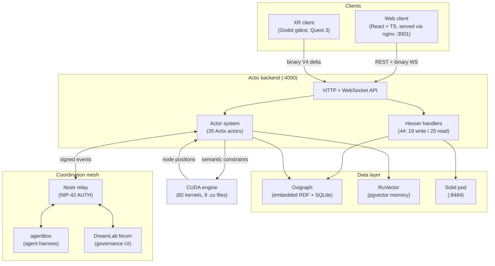
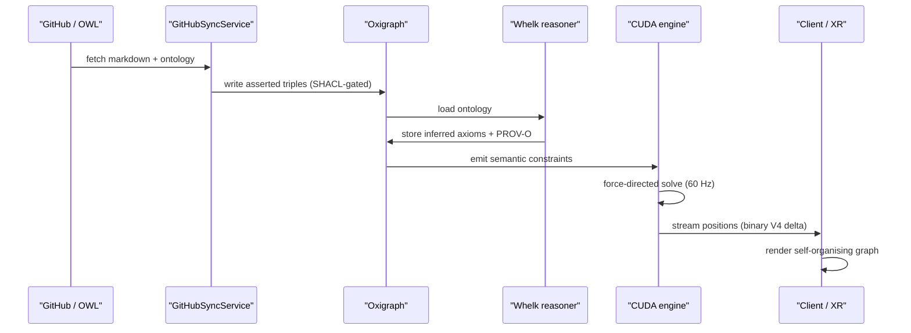

# VisionClaw System Overview

> [VisionClaw Docs](../README.md) · [Explanation](README.md)

VisionClaw renders a living knowledge graph in 3D. Markdown notes and OWL
ontologies become nodes; formal reasoning and GPU physics arrange them in space;
a binary WebSocket streams positions at interactive frame rates to a web client
and to an immersive XR client on Quest 3. Around that core sits a coordination
mesh — a Nostr relay, the agentbox agent harness, and the DreamLab forum — that
lets humans and AI agents reason against the same graph under cryptographic
identity and explicit governance.

This document is the map. It explains the four layers, why they are shaped the
way they are, and where to read the detail. It does not duplicate the deep-dives
it links to.

## Top-level architecture

The flow is one-directional through the core and bidirectional at the edges.
Clients send intent (REST mutations, WebSocket subscriptions); the backend
resolves it through actors and handlers; the data layer persists it; the GPU
computes layout; positions stream back out. The mesh wraps the whole thing in a
shared identity and event fabric so that agents are first-class participants,
not external callers.

## The four layers

### Clients

Two surfaces consume the same backend.

- **Web client** — a React + TypeScript single-page app, 465 `.ts`/`.tsx` files
  (422 non-test) across 16 feature modules, roughly 103K lines. It owns the
  WebGPU/WebGL render loop, the instanced node and edge geometry, label layout,
  and the settings control panel. nginx serves it on `:3001` and reverse-proxies
  the API.
- **XR client** — a Godot gdext (Rust `cdylib`) build targeting Quest 3,
  packaged as its own workspace context (PRD-008). It consumes the same binary
  position stream plus an XR presence channel for multi-user co-location.

Both clients read node positions from the binary WebSocket protocol rather than
JSON: it is the only representation that sustains interactive frame rates at
100K nodes. See [Client Architecture](client-architecture.md) and
[XR Architecture](xr-architecture.md).

### Actix backend

The backend is a single Rust binary, `visionclaw-server` — 428 `.rs` files,
about 178K lines — built on Actix. Two mechanisms carry the work.

**Actors (35).** Long-lived, stateful, message-driven units: 19 service actors
(graph state, settings, metadata, GitHub sync, ontology, semantic processing,
client coordination, workspace, presence, and supervisors) plus 16 GPU actors
(force compute, clustering, PageRank, shortest-path, stress majorisation,
constraint and ontology-constraint actors under their supervisors). A further
10 short-lived WebSocket session actors spin up per connection — 45 actor types
in total, but 35 form the persistent service spine. Actors own all mutable
runtime state; nothing else holds an `Arc<RwLock<T>>` over graph or physics
data.

**Hexser handlers (44).** The application layer is hexagonal: 19 `DirectiveHandler`
implementations (writes) and 25 `QueryHandler` implementations (reads) sit behind
9 ports with 12 concrete adapters. The Directive/Query split is a typing
discipline, not a runtime message bus — **there is no CQRS dispatch bus**. The
bus was removed under [ADR-089](../adr/ADR-089-cqrs-bus-removal.md); handlers are
invoked directly as plain async calls, which removed a layer of indirection
without losing the read/write separation.

Read the detail in [Backend Architecture](backend-architecture.md) and the
[Actor Hierarchy](actor-hierarchy.md).

### Data layer

Three stores, each with a distinct job. None is Neo4j — Neo4j was removed
entirely (ADR-11); there is no graph database container and no DB browser UI.

- **Oxigraph** — an embedded, RocksDB-backed RDF quad store opened in-process.
  It holds both the knowledge graph and the ontology as named graphs, queried
  with W3C SPARQL 1.1. SHACL-lite shapes gate writes; PROV-O provenance is
  reified into an append-only graph (PRD-022, [ADR-127](../adr/ADR-127-semantic-trust-layer.md)).
- **SQLite** — an embedded store for user settings, kept relational because
  settings are key/value rather than graph-shaped.
- **RuVector** — a pgvector-backed semantic memory (MiniLM-L6-v2, 384-dim,
  HNSW-indexed) used for cross-session agent memory and similarity search. See
  [RuVector Integration](ruvector-integration.md).
- **Solid pod** — a per-actor data pod on `:8484`, the sovereign store for agent
  output, accessed under WAC access control and `did:nostr` identity. See
  [Solid Sidecar Architecture](solid-sidecar-architecture.md).

The ontology pipeline — Whelk-rs OWL 2 EL reasoning, SHACL-lite plus JSON-LD
validation, PROV-O provenance, and the 7 MCP ontology tools
(`discover`/`read`/`query`/`traverse`/`propose`/`validate`/`status`) — is the
subject of [Ontology Pipeline](ontology-pipeline.md).

### GPU engine

Layout is the expensive part, and it runs on CUDA. The `visionclaw-gpu` crate
carries 82 `__global__` kernels across 9 `.cu` files (about 5,854 lines) in
`crates/visionclaw-gpu/src/cuda_sources/`: a unified force-directed solver plus
specialised kernels for SSSP, connected components, clustering, PageRank,
landmark APSP, AABB reduction, dynamic spatial grids, and semantic forces.

Ontological structure becomes physical force: `SubClassOf` pulls children toward
parents, `DisjointWith` pushes classes apart, inferred axioms apply weaker
influence than asserted ones. The result is a layout that reflects meaning.

At 100K nodes the GPU path delivers roughly a **55× speedup** over the CPU
fallback — 246 ms per frame (about 4 FPS) collapses to 4.5 ms (about 222 FPS).
Computed positions stream out over the binary protocol. See
[Physics GPU Engine](physics-gpu-engine.md) and
[Agent–Physics Bridge](agent-physics-bridge.md).

## Workspace structure

The backend is split into 8 workspace crates under
[ADR-090](../adr/ADR-090-hexagonal-crate-modularisation.md), so a one-line change
to a domain type recompiles one crate and the linker rather than the whole
server:

| Crate | Responsibility |
|---|---|
| `visionclaw-contracts` | Shared wire/DTO contracts, independently buildable |
| `visionclaw-domain` | Domain types and value objects |
| `visionclaw-protocol` | Binary and WebSocket protocol codecs |
| `visionclaw-adapters` | Port adapter implementations |
| `visionclaw-gpu` | CUDA kernels and the GPU compute path |
| `visionclaw-ontology` | Whelk reasoning, SHACL, provenance |
| `visionclaw-actors` | The Actix actor system |
| `visionclaw-xr-presence` | XR room registry and presence wire codec |

The root `visionclaw-server` package re-exports through thin shims, so callers
see one cohesive API while builds stay incremental. See
[Bounded Contexts](bounded-contexts.md) for how these crates map onto domains.

## Request and data lifecycle

The end-to-end path from ingestion to render:

Positions move over a versioned binary wire format. V2 used 36 bytes per node,
V3 widened to 52 bytes (`BINARY_NODE_SIZE_V3`) to carry richer per-node state,
and **V4 delta is the current default** — it transmits only changed nodes once
the layout settles, which keeps bandwidth flat after convergence. The
[Binary Protocol](../reference/binary-protocol.md) reference is exhaustive on the
byte layout.

## Coordination mesh

The mesh is what makes VisionClaw a platform rather than an application. Every
actor — human, agent, server — is one secp256k1 keypair expressed as
`did:nostr:<pubkey>`, verified at the relay (NIP-42 AUTH) and on every HTTP
request (NIP-98). There is no shared session store and no token exchange between
tiers; the cryptographic primitive is the coordination primitive.

- **Nostr relay** — the event transport. Governance events (the Agent Control
  Surface, kinds 31400–31405) and session/project digests (kinds 30840/30841)
  flow across it.
- **agentbox** — the reproducible, hardened agent harness: 113 skills, 5 adapter
  slots, 18 URN kinds, an embedded Solid pod, and a privacy filter on every
  persistent write. agentbox is a subsystem in its own right; VisionClaw links
  into it through a broker bridge rather than absorbing it. See its
  [developer architecture](../../agentbox/docs/developer/architecture.md).
- **DreamLab forum** — the human governance surface where agents publish control
  panels and humans approve or reject signed actions.

[Subsystems](subsystems.md) covers how these pieces compose, and
[Deployment Topology](deployment-topology.md) covers where they run.

## Numbers at a glance

| Dimension | Value |
|---|---|
| Backend source | 428 `.rs` files, ~178K LOC |
| Client source | 465 `.ts`/`.tsx` (422 non-test), ~103K LOC, 16 modules |
| Actor types | 35 service spine (19 service + 16 GPU); 45 incl. WS sessions |
| Hexser handlers | 44 (19 Directive / 25 Query), no CQRS bus (ADR-089) |
| Ports / adapters | 9 ports, 12 adapters |
| Workspace crates | 8 (ADR-090) |
| CUDA kernels | 82 `__global__` across 9 `.cu` files, ~5,854 LOC |
| GPU speedup @100K | ~55× — 246 ms (4 FPS) → 4.5 ms (222 FPS) |
| Graph store | embedded Oxigraph (RDF) + SQLite (settings); Neo4j removed |
| Ontology | Whelk-rs OWL 2 EL + SHACL-lite + JSON-LD + PROV-O (PRD-022) |
| MCP ontology tools | 7 (discover/read/query/traverse/propose/validate/status) |
| Binary wire | V2 36 B, V3 52 B, V4 delta (default) |
| Ports | API :4000, frontend :3001, Solid pod :8484, legacy MCP TCP :9500 |
| ADRs | ~98 (ADR-011 … ADR-127) |

## See also

- [Backend Architecture](backend-architecture.md) — actors, handlers, ports
- [Actor Hierarchy](actor-hierarchy.md) — the supervision tree in detail
- [Physics GPU Engine](physics-gpu-engine.md) — the CUDA layout solver
- [Ontology Pipeline](ontology-pipeline.md) — reasoning, SHACL, provenance
- [Subsystems](subsystems.md) — how VisionClaw, agentbox, and the mesh compose
- [Deployment Topology](deployment-topology.md) — where each component runs
- [Architecture Decision Records](../adr/README.md) — governing ADRs, especially
  [ADR-089 (CQRS bus removal)](../adr/ADR-089-cqrs-bus-removal.md),
  [ADR-090 (crate modularisation)](../adr/ADR-090-hexagonal-crate-modularisation.md),
  [ADR-112 (ontology spine)](../adr/ADR-112-ontology-augmentation-retrieval-spine.md),
  and [ADR-127 (semantic trust layer)](../adr/ADR-127-semantic-trust-layer.md)
