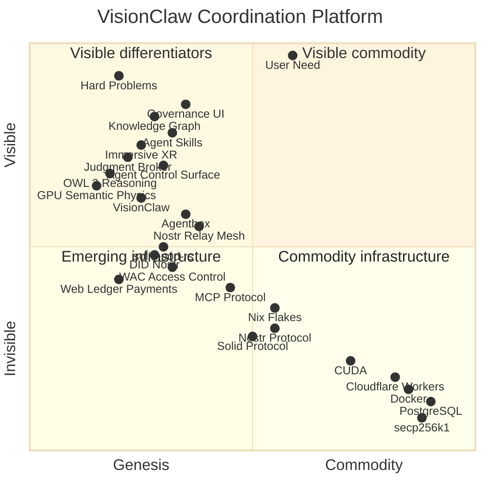

# VisionClaw Wardley Map

This Wardley map positions VisionClaw's components along the evolution axis (Genesis → Custom-Built → Product → Commodity) and the value chain (Visible to user → Invisible infrastructure). It shows where the ecosystem creates unique value versus where it consumes commodity infrastructure.

## Strategic Map

Mermaid source (wardleyMap syntax, requires Mermaid 12+)

## Reading the Map

### Where VisionClaw Creates Unique Value (Genesis–Custom)

The top-left quadrant — visible to users, not yet commoditised — is where VisionClaw's strategic advantage lives:

- **Judgment Broker** — the human-in-the-loop governance layer that makes agent meshes trustworthy. No equivalent exists in any competing platform.
- **OWL 2 EL Reasoning** (evolving →) — formal semantic reasoning as the shared vocabulary for human-agent collaboration. Most agent systems use keyword matching; VisionClaw uses ontological subsumption.
- **GPU Semantic Physics** (evolving →) — ontology-driven force simulation where `subClassOf` creates attraction and `disjointWith` creates repulsion. Makes semantic relationships physically visible.
- **Agent Control Surface Protocol** (evolving →) — kinds 31400-31405 for structured agent-human governance decisions over Nostr. Being standardised through use; could become a NIP.

### The Protocol Layer (Custom-Built, evolving toward Product)

The middle band is where VisionClaw's protocol infrastructure sits — custom-built Rust implementations of open standards:

- **solid-pod-rs** — Rust port of JSS at ~98% parity. Compiles to both native and WASM. The foundation for self-sovereign data.
- **DID:Nostr** (evolving →) — bridges Nostr identity (secp256k1) to W3C DID and Solid WebID. Unique in combining these three identity systems.
- **Web Ledger Payments** (evolving →) — HTTP 402 micropayments, DREAM tokens, BIP-341 anchoring. Still genesis-stage; could commoditise agent-to-agent payments.
- **Nostr Relay Mesh** (evolving →) — moving from standalone deployment toward federated mode. The coordination transport layer.

### Commodity Infrastructure (Product–Commodity)

The bottom-right is consumed, not built:

- **CUDA, Docker, PostgreSQL, Cloudflare Workers, secp256k1** — commodity infrastructure. VisionClaw builds on top of these; it doesn't reinvent them.
- **Nostr Protocol, Solid Protocol, MCP Protocol** — open standards consumed as dependencies. VisionClaw implements them; it doesn't own them.
- **Nix Flakes** — product-stage build system consumed by agentbox for reproducibility.

### Strategic Movements

Arrows on `evolve` components show where the ecosystem is actively investing:

1. **OWL 2 Reasoning → Product**: Making formal reasoning accessible to non-ontologists through agent MCP tools and the Insight Ingestion Loop.
2. **Agent Control Surface → Product**: Standardising the governance event protocol for broader adoption beyond the DreamLab deployment.
3. **DID:Nostr → Product**: Pushing the identity bridge toward wider ecosystem adoption.
4. **Nostr Relay Mesh → Product**: Moving from standalone to federated mode (Sprint v12+).
5. **Web Ledger Payments → Custom-Built**: Building the agent micropayment infrastructure that makes token-priced agent services economically viable at scale.

## Inertia Points

- **CF Workers runtime limitation**: Cannot run Tokio, cannot spawn processes. Prevents git-pods, data export, and key provisioning on the edge tier. Resolved operationally by the two-tier pod architecture (ADR-093).
- **Nostr relay mesh federation**: Currently standalone; federated mode is scaffolded but not production-tested. The relay mesh is the critical enabler for enterprise-scale deployment.
- **OWL 2 accessibility**: Ontological reasoning is powerful but intimidating. The Insight Ingestion Loop (Discovery → Codification → Validation → Integration → Amplification) is the UX answer — making formal reasoning invisible to end users.

## Competitive Landscape

| Competitor Shape | What They Build | What They Miss |
|---|---|---|
| Agent frameworks (LangChain, CrewAI) | Orchestration | Governance, shared semantics, self-sovereign data |
| Knowledge management (Notion, Confluence) | Information storage | Formal reasoning, agent integration, provenance |
| Collaboration platforms (Slack, Teams) | Communication | Coordination, semantic grounding, trust hierarchies |
| AI platforms (OpenAI, Anthropic) | Model access | Decentralised identity, data sovereignty, governance |

VisionClaw occupies the intersection: governed coordination of distributed human and AI intelligence at scale, with self-sovereign data and platform-agnostic deployment.
