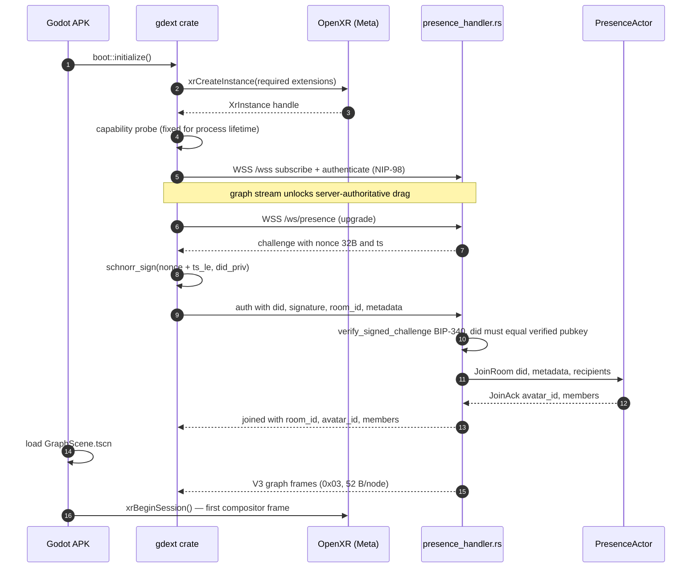
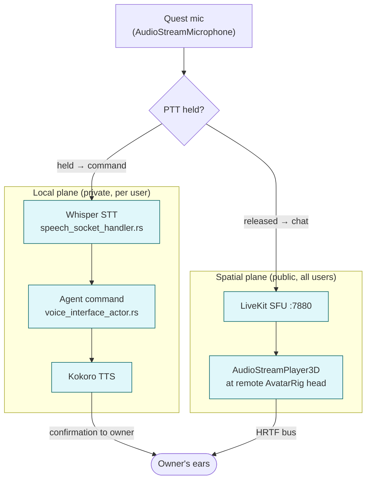

# XR Architecture (Godot 4 + godot-rust + OpenXR)

> [VisionClaw Docs](../README.md) · [Explanation](README.md)

VisionClaw's XR client is a **native Meta Quest 3 APK** built from a **Godot 4.3**
project, with the performance-critical paths — protocol decode, WebSocket
lifecycle, authentication, pose validation, LOD — written in **Rust through
godot-rust (gdext)**, and runtime headset access through **OpenXR**. The client
decodes the existing **V3 binary graph stream** byte-for-byte, joins rooms over a
new **BIP-340-authenticated `/ws/presence`** WebSocket, treats node manipulation
as **server-authoritative**, and routes voice through two planes: a local
**Whisper/Kokoro** command-and-assistant loop and a **LiveKit** spatial voice
overlay.

This design is recorded in [ADR-071](../adr/ADR-071-godot-rust-xr-replacement.md);
the transport and authentication completion is recorded in
[ADR-102](../adr/ADR-102-xr-client-backend-transport-completion.md).

> **Superseded predecessor.** The prior browser-hosted **WebXR** client
> (Babylon.js render path, Three.js fallback, and a **Vircadia** world server with
> its own PostgreSQL entity store) is replaced wholesale. Babylon.js and Vircadia
> appear in this document only as the stack being retired. Quest 3 users side-load
> the APK; non-XR users continue to use the desktop React Three Fiber graph view
> ([client-architecture.md](client-architecture.md)), which is unchanged.

> **Reality check — first in-headset render was desktop PCVR, not Quest (2026-08-22, [ADR-136](../adr/ADR-136-desktop-openxr-vive-validation-target.md), branch `xr-vive-runtime`).**
> This document is written Quest-first because the **Quest 3 APK is the sole *ship*
> target** — but the **first working headset render happened on a physical HTC VIVE
> Pro over desktop OpenXR**, and the Quest APK cross-build is still frozen/unbuilt.
> Corrections to the renderer/runtime detail below, for the desktop VIVE path:
> - **Engine + renderer:** **Godot 4.6.1** (not 4.3) running the **Compatibility
>   (OpenGL) renderer**, not Forward+/Forward Mobile. The **RD/Vulkan multiview
>   tonemapper is broken on this stack** (NVIDIA 580 + native X11 + SteamVR), so
>   glow/bloom is **off** and Compatibility is mandatory. §8's "mobile renderer"
>   and §3's scene table describe the Quest APK; on desktop VIVE the renderer is
>   Compatibility.
> - **Runtime:** **SteamVR** desktop OpenXR on HP-Desktop, lighthouse-tracked —
>   not the Meta runtime and not the Monado sidecar. `Tier3Tethered`.
> - **Interaction:** dual VIVE wands (right confirmed) via an
>   `htc/vive_controller`-bound action map (`pose="aim"`); grab is a literal
>   world-space ray/sphere intersection that keeps grab distance along the ray;
>   trackpad locomotion; world-anchored movable (wand-grabbable) HUD. Left wand +
>   edge-tracking + adaptive-fit-on-grab are WIP.
> - **Client render model:** adaptive room-fit (re-measured each frame) + client-side
>   optimistic position hunting — the desktop "**GPU settles fast, clients hunt at
>   their own speed**" model. Backend defaults to **Continuous settle** (was a
>   FastSettle latch that froze the graph); `PinNodePositions` GPU-injects a grabbed
>   node so it perturbs neighbours' springs; `initialGraphLoad` node limit raised
>   200→3000 so edges reach the client (top-640 node display). The presence/voice
>   and server-authoritative-drag sections below are unchanged by this bring-up.

---

## 1. Why a native APK

The browser-hosted WebXR client could not deliver the target experience on the
target device. The native APK removes five structural ceilings:

1. **Single source of truth for position.** The Vircadia world server kept its own
   entity store, duplicating state that is already canonical in the embedded
   graph store (Oxigraph + SQLite, ADR-11), RuVector, and the GPU physics actor
   mesh. The APK consumes the graph position stream directly — there is no
   second entity store to reconcile.
2. **Full OpenXR extension surface.** Native OpenXR gives passthrough, scene mesh,
   spatial anchors, foveated rendering, and display-refresh control that the Meta
   browser's WebXR profile does not expose.
3. **No JS garbage collector in the render loop.** The 90 Hz / 11.1 ms frame
   budget is met in Rust with zero steady-state allocation, not contended against
   a browser GC.
4. **One renderer.** The browser stack carried two competing render trees
   (immersive and fallback) with duplicated identity, scene-graph, and input
   pipelines. The APK has a single Godot scene tree.
5. **Substrate alignment.** The hot paths link the same Rust transport crate the
   server links, so wire semantics cannot drift between client and server.

---

## 2. System view

The Rust substrate is unchanged. The only server-side additions are one WebSocket
handler and one actor, plus a transport-agnostic crate shared with the client.


The new server surface is three files —
[`src/handlers/presence_handler.rs`](../../src/handlers/presence_handler.rs),
`src/actors/presence_actor.rs`, and the
[`crates/visionclaw-xr-presence`](../../crates/visionclaw-xr-presence) workspace
member — wired into the existing supervisor tree on the existing `:4000` port
behind nginx `:3001`. No new containers and no new ports.

---

## 3. Godot ↔ Rust split

The split is deliberate. GDScript owns scene composition, signal wiring, UI state,
OpenXR feature toggles, and scene-graph manipulation in response to gdext signals.
It performs **no** wire-format parsing, **no** WebSocket state, and **no** pose
validation. The gdext crate owns protocol decode, WebSocket lifecycle, BIP-340
auth, pose validation, and LOD math, exposed to GDScript through
`#[derive(GodotClass)]` types that emit signals into the scene tree.

| Godot scene | Root node | gdext module | Responsibility |
|---|---|---|---|
| `XRBoot` | `Node3D` | `boot.rs` | OpenXR instance creation, capability probe, error overlay |
| `GraphScene` | `Node3D` | `graph_renderer.rs` | Instanced nodes (MultiMeshInstance3D) + edges, LOD |
| `AvatarRig` | `Node3D` | `avatar.rs` | Remote head + hands + nameplate, one per remote user |
| `LocalRig` | `XROrigin3D` | `interaction.rs` | Local pose, controller ray, grab, haptics |
| `HUD` | `Control` | `hud.rs` | Settings, room picker, mute, debug overlay |

The shared `crates/visionclaw-xr-presence` library is **transport-agnostic**: it
knows nothing about Actix actors, godot signals, or LiveKit. It is the single
source of truth for the avatar pose wire format (opcode `0x43`), the
`PresenceRoom` aggregate invariants, and the pose validators. Both the client
gdext crate and the server `presence_actor.rs` link it, so wire-level pose
semantics cannot drift.

---

## 4. Live V3 graph wire

The client decodes the **same binary position stream as the desktop client**, on
the existing `/wss` endpoint. The V3 layout is a fixed **52 bytes per node** behind
a 1-byte version header (`0x03`) — `BINARY_NODE_SIZE_V3` — carrying id + flags,
position, velocity, SSSP distance and parent, cluster id, anomaly, community id,
and centrality. V4 delta encoding is the current default optimisation for the
desktop path; the canonical layout, the version registry, and the delta scheme are
documented in [reference/binary-protocol.md](../reference/binary-protocol.md)
([ADR-061](../adr/ADR-061-binary-protocol-unification.md)).

The frame loop drains pending position frames over an `mpsc` channel each
`_process(dt)` tick and writes directly into MultiMesh transform buffers — no
per-frame allocation. LOD buckets are recomputed every second frame to hold CPU
under 8 ms; bucket assignments are diffed against the previous frame, so only
changed instances incur a transform write. If the local head is stationary
(position delta < 1 cm, quaternion dot > 0.9999) the outbound pose frame is
dropped by the delta encoder, keeping AFK bandwidth near zero.

---

## 5. Presence over BIP-340 `/ws/presence`

Multi-user presence rides a dedicated WebSocket served by
`presence_handler.rs`. Authentication is a Nostr-style challenge/response over
**BIP-340 Schnorr signatures (secp256k1)** — the same identity primitive the
graph socket's `authenticate` flow uses. The handshake binds the socket to a
verified `did:nostr:<pubkey>` so a client can never select its own avatar id or
impersonate another member.



The graph WebSocket is connected before the presence WebSocket because graph
state is the load-bearing context. Presence is allowed to fail without aborting
boot: the user enters a single-user session and a yellow indicator appears in the
HUD. The handshake has a 10 s deadline and a 15 s ping heartbeat; a failed or
replayed signature closes the socket with code **4401**.

### 5.1 Pose ingest and broadcast

Once joined, the client sends binary **`0x43` avatar pose frames** and the server
fans out coalesced **sibling frames** at a fixed 90 Hz room tick. The client→server
frame, encoded by `crates/visionclaw-xr-presence/src/wire.rs`, is variable-length
and little-endian:

```text
[u8  opcode = 0x43]
[u16 frame_len_LE]            bytes that follow this field
[u8;16 room_id_hash]
[u8  avatar_id_len][u8;N avatar_id_utf8]
[u64 timestamp_us_LE]
[u8  transform_mask]          bit0=head bit1=left_hand bit2=right_hand
[{28 B} transforms...]        present slots in head, left, right order
```

Hands are optional via the mask, so a head-only frame is far smaller than a full
head+hands frame. The server→client sibling frame prepends a
`[u64 broadcast_seq][u32 room_id][u16 user_count]` header and contains every
current member's latest pose, attributed by an opaque per-session `local_id` that
each `avatar_joined` event maps to a named DID.

`presence_handler.rs` rate-limits inbound frames to **120 per second** (sliding
window; code **4429** on breach). `PresenceActor` then runs the shared validators
before re-broadcasting to every peer **except the sender**:

| Check | Bound | On failure |
|---|---|---|
| Velocity (head Δposition / Δt) | ≤ 20 m/s; NaN/∞ rejected | drop frame |
| World bounds (AABB) | default ±50 m symmetric | drop frame |
| Quaternion magnitude | within [0.99, 1.01] | drop frame |
| Timestamp monotonicity | strictly increasing, ≥ 8 ms apart | drop frame |
| Hand-to-head reach | ≤ 1.2 m anatomical | drop frame |

A session accumulating **10 violations in a 1 s window** is kicked. Re-broadcast
respects the sovereign visibility-transition rules
([ADR-051](../adr/ADR-051-visibility-transitions.md)) — invisible avatars are
dropped from each receiver's frame. A
`PresenceActor` self-stops when its room empties; the handler replaces any
disconnected actor address before the next joiner reuses the room, so a rejoin
never lands on a dead mailbox.

---

## 6. Server-authoritative node drag

Node manipulation is **server-authoritative**. The headset never treats its own
local position as truth: grabbing a node with the controller ray emits
`nodeDragStart` / `nodeDragUpdate` / `nodeDragEnd` text messages on the `/wss`
graph socket. The server (`socket_flow_handler`) gates every drag:

1. **Authentication required** — drags from a socket without a verified pubkey
   (no completed `authenticate` handshake) are rejected.
2. **`nodeId` must fit `u32`** — oversized ids are rejected rather than silently
   truncated.
3. **Position sanitised** — NaN, infinity, and out-of-bounds coordinates are
   rejected.
4. **Concurrent-drag cap** — a per-client limit on simultaneous dragged nodes.

A validated drag **pins the node in the GPU physics actor**, freezing it against
the force-directed layout. The pinned position re-enters the V3 broadcast and
every client — the dragger, other headsets, and desktop browsers — renders the
same authoritative coordinate. Orphaned drags (a socket dropping before
`nodeDragEnd`) are released server-side after a 500 ms timeout, so a crashed
client can never leave a node permanently pinned.

---

## 7. Voice

Voice runs in two independent planes, multiplexed per user by
`src/services/audio_router.rs` and gated by push-to-talk (PTT). The local plane is
a **Whisper / Kokoro** command-and-assistant loop; the spatial plane is the
**LiveKit** overlay carrying positioned peer and agent audio.



- **Plane 1 — command (private).** With PTT held, mic audio routes to local
  **Whisper STT**; the transcript drives graph/view configuration and agent
  commands through `voice_interface_actor.rs`.
- **Plane 2 — assistant (private).** Agent and confirmation responses are spoken
  by local **Kokoro TTS** into the owner's ears only.
- **Plane 3 — spatial chat (public).** With PTT released, mic audio routes to the
  **LiveKit** SFU; each remote track plays from an `AudioStreamPlayer3D` parented
  to that user's avatar head, spatialised on a dedicated HRTF bus
  (`ATTENUATION_INVERSE_DISTANCE`). The LiveKit room id equals the presence room
  id (1:1).
- **Plane 4 — spatial agent voice (public).** Agent TTS can also be injected into
  the LiveKit room at the agent's graph position, so co-located users hear it
  spatially.

The local Whisper/Kokoro stack is the same one the desktop and elevation flows
use; the spatial plane reuses the existing LiveKit token path
(`src/handlers/livekit_token_handler.rs`) with no XR-specific changes. Opus at
32 kbps mono (≈ 64 kbps on the wire with redundancy) keeps a four-user room near
256 kbps of voice — comfortably inside the 100 KB/s per-user budget.

---

## 8. OpenXR feature set

A missing **required** extension produces a fatal, user-visible error — there is
no silent degraded mode. Required: hand tracking and hand interaction, passthrough,
scene mesh and capture, spatial anchors, foveated rendering, composition-layer
depth, performance settings, display-refresh-rate control, and local-floor
reference. Optional: visibility mask and eye-gaze interaction (Pro variants only,
PII-gated and opt-in). Scene-mesh and gaze data stay client-side; the gdext
bindings expose no serialiser for them.

---

## 9. Failure modes

The XR client is more sensitive to transient failure than the desktop client —
losing positional tracking for 200 ms in VR is nauseating. Each mode degrades
gracefully rather than freezing the compositor.

| Failure | Behaviour |
|---|---|
| **WebSocket disconnect** | Exponential backoff 1 s → 30 s cap, 10 attempts. The last-received graph snapshot keeps rendering at 90 Hz so the compositor stays alive. After 5 failures, snapshot mode pauses pose tx; the HUD shows a reconnecting spinner. |
| **OpenXR runtime crash** (`XR_ERROR_INSTANCE_LOST`) | gdext flips to a 2D error overlay and tears down OpenXR. Restart requires a fresh launch — Meta's runtime owns process-wide GPU compositor resources. |
| **Voice failure** (LiveKit `RoomDisconnected`) | Non-fatal. Spatial voice indicators hide, a mic-off icon appears, pose continues; LiveKit reconnect every 30 s. The local Whisper/Kokoro plane is unaffected. |
| **Packet-loss degradation** | Per-remote-avatar pose ladder: 90 Hz → 30 Hz (loss > 5%) → 10 Hz (loss > 15%) → snapshot-on-significant-change (loss > 30%), recovering on the same thresholds in reverse. |

---

## 10. Performance budget

The 90 Hz target imposes an 11.1 ms hard frame budget. CI gates fail on any
sustained breach.

| Resource | Budget |
|---|---|
| CPU per frame | 8 ms |
| GPU per frame | 8 ms |
| Draw calls | ≤ 50 |
| Triangles | ≤ 100 K |
| Allocations per frame | 0 in steady state |
| Network ingress | < 80 KB/s per user |
| Network egress | < 30 KB/s per user |
| Battery drain | < 12 %/hour |

Headline target: 90 fps stable on Quest 3 with 5 K visible nodes and 4 remote
avatars, 99th-percentile frame time ≤ 12 ms, motion-to-photon < 20 ms, presence
join < 500 ms p95.

---

## See also

- [ADR-071 — Godot 4 + godot-rust + OpenXR XR replacement](../adr/ADR-071-godot-rust-xr-replacement.md) — governing decision (supersedes Babylon.js + Vircadia)
- [ADR-102 — XR client / backend transport completion](../adr/ADR-102-xr-client-backend-transport-completion.md) — shipped handshake, opcode `0x43`, `/ws/presence`
- [ADR-061 — Binary protocol unification](../adr/ADR-061-binary-protocol-unification.md) — single-wire authority
- [reference/binary-protocol.md](../reference/binary-protocol.md) — V3 52 B/node layout and opcode registry
- [how-to/xr-quest3-setup.md](../how-to/xr-quest3-setup.md) — build, side-load, and troubleshoot the Quest 3 APK
- [security-model.md](security-model.md) — BIP-340 identity, pose-injection gates, visibility filtering
- [client-architecture.md](client-architecture.md) — desktop React Three Fiber graph view (unchanged)
