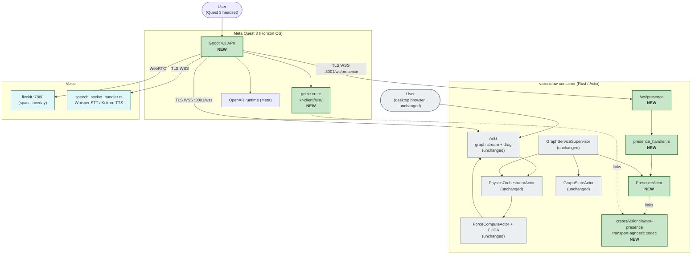
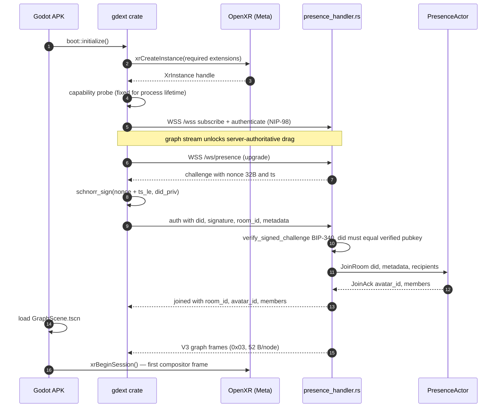

# XR Architecture (Godot 4 + godot-rust + OpenXR)

> [VisionClaw Docs](../README.md) · [Explanation](README.md)

VisionClaw's immersive client is a **native Godot 4** application with the
performance-critical paths — protocol decode, WebSocket lifecycle, authentication,
pose validation, and all per-frame render maths — written in **Rust through
godot-rust (gdext)**, and headset access through **OpenXR**. It ships **first on a
desktop-tethered HTC VIVE Pro over SteamVR** and cross-builds to a **Meta Quest 3
APK**; the two share one Godot project and one Rust substrate. The client decodes
the binary position stream — including the **V5 sequenced wrapper** (`0x05`) — joins
rooms over a **BIP-340-authenticated `/ws/presence`** WebSocket, treats node
manipulation as **server-authoritative**, **embodies agent swarms** as capsules
with directional work beams, and drives a **tabbed, wand-operated HUD control
centre** with **Graph2VR-class** pinch/radial/search interaction.

The governing decisions are [ADR-071](../adr/ADR-071-godot-rust-xr-replacement.md)
(Godot + godot-rust + OpenXR replacement) and
[ADR-102](../adr/ADR-102-xr-client-backend-transport-completion.md) (transport and
authentication completion). The 2026-08 hardening on the `xr-vive-hardening` branch
is recorded across four ADRs that this page describes:
[ADR-136](../adr/ADR-136-desktop-openxr-vive-validation-target.md) (desktop VIVE
validation target), [ADR-137](../adr/ADR-137-xr-render-offload-and-runtime-quality-dials.md)
(render offload + runtime quality dials), [ADR-139](../adr/ADR-139-immersive-interaction-adoption-programme.md)
(Graph2VR-class interaction adoption), and [ADR-140](../adr/ADR-140-xr-agent-swarm-visualisation.md)
(agent-swarm visualisation).

> **Predecessor.** The prior browser-hosted **WebXR** client (Babylon.js render
> path, Three.js fallback, and a **Vircadia** world server with its own PostgreSQL
> entity store) is replaced wholesale; it appears here only as the stack being
> retired. Non-XR users continue to use the desktop React Three Fiber graph view
> ([client-architecture.md](client-architecture.md)).

## 1. Two targets, one substrate

The immersive client removes the structural ceilings of the browser WebXR stack
while running on both the desktop-tethered VIVE (the current *validation and first-
render* target) and the Quest 3 APK (the eventual *untethered ship* target):

1. **Single source of truth for position.** The Vircadia world server kept its own
   entity store, duplicating state that is already canonical in the embedded
   graph store (Oxigraph + SQLite, ADR-11), RuVector, and the GPU physics actor
   mesh. The client consumes the graph position stream directly — there is no
   second entity store to reconcile.
2. **Full OpenXR extension surface.** Native OpenXR gives passthrough, scene mesh,
   spatial anchors, foveated rendering, and display-refresh control that the Meta
   browser's WebXR profile does not expose.
3. **No JS garbage collector in the render loop.** The 90 Hz / 11.1 ms frame
   budget is met in Rust with zero steady-state allocation, not contended against
   a browser GC.
4. **One renderer.** The browser stack carried two competing render trees
   (immersive and fallback) with duplicated identity, scene-graph, and input
   pipelines. The Godot client has a single scene tree.
5. **Substrate alignment.** The hot paths link the same Rust transport crate the
   server links, so wire semantics cannot drift between client and server.

### 1.1 Where the two targets diverge

The first working in-headset render (2026-08-22, [ADR-136](../adr/ADR-136-desktop-openxr-vive-validation-target.md))
was **desktop PCVR on a physical HTC VIVE Pro**, not Quest; the Quest APK cross-
build is the ship goal, not the current runtime. The engine and renderer detail
below reflects that reality:

| Concern | Desktop VIVE (first render, current) | Quest 3 APK (ship target) |
|---|---|---|
| Engine | Godot 4.6.x | Godot 4.6.x (cross-build) |
| Renderer | **Compatibility (OpenGL)** — the RD/Vulkan multiview tonemapper is broken on NVIDIA + native X11 + SteamVR, so glow/bloom is off and the XR-safe eye candy exists to work *without* post-processing | Forward Mobile |
| Runtime | **SteamVR** desktop OpenXR, lighthouse-tracked (`Tier3Tethered`) | Meta Horizon OS OpenXR |
| Controllers | Dual VIVE wands via an `htc/vive_controller` action map (`pose="aim"`) | Touch controllers + hand tracking |

Because the eye-candy and quality decisions were forced by the Compatibility
renderer, the whole client is written to look right *without* post-processing:
fresnel halos, edge-flow, and centrality-size are vertex/fragment tells, not
bloom passes ([ADR-137](../adr/ADR-137-xr-render-offload-and-runtime-quality-dials.md) §5).

---

## 2. System view

The Rust substrate is unchanged. The only server-side additions are one WebSocket
handler and one actor, plus a transport-agnostic crate shared with the client. The
diagram below labels the Quest 3 topology; the desktop-VIVE path is identical on the
server side and differs only in the client's OpenXR runtime (SteamVR, not the Meta
runtime) and renderer (Compatibility — see §1.1).



The new server surface is three files —
[`src/handlers/presence_handler.rs`](../../src/handlers/presence_handler.rs),
`src/actors/presence_actor.rs`, and the
[`crates/visionclaw-xr-presence`](../../crates/visionclaw-xr-presence) workspace
member — wired into the existing supervisor tree on the existing `:4000` port
behind nginx `:3001`. No new containers and no new ports.

---

## 3. Godot ↔ Rust split — GDScript rigs, Rust does the maths

The split is deliberate and load-bearing for the frame budget: **GDScript owns the
rig, Rust owns the per-frame maths.** GDScript (`xr-client/scripts/`) does scene
composition, signal wiring, UI state, OpenXR feature toggles, wand-ray arbitration,
and scene-graph manipulation. It performs **no** wire-format parsing, **no**
WebSocket state, **no** pose validation, and — the [ADR-137](../adr/ADR-137-xr-render-offload-and-runtime-quality-dials.md)
discipline — **no per-frame hot loop**. The gdext crate (`xr-client/rust/src/`)
owns protocol decode, WebSocket lifecycle, BIP-340 auth, pose validation, and the
`RenderStore` render offload, exposed to GDScript through `#[derive(GodotClass)]`
types that emit signals and expose `#[func]` adapters into the scene tree.

| GDScript script | Rust module | Responsibility |
|---|---|---|
| `graph_scene.gd` | `render_store.rs`, `binary_protocol.rs` | Graph root; per-frame node/edge instancing driven by the Rust `RenderStore`; adaptive room-fit; wand grab; radial-menu + HUD pointer arbitration |
| `hud.gd` | — | Tabbed wand-operated HUD control centre (`graph`/`query`/`pins`/`swarm`/`session`/`help`) on a world-anchored quad |
| `radial_menu.gd` | — | Reusable wand-operated radial menu (node context actions, query-builder marks, predicate-expansion items) |
| `plane_manager.gd` | `render_store.rs` | Stratified semantic planes built from `RenderStore.build_plane_*` |
| `query_builder.gd` | `render_store.rs` | In-graph visual query builder; palette indices agree with `render_store.rs::QUERY_PALETTE_LEN` |

The single most important seam is `BinaryProtocolClient` (`binary_protocol.rs`),
which decodes Protocol V3 **and** the V5 wrapper and fronts the Rust **`RenderStore`**
via `#[func]` adapters (`build_node_buffer`, `build_edge_buffer`, `hunt`,
`nodes_near`, `upsert`, `set_meta`). The per-frame position-hunt and MultiMesh
buffer packing that used to live in GDScript hot loops moved wholesale into
`RenderStore` ([ADR-137](../adr/ADR-137-xr-render-offload-and-runtime-quality-dials.md) §1):
full density (13,164 nodes / 145,692 edges) now renders at 90 fps, where the
GDScript path collapsed past ~3k. §4.1 covers the offload in detail.

The shared `crates/visionclaw-xr-presence` library is **transport-agnostic**: it
knows nothing about Actix actors, godot signals, or LiveKit. It is the single
source of truth for the avatar pose wire format (opcode `0x43`), the
`PresenceRoom` aggregate invariants, and the pose validators. Both the client
gdext crate and the server `presence_actor.rs` link it, so wire-level pose
semantics cannot drift.

---

## 4. Live graph wire — V3 body, V5 wrapper

The client decodes the **same binary position stream as the desktop client**, on
the existing `/wss` endpoint. The V3 body is a fixed **52 bytes per node** behind a
1-byte version header (`0x03`) — `BINARY_NODE_SIZE_V3` — carrying id + flags,
position, velocity, SSSP distance and parent, cluster id, anomaly, community id,
and centrality. The client also decodes the **V5 wrapper** (`0x05`), which prefixes
a V3 body with an **8-byte broadcast sequence** (`[0x05][u64 broadcast_seq LE][V3
records]`); the sequence drives the `ClientBroadcastAck` flow-control loop and
gap-detected `request_full_snapshot`. The V5 wrapper and the frame table are the
healthy source of truth in
[reference/binary-protocol.md](../reference/binary-protocol.md) (§"V5 wrapper —
sequenced V3 body") and [reference/websocket-protocol.md](../reference/websocket-protocol.md),
governed by [ADR-137](../adr/ADR-137-xr-render-offload-and-runtime-quality-dials.md)
(amending [ADR-102](../adr/ADR-102-xr-client-backend-transport-completion.md)/ADR-061).

### 4.1 Render offload — the RenderStore

The per-frame maths lives in the Rust `RenderStore` (`xr-client/rust/src/render_store.rs`),
not GDScript. Each `_process(dt)` tick, `graph_scene.gd` calls the
`BinaryProtocolClient` `#[func]` adapters, which drain decoded frames and let
`RenderStore` **hunt** each node's optimistic display position toward the
server-authoritative target and pack the node/edge MultiMesh buffers in one pass.
The GDScript side only reads back finished buffers — it never touches per-node
transforms in a loop.

Two [ADR-137](../adr/ADR-137-xr-render-offload-and-runtime-quality-dials.md)
decisions follow from the offload:

- **Runtime-derived instance budgets.** Node/edge draw budgets are derived from the
  received topology (bounded by an absolute safety ceiling), replacing the old
  hardcoded 640/3000 quality gates — so a full-graph load is not silently clipped.
- **Initial-load quality is a settings dial.** `initialNodeLimit`
  (`/api/settings/physics`) replaces the compiled-in default, and the WebSocket
  receive cap is raised to 256 MiB so a full-graph initial load is not truncated
  mid-frame. Full 3D layout is the default (`axisCompressionZ` removed; the dual-
  disc flatten is opt-in via `enableDualDiscLayout`, default off).

The "GPU settles fast, clients hunt at their own speed" model means the backend
owns convergence while each client optimistically interpolates — so a stationary
head drops its outbound pose frame (position delta < 1 cm, quaternion dot > 0.9999)
and AFK bandwidth stays near zero.

### 4.2 HUD control centre — one tabbed, wand-operated surface

The HUD (`hud.gd`) is a world-anchored, wand-grabbable quad (`HudPanel`, aspect
1.6, matched to the SubViewport so wand-ray hit-testing is exact) rebuilt as **one
tabbed control centre** rather than a stacked single-VBox of controls that ran past
the fold. Tab order (`hud.gd:155`) is:

| Tab | Contents |
|---|---|
| **Graph** | Physics/layout controls; the six layout modes (`forceDirected`/`hierarchical`/`radial`/`spectral`/`temporal`/`clustered`) and node-type show/hide filters, mapping to the layout API of [ADR-141](../adr/ADR-141-constrained-layout-engine-programme.md) |
| **Query** | The in-graph visual query builder surface (see §6) |
| **Pins** | Pinned-node roster and controls |
| **Swarm** | Agent-swarm roster with tap-to-teleport ([ADR-140](../adr/ADR-140-xr-agent-swarm-visualisation.md), §5) |
| **Session** | Room picker, mute, presence status |
| **Help** | The "Vive Wand — Controls" controller cheat-sheet |

Every control has a minimum 56 px wand hit-target height (`BTN_H`); the buttons on
the `TabBar` and inside each page are wand-clickable through the same SubViewport
pointer path the radial menu uses.

## 5. Graph2VR-class immersive interaction

[ADR-139](../adr/ADR-139-immersive-interaction-adoption-programme.md) mined five
external VR/graph tools (Graph2VR, OntoAir, and three MIT/Apache sources) for
interaction ideas and re-implemented a deduplicated set against VisionClaw's own
`RenderStore`, CUDA kernels, and Graph V3 wire — **ideas-level, clean-room**, no
external code or assets vendored. The adopted vocabulary, on top of the existing
grab/locomotion/HUD:

- **Two-hand pinch scale + rotate.** Grabbing the graph with both wands scales and
  rotates the whole `GraphRoot`. Because XR cannot move the user's physical floor,
  `graph_scene.gd` scales node/edge geometry with positions and applies the inverse
  fit-scale to labels so apparent world size and text size stay constant in metres.
- **Wand radial menu.** `radial_menu.gd` is a reusable world-space QuadMesh menu:
  node context actions, query-builder variable marks, and predicate-expansion items
  are laid out on a ring, with a Graph2VR-style rotating overflow window past ten
  items (a small centre-cluster layout below three). The A/X button toggles it; the
  nearer-ray controller owns the radial while the other owns the HUD.
- **Predicate-count-first expansion.** Opening the radial on a node offers
  "← label (N)" items (grammar `expand:<direction>:<edgeType>`) sourced from the
  backend's relations/expand routes; selecting one POSTs `/api/graph/node/{id}/expand`
  and **additively merges** the returned edges into the `RenderStore` with no re-fit.
  This is the Graph2VR "ask what relations exist, then pull one predicate" model.
- **Stratified semantic planes.** `plane_manager.gd` builds clean client-side plane
  copies from `RenderStore.build_plane_*`, targeting a fixed world-metre gap between
  layers (pre-fit-scaled).
- **In-graph search / fold ladder.** The visual query builder and the fold-level
  ladder (see §6) are driven from the same HUD tabs and radial, so density can be
  collapsed and re-expanded without leaving the headset.

## 6. Visual query builder and fold ladder

Both features consume server routes documented in
[reference/rest-api.md](../reference/rest-api.md) (§"Node navigation, fold, and
pattern-query routes"); the XR client is one of four clients that speak them.

- **Visual query builder.** `query_builder.gd` lets the user mark nodes as
  variables (`?v0…`) via the radial and assemble triple patterns, then POST
  `/api/graph/query/pattern` (max 16 triples / 8 variables). Match-highlight palette
  indices agree with `render_store.rs::QUERY_PALETTE_LEN` so client and server colour
  the same variable identically.
- **Fold-level ladder.** `GET /api/graph/fold` returns a fold plan at level 0–3;
  each group carries `{representativeId, memberIds, badge, kind}` where `kind` is
  `subclass` or `community`. The `RenderStore` is the fold application layer — it
  collapses members onto their representative and restores them on unfold, per-frame,
  with no GDScript loop.

---

## 7. Embodied agent swarms — capsules, work beams, swarm tab

The desktop web client shows "agent swarms working on nodes";
[ADR-140](../adr/ADR-140-xr-agent-swarm-visualisation.md) ports that to the headset
**redesigned for embodiment**. Agent capsules glide to hover near the node they are
working on; a bright directional **work beam** streams from agent to target node;
status shows through a four-channel halo colour and the agent's task line; and the
HUD **Swarm tab** (§4.2) is a roster with tap-to-teleport.

The wire is the existing **`0x23 AGENT_ACTION`** frame (`MessageType::AgentAction =
0x23`, `src/utils/binary_protocol.rs`), a **15-byte header + variable payload**
(`AGENT_ACTION_HEADER_SIZE = 15`) carrying `source_agent_id → target_node_id` +
`action_type` + optional `{intent}`. Server-side it is produced by `AgentBeamActor`
(`src/actors/agent_beam_actor.rs`), which absorbs bursts into a `BeamCoalescer` and
flushes the whole backlog as **one multi-action `0x23` frame** fanned to every
`/wss` client — the same ungated binary dispatch the desktop client already decodes,
so the XR client consumes it with zero server change ([ADR-059](../adr/ADR-059-bidirectional-agent-channel-server.md),
server-side beam wire; agentbox ADR-071 producer contract).

The core design decision is a **motion-authority split**: the server owns *which*
node an agent works on and its status/task; the XR client owns *where in the room*
the agent capsule hovers. Because the client already knows every node's position in
the `RenderStore`, it anchors agents to their targets with no server round-trip, and
all per-frame beam/capsule maths stays in the `RenderStore` — zero new GDScript frame
work, per the [ADR-137](../adr/ADR-137-xr-render-offload-and-runtime-quality-dials.md)
discipline. The four status→halo colours (idle slate / working green / blocked
amber-red / done cyan-white, `hud.gd:161`) mirror `render_store::agent_status_color`.

---

## 8. Presence over BIP-340 `/ws/presence`

Multi-user presence rides a dedicated WebSocket served by
`presence_handler.rs`. Authentication is a Nostr-style challenge/response over
**BIP-340 Schnorr signatures (secp256k1)** — the same identity primitive the
graph socket's `authenticate` flow uses. The handshake binds the socket to a
verified `did:nostr:<pubkey>` so a client can never select its own avatar id or
impersonate another member.



The graph WebSocket is connected before the presence WebSocket because graph
state is the load-bearing context. Presence is allowed to fail without aborting
boot: the user enters a single-user session and a yellow indicator appears in the
HUD. The handshake has a 10 s deadline and a 15 s ping heartbeat; a failed or
replayed signature closes the socket with code **4401**.

### 5.1 Pose ingest and broadcast

Once joined, the client sends binary **`0x43` avatar pose frames** and the server
fans out coalesced **sibling frames** at a fixed 90 Hz room tick. The client→server
frame, encoded by `crates/visionclaw-xr-presence/src/wire.rs`, is variable-length
and little-endian:

```text
[u8  opcode = 0x43]
[u16 frame_len_LE]            bytes that follow this field
[u8;16 room_id_hash]
[u8  avatar_id_len][u8;N avatar_id_utf8]
[u64 timestamp_us_LE]
[u8  transform_mask]          bit0=head bit1=left_hand bit2=right_hand
[{28 B} transforms...]        present slots in head, left, right order
```

Hands are optional via the mask, so a head-only frame is far smaller than a full
head+hands frame. The server→client sibling frame prepends a
`[u64 broadcast_seq][u32 room_id][u16 user_count]` header and contains every
current member's latest pose, attributed by an opaque per-session `local_id` that
each `avatar_joined` event maps to a named DID.

`presence_handler.rs` rate-limits inbound frames to **120 per second** (sliding
window; code **4429** on breach). `PresenceActor` then runs the shared validators
before re-broadcasting to every peer **except the sender**:

| Check | Bound | On failure |
|---|---|---|
| Velocity (head Δposition / Δt) | ≤ 20 m/s; NaN/∞ rejected | drop frame |
| World bounds (AABB) | default ±50 m symmetric | drop frame |
| Quaternion magnitude | within [0.99, 1.01] | drop frame |
| Timestamp monotonicity | strictly increasing, ≥ 8 ms apart | drop frame |
| Hand-to-head reach | ≤ 1.2 m anatomical | drop frame |

A session accumulating **10 violations in a 1 s window** is kicked. Re-broadcast
respects the sovereign visibility-transition rules
([ADR-051](../adr/ADR-051-visibility-transitions.md)) — invisible avatars are
dropped from each receiver's frame. A
`PresenceActor` self-stops when its room empties; the handler replaces any
disconnected actor address before the next joiner reuses the room, so a rejoin
never lands on a dead mailbox.

---

## 9. Server-authoritative node drag

Node manipulation is **server-authoritative**. The headset never treats its own
local position as truth: grabbing a node with the controller ray emits
`nodeDragStart` / `nodeDragUpdate` / `nodeDragEnd` text messages on the `/wss`
graph socket. The server (`socket_flow_handler`) gates every drag:

1. **Authentication required** — drags from a socket without a verified pubkey
   (no completed `authenticate` handshake) are rejected.
2. **`nodeId` must fit `u32`** — oversized ids are rejected rather than silently
   truncated.
3. **Position sanitised** — NaN, infinity, and out-of-bounds coordinates are
   rejected.
4. **Concurrent-drag cap** — a per-client limit on simultaneous dragged nodes.

A validated drag **pins the node in the GPU physics actor**, freezing it against
the force-directed layout. The pinned position re-enters the V3 broadcast and
every client — the dragger, other headsets, and desktop browsers — renders the
same authoritative coordinate. Orphaned drags (a socket dropping before
`nodeDragEnd`) are released server-side after a 500 ms timeout, so a crashed
client can never leave a node permanently pinned.

---

## 10. Voice

Voice runs in two independent planes, multiplexed per user by
`src/services/audio_router.rs` and gated by push-to-talk (PTT). The local plane is
a **Whisper / Kokoro** command-and-assistant loop; the spatial plane is the
**LiveKit** overlay carrying positioned peer and agent audio.


- **Plane 1 — command (private).** With PTT held, mic audio routes to local
  **Whisper STT**; the transcript drives graph/view configuration and agent
  commands through `voice_interface_actor.rs`.
- **Plane 2 — assistant (private).** Agent and confirmation responses are spoken
  by local **Kokoro TTS** into the owner's ears only.
- **Plane 3 — spatial chat (public).** With PTT released, mic audio routes to the
  **LiveKit** SFU; each remote track plays from an `AudioStreamPlayer3D` parented
  to that user's avatar head, spatialised on a dedicated HRTF bus
  (`ATTENUATION_INVERSE_DISTANCE`). The LiveKit room id equals the presence room
  id (1:1).
- **Plane 4 — spatial agent voice (public).** Agent TTS can also be injected into
  the LiveKit room at the agent's graph position, so co-located users hear it
  spatially.

The local Whisper/Kokoro stack is the same one the desktop and elevation flows
use; the spatial plane reuses the existing LiveKit token path
(`src/handlers/livekit_token_handler.rs`) with no XR-specific changes. Opus at
32 kbps mono (≈ 64 kbps on the wire with redundancy) keeps a four-user room near
256 kbps of voice — comfortably inside the 100 KB/s per-user budget.

---

## 11. OpenXR feature set

A missing **required** extension produces a fatal, user-visible error — there is
no silent degraded mode. Required: hand tracking and hand interaction, passthrough,
scene mesh and capture, spatial anchors, foveated rendering, composition-layer
depth, performance settings, display-refresh-rate control, and local-floor
reference. Optional: visibility mask and eye-gaze interaction (Pro variants only,
PII-gated and opt-in). Scene-mesh and gaze data stay client-side; the gdext
bindings expose no serialiser for them.

---

## 12. Failure modes

The XR client is more sensitive to transient failure than the desktop client —
losing positional tracking for 200 ms in VR is nauseating. Each mode degrades
gracefully rather than freezing the compositor.

| Failure | Behaviour |
|---|---|
| **WebSocket disconnect** | Exponential backoff 1 s → 30 s cap, 10 attempts. The last-received graph snapshot keeps rendering at 90 Hz so the compositor stays alive. After 5 failures, snapshot mode pauses pose tx; the HUD shows a reconnecting spinner. |
| **OpenXR runtime crash** (`XR_ERROR_INSTANCE_LOST`) | gdext flips to a 2D error overlay and tears down OpenXR. Restart requires a fresh launch — Meta's runtime owns process-wide GPU compositor resources. |
| **Voice failure** (LiveKit `RoomDisconnected`) | Non-fatal. Spatial voice indicators hide, a mic-off icon appears, pose continues; LiveKit reconnect every 30 s. The local Whisper/Kokoro plane is unaffected. |
| **Packet-loss degradation** | Per-remote-avatar pose ladder: 90 Hz → 30 Hz (loss > 5%) → 10 Hz (loss > 15%) → snapshot-on-significant-change (loss > 30%), recovering on the same thresholds in reverse. |

---

## 13. Performance budget

The 90 Hz target imposes an 11.1 ms hard frame budget. CI gates fail on any
sustained breach.

| Resource | Budget |
|---|---|
| CPU per frame | 8 ms |
| GPU per frame | 8 ms |
| Draw calls | ≤ 50 |
| Triangles | ≤ 100 K |
| Allocations per frame | 0 in steady state |
| Network ingress | < 80 KB/s per user |
| Network egress | < 30 KB/s per user |
| Battery drain | < 12 %/hour |

Headline target: 90 fps stable on Quest 3 with 5 K visible nodes and 4 remote
avatars, 99th-percentile frame time ≤ 12 ms, motion-to-photon < 20 ms, presence
join < 500 ms p95.

---

## See also

- [ADR-071 — Godot 4 + godot-rust + OpenXR XR replacement](../adr/ADR-071-godot-rust-xr-replacement.md) — governing decision (supersedes Babylon.js + Vircadia)
- [ADR-102 — XR client / backend transport completion](../adr/ADR-102-xr-client-backend-transport-completion.md) — shipped handshake, opcode `0x43`, `/ws/presence`
- [ADR-136 — Desktop OpenXR / VIVE validation target](../adr/ADR-136-desktop-openxr-vive-validation-target.md) — first in-headset render on desktop PCVR
- [ADR-137 — XR render offload, runtime quality dials, full-3D default](../adr/ADR-137-xr-render-offload-and-runtime-quality-dials.md) — the `RenderStore` and V5 wrapper
- [ADR-139 — Immersive interaction adoption programme](../adr/ADR-139-immersive-interaction-adoption-programme.md) — Graph2VR-class pinch/radial/search, expansion, fold ladder
- [ADR-140 — XR agent-swarm visualisation](../adr/ADR-140-xr-agent-swarm-visualisation.md) — embodied capsules, `0x23` work beams, swarm tab
- [ADR-141 — Constrained-layout engine programme](../adr/ADR-141-constrained-layout-engine-programme.md) — the layout modes the HUD Graph tab drives
- [ADR-061 — Binary protocol unification](../adr/ADR-061-binary-protocol-unification.md) — single-wire authority
- [reference/binary-protocol.md](../reference/binary-protocol.md) — V3 52 B/node layout, V5 wrapper, `0x23` header, opcode registry
- [reference/websocket-protocol.md](../reference/websocket-protocol.md) — V5 broadcast-ack flow control and message types
- [reference/rest-api.md](../reference/rest-api.md) — fold, expand, relations, pattern-query, and layout routes
- [how-to/xr-quest3-setup.md](../how-to/xr-quest3-setup.md) — build, side-load, and troubleshoot the Quest 3 APK
- [security-model.md](security-model.md) — BIP-340 identity, pose-injection gates, visibility filtering
- [client-architecture.md](client-architecture.md) — desktop React Three Fiber graph view (unchanged)
