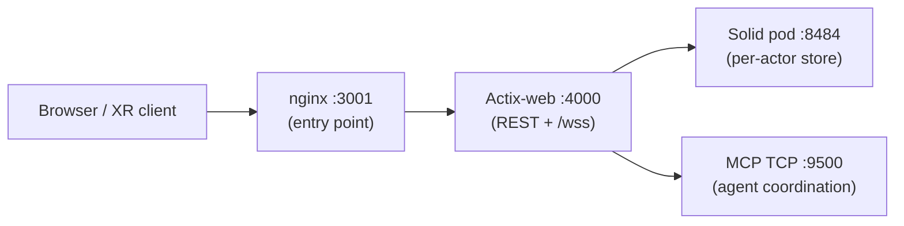

# Deploy VisionClaw

> [VisionClaw Docs](../README.md) · [How-to](README.md)

This guide gets a working VisionClaw deployment running two ways: the Docker
stack (recommended) and a native release build. It also covers the NVIDIA GPU
prerequisites needed for the CUDA physics engine. For the full set of tunable
settings see [configuration reference](../reference/configuration.md); for the
launcher and binary flags see the [CLI reference](../reference/cli.md).

---

## 1. Prerequisites

### Hardware

| Profile | CPU | RAM | Storage | GPU |
|---------|-----|-----|---------|-----|
| Development | 4+ cores | 16 GB | 20 GB SSD | optional |
| Production (≤100K nodes) | 8+ cores | 32 GB | 100 GB SSD | NVIDIA, compute capability 7.5+ |

The CUDA physics engine delivers a 55x speedup over the CPU path: a 100K-node
force step runs in ~4.5 ms on GPU (222 FPS) versus ~246 ms on CPU (4 FPS). A
GPU is optional for small graphs and recommended above ~10K nodes.

### Software

```bash
# Docker Engine 24+ with Compose V2
docker --version
docker compose version

# Rust toolchain (native builds only)
rustc --version          # 1.82+
cargo --version

# Node.js (native client build only)
node --version           # 20+
```

### NVIDIA Container Toolkit

The host needs the NVIDIA Container Toolkit so Docker can expose GPUs to
containers. See [CUDA 13.1 GPU setup](#4-cuda-131-gpu-setup) for the install
steps and `CUDA_ARCH` tuning.

### Ports

| Port | Service | Profile | Purpose |
|------|---------|---------|---------|
| 3001 | Frontend (nginx → client) | dev + prod | Web UI entry point |
| 4000 | Actix-web API + WebSocket | dev (direct), prod (behind nginx) | REST API, `/wss` binary stream |
| 8484 | Solid pod (per-actor data pod) | when Solid enabled | Sovereign agent storage |
| 9500 | Legacy MCP TCP | agent coordination | Multi-agent protocol |

---

## 2. Quick start (Docker)

The `./scripts/launch.sh` wrapper is the canonical entry point. It selects the
right compose profile, content-hashes source files for fast incremental
rebuilds, and prints the service URLs on completion.

```bash
# One-time: create the shared external network
docker network create visionclaw_network

# Configure environment (the graph store is embedded — no DB password)
cp env.example .env
# edit .env: set JWT_SECRET, ENABLE_GPU, CUDA_ARCH for your hardware

# Start the development stack (auto-detects source changes, ~2 min warm)
./scripts/launch.sh up dev

# Production uses a separate, explicit environment file. The launcher refuses
# `up prod` if this file is absent rather than falling back to development.
cp env.production.template .env.prod
chmod 600 .env.prod
# edit .env.prod and replace every placeholder before starting production
```

Launcher commands (`./scripts/launch.sh <command> [dev|prod]`):

| Command | Action |
|---------|--------|
| `up` | Start the stack; auto-detects source changes (fast path) |
| `rebuild` | Full rebuild, no cache (Dockerfile/deps changed, ~15 min) |
| `down` | Stop and remove containers |
| `logs` | Follow container logs |
| `shell` | Open an interactive shell in the container |
| `status` | Show container status and the service URLs |
| `restart` | Restart the stack |

The wrapper drives `docker-compose.unified.yml`. To call Compose directly
instead:

```bash
docker compose -f docker-compose.unified.yml --profile dev up -d
```

The `dev` profile mounts source read-only and compiles Rust on first boot
(allow up to ~5 min cold; the warm path is ~2 min). The `prod` profile uses a
pre-compiled image — see [production deployment](operations/configuration.md).
Compose receives the selected file through `ENV_FILE`; do not put production
credentials in the development `.env`.

---

## 3. Service URLs

Once the stack is up, `./scripts/launch.sh status` lists these endpoints:



| URL | What it serves |
|-----|----------------|
| `http://localhost:3001` | Web UI (nginx front door, dev and prod) |
| `http://localhost:4000` | Backend API direct (dev); redirects to `:3001` in prod |
| `ws://localhost:4000/wss` | Graph position binary stream (V4 delta wire format) |
| `tcp://localhost:9500` | Legacy MCP TCP for multi-agent coordination |

The knowledge/ontology graph store is **embedded in-process** (Oxigraph + SQLite,
RocksDB-backed). There is no separate database container and no Neo4j.

---

## 4. CUDA 13.1 GPU setup

### Install the container toolkit

```bash
# Arch / CachyOS
sudo pacman -S nvidia-container-toolkit
sudo nvidia-ctk runtime configure --runtime=docker
sudo systemctl restart docker

# Debian / Ubuntu
sudo apt install nvidia-container-toolkit
sudo nvidia-ctk runtime configure --runtime=docker
sudo systemctl restart docker
```

Verify GPU passthrough into Docker:

```bash
docker run --rm --gpus all nvidia/cuda:13.1.0-base-ubuntu24.04 nvidia-smi
docker info | grep -i runtime   # expect: nvidia
```

### Driver compatibility

The build system targets the CUDA 13.1 toolkit and automatically downgrades PTX
ISA to 9.0 for maximum driver compatibility (`build.rs`). Kernels JIT-compile on
any driver that supports PTX ISA 9.0+.

| Driver | CUDA Toolkit | Max PTX ISA | Status |
|--------|--------------|-------------|--------|
| 580.x | 13.0 | 9.0 | Minimum supported |
| 595.x | 13.2 | 9.2 | Recommended |

### Set the target architecture

`CUDA_ARCH` controls the SM architecture passed to `nvcc`. The default `75`
produces portable PTX that JIT-compiles on any sm_75+ GPU; set an explicit value
to skip JIT and compile native SASS for a known target.

| `CUDA_ARCH` | GPUs | When to use |
|-------------|------|-------------|
| `75` | Turing (RTX 2080, T4) | Default — portable PTX |
| `80` | Ampere (A100) | Known A100 target |
| `86` | Ampere (A6000, RTX 30-series) | Known A6000 / RTX 30-series |
| `89` | Ada (RTX 40-series, L40) | Known Ada target |

Set it in `.env` or inline:

```bash
CUDA_ARCH=86 NVIDIA_VISIBLE_DEVICES=all ./scripts/launch.sh up dev
```

### Multi-GPU selection

`NVIDIA_VISIBLE_DEVICES` chooses which GPUs the container sees. The CUDA physics
kernels target a single GPU by default.

```bash
NVIDIA_VISIBLE_DEVICES=0     # single GPU
NVIDIA_VISIBLE_DEVICES=0,2   # specific GPUs
NVIDIA_VISIBLE_DEVICES=all   # all GPUs
```

`build.rs` auto-detection: Docker builds skip `nvidia-smi` detection (the build
GPU often differs from the runtime GPU) and use `CUDA_ARCH`, defaulting to `75`.
Host builds run `nvidia-smi --query-gpu=compute_cap` and fall back to `75`. In
both cases an explicit `CUDA_ARCH` always wins.

---

## 5. Native build

To build and run outside Docker, compile the backend with the `gpu` feature
(it is part of the default feature set, alongside `ontology`,
`persistence-oxigraph`, and `solid-pod-embed`):

```bash
# Point the CUDA build scripts at the toolkit
export CUDA_HOME=/opt/cuda        # CachyOS / Arch; use /usr/local/cuda elsewhere
export CUDA_PATH=$CUDA_HOME
export PATH=$CUDA_HOME/bin:$PATH

# Optional: pin the target SM architecture
export CUDA_ARCH=86

# Build the release backend binary with GPU kernels
cargo build --release --features gpu
```

> On CachyOS the CUDA toolkit installs to `/opt/cuda`, not `/usr/local/cuda`.
> `build.rs` checks both, but exporting `CUDA_HOME` removes any ambiguity.

For a CPU-only build (no NVIDIA toolchain), drop the GPU kernels:

```bash
cargo build --release --no-default-features --features ontology,persistence-oxigraph,solid-pod-embed
```

Build the client bundle, then run the server:

```bash
# Client (from client/)
npm ci
npx vite build

# Backend
RUST_LOG=info ./target/release/visionclaw-server
```

The server opens the embedded Oxigraph dataset under `${DATA_DIR:-./data}/oxigraph/`
and populates it from local files on first boot.

---

## 6. Verify the deployment

The backend exposes three health endpoints with distinct semantics:

```bash
curl http://localhost:3001/healthz      # liveness — process is up
curl http://localhost:3001/readyz       # readiness — Oxigraph populated, not DEGRADED
curl http://localhost:3001/api/health   # full diagnostics (subsystems, physics, MCP)
```

| Endpoint | Meaning | Use for |
|----------|---------|---------|
| `GET /healthz` | Process is serving | Liveness probes, load-balancer up checks |
| `GET /readyz` | Graph store populated, not DEGRADED | Readiness probes — safe to route traffic |
| `GET /api/health` | JSON diagnostics report | Operators, dashboards, debugging |

The Web UI is usable at `http://localhost:3001` once `/readyz` returns ready.
Container and GPU checks:

```bash
# Container health
docker inspect --format='{{.State.Health.Status}}' visionclaw_container

# GPU visible inside the container
docker exec -it visionclaw_container nvidia-smi

# Live GPU utilisation
nvidia-smi dmon -s pucvmet -c 10
```

If `/readyz` stays not-ready, the embedded store failed to populate (the backend
enters DEGRADED rather than serving an empty graph). Check the logs:

```bash
docker logs visionclaw_container 2>&1 | grep -iE 'oxigraph|degraded|populat'
```

---

## 7. Common issues

| Symptom | Cause | Fix |
|---------|-------|-----|
| `no NVIDIA GPU device is present` | Toolkit not configured | `nvidia-ctk runtime configure --runtime=docker`; restart Docker |
| PTX JIT compilation fails at runtime | Driver too old for PTX ISA | Upgrade the driver (see matrix) or lower `CUDA_ARCH` |
| `Failed to execute nvcc` | CUDA toolkit missing | Set `CUDA_HOME`/`CUDA_PATH` to the toolkit (default `/opt/cuda`) |
| Wrong GPU auto-detected at build | Host build picks slot-0 GPU | Set `CUDA_ARCH` explicitly |
| Backend reports DEGRADED, empty graph | Oxigraph population failed | Check `/app/data` permissions and source files; reset the dataset |
| Port already in use | Conflicting process on 3001/4000/9500 | Change `DEV_NGINX_PORT`/`API_PORT`/`MCP_TCP_PORT` in `.env` |
| Network missing | `visionclaw_network` not created | `docker network create visionclaw_network` |

Reset the embedded graph dataset (it re-populates from local files on next boot):

```bash
./scripts/launch.sh down
docker run --rm -v visionclaw-data:/data alpine rm -rf /data/oxigraph
./scripts/launch.sh up dev
```

For production hardening, TLS termination, and operator runbooks, continue to
the [operations guides](operations/README.md).

---

## See also

- [Configuration reference](../reference/configuration.md) — every environment variable and setting
- [CLI reference](../reference/cli.md) — `launch.sh` commands and `visionclaw-server` flags
- [Development guide](development.md) — local dev workflow and hot reload
- [Operations runbooks](operations/README.md) — production hardening, TLS, maintenance
- Governing ADRs: [ADR-070 (CUDA integration hardening)](../archive/adr/ADR-070-cuda-integration-hardening.md), [ADR-090 (hexagonal crate modularisation)](../archive/adr/ADR-090-hexagonal-crate-modularisation.md), [ADR-101 (triple-store migration framework)](../archive/adr/ADR-101-triple-store-migration-framework.md)
