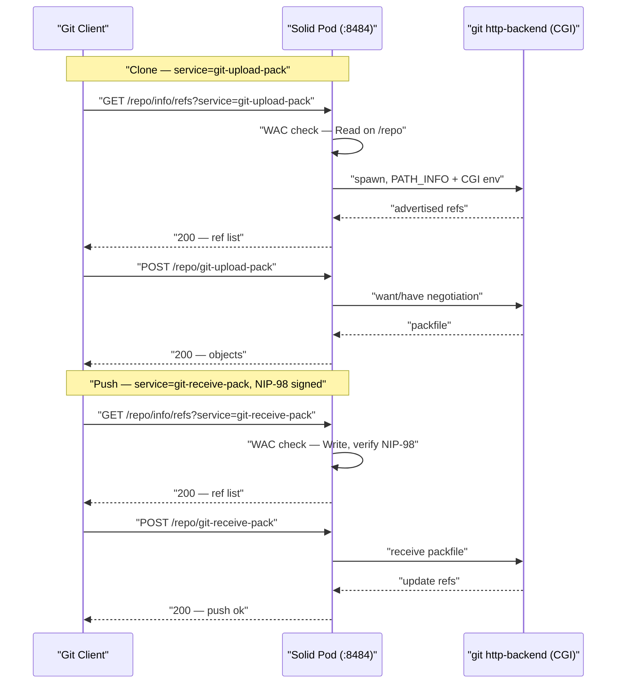

# Git over HTTP on a Solid Pod

> [VisionClaw Docs](../../README.md) · [How-to](../README.md) · [Integration](solid-integration.md)

A VisionClaw Solid pod doubles as a git smart-HTTP server. Any container that holds
a git repository can be cloned and pushed using the standard `git` CLI, with read and
write gated by the pod's Web Access Control (WAC) policy and push authenticated by a
NIP-98 signature bound to a `did:nostr` identity. This is the transport that ADR-086
uses to ingest and write back knowledge bases without a vendor-specific API.

This recipe covers enabling the backend, laying out a repository inside a pod
container, writing the ACLs, and running clone/push from a client.

## When to use this

- Hosting an Obsidian vault or other markdown knowledge base inside a pod so VisionClaw can ingest it
  over `git clone` / `git fetch` instead of the GitHub REST API.
- Letting an agent commit broker-approved enrichments back to the source repository
  (the write-back saga, ADR-086 G4).
- Serving any RDF or document repository to git clients while WAC owns access control.

If you only need LDP CRUD against pod resources, you do not need this — use plain HTTP
verbs as in [Solid Pod Integration](solid-integration.md). Git over HTTP is for
repositories that need commit history, diff-based incremental sync, and signed push.

## How it works

Git's smart-HTTP protocol runs every operation through two request pairs handled by
the `git http-backend` CGI program — the same backend Apache and nginx use. The pod
detects the git URL shape, runs a WAC check, then spawns `git http-backend` with the
CGI environment pointing at the container's on-disk repository.



Three URL shapes carry git traffic; everything else is ordinary LDP:

| Path | Method | Operation | Required WAC mode |
|------|--------|-----------|-------------------|
| `/<repo>/info/refs?service=git-upload-pack` | GET | Clone/fetch discovery | Read |
| `/<repo>/git-upload-pack` | POST | Fetch objects | Read |
| `/<repo>/info/refs?service=git-receive-pack` | GET | Push discovery | Write |
| `/<repo>/git-receive-pack` | POST | Receive objects | Write |

Direct file access to `.git/` internals (`GET /<repo>/.git/config`,
`GET /<repo>/.git/objects/...`) is always refused with `403`. Only the protocol
endpoints above reach the backend; the raw object store is never exposed.

## Prerequisites

- A running VisionClaw deployment with the Solid pod sidecar reachable on
  `:8484` (proxied to clients under `/solid`). See
  [Solid Pod Integration](solid-integration.md) and the
  [solid-pod-rs runbook](../operations/solid-pod-rs-runbook.md).
- An active Nostr session for any operation that needs Write (push). Read-only clone
  against a publicly-ACL'd container needs no auth.
- `git` ≥ 2.30 on the client.

## Step 1 — enable the git backend

The git smart-HTTP backend is provided by `solid-pod-rs-git` and is off unless the
pod is started with git support. Enable it per the deployment you run.

For the pod sidecar, set the environment flag before start:

```bash
# Enable the git smart-HTTP backend on the pod
SOLID_GIT=true
```

Confirm it is live by hitting the discovery endpoint for a known repo (replace
`<repo>` and the base URL with your pod's address):

```bash
curl -sI "http://localhost:8484/<repo>/info/refs?service=git-upload-pack"
# Expect: 200 OK with Content-Type: application/x-git-upload-pack-advertisement
# A 403/404 here means the backend is disabled or the repo path is wrong.
```

## Step 2 — create a repository inside a pod container

A pod container is just a directory on the pod's storage volume. Initialise a git repo
inside the container that will be served.

For a working repository (has a checkout — convenient when the pod also renders the
files):

```bash
cd /path/to/pod/<repo>
git init
printf '# My Knowledge Base\n' > README.md
git add .
git commit -m "Initial commit"
```

For a bare repository (server-only, smaller, the preferred shape for push targets):

```bash
cd /path/to/pod
git init --bare <repo>.git
```

The backend resolves a working repo by pointing `GIT_DIR` at its `.git` subdirectory
and a bare repo directly at the container path. Both are valid clone and push targets.

## Step 3 — write the WAC ACLs

WAC decides who may clone (Read) and who may push (Write). Place an `.acl` resource
alongside the repository container.

Public clone, no write:

```turtle
@prefix acl: <http://www.w3.org/ns/auth/acl#>.
@prefix foaf: <http://xmlns.com/foaf/0.1/>.

<#public>
    a acl:Authorization;
    acl:agentClass foaf:Agent;
    acl:accessTo <./>;
    acl:default <./>;
    acl:mode acl:Read.
```

Public clone plus owner-only push:

```turtle
@prefix acl: <http://www.w3.org/ns/auth/acl#>.
@prefix foaf: <http://xmlns.com/foaf/0.1/>.

<#owner>
    a acl:Authorization;
    acl:agent <https://alice.example/profile#me>;
    acl:accessTo <./>;
    acl:default <./>;
    acl:mode acl:Read, acl:Write, acl:Control.

<#public>
    a acl:Authorization;
    acl:agentClass foaf:Agent;
    acl:accessTo <./>;
    acl:default <./>;
    acl:mode acl:Read.
```

The `acl:agent` WebID is the one a `did:nostr` push identity resolves to. VisionClaw
maps `did:nostr:<hex>` to a WebID via the Nostr resolver (ADR-086 G2); the pubkey that
signs the push must own a WebID listed with `acl:Write` on the container. For
agent-delegated push, NIP-26 delegation lets the server identity act for agent
identities without ACL-ing each agent individually.

## Step 4 — clone

Clone is a plain `git clone` against the pod URL. The repo path is the container path
relative to the pod root.

```bash
# Against the pod directly
git clone http://localhost:8484/<repo>

# Through the client-facing /solid proxy
git clone https://your-host/solid/<repo>
```

If the container's ACL grants public Read, no credentials are requested. If Read is
restricted, git prompts for credentials — supply the NIP-98 auth described next.

## Step 5 — push with NIP-98 authentication

Push requires Write, and the pod authenticates the push request with a NIP-98 signed
HTTP header bound to the pushing `did:nostr` identity. Two ways to provide it.

Interactive, letting git prompt:

```bash
cd <repo>
printf 'New content\n' >> README.md
git add .
git commit -m "Update readme"
git push
# Git prompts for credentials; supply the NIP-98 token as the HTTP password.
```

Non-interactive, via a credential helper that mints the NIP-98 `Authorization: Nostr
<base64-event>` header per request. For VisionClaw's own ingest the `git2`-based
adapter injects this through `RemoteCallbacks::credentials()`, matching the scheme
`solid-pod-rs-git`'s `BasicNostrExtractor` expects — you do not configure this by hand
when push originates from the git ingest service.

On success the pod updates the refs and emits the push result into the audit trail. A
machine-generated commit (the write-back path) additionally carries provenance
trailers — `Urn:`, `Proposed-by:`, `Approved-by:`, `Decision:`, `Reasoning-hash:` —
so the source `git log` records who proposed and who approved each enrichment
(ADR-086 G3). Write-back commits never reach the pod without a broker approval and are
disabled globally unless `WRITEBACK_ENABLED=true`.

## Step 6 — register the repo as a VisionClaw ingest remote (optional)

Once a pod container serves git, register it as a knowledge source so the ingest
pipeline clones, diffs, and (optionally) writes back to it. Remotes are managed
through the REST surface at `/api/ingest/remotes`:

```bash
curl -sX POST http://localhost:4000/api/ingest/remotes \
  -H 'content-type: application/json' \
  -d '{
        "id": "alice-kb",
        "url": "http://localhost:8484/<repo>",
        "auth": "DidNostr",
        "owner_did": "did:nostr:<64-hex>",
        "branch": "main",
        "writeback_enabled": false
      }'
```

The adapter clones to a local worktree under `GIT_INGEST_ROOT`
(default `/app/data/git-ingest/<remote-id>/`) and points the existing parser pipeline
at it — the git layer is transport, the parsers are unchanged. Set
`writeback_enabled: true` only when this pod should receive broker-approved
enrichments. See [REST API reference](../../reference/rest-api.md) for the full remote
schema.

## Troubleshooting

| Symptom | Cause | Fix |
|---------|-------|-----|
| `403` on `info/refs` discovery | Git backend disabled, or WAC denies Read | Confirm `SOLID_GIT=true`; check the container `.acl` grants the agent Read |
| Clone prompts for credentials on a public repo | `acl:default` not set, so children inherit nothing | Add `acl:default <./>` to the public authorisation |
| Push returns `401` | No NIP-98 signature, or expired Nostr session | Re-authenticate; ensure the request carries `Authorization: Nostr <event>` |
| Push returns `403` | NIP-98 valid but the WebID lacks `acl:Write` | Add the pushing agent's WebID to an `acl:Write` authorisation |
| `GET /<repo>/.git/config` returns `403` | Expected — raw `.git` access is always blocked | Use the protocol endpoints, not raw object paths |
| Ingest clone fails for a registered remote | Wrong `auth` type or unresolvable `owner_did` | For pods use `"auth": "DidNostr"`; verify the DID resolves to a WebID |
| Push conflict on write-back | Source pod diverged since last fetch | The saga fails and notifies the broker by design — resolve manually, then re-review |

## See also

- [Solid Pod Integration](solid-integration.md) — LDP CRUD, WAC, Nostr auth, and the pod sidecar this backend runs on
- [Solid Pod Creation Flow](solid-pod-creation.md) — provisioning a per-user pod and its container layout
- [solid-pod-rs runbook](../operations/solid-pod-rs-runbook.md) — operating the Rust pod sidecar
- [Pipeline operator runbook](../operations/pipeline-operator-runbook.md) — running and monitoring ingest
- [REST API reference](../../reference/rest-api.md) — `/api/ingest/remotes` remote management
- [URN ↔ Solid mapping](../../reference/urn-solid-mapping.md) — how pod URLs map to `urn:visionclaw:` identifiers
- [Solid sidecar architecture](../../explanation/solid-sidecar-architecture.md) — why the pod is a git remote, an LDP server, and a renderable site at once
- [Security model](../../explanation/security-model.md) — WAC, NIP-98, and the DID trust chain
- Governing ADRs: [ADR-086 Git-over-HTTP Ingest Unification](../../adr/ADR-086-git-over-http-ingest-unification.md), [ADR-032 Embed solid-pod-rs Library](../../adr/ADR-032-embed-solid-pod-rs-library.md), [ADR-033 Git Bead Provenance](../../adr/ADR-033-git-bead-provenance.md), [ADR-107 GitHub Creds in Pod](../../adr/ADR-107-github-creds-in-pod.md)

### External references

- [Git smart HTTP protocol](https://git-scm.com/book/en/v2/Git-on-the-Server-Smart-HTTP)
- [git-http-backend](https://git-scm.com/docs/git-http-backend)
- [Web Access Control (WAC)](https://solidproject.org/TR/wac)
