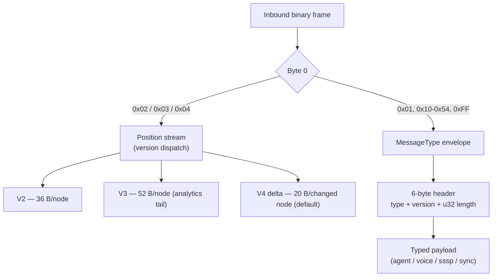

# Binary Protocol Reference

> [VisionClaw Docs](../README.md) · [Reference](README.md)

The binary protocol carries every high-frequency payload on the `/wss`
WebSocket: GPU position broadcasts, agent telemetry, voice, single-source
shortest-path (SSSP) data, and multi-user XR sync. Connection lifecycle,
authentication, and subscription control travel as JSON text frames on the
same socket — see [WebSocket Protocol](websocket-protocol.md). Only the
high-rate payloads are binary.

Every binary frame is **little-endian**. There are two byte-0 dispatch
surfaces:

1. The **position stream**, dispatched on a leading one-byte *protocol
   version* (`0x02` V2, `0x03` V3, `0x04` V4 delta). This is the only channel
   that streams per-node position records.
2. The **multiplexed message system**, dispatched on a one-byte *MessageType*
   header (`0x01`, `0x10`–`0x54`, `0xFF`) followed by a fixed envelope and a
   typed payload.



---

## MessageType frame table (one-byte header)

The multiplexed message system routes on the first header byte. Ranges group
related message families. Values are the canonical client/server constants.

| Code | Name | Family | Direction | Payload |
|------|------|--------|-----------|---------|
| `0x01` | `GRAPH_UPDATE` | Graph | S→C | Graph node/edge batch; 7-byte header adds a `GraphTypeFlag` |
| `0x02` | `VOICE_DATA` | Voice | both | Opus audio chunk |
| `0x10` | `POSITION_UPDATE` | Position | S→C | Node position records |
| `0x11` | `AGENT_POSITIONS` | Position | S→C | Agent position updates (21 B each) |
| `0x12` | `VELOCITY_UPDATE` | Position | S→C | Velocity-only records |
| `0x20` | `AGENT_STATE_FULL` | Agent | S→C | Full agent telemetry (49 B each) |
| `0x21` | `AGENT_STATE_DELTA` | Agent | S→C | Changed-field agent telemetry |
| `0x22` | `AGENT_HEALTH` | Agent | S→C | Health/resource snapshot |
| `0x23` | `AGENT_ACTION` | Agent | S→C | Ephemeral agent-to-node action (15-byte header) |
| `0x30` | `CONTROL_BITS` | Control | C→S | `ControlFlags` bitfield |
| `0x31` | `SSSP_DATA` | Control | S→C | Shortest-path records (14 B each) |
| `0x32` | `HANDSHAKE` | Control | both | Session handshake |
| `0x33` | `HEARTBEAT` | Control | both | Keepalive |
| `0x34` | `BROADCAST_ACK` | Control | C→S | Backpressure acknowledgement |
| `0x40` | `VOICE_CHUNK` | Voice | both | Voice payload chunk |
| `0x41` | `VOICE_START` | Voice | both | Voice stream start |
| `0x42` | `VOICE_END` | Voice | both | Voice stream end |
| `0x50` | `SYNC_UPDATE` | Multi-user | both | Graph operation sync |
| `0x51` | `ANNOTATION_UPDATE` | Multi-user | both | Annotation sync |
| `0x52` | `SELECTION_UPDATE` | Multi-user | both | Selection sync |
| `0x53` | `USER_POSITION` | Multi-user | both | Cursor / avatar position |
| `0x54` | `VR_PRESENCE` | Multi-user | both | VR head + hand tracking |
| `0xFF` | `ERROR` | — | S→C | Error notification |

### Envelope header

The multiplexed header is six bytes; `GRAPH_UPDATE` appends one flag byte.

| Offset | Field | Type | Notes |
|--------|-------|------|-------|
| `0` | MessageType | `u8` | Table above |
| `1` | Protocol version | `u8` | Negotiated wire version |
| `2` | Payload length | `u32` | Byte count of the payload that follows |

`MESSAGE_HEADER_SIZE = 6`. For `GRAPH_UPDATE`,
`GRAPH_UPDATE_HEADER_SIZE = 7` — byte `6` carries a `GraphTypeFlag`
(`0x00` knowledge graph, `0x01` ontology).

---

## Position-stream node records

The position stream prefixes the payload with a single protocol-version byte
and then a flat array of fixed-size node records. Receivers MUST dispatch on
the version byte and length-check the record framing
(`payload_bytes % node_size == 0`).

```text
[u8 version][record 0][record 1]…[record N-1]
```

### V2 record — 36 bytes (base layout)

| Offset | Field | Type | Description |
|--------|-------|------|-------------|
| `0` | Node ID | `u32` | Bits 0–25 ID, bits 26–31 type flags |
| `4` | Position X | `f32` | World-space coordinate |
| `8` | Position Y | `f32` | World-space coordinate |
| `12` | Position Z | `f32` | World-space coordinate |
| `16` | Velocity X | `f32` | Physics velocity (units/s) |
| `20` | Velocity Y | `f32` | Physics velocity |
| `24` | Velocity Z | `f32` | Physics velocity |
| `28` | SSSP distance | `f32` | Shortest-path from source; `f32::INFINITY` if unset |
| `32` | SSSP parent | `i32` | Parent node index in the SSSP tree; `-1` if none |

`BINARY_NODE_SIZE_V2 = 36`. Total frame size `1 + 36 × N` bytes.

### V3 record — 52 bytes (V2 + analytics tail)

V3 is the full-state analytics frame (ADR-031). Bytes `0–35` are byte-for-byte
identical to V2; bytes `36–51` carry the 16-byte analytics tail.

| Offset | Field | Type | Description |
|--------|-------|------|-------------|
| `0–35` | V2 base | — | Identical to the V2 record above |
| `36` | Cluster ID | `u32` | K-means assignment; `0` = unassigned |
| `40` | Anomaly score | `f32` | Local Outlier Factor; `0.0` normal, `1.0` anomaly |
| `44` | Community ID | `u32` | Louvain community; `0` = unassigned |
| `48` | Centrality | `f32` | Normalised PageRank (ADR-031 D2) |

`BINARY_NODE_SIZE_V3 = 52`. Total frame size `1 + 52 × N` bytes. The strides
stay mutually unambiguous under the `length % node_size` heuristic
(`52 % 36 = 16 ≠ 0` and `36 % 52 ≠ 0`), so a misframed buffer can be
re-detected.

Analytics values change at recompute cadence (~0.1–1 Hz); consumers treat the
tail as slowly varying. Each record carries position, velocity **and** the
analytics tail — there is no separate per-frame analytics message.

### Node ID and type flags

The high bits of the `u32` node ID encode node type. The low 26 bits are the
sequential ID (`NEXT_NODE_ID` atomic counter, starting at 1).

| Constant | Value | Bit | Meaning |
|----------|-------|-----|---------|
| `AGENT_NODE_FLAG` | `0x80000000` | 31 | Agent node |
| `KNOWLEDGE_NODE_FLAG` | `0x40000000` | 30 | Knowledge node |
| `ONTOLOGY_TYPE_MASK` | `0x1C000000` | 26–28 | Ontology subtype mask |
| `ONTOLOGY_CLASS_FLAG` | `0x04000000` | 26 | OWL class |
| `ONTOLOGY_INDIVIDUAL_FLAG` | `0x08000000` | 27 | OWL individual |
| `ONTOLOGY_PROPERTY_FLAG` | `0x10000000` | 28 | OWL property |
| `NODE_ID_MASK` | `0x03FFFFFF` | 0–25 | Actual ID (`0 … 2²⁶−1`) |

Decode: `actualId = rawId & NODE_ID_MASK`. Test agent/knowledge with the
single-bit flags; test ontology subtype with `rawId & ONTOLOGY_TYPE_MASK`
against the exact subtype flag. See [Graph Schema](graph-schema.md) for the
node-type taxonomy.

---

## V4 delta — current default

V4 is the default wire format. It transmits only the nodes whose position or
velocity changed since the previous frame, scaled to 0.01 precision as `i16`
deltas. Receivers add the deltas to their cached absolute state.

```text
[u8 version = 4][u8 frame_number][u16 num_changed][item 0]…[item N-1]
```

Header is four bytes; each changed-node item is 20 bytes
(`DELTA_ITEM_SIZE = 20`).

| Offset | Field | Type | Description |
|--------|-------|------|-------------|
| `0` | Node ID | `u32` | ID with type flags (same encoding as V2) |
| `4` | Change flags | `u8` | `0x01` position changed, `0x02` velocity changed |
| `5` | Padding | `u8 × 3` | Reserved, zero |
| `8` | Δ Position X | `i16` | Position-X delta × 100.0 |
| `10` | Δ Position Y | `i16` | Position-Y delta × 100.0 |
| `12` | Δ Position Z | `i16` | Position-Z delta × 100.0 |
| `14` | Δ Velocity X | `i16` | Velocity-X delta × 100.0 |
| `16` | Δ Velocity Y | `i16` | Velocity-Y delta × 100.0 |
| `18` | Δ Velocity Z | `i16` | Velocity-Z delta × 100.0 |

`DELTA_SCALE_FACTOR = 100.0`. A flag bit that is clear means the corresponding
delta is zero (the `i16` is ignored). If an applied delta would push a
coordinate past the ±100000 sanity bound, the value was likely `i16`-clamped
on the server: drop the node and wait for the next full V3 frame rather than
accumulating drift.

> **Two meanings of "delta".** The V4 *wire format* above is distinct from the
> server-side **broadcast delta filter**, a culling step that drops
> below-threshold movers from a full V3/V2 frame. The filter is always active;
> a periodic full broadcast every 300 physics iterations counteracts
> over-filtering after convergence so late-connecting clients still receive
> positions. See [Physics GPU Engine](../explanation/physics-gpu-engine.md).

### V5 sequence wrapper (optional)

The client decoder also recognises a V5 wrapper: `[u8 version = 5][u64
broadcast_sequence][V3 node data]`. It prefixes a monotonic broadcast sequence
(little-endian) ahead of an otherwise verbatim V3 body, letting clients
correlate `BROADCAST_ACK` backpressure and detect dropped frames. The body
parses exactly as a V3 frame once the 9-byte prefix is stripped.

---

## AGENT_ACTION (0x23) — 15-byte header

`AGENT_ACTION` visualises an ephemeral agent-to-node action (query, update,
create…). The fixed header is 15 bytes; an optional variable payload follows.

| Offset | Field | Type | Description |
|--------|-------|------|-------------|
| `0` | Source agent ID | `u32` | Acting agent |
| `4` | Target node ID | `u32` | Target data node |
| `8` | Action type | `u8` | See action table below |
| `9` | Timestamp | `u32` | Event time, ms |
| `13` | Duration | `u16` | Animation duration hint, ms |
| `15…` | Payload | `u8[]` | Optional metadata (length = frame − 15) |

`AGENT_ACTION_HEADER_SIZE = 15`.

| Value | Action | Visual cue |
|-------|--------|-----------|
| `0` | Query | Blue `#3b82f6` |
| `1` | Update | Yellow `#eab308` |
| `2` | Create | Green `#22c55e` |
| `3` | Delete | Red `#ef4444` |
| `4` | Link | Purple `#a855f7` |
| `5` | Transform | Cyan `#06b6d4` |

A batch wraps multiple actions: `[u16 event_count]` then, per event,
`[u16 event_length][event bytes]`.

---

## Auxiliary payloads

Fixed-size records carried by the agent and control message families. All
fields little-endian.

### AGENT_POSITIONS (0x11) — 21 bytes/record

| Offset | Field | Type |
|--------|-------|------|
| `0` | Agent ID | `u32` |
| `4` | Position X/Y/Z | `f32 × 3` |
| `16` | Timestamp | `u32` |
| `20` | Flags | `u8` |

`AGENT_POSITION_SIZE = 21`.

### AGENT_STATE_FULL (0x20) — 49 bytes/record

| Offset | Field | Type |
|--------|-------|------|
| `0` | Agent ID | `u32` |
| `4` | Position X/Y/Z | `f32 × 3` |
| `16` | Velocity X/Y/Z | `f32 × 3` |
| `28` | Health | `f32` |
| `32` | CPU usage | `f32` |
| `36` | Memory usage | `f32` |
| `40` | Workload | `f32` |
| `44` | Tokens | `u32` |
| `48` | Flags | `u8` |

`AGENT_STATE_SIZE = 49`.

### SSSP_DATA (0x31) — 14 bytes/record

| Offset | Field | Type |
|--------|-------|------|
| `0` | Node ID | `u32` |
| `4` | Distance | `f32` |
| `8` | Parent ID | `u32` |
| `12` | Flags | `u16` |

`SSSP_DATA_SIZE = 14`.

### BROADCAST_ACK (0x34) — backpressure

| Field | Type | Description |
|-------|------|-------------|
| Sequence ID | `u64` | Correlates with the server broadcast sequence |
| Nodes received | `u32` | Count the client processed |
| Timestamp | `u64` | Client receive time, ms |

### Bitfields

`AgentStateFlags` (one byte, `AGENT_STATE_FULL`): `ACTIVE 1<<0`, `IDLE 1<<1`,
`ERROR 1<<2`, `VOICE_ACTIVE 1<<3`, `HIGH_PRIORITY 1<<4`, `POSITION_CHANGED
1<<5`, `METADATA_CHANGED 1<<6`, `RESERVED 1<<7`.

`ControlFlags` (`CONTROL_BITS`): `PAUSE_UPDATES 1<<0`, `HIGH_FREQUENCY 1<<1`,
`LOW_BANDWIDTH 1<<2`, `VOICE_ENABLED 1<<3`, `DEBUG_MODE 1<<4`,
`FORCE_FULL_UPDATE 1<<5`, `USER_INTERACTING 1<<6`, `BACKGROUND_MODE 1<<7`.

---

## Server broadcast frame (BinaryV3Frame)

The position-broadcast hot path in `visionclaw-protocol` encodes a
magic-tagged, position-only frame rather than the analytics V3 record. It
carries no analytics tail; analytics ride on the version-byte V3 stream above.

```text
Header  (8 B):  u32 magic = 0x56334630  ·  u32 frame_id (monotonic, wraps)
Per node (28 B): u32 node_id  ·  f32 pos[3]  ·  f32 vel[3]
Trailer (4 B):  u32 node_count
```

Total `12 + 28 × N` bytes. `V3_MAGIC = 0x56334630` is the ASCII mnemonic
"V3F0" read big-endian; serialised little-endian the on-wire bytes are
`30 46 33 56`. Decoders compare the magic numerically and validate that
`node_count × 28` equals the body length, rejecting short buffers, bad magic,
and length mismatch. The `NodeRow` struct is `#[repr(C)]` and `Pod`, so a
`&[NodeRow]` casts straight to bytes — the encode path is a single allocation
per snapshot.

---

## Validation rules

- Set `ws.binaryType = 'arraybuffer'` before the socket opens.
- Read all multi-byte fields little-endian.
- Position-stream frames: dispatch on the version byte, reject unknown
  versions, and require `payload_bytes % node_size == 0`.
- Reject records whose position or velocity is `NaN`/`Inf`.
- `BinaryV3Frame`: verify magic, then verify `node_count × 28` matches the
  body length before casting.

## See also

- [WebSocket Protocol](websocket-protocol.md) — handshake, JSON control frames, subscription lifecycle
- [Graph Schema](graph-schema.md) — node-type taxonomy and ID semantics
- [Physics GPU Engine](../explanation/physics-gpu-engine.md) — where position broadcasts originate
- [Performance Benchmarks](performance-benchmarks.md) — frame-size and bandwidth figures
- Governing records: [ADR-061 — Binary Protocol Unification](../adr/ADR-061-binary-protocol-unification.md) · [ADR-031 — GPU Analytics Correctness and Wiring](../adr/ADR-031-gpu-analytics-correctness-and-wiring.md)
