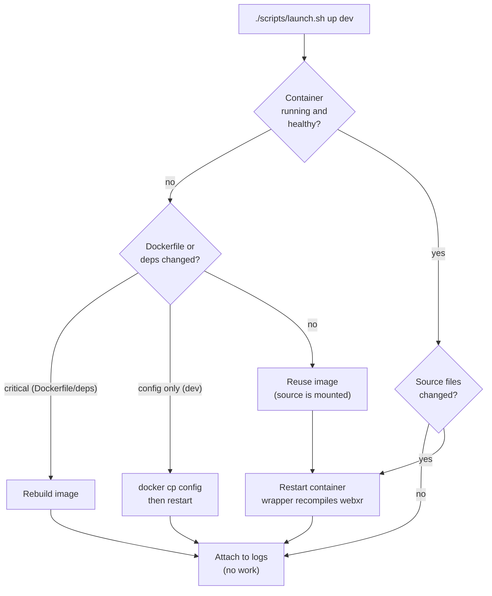

# CLI Reference

> [VisionClaw Docs](../README.md) · [Reference](README.md)

Exhaustive command reference for the three tools you use to build and operate
VisionClaw: the Rust toolchain (`cargo`), the unified launcher
(`./scripts/launch.sh`), and Docker Compose
(`docker compose -f docker-compose.unified.yml`). The launcher is the canonical
entry point — it wraps Compose, detects the GPU and Docker-in-Docker host paths,
selects Cargo features, and chooses the fast incremental path over a full
rebuild. Reach for raw `cargo` and `docker compose` for development, debugging,
and CI.

The backend package is `visionclaw-server` (a `cdylib` + `rlib`). It sits at the
root of an eight-crate Cargo workspace (ADR-090): `visionclaw-contracts`,
`-domain`, `-protocol`, `-adapters`, `-gpu`, `-ontology`, `-actors`, and
`-xr-presence`. Touching one domain type recompiles only that crate plus the
linker, not the whole server.

---

## Cargo

### Build

```bash
# Default features: gpu, ontology, persistence-oxigraph, solid-pod-embed
cargo build

# Optimised release binary
cargo build --release

# Build a single workspace crate
cargo build -p visionclaw-gpu

# Build the independently-compilable contracts crate from a fresh checkout
cargo build --manifest-path crates/visionclaw-contracts/Cargo.toml
```

### Feature flags

These are the real features declared in the root `Cargo.toml`. The default set
covers full functionality; the launcher adds `dev-auth` only for the `dev`
environment.

| Feature | Default | Effect |
|---------|---------|--------|
| `gpu` | yes | CUDA GPU physics kernels (82 `__global__` kernels, 9 `.cu` files) |
| `ontology` | yes | OWL 2 EL reasoning, SHACL-lite + JSON-LD validation, PROV-O |
| `persistence-oxigraph` | yes | Oxigraph SPARQL store + SQLite (ADR-2004). Always-on; flag gates compile guards |
| `solid-pod-embed` | yes | Embedded Solid pod (port 8484) |
| `redis` | no | Optional Redis distributed caching |
| `physics-v2` | no | Phase 5 GPU buffer/`LayoutEngine` rewrite (ADR-01); legacy path is production |
| `dev-auth` | no | Compile-time auth-bypass surface — see warning below |

```bash
# GPU + ontology, the production feature set used by the launcher
cargo build --release --features "gpu,ontology"

# No GPU (CPU host): ontology only
cargo build --no-default-features --features "ontology,persistence-oxigraph,solid-pod-embed"
```

> [!WARNING]
> `dev-auth` is a compile-time gate (ADR-011). Every auth-bypass branch is
> wrapped in `#[cfg(any(debug_assertions, feature = "dev-auth"))]`, so a release
> binary built *without* it physically cannot honour `SETTINGS_AUTH_BYPASS`,
> `ALLOW_INSECURE_DEFAULTS`, `--allow-skip-auth`, or `Bearer dev-session-token`.
> `./scripts/launch.sh up dev` enables it; `up prod` and `cargo build --release`
> do not. Never ship `dev-auth` to production.

### Run

```bash
cargo run                                   # debug build, default features
cargo run --release --features gpu          # optimised, GPU on
RUST_LOG=visionclaw=debug cargo run         # scoped debug logging
cargo run -- --config config.yaml           # pass server arguments
```

### Test

```bash
cargo test                                  # all unit + integration tests
cargo test -p visionclaw-protocol           # one crate
cargo test test_binary_v3 -- --nocapture    # single test, show stdout
cargo test --test '*'                       # integration tests only
cargo test --doc                            # documentation tests
cargo test --features gpu                   # include GPU-gated tests
```

| Option | Effect |
|--------|--------|
| `-- --nocapture` | Show `stdout`/`stderr` |
| `-- --ignored` | Run `#[ignore]`d tests |
| `-- --test-threads=1` | Run serially (GPU tests, shared state) |
| `-- --exact` | Match the test name exactly |

### Code quality

```bash
cargo fmt                   # apply formatting
cargo fmt --check           # verify only (CI)
cargo clippy --all-features # lint with every feature compiled
cargo clippy -- -D warnings # fail on any warning
cargo doc --open            # build and open API docs
```

### Benchmarks and dependencies

```bash
cargo bench --features gpu  # GPU physics benchmarks (see performance-benchmarks.md)
cargo tree                  # dependency graph
cargo update -p oxigraph    # update one dependency
cargo audit                 # security advisory scan
```

### Cargo environment variables

| Variable | Purpose | Example |
|----------|---------|---------|
| `RUST_LOG` | Log level / target filter | `info`, `visionclaw=debug` |
| `RUST_BACKTRACE` | Backtrace on panic | `1`, `full` |
| `CARGO_INCREMENTAL` | Incremental compilation | `1`, `0` |
| `RUSTFLAGS` | Compiler flags | `-C target-cpu=native` |

```bash
RUST_LOG=visionclaw=debug RUST_BACKTRACE=1 cargo run --features gpu
```

---

## Launcher — `./scripts/launch.sh`

The unified launcher is the recommended way to build and run the full stack. It
wraps `docker compose -f docker-compose.unified.yml`, loads `.env.<env>`,
detects the GPU via `nvidia-smi`, resolves host bind-mount paths under
Docker-in-Docker, and picks the Cargo feature set (`gpu,ontology`, plus
`dev-auth` for `dev`).

```bash
./scripts/launch.sh [COMMAND] [ENVIRONMENT] [--with-agent]
```

### Commands

| Command | Action |
|---------|--------|
| `up` | Start the environment. Auto-detects source/config changes and takes the fast path (see below) |
| `down` | Stop and remove containers (`--remove-orphans`) |
| `build` | Build images using the Docker layer cache |
| `rebuild` | Full rebuild: `--no-cache` image build + clears all cargo cache volumes |
| `logs` | Follow container logs |
| `shell` | Open an interactive shell in the running container |
| `restart` | `down` then `up` |
| `status` | Show container status and service URLs |
| `clean` | Remove all containers, volumes, and images |
| `restart-agent` | Restart the `agentic-workstation` sidecar |
| `rebuild-agent` | Full rebuild of `agentic-workstation` with GPU/ComfyUI/CachyOS validation |

### Environments

| Environment | `BUILD_TARGET` | Profile | Logging | Restart policy | `dev-auth` |
|-------------|----------------|---------|---------|----------------|------------|
| `dev` (default) | `development` | `dev` | debug, hot reload | `no` | enabled |
| `prod` | `production` | `prod` | info | `unless-stopped` | disabled |

`prod` additionally starts the `cloudflared` tunnel; `dev` skips it for
local-only access.

### Flags

| Flag | Effect |
|------|--------|
| `--with-agent` | Also (re)start the `agentic-workstation` container |
| `--skip-comfyui` | (`rebuild-agent`) skip the ComfyUI deployment step |
| `--comfyui-full` | (`rebuild-agent`) build full `open3d` support (30–60 min) |
| `--skip-cachyos` | (`rebuild-agent`) skip CachyOS CUDA builds |

### Examples

```bash
./scripts/launch.sh                       # start dev (default command + env)
./scripts/launch.sh up dev                # start dev explicitly
./scripts/launch.sh up dev --with-agent   # start dev + restart the agent sidecar
./scripts/launch.sh build prod            # build prod images (layer cache)
./scripts/launch.sh rebuild prod          # prod rebuild, no cache
./scripts/launch.sh logs dev              # follow dev logs
./scripts/launch.sh shell prod            # shell into the prod container
./scripts/launch.sh status dev            # status + URLs
./scripts/launch.sh clean                 # remove everything
```

### The `up` fast path

In `dev`, the Rust and client source trees are volume-mounted, so source-only
edits never require an image rebuild — the in-container wrapper recompiles the
touched crates on restart (~2 min incremental). `up` inspects file modification
times to decide what to do:



`rebuild` forces a clean image build with `--no-cache` and removes the
`visionclaw-cargo-target-cache`, `-cargo-cache`, and `-cargo-git-cache` volumes —
use it only after a Dockerfile or dependency change, or when the incremental
build is wedged.

### Service URLs

After `up`, the launcher prints the live endpoints:

| Service | Dev URL | Notes |
|---------|---------|-------|
| Web UI (nginx) | `http://localhost:3001` | Frontend; reverse-proxies the API |
| Backend API | `http://localhost:4000` | Actix server (proxied to `:3001` in dev) |
| WebSocket | `ws://localhost:4000/ws` | Binary position stream (V2=36B, V3=52B, V4 delta) |
| Vite dev server | `http://localhost:5173` | Hot-module reload (HMR on `:24678`) |
| Management API | `http://localhost:9090` | Health, metrics, control |
| Solid pod | `http://localhost:8484` | Embedded pod (`solid-pod-embed`) |
| Legacy MCP (TCP) | `tcp://localhost:9500` | Ontology MCP transport |

In `prod` the public URL is served through the `cloudflared` tunnel at
`https://www.visionclaw.info`.

---

## Docker Compose — `docker-compose.unified.yml`

The launcher calls Compose for you with the right profile and feature build
args. These commands are for when you need direct control — debugging, CI, or
one-off operations. Always pass the unified file and a profile (`dev` or
`prod`).

### Lifecycle

```bash
# Start dev (foreground build args handled by launcher; here we replicate them)
docker compose -f docker-compose.unified.yml --profile dev up -d --remove-orphans

# Start dev with a feature build arg
docker compose -f docker-compose.unified.yml --profile dev build \
  --build-arg FEATURES=gpu,ontology,dev-auth
docker compose -f docker-compose.unified.yml --profile dev up -d

# Stop and remove (keep volumes)
docker compose -f docker-compose.unified.yml --profile dev down --remove-orphans

# Stop and remove including named volumes
docker compose -f docker-compose.unified.yml --profile dev down -v
```

The dev service is `visionclaw` (container `visionclaw_container`); the prod
service is the profile-`prod` variant (container `visionclaw_prod_container`).
Compose maps `${DEV_NGINX_PORT:-3001}:3001` and `${API_PORT:-4000}:4000`.

### Logs and status

```bash
docker compose -f docker-compose.unified.yml --profile dev ps
docker compose -f docker-compose.unified.yml --profile dev logs -f --tail=100 visionclaw
docker compose -f docker-compose.unified.yml --profile dev logs --since 1h
```

### Exec and one-off runs

```bash
# Shell into the running dev container
docker compose -f docker-compose.unified.yml --profile dev exec visionclaw /bin/bash

# Run the test suite once in a throwaway container
docker compose -f docker-compose.unified.yml --profile dev run --rm visionclaw cargo test

# Hit the in-container health endpoint
docker compose -f docker-compose.unified.yml --profile dev exec visionclaw \
  curl -f http://localhost:4000/api/health
```

### Build

```bash
# Layer-cached build of the dev image
docker compose -f docker-compose.unified.yml --profile dev build

# Clean rebuild (no cache) — equivalent to `launch.sh rebuild`
docker compose -f docker-compose.unified.yml --profile dev build --no-cache \
  --build-arg CACHE_BUST=$(date +%s)
```

### Health checks

The dev service checks `http://localhost:4000/api/health`. Production checks
`http://localhost:3001/readyz`, which nginx proxies to the Rust backend so a
failed or unready graph store cannot be masked by a healthy nginx process.
Inspect status directly:

```bash
docker inspect --format='{{.State.Health.Status}}' visionclaw_container
docker inspect --format='{{json .State.Health}}' visionclaw_container | jq
```

### Volumes and networks

```bash
docker volume ls | grep visionclaw          # cargo + data volumes
docker volume rm visionclaw-cargo-target-cache   # nuke incremental cache (see rebuild)
docker network inspect visionclaw_network   # shared external network
```

> [!NOTE]
> Under Docker-in-Docker, bind-mount paths resolve against the *host*
> filesystem, not the calling container's. Run builds through the launcher (which
> resolves `HOST_PROJECT_ROOT` automatically) or from a host shell — a raw
> `docker compose up --build` from inside a nested container bakes stale image
> code instead of mounting live source. See
> [Development](../how-to/development.md) for the host-shell workflow.

---

## See also

- [Development](../how-to/development.md) — local build loop, incremental recompile, host-shell rebuilds
- [Deployment](../how-to/deployment.md) — dev/prod launch, environments, cloudflared tunnel
- [Configuration](configuration.md) — environment variables and `.env.<env>` reference
- [Performance Benchmarks](performance-benchmarks.md) — GPU vs CPU physics (55× at 100K nodes)
- [Reference index](README.md)
- ADR-090 — [Hexagonal crate modularisation](../archive/adr/ADR-090-hexagonal-crate-modularisation.md) (workspace crate split)
- ADR-011 — [Auth enforcement](../archive/adr/ADR-011-auth-enforcement.md) (`dev-auth` compile-time gate)
