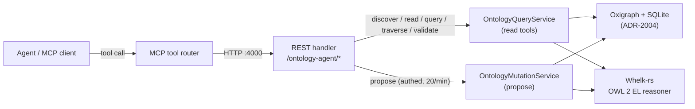

# MCP Tools Reference

> [VisionClaw Docs](../README.md) · [Reference](README.md)

VisionClaw exposes a small, governed Model Context Protocol (MCP) surface for
agent reasoning over the ontology and knowledge graph. There are two distinct
surfaces, and they must not be confused:

1. **Native ontology MCP tools (7)** — the canonical, supported surface.
   Served as HTTP endpoints under `/ontology-agent/*` on the API server
   (`:4000`) and invoked by agents through MCP tool routing. These are the tools
   documented in full below.
2. **agentbox ontology-bridge tools (10)** — a separate Node.js MCP server that
   lives in the [agentbox](../../agentbox/docs/developer/ecosystem.md) subsystem
   and *proxies* to VisionClaw's REST API. They are cross-referenced here, not
   redocumented — agentbox owns them.
3. **MCP TCP `:9500`** — the live outbound poll VisionClaw makes to agentbox's
   MCP TCP server for agent-state snapshots (ADR-2084). See the final section.

The native tools are governed by
[ADR-023 — VisionClaw Ontology Bridge via MCP](../../agentbox/docs/archive/adr/ADR-023-ontology-bridge.md).

---

## Tool surface at a glance

| MCP tool | Method · endpoint | Side | Auth |
|----------|-------------------|------|------|
| `ontology_discover` | `POST /ontology-agent/discover` | read | anonymous |
| `ontology_read` | `POST /ontology-agent/read` | read | anonymous |
| `ontology_query` | `POST /ontology-agent/query` | read | anonymous |
| `ontology_traverse` | `POST /ontology-agent/traverse` | read | anonymous |
| `ontology_validate` | `POST /ontology-agent/validate` | read | anonymous |
| `ontology_status` | `GET /ontology-agent/status` | read | anonymous |
| `ontology_propose` | `POST /ontology-agent/propose` | **write** | **authenticated + rate-limited** |

### Read/write authorisation split

Per the WS-1 hardening (ADR-120), every read-side tool is anonymous, and
`ontology_propose` is the **only** gated route. It is wrapped with
`RequireAuth::authenticated()` (innermost, runs first) and
`RateLimit::per_minute(20)` (outermost, keyed on `user:{pubkey}` rather than
source IP). The caller's self-asserted `agent_id` / `user_id` in the request
body are discarded and **overridden** with the verified `did:nostr` pubkey from
the NIP-98 / session authentication, so a caller cannot impersonate another
agent's identity.

### Request and response field casing

Request bodies use **camelCase** keys (`startIri`, `relationshipTypes`,
`agentContext`). Response payloads use **snake_case** keys
(`preferred_term`, `whelk_inferred`, `quality_score`), because the response
structs derive plain `serde` serialisation. Watch the boundary.

### Routing



---

## ontology_discover

Semantic discovery of ontology classes via the class hierarchy plus Whelk
inference. Returns scored candidates, including results reached only through
inferred subsumption.

**Endpoint**: `POST /ontology-agent/discover`

**Input**

| Field | Type | Required | Default | Description |
|-------|------|----------|---------|-------------|
| `query` | string | yes | — | Free-text discovery query |
| `limit` | integer | no | `20` | Maximum results |
| `domain` | string | no | — | Restrict to a single domain |

**Output**

```json
{
  "success": true,
  "count": 2,
  "results": [
    {
      "iri": "https://narrativegoldmine.com/ns/v1#Concept",
      "preferred_term": "Concept",
      "definition_summary": "A unit of meaning in the shared ontology.",
      "relevance_score": 0.91,
      "quality_score": 0.78,
      "domain": "knowledge",
      "relationships": [
        { "rel_type": "subClassOf", "target_iri": "...#Entity", "target_term": "Entity" }
      ],
      "whelk_inferred": false
    }
  ]
}
```

`whelk_inferred: true` marks a result that was reached through Whelk inference
rather than a direct lexical match.

---

## ontology_read

Read a single note (ontology class) with its full context: vault markdown,
ontology metadata, Whelk axioms (asserted and inferred), related notes, and a
pre-rendered schema context string for query grounding.

**Endpoint**: `POST /ontology-agent/read`

**Input**

| Field | Type | Required | Description |
|-------|------|----------|-------------|
| `iri` | string | yes | Class IRI to read |

**Output** — `{ "success": true, "note": EnrichedNote }`, where `EnrichedNote`:

| Field | Type | Description |
|-------|------|-------------|
| `iri` | string | Class IRI |
| `term_id` | string | Stable term identifier |
| `preferred_term` | string | Display label |
| `markdown_content` | string | Full vault markdown |
| `ontology_metadata` | object | `owl_class`, `physicality`, `role`, `domain`, `quality_score`, `authority_score`, `maturity`, `status`, `parent_classes[]` |
| `whelk_axioms` | array | `{ axiom_type, subject, object, is_inferred }` — `is_inferred=true` means Whelk-derived |
| `related_notes` | array | `{ iri, preferred_term, relationship_type, direction ("outgoing"\|"incoming"), summary }` |
| `schema_context` | string | `SchemaService.to_llm_context()` output for grounding follow-up queries |

---

## ontology_query

Validate and execute a read-only Cypher query against the knowledge graph. The
service validates the query before running it and returns validation status,
errors, and corrective hints.

**Endpoint**: `POST /ontology-agent/query`

**Input**

| Field | Type | Required | Description |
|-------|------|----------|-------------|
| `cypher` | string | yes | Cypher query (read-only) |

**Output** — `{ "success": true, "validation": CypherValidationResult }`:

```json
{
  "success": true,
  "validation": {
    "valid": true,
    "errors": [],
    "hints": ["Use a label filter to bound the match"]
  }
}
```

When the query executes and returns rows, the row payload follows the
`QueryResult` shape: `{ "columns": [...], "rows": [ { col: value, ... } ], "row_count": n }`.
Mutating Cypher is rejected at validation — writes go through `ontology_propose`.

---

## ontology_traverse

Walk the ontology graph outward from a starting IRI, breadth-first, up to a
bounded depth, optionally filtering by relationship type. The traversal is built
by repeatedly reading notes and following their related-note edges.

**Endpoint**: `POST /ontology-agent/traverse`

**Input**

| Field | Type | Required | Default | Description |
|-------|------|----------|---------|-------------|
| `startIri` | string | yes | — | Starting class IRI |
| `depth` | integer | no | `3` | Maximum traversal depth |
| `relationshipTypes` | string[] | no | — | If set, only follow these relationship types |

**Output** — `{ "success": true, "traversal": TraversalResult }`:

```json
{
  "success": true,
  "traversal": {
    "start_iri": "...#Concept",
    "nodes": [
      { "iri": "...#Concept", "preferred_term": "Concept", "domain": "knowledge", "depth": 0 }
    ],
    "edges": [
      { "source_iri": "...#Concept", "target_iri": "...#Entity", "relationship_type": "subClassOf" }
    ]
  }
}
```

Nodes that cannot be read (do not exist) are skipped silently; the traversal
de-duplicates visited IRIs.

---

## ontology_propose

Propose a new note or an amendment to an existing one. This is the **only
mutating tool** and the only one that requires authentication. The proposal is
checked for Whelk consistency, scored, rendered to a markdown preview, and
staged (optionally raising a pull request).

**Endpoint**: `POST /ontology-agent/propose` — **authenticated**, rate-limited
to **20 requests/minute per pubkey**.

**Input** — `{ "proposal": ProposeInput, "agentContext": AgentContext }`.

`proposal` is a tagged union on `action`:

`action: "create"` — a `NoteProposal`:

| Field | Type | Description |
|-------|------|-------------|
| `preferred_term` | string | Display label |
| `definition` | string | Definition text |
| `owl_class` | string | Target OWL class |
| `physicality` / `role` / `domain` | string | Classification facets |
| `is_subclass_of` | string[] | Parent class IRIs |
| `relationships` | map<string, string[]> | Typed relationships |
| `alt_terms` | string[] | Synonyms |
| `owner_user_id` | string? | Per-user ownership |

`action: "amend"` — `{ "target_iri": string, "amendment": NoteAmendment }`, where
`NoteAmendment` carries `add_relationships`, `remove_relationships`,
`update_definition?`, `update_quality_score?`, `add_alt_terms[]`, and
`custom_fields`.

`agentContext` is an `AgentContext` (`agent_id`, `agent_type`,
`task_description`, `session_id?`, `confidence`, `user_id`). **Note**: `agent_id`
and `user_id` are overwritten server-side with the authenticated pubkey and are
not trusted from the body.

**Output** — `{ "success": true, "proposal": ProposalResult }`:

| Field | Type | Description |
|-------|------|-------------|
| `proposal_id` | string | Staged proposal identifier |
| `action` | string | `create` or `amend` |
| `target_iri` | string | Affected class IRI |
| `consistency` | object | `{ consistent, new_subsumptions, explanation? }` from the Whelk check |
| `quality_score` | float | Computed quality score |
| `markdown_preview` | string | Rendered markdown |
| `pr_url` | string? | Pull request URL, when one was opened |
| `status` | enum | `Staged` \| `PRCreated` \| `Merged` \| `Rejected` |

---

## ontology_validate

Check a batch of candidate axioms for Whelk consistency. Each axiom's subject is
checked against the known class set; the tool aggregates errors and hints across
the batch.

**Endpoint**: `POST /ontology-agent/validate`

**Input** — `{ "axioms": [ { "axiom_type", "subject", "object" }, ... ] }`.

**Output**

```json
{
  "success": true,
  "valid": true,
  "errors": [],
  "hints": [],
  "axiom_count": 3
}
```

`valid` is `true` only when no errors were produced across all submitted axioms.

---

## ontology_status

Service health and capability listing. No input.

**Endpoint**: `GET /ontology-agent/status`

**Output**

```json
{
  "service": "ontology-agent",
  "status": "healthy",
  "capabilities": [
    "ontology_discover",
    "ontology_read",
    "ontology_query",
    "ontology_traverse",
    "ontology_propose",
    "ontology_validate"
  ]
}
```

The `capabilities` list enumerates the six callable ontology tools; `status`
itself is the introspection endpoint and is not listed.

---

## agentbox ontology-bridge tools (cross-reference)

The agentbox subsystem ships a **separate** Node.js MCP server — the *ontology
bridge* — that proxies to the VisionClaw REST API rather than touching Oxigraph
directly (VisionClaw is the single writer). It exposes **ten** tools across
three concerns. These belong to agentbox and are documented there; do not
duplicate them here.

| Concern | Tools |
|---------|-------|
| Ontology (TBox) | `ontology_class_get`, `ontology_class_list`, `ontology_axiom_add`, `ontology_validate` |
| Knowledge graph (ABox) | `kg_node_search`, `kg_neighbors`, `kg_pathfind` |
| Infrastructure | `ontology_search`, `ontology_graph_query`, `ontology_health` |

`ontology_graph_query` accepts a read-only SPARQL `SELECT` with VisionClaw's
standard prefix prologue injected; SPARQL `UPDATE` is never exposed. The bridge
fails open — if VisionClaw is unreachable it returns
`{ "error": "ontology_unavailable" }` per call and reports `degraded` health
rather than blocking agentbox startup.

Full documentation:
[agentbox · Ecosystem integration](../../agentbox/docs/developer/ecosystem.md)
and its governing
[ADR-023 — VisionClaw Ontology Bridge via MCP](../../agentbox/docs/archive/adr/ADR-023-ontology-bridge.md).

---

## MCP TCP `:9500`

VisionClaw polls agentbox's MCP TCP server (`MCP_TCP_PORT`, default `9500`) every
2 s for agent-state snapshots (`bots_client.rs`); it is the live, sole source of
those snapshots ([ADR-2084](../adr/ADR-2084-9500-load-bearing-doc-correct-plan-ws-cutover.md)).
The swarm-orchestration methods once carried over this transport (`swarm_init`,
`agent_spawn`, `task_orchestrate`, `swarm_status`, `agent_terminate`) are legacy,
and a WebSocket cutover is planned in ADR-2084. There is no `ENABLE_MCP_BRIDGE`
gate. New integrations must use the native ontology tools above and the
REST/WebSocket surfaces — not the TCP transport.

---

## See also

- [Reference index](README.md)
- [REST API reference](rest-api.md) — the underlying `/ontology-agent/*` endpoints
- [Ontology pipeline](../explanation/ontology-pipeline.md) — Whelk, SHACL, and PROV-O concepts
- [Agent control surface](../explanation/agent-control-surface.md) — how agents drive these tools
- [agentbox · Ecosystem integration](../../agentbox/docs/developer/ecosystem.md) — the 10 bridge tools
- Governing ADR: [ADR-023 — VisionClaw Ontology Bridge via MCP](../../agentbox/docs/archive/adr/ADR-023-ontology-bridge.md)
