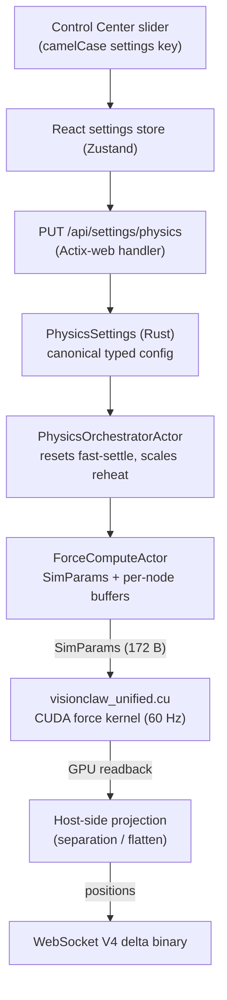

# Physics Parameters Reference

> [VisionClaw Docs](../README.md) · [Reference](README.md)

This page documents every parameter that drives the GPU force-directed layout. The
authoritative source of truth is the Rust `PhysicsSettings` struct
(`crates/visionclaw-domain/src/types/physics_config.rs`), which the backend converts to
the GPU-aligned `SimParams` (`src/models/simulation_params.rs`, a 172-byte `#[repr(C)]`
mirror of the CUDA `SimParams`) before each compute pass. Defaults quoted here are the
canonical boot defaults from `PhysicsSettings::default()` — the values the simulation
starts with whenever the SQLite `physics` key is absent. The [Control Center](../explanation/control-center.md)'s
Motion & Forces group sliders edit the same fields through `PUT /api/settings/physics`.

The empirical tuning guidance at the foot of this page is folded in from the parameter
analysis of a 2,242-node knowledge graph and is the recommended starting point for graphs
of similar size and sparsity.

---

## How a parameter reaches the GPU

`graph_separation_x` and `axis_compression_z` are the only layout controls **not** applied
inside the kernel — they are a deterministic post-readback projection on the host position
buffer, re-applied every broadcast frame. `adaptive_speed` and the other ForceAtlas2 fields
**are** kernel inputs forwarded via `SimParams`.

---

## Core forces

These are the dominant scale controls. `center_gravity_k` sets the equilibrium radius against
`repel_k`; `spring_k` pulls connected nodes to `rest_length`; `repel_k` keeps everything else
apart.

| UI label | Settings key | Type | Range (slider) | Default | Effect |
|---|---|---|---|---|---|
| Spring Strength | `springK` | f32 | 0.1 – 100 | **12.0** | Edge spring (Hooke) constant. Pulls connected nodes toward `restLength`. 8–20 suits 2K+ node graphs; rigid above ~40 |
| Node Spacing | `restLength` | f32 | 1 – 200 | **50.0** | Spring rest length — the target edge length. Small = dense, large = spread. Scale to graph size (see tuning table) |
| Repulsion | `repelK` | f32 | 0 – 3000 | **120.0** | Coulomb-style node–node repulsion. Balanced against gravity; too high explodes the layout past the bounds |
| Max Repulsion Dist | `maxRepulsionDist` | f32 | 10 – 2000 | **400.0** | Distance beyond which repulsion is ignored (maps to `SimParams.repulsion_cutoff`). Lower localises repulsion and preserves clusters |
| Repulsion Softening | `repulsionSofteningEpsilon` | f32 | — | **0.0001** | Plummer-softening epsilon added to `r²` so coincident nodes do not produce infinite force |
| Cluster Tightness | `centerGravityK` | f32 | 0 – 10 | **0.2** | Linear pull toward the origin. Dominant scale control: reins in disconnected nodes the springs cannot reach. Enables the `ENABLE_CENTERING` flag when > 0 |
| Gravity | `gravity` | f32 | — | **0.002** | Constant weak pull toward origin, applied on top of `centerGravityK`. Keeps disconnected components from drifting away |
| Separation Radius | `separationRadius` | f32 | 0.01 – 200 | **2.116** | Minimum enforced node–node separation (collision floor) |
| Cluster Strength | `clusterStrength` | f32 | 0 – 1 | **0.0** | Community-cohesion force. Opt-in: the Leiden/Louvain detector only runs in the force loop when this exceeds the `> 0.0001` gate, so the default keeps a fresh graph open rather than collapsing each community to its centroid |

> **No separate `attractionK`**: edge attraction is `spring_k`. Earlier UI builds exposed a
> distinct "Attraction" slider; the kernel only reads `spring_k`, so prefer `springK` and treat
> any `attractionK` as a legacy alias.

---

## Integration, damping and annealing

| UI label | Settings key | Type | Range (slider) | Default | Effect |
|---|---|---|---|---|---|
| Time Step | `dt` | f32 | 0.001 – 0.1 | **0.016** | Integration step per iteration (~60 Hz). Larger = faster but less stable |
| Damping | `damping` | f32 | 0 – 1 | **0.9** | Velocity damping. Lower = more energy/longer settle; higher = faster convergence, risk of premature freeze |
| Boundary Damping | `boundaryDamping` | f32 | 0 – 1 | **0.95** | Extra damping applied as nodes approach the world bounds, preventing wall bounce |
| Max Velocity | `maxVelocity` | f32 | 0.1 – 500 | **100.0** | Per-step speed cap. Lower = smoother settling, fewer overshoots |
| Max Force | `maxForce` | f32 | 1 – 1000 | **150.0** | Per-node force cap. Lower prevents explosion on high-degree hubs |
| Temperature | `temperature` | f32 | 0.001 – 100 | **0.0** | Simulated-annealing energy injected per step. 0 = no random jitter (deterministic) |
| Cooling Rate | `coolingRate` | f32 | 0.00001 – 0.01 | **0.001** | Annealing decay rate. Faster cooling = quicker, more stable layout; slower = more exploration |
| Iterations | `iterations` | u32 | 1 – 5000 | **50** | Solver iterations per frame in batched modes |
| Warmup Iterations | `warmupIterations` | u32 | 0 – 500 | **100** | Initial stabilisation steps before convergence is checked, so residual reheat energy does not trigger false early termination |

The runtime also holds a **stability-warmup window** in `ForceComputeActor` independent of
`warmupIterations`: 600 frames after a normal graph upload, 1,200 frames for edge-sparse
graphs (0 edges → repulsion + gravity only, which reach equilibrium too fast), and 1,800
frames (~30 s) after a parameter change during settle.

---

## ForceAtlas2 / LinLog

| UI label | Settings key | Type | Range | Default | Effect |
|---|---|---|---|---|---|
| LinLog Mode | `linLogMode` | bool | off / on | **on** | Switches edge attraction to logarithmic (`log(1+d)`) so dense communities contract and sparse links stay long — clearer community separation |
| Scaling Ratio | `scalingRatio` | f32 | — | **10.0** | ForceAtlas2 global scale multiplier applied to repulsion |
| Adaptive Speed | `adaptiveSpeed` | bool | off / on | **on** | Per-node swing/traction scales the global integration step: high-energy regions slow, converged regions speed up. Forwarded as `SimParams.adaptive_speed`; a change re-uploads params and reheats |
| Global Speed | `globalSpeed` | f32 | — | **0.4** | Base global step multiplier the adaptive controller scales from |

---

## Per-population spring multipliers

The graph carries three node populations (Knowledge, Ontology, Agent). Each gets an
independent spring multiplier uploaded to the GPU as a per-node `spring_scale` buffer, so one
population can be stiffened or relaxed without touching the others. The effective spring for a
node is `spring_k × spring_k_<population>`.

| Settings key | Type | Default | Effect |
|---|---|---|---|
| `springKKnowledge` | f32 | **1.0** | Spring multiplier for Knowledge (page / linked-page) nodes |
| `springKOntology` | f32 | **1.0** | Spring multiplier for Ontology (OWL class) nodes |
| `springKAgent` | f32 | **1.0** | Spring multiplier for Agent / bot nodes |

---

## Dual-graph host-side projection

These two controls are applied on the host position buffer after GPU readback, every broadcast
frame, leaving the integrator free of layout bias. Knowledge nodes shift toward `-x`, Ontology
toward `+x`, Agent nodes stay at the origin to bridge both. The Z axis is the disc normal shared
by separation and flatten.

| UI label | Settings key | Type | Range (slider) | Default | Effect |
|---|---|---|---|---|---|
| Dual Graph Separation | `graphSeparationX` | f32 | 0 – 500 | **100.0** | Half-distance the two populations are pushed apart on X (total gap = `2 × graphSeparationX`). 0 = merged; ~100 keeps the discs close and overlapping; > 250 pushes them unusably far |
| Axis Compression (Z) | `axisCompressionZ` | f32 | 0 – 1 | **0.9** | Flattens Knowledge + Ontology toward `z=0` (`pos.z *= 1 - axisCompressionZ`) to form discs; Agent nodes keep full-3D depth so they visibly bridge the discs. 0 = no compression, 1 = fully flat |
| Flatten to Planes | `zDamping` | f32 | 0 – 0.1 | 0.0 | Legacy client-side Z squash (`0` = full 3D, `0.1` = flat). Superseded by `axisCompressionZ`; prefer the latter |

---

## Bounds, grid and SSSP

| Settings key | Type | Default | Effect |
|---|---|---|---|
| `boundsSize` | f32 | **400.0** | Soft world-cube half-extent (`SimParams.viewport_bounds` when `enableBounds` is on). Forces ramp up near the wall |
| `enableBounds` | bool | **on** | When off, `viewport_bounds` is fed to the kernel as 0 (unbounded) |
| `gridCellSize` | f32 | **50.0** | Spatial-hash cell size for the neighbour grid used by repulsion. Tune near `restLength` |
| `ssspAlpha` | f32 | **1.5** | Weight of single-source-shortest-path graph distance in the SSSP-adjusted rest length (`ENABLE_SSSP_SPRING_ADJUST`). Makes spring rest length ontology-aware: topologically distant nodes rest farther apart |

---

## Constraint ramp

The constraint solver (separation, boundary, alignment, cluster, ontology) ramps its force in
over the first frames after a constraint set is applied, avoiding a snap.

| Settings key | Type | Default | Effect |
|---|---|---|---|
| `constraintRampFrames` | u32 | **60** | Frames over which constraint force ramps from 0 to full |
| `constraintMaxForcePerNode` | f32 | **50.0** | Per-node cap on constraint force, preventing a constraint from overpowering the base layout |

---

## Reheat dynamics

`reheat_factor` is a **runtime-derived** scalar, not a slider. When a parameter changes during a
settle, `ForceComputeActor` injects a velocity perturbation scaled by the reheat factor so the
layout re-explores rather than staying pinned in its current minimum.

- **Trigger**: any force-coefficient change (`repel_k` or `spring_k`) during settle, or a layout
  reset (which forces `reheat_factor = 1.0`).
- **Magnitude**: scaled by the log-ratio of the largest force change in either direction —
  `reheat = (1 + ln(ratio) × 2).clamp(1.0, 5.0)`. A 10× bump produces a strong reheat; a tiny
  nudge barely reheats.
- **Decay**: `reheat_factor *= 0.997` each step (~230-step half-life), cleared once it falls
  below `0.02`. The slow decay sustains exploration across the stability-warmup window instead of
  snapping back to the nearest local minimum.

---

## Degree-weighted gravity and isolated nodes

On graph upload, `ForceComputeActor` derives two per-node buffers from the CSR adjacency to make
the layout reveal structure rather than form a uniform ball:

- **Degree weight** `= log(1 + degree)`, normalised so the median-degree node weighs ~1.0. Hubs
  are pulled toward the centre more strongly; isolated (degree-0) nodes receive ~0 centering and
  drift to a peripheral shell instead of polluting the core.
- **Class mass** `= clamp(0.5 + 2·weight, _, 5.0)`. High-degree hubs gain inertia (up to ~5×) so
  they resist sudden jumps and settle smoothly during layout transitions; isolated nodes get the
  0.5 floor.

---

## Semantic forces

Optional advanced layout forces computed in `semantic_forces.cu`, configured through
`SemanticForcesActor`. Each block is independently enabled and defaults are conservative.

**DAG layout** (`ConfigureDAG`) — arranges hierarchies into levels:

| Field | Type | Default | Effect |
|---|---|---|---|
| `vertical_spacing` | f32 | 100.0 | Vertical separation between hierarchy levels |
| `horizontal_spacing` | f32 | 50.0 | Minimum horizontal separation within a level |
| `level_attraction` | f32 | 0.5 | Strength of attraction to a node's target level |
| `sibling_repulsion` | f32 | 0.3 | Repulsion between nodes on the same level |

**Type clustering** (`ConfigureTypeClustering`) — groups same-type nodes:

| Field | Type | Default | Effect |
|---|---|---|---|
| `cluster_attraction` | f32 | 0.4 | Attraction between nodes of the same type |
| `cluster_radius` | f32 | 80.0 | Target radius of a type cluster |
| `inter_cluster_repulsion` | f32 | 0.2 | Repulsion between different type clusters |

**Collision** (`ConfigureCollision`) — hard overlap avoidance:

| Field | Type | Default | Effect |
|---|---|---|---|
| `min_distance` | f32 | 10.0 | Minimum allowed distance between nodes |
| `collision_strength` | f32 | 0.8 | Force strength when nodes overlap |
| `node_radius` | f32 | 15.0 | Assumed node radius for collision tests |

**Attribute springs** — weight-scaled edge springs:

| Field | Type | Default | Effect |
|---|---|---|---|
| `base_spring_k` | f32 | 0.1 | Base spring constant for attribute-derived edges |
| `weight_multiplier` | f32 | 1.5 | Scales spring stiffness by edge weight |

---

## FastSettle vs Continuous

Physics runs in one of two modes set by `SettleMode` in `SimulationParams`.

**FastSettle** (`SettleMode::FastSettle { max_settle_iterations, energy_threshold, damping_override }`)
- Fires GPU steps as fast as the GPU allows (no inter-step sleep).
- Stops when kinetic energy drops below `energy_threshold` **or** `max_settle_iterations` is
  reached — whichever first.
- Convergence is not checked during the warmup window, avoiding false early termination from
  residual reheat energy.
- A parameter change during FastSettle resets `fast_settle_iteration_count` and reheats,
  restarting the settle.

**Continuous** (`SettleMode::Continuous`)
- Fires at ~60 fps indefinitely.
- For live responsiveness over convergence (e.g. interactive graph edits).
- Parameter changes take effect on the next tick with no reheat.

---

## Authoritative tuning table

Derived from analysis of a 2,242-node, 4,531-edge knowledge graph (mean degree 3.8, 21% isolated
singletons, one giant component of 1,722 nodes, 5 mega-hubs with the largest at degree 149). The
canonical defaults above already incorporate the direction of this analysis — stronger springs,
lower repulsion, smaller rest length, higher damping. Use the tuning range when adapting to a
graph of different size or density.

| Parameter | Canonical default | Tuning range | Rationale |
|---|:---:|:---:|---|
| `restLength` | 50 | 30 – 40 | Scale to graph size: `restLength ≈ (V / N)^(1/3)` for a target display volume `V`. A 500-unit cube with 2,242 nodes gives ~37 |
| `repelK` | 120 | 120 – 500 | Enough to prevent overlap without exploding clusters; long-range repulsion past `maxRepulsionDist` hurts community structure |
| `springK` | 12 | 12 – 30 | Stronger springs pull communities together; too high (> 40) makes rigid rods that oscillate |
| `centerGravityK` | 0.2 | 0.2 – 0.3 | Moderate centering keeps the main component anchored without crushing it |
| `damping` | 0.9 | 0.9 – 0.92 | Higher damping prevents oscillation and premature freeze |
| `maxVelocity` | 100 | 50 – 100 | Lower = smoother settling |
| `maxForce` | 150 | 150 – 200 | Caps hub forces to prevent explosion |
| `maxRepulsionDist` | 400 | 150 – 400 | Lower localises repulsion (maps to `repulsion_cutoff`) |
| `temperature` | 0.0 | 0.0 – 0.5 | Small random energy can help escape symmetric minima |
| `coolingRate` | 0.001 | 0.001 – 0.005 | Faster cooling → more stable final layout |

**Why a uniform ball appears**: with one repulsion scale and one spring scale, fast-settle
converges to the nearest equilibrium — a featureless sphere where repulsion balances springs
uniformly. The degree-weighted gravity and isolated-node shell (above) counter this; for very
large graphs the gold-standard remedy is a multi-resolution (coarsen → layout → refine) pass
such as OpenOrd / ForceAtlas2 grid layout.

---

## Effective ranges

The slider maxima are conservative limits that prevent degenerate layouts:

- **`springK` > ~40**: springs become rigid rods; the layout oscillates instead of settling.
- **`repelK` > 3000**: nodes explode past the bounding box before the loop can compensate.
- **`graphSeparationX` > 250**: the two discs are pushed more than 500 units apart — unnavigable.
- **`axisCompressionZ` = 1**: fully flattens Knowledge + Ontology onto `z=0`; combine with
  `graphSeparationX` for two parallel discs bridged by full-3D Agent nodes.
- **`centerGravityK` too high vs `repelK`**: the graph collapses to a point; keep the ratio modest.

---

## See also

- [Physics / GPU Engine](../explanation/physics-gpu-engine.md) — architecture of the simulation pipeline and CUDA kernels
- [REST API — `PUT /api/settings/physics`](rest-api.md) — request schema and auth
- [Performance Benchmarks](performance-benchmarks.md) — GPU vs CPU layout timings
- Governing ADRs: [ADR-069 Force Preset System](../adr/ADR-069-force-preset-system.md), [ADR-070 CUDA Integration Hardening](../adr/ADR-070-cuda-integration-hardening.md), [ADR-108 Layout Mode System](../adr/ADR-108-layout-mode-system.md)
</content>
</invoke>
