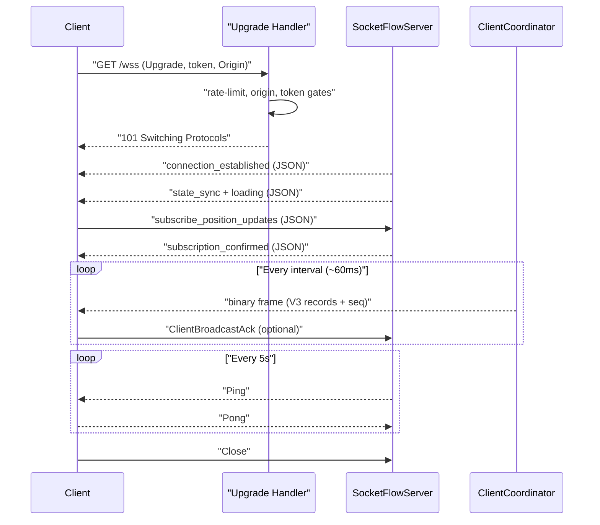
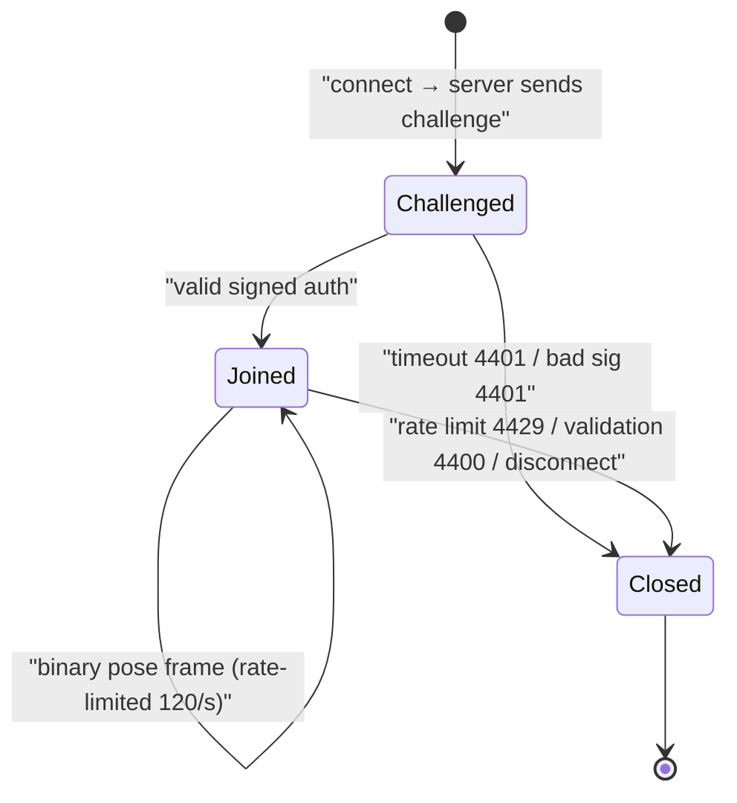

# WebSocket Protocol — Framing and Lifecycle

> [VisionClaw Docs](../README.md) · [Reference](README.md)

This page is the framing-and-lifecycle reference for VisionClaw's WebSocket
surfaces: which endpoints exist, how a connection is established and
authenticated, how heartbeats and reconnection work, and which subprotocol each
socket negotiates. It deliberately does **not** describe the binary byte layout
of the position stream — that single-source spec lives in
[The Binary Protocol](./binary-protocol.md). Read the two together: this page
covers the envelope and the connection state machine, the binary doc covers the
52-byte node record carried inside binary frames.

## Endpoint catalogue

All WebSocket routes are registered in `src/main.rs`. The server speaks plain
`ws://` in development and `wss://` behind the nginx/cloudflared edge in
production (frontend `:3001`, API `:4000`).

| Path | Handler | Direction | Frames | Subprotocol |
|------|---------|-----------|--------|-------------|
| `/wss` | `socket_flow_handler` | bidirectional | JSON control + binary position stream | `permessage-deflate` (echoed) |
| `/wss/agent-events` | `agent_events_ws` | inbound (server-to-server) | JSON only | `vc-agent-events.v1` |
| `/ws/presence` | `ws_presence` | bidirectional | JSON handshake + binary pose | none |
| `/ws/speech` | `speech_socket_handler` | bidirectional | binary Opus audio | none |
| `/ws/mcp-relay` | `mcp_relay_handler` | bidirectional | JSON MCP relay | none |
| `/ws/client-messages` | `client_messages_handler` | bidirectional | JSON client-to-client | none |

This page details the three load-bearing surfaces: the **position stream**
(`/wss`), the **agent-events ingest** (`/wss/agent-events`), and the **XR
presence** socket (`/ws/presence`). The remaining sockets follow the same
upgrade-and-authenticate pattern described under [Authentication](#authentication).

---

## Position stream — `/wss`

`/wss` is a hybrid socket. JSON text frames carry the connection lifecycle
(handshake, subscription control, heartbeat, drag interactions); binary frames
carry the high-frequency GPU position stream. A single connection multiplexes
both — the client branches on `event.data instanceof ArrayBuffer`.

### Upgrade and handshake

The upgrade handler (`src/handlers/socket_flow_handler/http_handler.rs`) runs
four gates before accepting the socket, in order:

1. **Rate limit** — per-client-IP via `WEBSOCKET_RATE_LIMITER`. A rejected
   upgrade returns a rate-limit HTTP response, not a 101.
2. **Origin check** — the `Origin` header must match the `CORS_ALLOWED_ORIGINS`
   allow-list or be same-host as `Host`/`X-Forwarded-Host`. This is the
   cross-site WebSocket hijacking (CSWSH) defence. A missing `Origin` is
   rejected in release builds.
3. **Token validation** — see [Authentication](#authentication).
4. **Upgrade header** — a missing `Upgrade` header returns `400`.

On success the server upgrades, then the `SocketFlowServer` actor's `started()`
sends an opening sequence over JSON text frames:

```json
{ "type": "connection_established",
  "timestamp": 1748500000000,
  "is_reconnection": false,
  "state_sync_sent": true,
  "protocol": { "supported": [3, 5], "preferred": 3 } }
```

`protocol.supported` advertises the binary wire versions the server can emit;
`preferred` is the V3 per-tick frame (the current default — see
[binary-protocol.md](./binary-protocol.md)). A full state sync and a
`{"type":"loading"}` notice follow immediately.

### Subscribing to positions

The client opts into the binary stream with a JSON control frame:

```json
{ "type": "subscribe_position_updates",
  "data": { "interval": 60, "binary": true, "nodeTypes": ["knowledge", "agent"] } }
```

- `interval` is the broadcast period in milliseconds (default `60`, clamped up
  to the endpoint rate limit `1000 / (rpm/60)`).
- `nodeTypes` is an optional server-side filter — only matching node types are
  encoded into binary frames for this session.

The server replies `{"type":"subscription_confirmed","subscription":"position_updates",...}`
and starts a single broadcast loop. Two server-side defences keep reconnect
storms from amplifying:

- **Per-session debounce** — subscribes arriving within 2 s of the last accepted
  one are ignored.
- **Generation collapse** — each `subscribe_position_updates` bumps a generation
  counter; older self-looping broadcast tasks stop when they observe a newer
  generation, so exactly one loop survives no matter how many times the client
  re-subscribes.

### Backpressure acknowledgement

The stream supports application-level flow control. After consuming a binary
frame the client may send a `ClientBroadcastAck` carrying the broadcast sequence
number embedded in the frame. The `ClientCoordinatorActor` forwards it to the
GPU compute actor as `PositionBroadcastAck`, which replenishes the broadcast
token budget. The sequence number is the V5 frame's monotonic
`broadcast_sequence`; gaps signal dropped frames and warrant a
`request_full_snapshot`. The wire encoding of the sequence header is documented
in [binary-protocol.md](./binary-protocol.md).

### Inbound control frames

`message_routing.rs` dispatches JSON text frames by `type`:

| `type` | Effect |
|--------|--------|
| `ping` (plain `"ping"` or JSON) | refresh activity clock, reply `pong` |
| `subscribe_position_updates` | start/refresh the binary broadcast loop |
| `request_full_snapshot` | emit one full binary frame immediately |
| `requestInitialData` | send the sparse initial graph load |
| `filter_update` | adjust server-side node filtering |
| `authenticate` | upgrade an unauthenticated session in place |
| `nodeDragStart` / `nodeDragUpdate` / `nodeDragEnd` | pin/move/release a node |
| `update_physics_params` | **rejected** — physics changes go via REST |

Unknown types are logged and ignored; malformed JSON returns a
`{"type":"error"}` frame.

### Live linkage — `graphUpdated` (server → client)

When the reasoned graph changes shape at runtime, `GraphServiceSupervisor`
broadcasts a debounced JSON text frame to every connected client over the
`ClientCoordinatorActor` fan-out:

```json
{"type":"graphUpdated","revision":42,"reason":"database_reload"}
```

- `revision` — monotonic mutation counter (bumps on every topology mutation;
  one frame per ~500 ms settle window coalesces bursts).
- `reason` — `database_reload` (GitHub sync / admin reload), `nodes_added`
  (bulk metadata ingest), `edge_added` (runtime edge insert),
  `graph_data_replaced` (full topology replacement),
  `ontology_axiom_added` / `ontology_axiom_removed` (REST axiom writes), or
  `inference_results_stored` (fresh Whelk inferences landed).

The client (`textMessageHandler.ts`) responds with a trailing-debounced
(750 ms) refetch of REST `GET /api/graph/data` plus a refresh of the
inferred-axioms overlay (`/ontology/inferred`). The topology hash in
`graphDataManager` collapses no-change deliveries to a no-op, so
over-signalling is cheap. A sampling self-heal in
`graphDataManager.updateNodePositions` backstops missed signals: if the binary
position stream references node ids the client has never learned, it refetches
topology (30 s cooldown).



---

## Agent-events ingest — `/wss/agent-events`

`/wss/agent-events` is a **server-to-server** ingest socket (ADR-059 Phase 2):
agentbox pushes `notifications/agent_action` JSON-RPC frames into VisionClaw,
which validates them against the canonical `AgentActionNotification` mirror and
publishes them to the process-global agent-events hub. The GPU beam render actor
(`AgentBeamActor`) subscribes to that hub and broadcasts `0x23` frames; the gluon
attractive force is deferred (needs a transient-edge GPU buffer, see the ADR-059
addendum).

- **Subprotocol** — the upgrade negotiates `vc-agent-events.v1`. Clients should
  offer it in `Sec-WebSocket-Protocol`.
- **JSON only** — binary frames are rejected; this is the inbound complement to
  the server-to-browser `0x23` beam frame, never a position channel.
- **Frame contract** — each text frame must parse as an `AgentActionNotification`
  and pass `is_canonical()` (`method == "notifications/agent_action"`, envelope
  `version >= 3`). Non-canonical frames get `{"error":"non_canonical_envelope"}`;
  unparseable frames get `{"error":"malformed_json"}`. Neither closes the socket.
- **Provenance** — a per-frame provenance status (signed / anonymous) is
  recorded and any foreign `urn:agentbox:*` source/target URN is translated
  through the BC20 namespace bridge. Frames publish regardless of attribution so
  the render path never drops on missing identity.
- **Heartbeat** — the actor answers `Ping` with `Pong` and honours `Close`;
  there is no server-initiated keepalive timer. The pushing client owns liveness.

Because this is not a browser socket, `Origin` is not enforced: non-browser
clients do not send it, and a cross-site script cannot forge the bearer token
cross-origin, so CSWSH is already mitigated by the token gate.

---

## XR presence — `/ws/presence`

`/ws/presence` (PRD-008) runs a JSON challenge/response handshake, then switches
to binary pose frames (opcode `0x43`) forwarded to a per-room `PresenceActor`.
It does not negotiate a subprotocol.

### Challenge handshake

On connect the server immediately sends a challenge; the client signs the nonce
with its `did:nostr` key and replies:

```json
// server → client
{ "type": "challenge", "nonce": "<hex32>", "ts": 1748500000000000 }
// client → server
{ "type": "auth", "did": "did:nostr:<pubkey>", "signature": "<hex>",
  "room_id": "<room>", "metadata": { "display_name": "...", "model_uri": null } }
```

The signature is verified by the `IdentityVerifier` port against the issued
nonce; the recovered `did` must equal the claimed one. On success the server
replies `{"type":"joined", ...}` with the current room roster, transitions the
session to the `Joined` phase, and begins forwarding pose frames. After the
handshake, **binary** frames are pose updates and **JSON** frames are room
events (join/leave).

### Limits and close codes

| Constant | Value | Meaning |
|----------|-------|---------|
| `HANDSHAKE_TIMEOUT` | 10 s | close if `auth` not received in time |
| `HEARTBEAT_INTERVAL` | 15 s | server `Ping` cadence |
| heartbeat deadline | 2× interval (30 s) | close if no client liveness |
| `RATE_LIMIT_FRAMES_PER_SEC` | 120 | per-session pose-frame ceiling |

| Close code | Symbol | Cause |
|------------|--------|-------|
| 4400 | `CLOSE_CODE_VALIDATION` | malformed/out-of-phase frame, bad `room_id`, binary before auth |
| 4401 | `CLOSE_CODE_AUTH_FAIL` | signature verification failed, did mismatch, handshake timeout |
| 4429 | `CLOSE_CODE_RATE_LIMIT` | pose frame rate exceeded |



---

## Authentication

VisionClaw WebSocket auth rests on Nostr identity. There are two shapes:

**Session-token gate (`/wss`, `/wss/agent-events`, and the other `/ws/*`
sockets).** The caller presents a Nostr session token issued by the
NIP-07/NIP-98 login flow, either as an `Authorization: Bearer <token>` header or
a `?token=<token>` query parameter. The handler validates it with
`NostrService::get_session`; a valid token yields the authenticated pubkey and
power-user flag, which the session carries for filtered broadcasts (ADR-060). An
invalid or missing token returns `401`. The `/wss` handler also stores the
HTTP-equivalent `connection_url` on the session so NIP-98 request-bound
validation (`src/utils/nip98.rs`) can verify the signed `u`/`method` tags where
required.

**Signed-challenge gate (`/ws/presence`).** Rather than a pre-issued token, the
presence socket issues a fresh nonce per connection and verifies a `did:nostr`
signature over it (see [XR presence](#xr-presence--wspresence)). This binds the
socket to a key without a separate login round-trip.

**Insecure-defaults override.** A connection that fails the token gate is
accepted only when `ALLOW_INSECURE_DEFAULTS` is set, and that branch is
**compile-gated** to `debug_assertions` / `--features dev-auth` builds (ADR-06).
Release binaries cannot reach it — the function is a `const false` stub. Never
rely on it outside local development.

NIP-98 itself (the HTTP authentication event kind) is documented as a
cross-cutting scheme in the [Security model](../explanation/security-model.md);
the token issuance flow is owned by `NostrService`.

---

## Heartbeat and keepalive

Each socket runs its own keepalive cadence. All of them treat any inbound frame
(including `Pong`) as a liveness signal by refreshing an activity clock.

| Socket | Server ping | Idle close | Notes |
|--------|-------------|------------|-------|
| `/wss` | every 5 s (`ctx.ping`) | activity-clock based | also accepts plain `"ping"` text and JSON `{"type":"ping"}`, replies `pong` |
| `/ws/presence` | every 15 s | 30 s (2× interval) | plus 10 s handshake deadline |
| `/wss/agent-events` | none | transport-driven | answers client `Ping` with `Pong` |

`src/utils/socket_flow_constants.rs` defines `HEARTBEAT_INTERVAL = 30` and
`CLIENT_TIMEOUT = 60` as the contract-level keepalive budget; the position
actor's own 5 s server ping keeps connections warm well inside that window.

The shared `WebSocketHeartbeat` trait (`src/utils/websocket_heartbeat.rs`) also
piggybacks server-to-client **directives** on pong frames (ADR-031):
`reload_config`, `force_full_sync`, and `update_available { version }`. Clients
should apply and clear any directives carried in a pong.

---

## Subprotocols

Subprotocol negotiation is per-endpoint and intentional:

- **`/wss` echoes `permessage-deflate`.** This is technically a compression
  *extension*, not a subprotocol, but echoing it in `Sec-WebSocket-Protocol`
  keeps the cloudflared/nginx proxy chain happy — proxies in that chain expect
  the server to reflect the header, and dropping it broke connections. Offer it
  from the client.
- **`/wss/agent-events` negotiates `vc-agent-events.v1`.** This is a real,
  versioned application subprotocol; bumping the suffix is how the agent-events
  wire contract is versioned.
- **`/ws/presence` and the other `/ws/*` sockets negotiate nothing.** Their
  framing is fixed by the handshake, not by a subprotocol token.

---

## Reconnection

WebSocket reconnection is a client responsibility; the server cooperates rather
than resuming sessions transparently — there is no server-side session resume,
each reconnect is a fresh socket and a fresh state sync.

**Signalling a reconnect.** A client that sets the `X-Client-Session` header on
the upgrade is flagged `is_reconnection`; the server reflects this in
`connection_established` (`is_reconnection: true`) and sends a "Restoring
state..." loading notice instead of the cold-start "Calculating initial
layout...". The graph and positions are re-synced either way.

**Backoff.** Use exponential backoff with a cap (for example 1 s doubling to a
30 s ceiling) and reset on a clean `open`. The `/wss` server actively defends
against reconnect/subscribe loops via the 2 s subscribe debounce and the
broadcast-generation collapse described above, but a well-behaved client should
not depend on those.

**Re-subscription.** After reconnect, re-send `subscribe_position_updates`. If
the binary `broadcast_sequence` shows a gap on resume, send
`request_full_snapshot` rather than accumulating against a stale base. The
desktop client decomposes this reconnect/resubscribe state machine into the
WebSocket store described in
[ADR-012](../archive/adr/ADR-012-websocket-store-decomposition.md).

---

## See also

- [The Binary Protocol](./binary-protocol.md) — byte layout of binary position
  frames (the complement to this page).
- [Reference index](README.md) · [Configuration](configuration.md) ·
  [Error codes](error-codes.md)
- [Security model](../explanation/security-model.md) — NIP-98 / Nostr auth,
  CSWSH defence, insecure-defaults gating.
- [Actor hierarchy](../explanation/actor-hierarchy.md) — where
  `SocketFlowServer`, `ClientCoordinatorActor`, and `PresenceActor` sit.
- [XR architecture](../explanation/xr-architecture.md) — the presence and pose
  pipeline behind `/ws/presence`.
- [Agent control surface](../explanation/agent-control-surface.md) — the
  agent-events channel in context.
- Governing records:
  [ADR-059](../archive/adr/ADR-059-bidirectional-agent-channel-server.md) (bidirectional
  agent channel),
  [ADR-060](../archive/adr/ADR-060-pubkey-filtered-binary-encoder.md) (pubkey-filtered
  broadcasts),
  [ADR-031](../archive/adr/ADR-031-gpu-analytics-correctness-and-wiring.md) (heartbeat
  directives).
