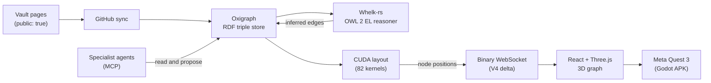

# What is VisionClaw?

> [VisionClaw Docs](../README.md) · [Tutorials](README.md)

VisionClaw turns a pile of notes into a knowledge graph you can walk around in. You point it at your Markdown (an Obsidian vault, GitHub repositories, documentation), it works out how the ideas connect, and it lays everything out as a 3D graph that you explore in a browser or on a Meta Quest 3 headset. Teams of specialist AI agents read and enrich the same graph alongside you.

This page is a tour. You will not type any commands here. By the end you will understand what each part does and where your data goes, so the [installation](installation.md) and [first graph](first-graph.md) tutorials make sense.

---

## The five-minute mental model

VisionClaw is one stack with four jobs:

1. **Ingest.** It reads your notes and turns the links between them into a graph of nodes and edges.
2. **Reason.** An OWL ontology gives the graph meaning, and a reasoner infers connections you never wrote down.
3. **Lay out.** A GPU physics engine arranges the graph in 3D so related things sit near each other.
4. **Explore.** You navigate the result in a browser, in XR, or by talking to AI agents that share the same graph.

Everything runs on your own infrastructure. There is no external database and no third-party cloud in the loop. The graph lives in an embedded triple store inside the backend process.

---

## Following a note through the system

Here is the journey a single note takes, from a vault page on disk to a glowing node you can grab in VR.

Walk it left to right:

- A page tagged `public:: true` is synced from GitHub. Its `[[wikilinks]]` become edges to other pages.
- The page lands in **Oxigraph**, an in-process RDF triple store that speaks W3C SPARQL 1.1. This is the single source of truth. Settings live in a small SQLite file next to it.
- The **Whelk-rs** reasoner applies your OWL 2 EL ontology and writes inferred relationships back into the store, so the graph knows that, say, a `Method` is a kind of `Technique` even if no note said so.
- The **GPU** takes the node-and-edge structure and solves a force-directed layout, pushing unrelated nodes apart and pulling connected ones together.
- New positions stream to your browser over a compact **binary WebSocket** protocol, far smaller than sending JSON.
- The **client** renders the graph with React Three Fiber. From there you can step into the same scene on a **Quest 3**.
- Meanwhile **AI agents** read the graph over MCP and can propose enrichments, which go through review before they touch the store.

---

## What you actually see

Open the UI at `http://localhost:3001` and you get a dark 3D space full of floating nodes:

- **Knowledge pages** render as faceted gems. Edges between them are the `[[wikilinks]]` from your notes.
- **Ontology classes** render as crystal orbs. These are the formal concepts the reasoner works with.
- **Agents** render as capsules. When a team is running, you watch them move and attach to the parts of the graph they are working on.

Nothing is static. The physics keeps settling, so when you change a setting or add a note, you see the layout reorganise in real time rather than redrawing from scratch. You drag nodes, fly the camera, click to inspect, and the graph responds at interactive frame rates.

---

## What it is good at

VisionClaw earns its keep when the *connections* between things matter more than any single document:

- **Research libraries.** Cluster hundreds of papers by topic and method, and surface the citation paths and gaps between schools of thought.
- **Engineering knowledge.** Sync a codebase and its architecture decision records, and keep a living map of which services depend on which, updated as the code changes.
- **Domain modelling.** Grow a formal ontology of your field one note at a time, with a reasoner checking it stays logically consistent as it grows.
- **Strategy and analysis.** Connect signals from many sources and let the spatial layout reveal correlations that a list of search results would hide.

If you only ever need full-text search over flat documents, VisionClaw is more machinery than you need. Its value is the graph, the reasoning, and the shared 3D space.

---

## Under the hood

You do not need any of this to use VisionClaw, but it helps to know the shape of what you are running. Every number below is current.

| Layer | What it is |
|---|---|
| Backend | Rust + Actix. A hexagonal (hexser) design with 44 command and query handlers, 9 ports and 12 adapters, organised across 8 workspace crates. No message bus — handlers dispatch directly (ADR-089). |
| Live system | 35 Actix actors supervise the running stack (19 service + 16 GPU), plus a per-connection WebSocket session actor for each client. |
| Graph store | Embedded **Oxigraph** RDF triple store (W3C SPARQL 1.1), in-process. SQLite holds settings. No Neo4j, no external database, no separate DB browser. |
| Ontology | **Whelk-rs** OWL 2 EL reasoner with SHACL-lite and JSON-LD validation, and PROV-O provenance on every inferred fact (PRD-022). Exposed to agents through 7 MCP tools (discover, read, query, traverse, propose, validate, status). |
| GPU physics | 82 CUDA kernels across 9 source files. A 100,000-node layout solves in **4.5 ms** — about 222 physics frames per second, **55× faster** than the CPU path (246 ms, roughly 4 FPS) at the same scale. |
| Client | React + Three.js / React Three Fiber, organised into 16 feature modules. Renders the live graph smoothly while positions stream in. |
| Wire protocol | Binary WebSocket. The default V4 format sends only deltas; the fixed frame formats are 36 bytes per node (V2) and 52 bytes (V3). All far smaller than JSON. |
| XR | Native Meta Quest 3 support via a Godot 4 + godot-rust APK, with OpenXR hand tracking and passthrough, and multi-user spatial presence. |

The whole project is open source under the Mozilla Public License 2.0.

---

## Where to go next

You now have the mental model. Time to run it.

1. **[Installation](installation.md)** — get the stack up with Docker, or build it natively with GPU support.
2. **[Build your first graph](first-graph.md)** — go from a fresh install to a live 3D knowledge graph with agents running, step by step.

When you are ready to grow your own ontology, [Promoting a Note to the Ontology](promote-note-to-ontology.md) walks through turning a single vault page into a live OWL class.

---

## See also

- [Installation](installation.md) — the next step in the learning path
- [Build your first graph](first-graph.md) — hands-on from zero to a live graph
- [System Overview](../explanation/system-overview.md) — how the layers fit together, in depth
- [Physics GPU Engine](../explanation/physics-gpu-engine.md) — the CUDA layout solver
- [Ontology Pipeline](../explanation/ontology-pipeline.md) — reasoning, SHACL and provenance
- [Agent Control Surface](../explanation/agent-control-surface.md) — how AI agents read and enrich the graph
- Governing ADRs: [ADR-090 (crate modularisation)](../archive/adr/ADR-090-hexagonal-crate-modularisation.md), [ADR-101 (triple-store migration)](../archive/adr/ADR-101-triple-store-migration-framework.md), [ADR-112 (ontology spine)](../archive/adr/ADR-112-ontology-augmentation-retrieval-spine.md)
